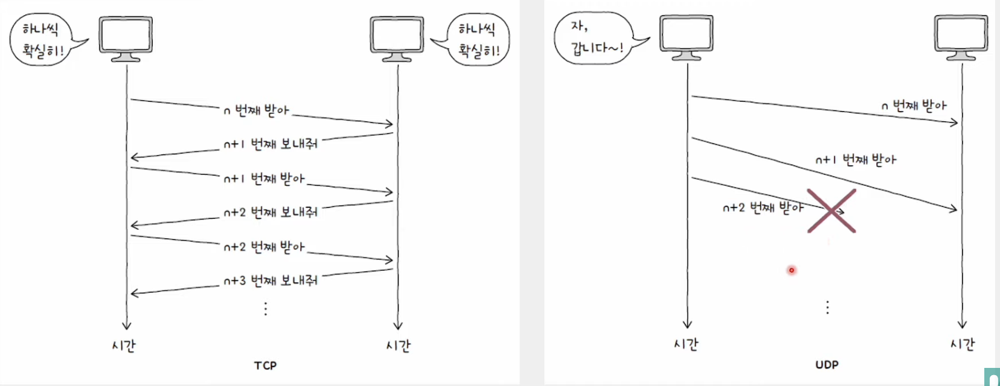

# UDP (User Datagram Protocol)

    TCP보다 신뢰성은 떨어지지만 비교적 빠른 통신이 가능한 비연결형 프로토콜

## UDP 데이터그램 구조

- UDP는 TCP와 달리 비연결형 통신을 수행하는 신뢰할 수 없는 프로토콜
- 연결 수립 및 해제, 재전송을 통한 오류 제어, 혼잡 제어, 흐름 제어 등을 수행하지 않는다.
- 상태를 유지하지 않는다. (Stateless Protocol)
- TCP에 비해 적은 오버헤드로 패킷을 빠르게 처리
- 주로 실시간 스트리밍 서비스, 인터넷 전화처럼 실시간성이 강조되는 상황에서 TCP보다 더 많이 쓰인다.

 

## TCP VS UDP

