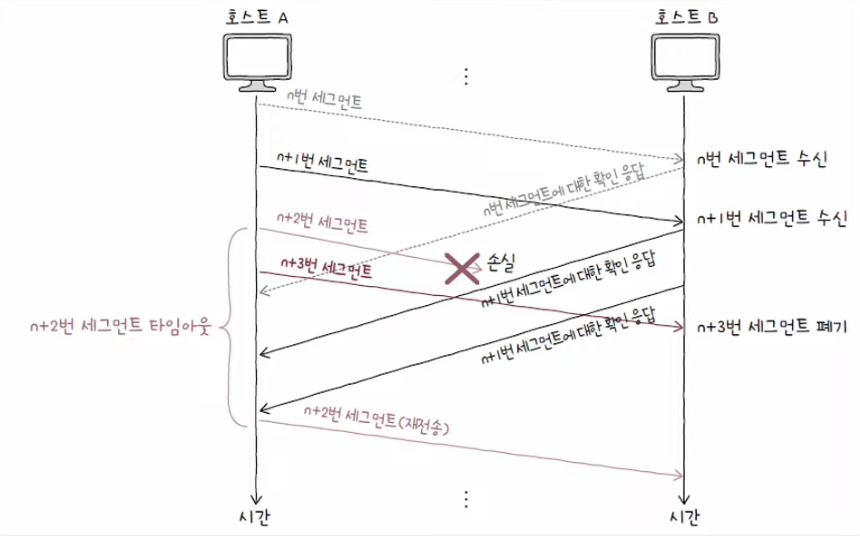

# 재전송 기반의 오류 제어

- TCP 세그먼트의 체크섬 필드는 데이터가 훼손되었는지 여부만 체크
  - => 체크섬 필드만으로 오류 검출하기에는 충분하지 않다.
- TCP가 신뢰성을 제대로 보장하려면, **오류 검출**과 **재전송**이 제대로 이루어져야 한다.

#### 오류 검출

    송신 호스트가 송신한 세그먼트에 문제가 발생했음을 인지할 수 있어야 한다.

#### 재전송

    오류를 감지하게 되면 해당 세그먼트를 재전송할 수 있어야 한다.

 

## TCP 오류 검출과 재전송 상황

### 💡 중복된 ACK 세그먼트를 수신했을 때

### 💡 타임아웃이 발생했을 때

- 호스트가 세그먼트를 전송할 때마다 재전송 타이머 시작
- 타임아웃이 발생할 때까지 ACK 세그먼트를 받지 못하면 재전송

 

## ARQ(Automatic Repeat Request; 자동 재전송 요구)

- 재전송 기법
- 수신 호스트의 답변(`ACK`)과 타임아웃을 토대로 문제를 진단하고,
- 문제가 생긴 메시지를 재전송함으로써 신뢰성을 확보하는 방식

### 💡 Stop-and-Wait ARQ

- 제대로 전달했음을 확인하기 전까지는 새로운 메시지를 보내지 않는 방식
- 송신 호스트
  - 확인 응답을 받기 전에는 더 보내고 싶어도 못 보냄
- 수신 호스트

  - 더 많은 데이터를 처리할 수 있어도 하나씩만 확인 응답

  

#### 장점

- 단순
- 높은 신뢰성 보장

#### 단점

- 네트워크의 낮은 이용 효율
- 성능 저하

#### Pipelining

- 연속해서 메시지를 전송할 수 있는 기술
- Stop-and-wait의 문제점 해결

    

 

### 💡 Go-Back-N ARQ

- 파이프라이닝 기반 ARQ 일종
- 여러 세그먼트 전송 중 오류가 발생하면 해당 세그먼트부터 전부 재전송
- 순서 번호 n번에 대한 ACK 세그먼트는 n번만의 확인 응답이 아닌 **n번까지의 누적 확인 응답**

  - CACK(Cumulative Acknowledgment)

  

 

### 💡 Selective Repeat ARQ

- 선택적으로 재전송
- 각각의 패킷들에 대해 ACK 세그먼트를 보내는 방식
- 오늘날 대부분의 호스트는 Selective Repeat ARQ 지원
- Selective Repeat ARQ를 사용하지 않을 경우, Go-Back-N ARQ로 동작

    

#### Go-Back-N ARQ VS Selective Repeat ARQ

- Go-Back-N ARQ의 ACK 세그먼트는 **누적 확인 응답**
- Selective Repeat ARQ의 ACK 세그먼트는 **개별 확인 응답**

 

## 빠른 재전송(Fast Retransmit)

- 재전송 타이머가 만료되기 전이라도 세 번의 동일한 ACK 세그먼트를 받았다면 곧바로 재전송
- 타이머가 끝날 때까지 기다리는 시간을 줄일 수 있다.

    
