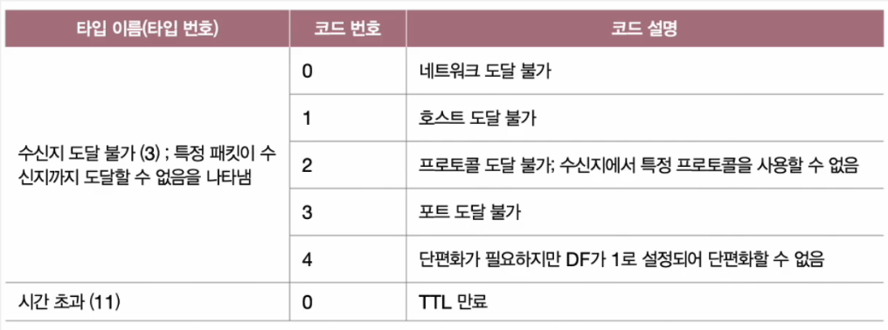

# 전송 계층

## 기능 1. IP 한계 보완

- 네트워크 계층의 한계를 극복
- 신뢰할 수 있는 통신과 연결형 통신 기능 제공

### 💡 IP의 한계

#### 특징 1. 비신뢰성 통신

- 패킷이 수신지까지 제대로 전송되었다는 보장을 하지 않는다.
- 통신 과정에서 패킷이 잘못 전송되어도 이를 확인하지 않고, 재전송도 하지 않으며, 순서대로 패킷이 도착할 것이라 보장도 하지 않는다는 의미
- = 최선형 전달(Best Effort Delivery)

#### 특징 2. 비연결형 통신

- 송수신 호스트 간에 사전 연결 수립 작업을 거치지 않는다.
- 그저 수신지를 향해 패킷을 보내기만 할 뿐이다.

### 💡 IP는 왜 비신뢰성와 비연결형 통신을 할까?

- 주된 이유는 **성능** 때문
- 신뢰할 수 있는 연결형 통신은 성능에 악영향
- 신뢰성 있는 전송이 모든 경우에 필요한 것은 아니다.

### 💡 IP 한계를 보완하는 전송 계층

#### TCP

- 연결형 통신을 가능하게 한다.
  - 송수신하는 동안에는 연결을 유지하고, 송수신이 끝나면 연결 종료
- 신뢰성 있는 통신을 가능하게 한다.
  - 재전송을 통한 오류 제어, 흐름 제어, 혼잡 제어 등 다양한 기능들을 제공

#### UDP

- 신뢰할 수 없는 통신, 비연결형 통신을 가능하게 한다.
- TCP보다는 비교적 빠른 전송 가능

 

## 기능 2. 응용 계층의 애플리케이션 프로세스 식별

- 포트 번호 활용한 애플리케이션 식별

#### 포트(Port)

    네트워크 상의 애플리케이션 식별 정보

 

## ICMP

- IP의 전송 특성을 보완하는 프로토콜
- IP 패킷 전송 과정에 대한 **피드백 메시지** 제공
  - 전송 과정에서 발생한 문제 상황에 대한 오류 보고
  - 네트워크에 대한 진단 정보 (네트워크상의 정보 제공)
- ICMP 메시지 = 타입 + 코드
- ICMP는 IP 보조일 뿐, 신뢰성을 완전히 보장하지는 않는다.

#### 타입

    ICMP 메시지 유형 번호

#### 코드

    구체적인 메시지 내용 번호

