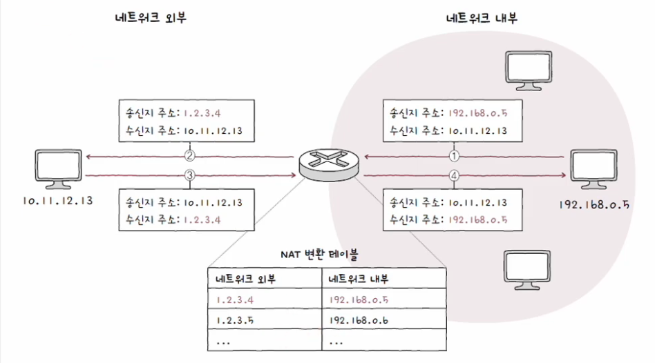
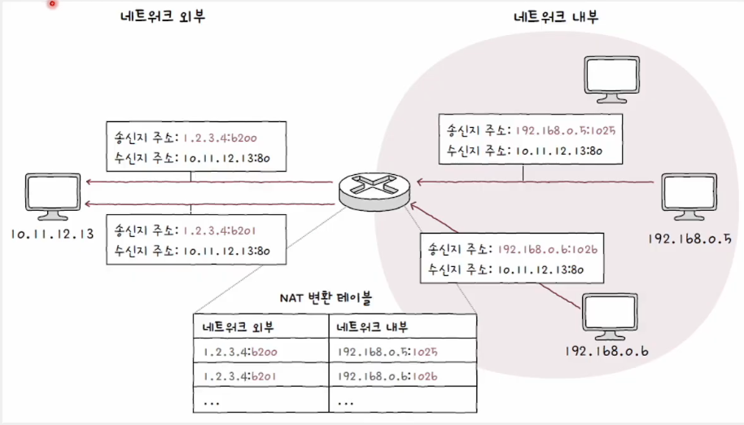

# 포트(Port)

- 패킷 내 수신지 포트와 송신지 포트를 통해 송수신지 호스트의 애플리케이션을 식별
- 16비트로 표현 가능
  - 사용 가능한 포트의 수 = 2^16개

 

## 포트의 분류

#### [IANA(Internet Assigned Numbers Aythority)](https://www.iana.org/assignments/service-names-port-numbers/service-names-port-numbers.xhtml)

    인터넷 할당 번호 관리 기관

### 💡 well-known port

- `0 ~ 1023`번의 포트
- 시스템 포트
- 범용적으로 사용되는 애플리케이션 프로토콜이 일반적으로 사용하는 포트 번호

| well-known port | 설명   |
| --------------- | ------ |
| 20, 21          | FTP    |
| 22              | SSH    |
| 23              | TELNET |
| 53              | DNS    |
| 67, 68          | DHCP   |
| 80              | HTTP   |
| 443             | HTTPS  |

### 💡 registered port

- `1024 ~ 49151`번의 포트
- well-known port에 비해서는 덜 범용적
- 흔히 사용되는 애플리케이션 프로토콜에 할당하기 위해 사용

| registered port | 설명                    |
| --------------- | ----------------------- |
| 1194            | OpenVPN                 |
| 1433            | Microsoft SQL Server DB |
| 3306            | MYSQL DB                |
| 6379            | Redis                   |
| 8080            | HTTP 대체               |

### 💡 dynamic port

- = private port = ephemeral port
- 특별히 관리되지 않은 포트 번호 범위 => 자유롭게 사용 가능
- 서버는 대부분 well-known port와 registered port 사용
- 클라이언트는 대부분 dynamic port 사용

 

## NAT

    IP 주소 변환 기술

#### NAT 변환 테이블

    변환의 대상이 되는 IP 주소 쌍

### 💡 문제점

- 사설 IP 주소 하나당 공인 IP 주소 하나가 대응
  - 많은 사설 IP 주소를 변환하기에는 무리
- 공인 IP 주소의 낭비
  - 사설 IP 주소의 수만큼 공인 IP 주소가 필요

## NAPT(Network Address Port Translation)

- 포트 기반 NAT
- NAT 테이블에 변환할 IP 주소 쌍과 더불어 **포트 번호도 함께 기록하고, 변환**
- 하나의 공인 IP 주소(1)를 여러 사설 IP 주소(N)가 공유 가능
- 공인 IP 주소 수 부족 문제를 개선한 기술

 

## 포트 포워딩(Port Forwarding)

- 네트워크 내 특정 호스트에 IP 주소와 포트 번호를 미리 할당하고,
- `{할당 IP 주소}:{포트 번호}`로써 해당 호스트에게 패킷을 전달하는 기능
- 특정 IP 주소와 포트 번호 쌍을 호스트에게 할당한 뒤, 외부 호스트에게 해당 접속 정보(`{할당 IP 주소}:{포트 번호}`)를 알려주면 된다.
