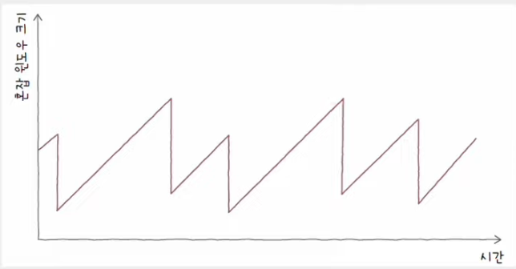
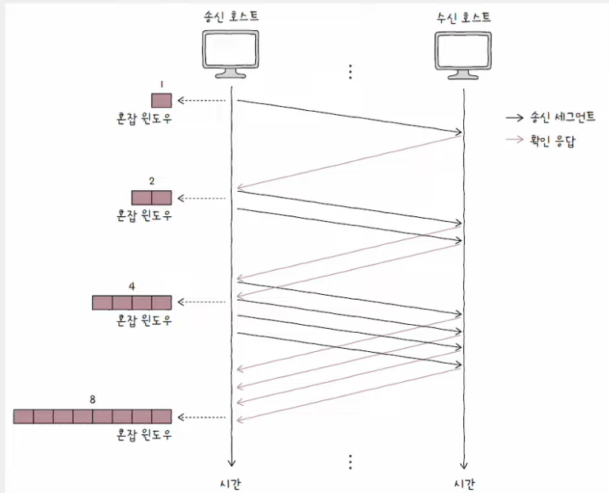
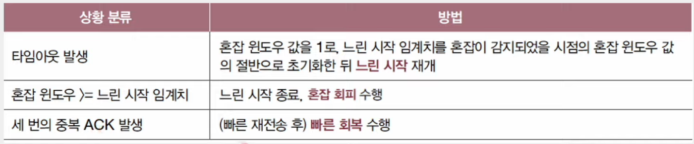
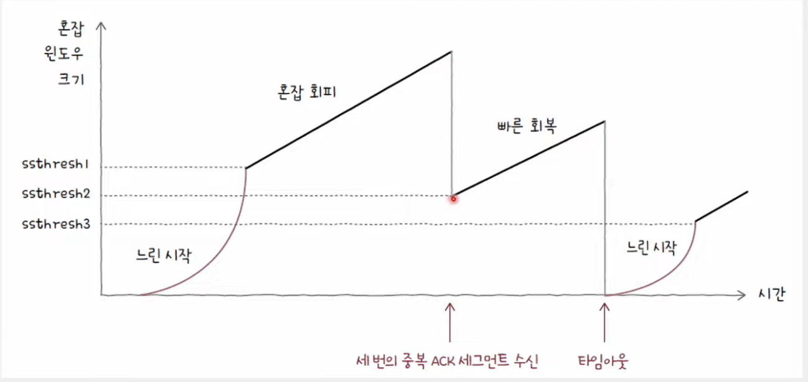
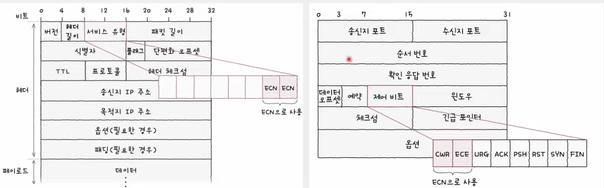
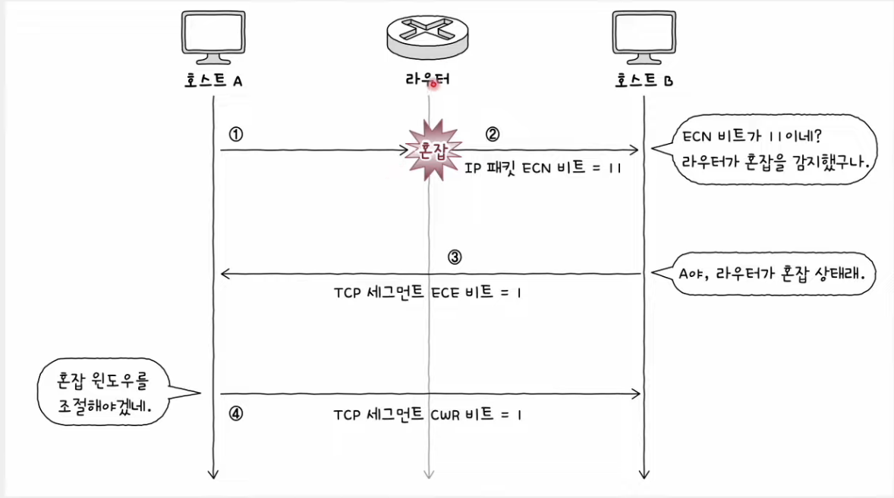

# 혼잡 제어(Congestion Control)

- 송신 호스트가 혼잡한 정도에 맞춰 유동적으로 전송량을 조절하는 기능
- 흐름 제어의 주체가 수신 호스트라면, 혼잡 제어의 주체는 송신 호스트

#### 혼잡(congestion)

    많은 트래픽으로 인해 패킷의 처리 속도가 늦어지거나 유실될 우려가 있는 네트워크 상황

<br>

## 혼잡 윈도우

- 혼잡 없이 전송할 수 있을 법한 데이터양
- *혼잡 윈도우의 크기*와 *한 번에 전송할 수 있는 세그먼트의 수*는 비례

### 수신 윈도우 VS 혼잡 윈도우

- 수신 윈도우는 수신 호스트가 헤더로 알려준다.
- 혼잡 윈도우는 송신 호스트가 알아서 직접 계산하여 알아내야 한다.

<br>

## 혼잡 제어 알고리즘

- 혼잡 제어를 수행하는 일련의 방법

### 💡 AIMD(Additive Increase/Multiplicative Decrease)

- 가장 기본적인 알고리즘
- 합으로 증가, 곱으로 감소
- 혼잡이 감지되지 않음
  - => 혼잡 윈도우를 RTT(Round Trip Time)마다 1씩 선형적으로 증가
- 혼잡이 감지
  - => 혼잡 윈도우를 절반으로 떨어뜨리는 동작 반복
- 혼잡 윈도우는 톱니 모양으로 변화

    

#### RTT(Round Trip Time)

    메시지를 전송한 뒤 그에 대한 답변을 받는 데까지 걸리는 시간

```shell
$ ping -c 5 www.google.com
```

#### 혼잡이 감지되는 상황 (= 오류 제어 발생 상황)

- 중복된 ACK 세그먼트를 수신했을 때
- 타임아웃이 발생했을 때

<br>

## 느린 시작(slow start) 알고리즘

- 고도화된 혼잡 제어 알고리즘
- 혼잡 윈도우를 1부터 시작해 문제 없이 수신된 ACK 세그먼트 하나당 1씩 증가시키는 방식
- 혼잡 윈도우는 RTT마다 2배씩 지수적으로 증가

    

### 💡 장점

- 초기 전송 속도 빠른 확보

### 💡 종료 발생 상황



### 💡 혼잡 회피 알고리즘

- RTT마다 혼잡 윈도우를 1MSS씩 증가시키는 알고리즘
- 혼잡 윈도우 크기 선형적으로 증가
- 느린 시작 임계치를 넘어서면 혼잡 여지가 있으니 조심해서 혼잡 윈도우 증가

    

### 💡 빠른 회복 알고리즘

- 세 번의 중복된 ACK 세그먼트 수신
  - 빠른 재전송 + 빠른 회복 알고리즘
- 빠른 전송률 회복을 위해 느린 시작은 건너뛰고 혼잡 회피를 수행하는 알고리즘
- 단, 빠른 회복 도중이라도 타임아웃이 발생하면 다시 느린 시작을 수행

#### 세 번의 중복 세그먼트 수신 VS 타임 아웃 중 뭐가 더 심각한 문제?

    타임 아웃이 더 심각한 문제

<br>



<br>

## ECN

- TCP의 혼잡 제어
  - 혼잡 감지, 혼잡 윈도우 계산, 재전송 -> 오로지 송신 호스트의 몫
- 중간 노드의 도움으로 혼잡을 제어하는 방법
- 혼잡을 회피하기 위해 네트워크 중간 장치(주로 라우터)의 도움을 받는 방법
- 오늘날의 네트워크 환경에서 적극적으로 사용하는 방법

### 💡 호스트가 ECN을 지원할 경우

- TCP/IP 헤더에 ECN 관련 비트 추가

    

### 💡 ECN을 통한 혼잡 제어

- 송신 호스트만 혼잡 제어를 수행할 경우, 문제가 발생한 이후에 비로소 혼잡 제어
- ECN을 이용하면 수신 호스트의 ACK 세그먼트를 통해 더 빠르게 혼잡 감지

    
