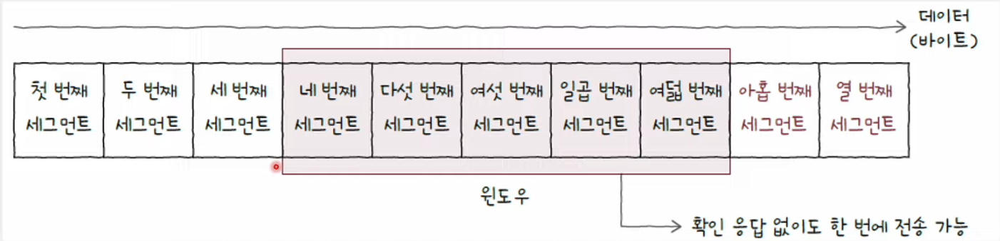
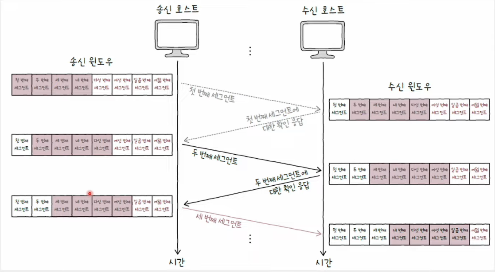

# 흐름 제어

- 송신 호스트가 수신 호스트의 처리 속도를 고려하며 송수신 속도를 균일하게 유지하는 기능
- Stop-and-Wait ARQ를 사용하면 별도의 흐름 제어가 필요하지 않다.
- 파이프라이닝 기반의 *Go-Back-N ARQ*와 *Selective Repeat ARQ*에서는 흐름 제어가 필요하다.

 

## 슬라이딩 윈도우(Sliding Window)

- TCP 흐름 제어 기법
- 윈도우가 점차 오른쪽으로 미끄러지듯 움직인다.
- 윈도우 크기에서 벗어난 숫자에 해당하는 세그먼트는 전송할 수 없다.

#### 윈도우

    송신 호스트가 파이프라이닝할 수 있는 최대량
    즉, 윈도우 크기만큼 확인 응답을 받지 않고도 한 번에 전송 가능

### 💡 송신 윈도우

- 헤더로 전달받은 수신 윈도우를 토대로 연산
- 수신 호스트는 TCP 헤더(윈도우 필드)를 통해 송신 호스트에게 자신이 받을 데이터의 양을 알려준다.

 

