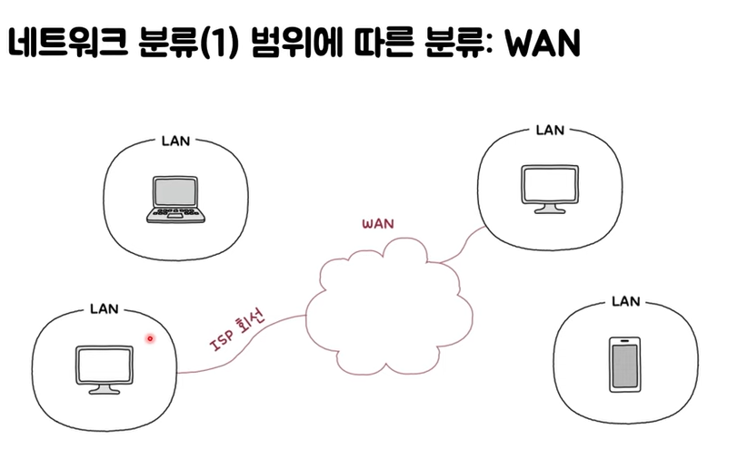

# 01. 컴퓨터 네트워크 개요

#### 컴퓨터 네트워크

- 여러 개의 장치가 마치 그물처럼 서로 연결되어 정보를 주고받을 수 있는 통신망
- 그래프라는 자료구조 형태를 띔

#### 인터넷

- 여러 네트워크를 연결한 '네트워크의 네트워크'

#### 그래프

- 네트워크의 기본 구조
- 노드와 노드를 연결하는 간선으로 이루어진 자료구조

 

## 네트워크 기본 구조

### 호스트

- 가장자리에 위치한 노드
- 네트워크를 통해 주고받는 메시지를 최초로 생성해서 송신하거나 최종적으로 수신하는 대상
- 역할에 따른 구분
  - **클라이언트** : 요청을 보내는 호스트
  - **서버** : 요청에 대한 응답을 보내는 호스트

### 네트워크 장비

- 호스트 간 주고받을 정보가 거치는 중간 노드 (이더넷 허브, 스위치, 라우터, 공유기 등)
- 호스트 간 주고받는 정보가 수신지까지 안정적이고 안전하게 전송

### 통신 매체

- 각 노드를 연결하는 간선 (링크)
  - 유선 매체
  - 무선 매체

### 메시지

- 통신 매체로 연결된 노드가 주고받는 정보
  - 웹 페이지, 파일, 메일 등

 

## 범위에 따른 네트워크 분류

### LAN (Local Area Network)

- 가까운 지역을 연결한 근거리 통신망
- 예) 일반 가정, 특정 회사, 다른 국가의 가정 등

### WAN (Wide Area Network)

- 먼 지역을 연결하는 광역 통신망
- 다른 LAN에 속한 호스트와 메시지를 주고받아야 할 때 필요
- 대표적인 WAN = 인터넷

#### ISP (Internet Service Provider)

- 사용자에게 인터넷과 같은 WAN에 연결 가능한 회선을 임대하는 등 WAN과 관련된 다양한 서비스를 제공
- 예) KT, LG U+, SK브로드밴드 등

### CAN (Campus Area Network)

- 학교 또는 회사의 여러 건물 단위

### MAN (Metropolitan Area Network)

- 도시나 대도시 단위

 

## 메시지 교환 방식에 따른 네트워크 분류

### 회선 교환 네트워크

- 메시지를 주고받기 전 메시지 전송로인 *회선(circuit)을 설정*한 뒤, 해당 회선을 통해 메시지를 주고받는 방식
  - 두 호스트를 연결할 전송로를 확보하였다.
- 장점
  - 두 호스트 사이에 연결을 확보한 후 메시지를 주고받는 특성  
    => 주어진 시간 동안 전송되는 정보의 양이 비교적 일정
- 단점
  - 회선의 이용 효율이 낮아질 수 있음
    - 가능한 모든 회선에 끊임없이 메시지가 흐르고 있어야 회선의 이용 효율이 높아짐
    - 메시지를 주고받지 않으면서 회선을 점유하는 것은 낭비

#### 회선 스위치

- 호스트 사이에 일대일 전송로를 확보하는 네트워크 장비

### 패킷 교환 네트워크

- 메시지를 패킷이라는 단위로 쪼개어 전송
- 쪼개어 전송된 패킷들은 수신지에서 재조립
- 전송로의 이용 효율이 높아 회선 교환 방식의 문제점 해결
- 현대 인터넷은 대부분 패킷 교환 방식을 이용

#### 패킷 (Packet)

- 패킷 교환 네트워크상의 송수신 단위
- 구조
  - **Payload**
    - 전송하려는 데이터
  - **Header**
    - 송수신지를 특정하는 정보 (주소)
    - 예) IP 주소, MAC 주소
    - 주소를 통해 "누구에게 전송할지"를 지정 가능
  - **Trailer**
    - 부가 정보 또는 제어 정보

#### 패킷 스위치

- 패킷의 송수신지를 식별
- 패킷이 이동할 최적의 경로를 결정
- 라우터, 스위치 등

 

## 송수신지 유형별 전송 방식

### 유니캐스트 (Unicast)

- 하나의 수신지에 메시지를 전송
- 송신지와 수신지가 일대일로 메시지를 주고받는 경우
- 가장 일반적인 송수신 형태

### 브로드캐스트 (Broadcast)

- 네트워크상의 모든 호스트에게 전송
- 브로트캐스트 도메인
  - 브로드캐스트가 전송되는 범위

### 멀티캐스트 (Multicast)

- 네트워크 내의 동일 그룹에 속한 호스트에게만 전송

### 애니캐스트 (Anycast)

- 네트워크 내의 동일 그룹에 속한 호스트 중 가장 가까운 호스트에게 전송

 

## 프로토콜

- 노드 간에 정보를 올바르게 주고받기 위해 합의된 규칙이나 방법
- 일상 속 언어와는 달리 통신 과정에서 일반적으로는 여러 프로토콜을 함께 사용
- 모든 프로토콜에는 **목적**과 **특징**이 존재

 

## 트래픽 (Traffic)

- 네트워크 내의 정보량
- 주로 노드에서 측정
- 특정 시점에 노드를 경유하는 정보량
- 과도한 트래픽이 야기하는 문제
- 과부하(성능 저하) 발생

 

## 네트워크 성능 지표

### 처리율 (Throughput)

- 단위 시간당 네트워크를 통해 실제로 전송되는 정보량
- 표현 단위
  - bps(bit/s) : bit per second
  - Mbps(Mbit/s) : megabits per second
  - Gbps(Gbit/s) : gigabits per second
  - pps(p/s) : packets per second

### 대역폭 (Bandwidth)

- 단위 시간 동안 통신 매체를 통해 송수신할 수 있는 최대 정보량
- 정보를 주고받을 폭

### 패킷 손실 (Packet Loss)

- 송수신되는 패킷이 손실되는 상황
- 손실된 패킷 수, 전체 패킷 / 유실된 패킷 (백분위) 사용
