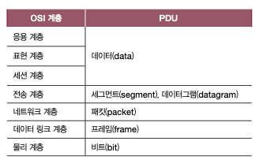

# 1.컴퓨터 네트워크 시작하기
## 01-1. 컴퓨터 네트워크를 알아야 하는 이유
> 컴퓨터 네트워크, 인터넷
- 네트워크: 여러 개의 장치가 마치 그물처럼 서로 연결되어 정보를 주고받을 수 있는 통신망
- 인터넷: 여러 네트워크를 연결한 네트워크의 네트워크
## 01-2. 네트워크 거시적으로 살펴보기
> 네트워크 구조, LAN, WAN, 회선 교환, 패킷 교환, 주소

### 네트워크의 기본 구조
- 호스트(Host): 네트워크의 가장 자리에 위치한 노드
  - Server: 어떠한 서비스를 제공하는 호스트
  - Client: 서버에게 어떠한 서비스를 요청하고 서버의 응답을 제공받는 호스트
- 네트워크 장비: 네트워크의 중간 노드
  - 이더넷 허브, 스위치, 라우터,공유기 등
  - 호스트 간 주고받는 정보가 원하는 수신지까지 안정적이고 안전하게 전송될 수 있도록 함
- 통신 매체: 네트워크의 간선
  - 유선 매체, 무선 매체
- 메시지: 통신 매체로 연결된 노드가 주고받는 정보

### 범위에 따른 네트워크 분류
- LAN (Local Area Network)
  - 근거리 통신망
  - 가정, 기업, 학교 등 한정된 공간에서의 네트워크
- WAN (Wide Area Network)
  - 광역 통신망
  - LAN을 연결할 수 있는 네트워크
  - 인터넷
  - ISP (Internet Service Provider): 인터넷 서비스 업체
    - WAN을 구축하고 관리함
    - 예: KT, LG U+, SK
- CAN, MAN 등도 존재
- WAN > MAN > CAN > LAN
  
### 메시지 교환 방식에 따른 네트워크 분류
- 회선 교환 방식 (circuit switching)
  - 회선(circuit): 메시지 전송로
  - 회선을 설정하고 이를 통해 메시지를 주고받는 방식
  - 회선을 설정한다 = 두 호스트가 연결되었다 = 전송로를 확보하였다
  - 메시지를 주고받기 전에 두 호스트를 연결하고, 연결된 경로(회선)로 메시지를 주고받음
  - 장점
    - 주어진 시간 동안 전송되는 정보의 양이 비교적 일정
  - 회선 스위치
    - 호스트 사이에 일대일 전송로를 확보하는 네트워크 장비
  - 예: 전통적인 전화망
  - 단점
    - 회선의 이용 효율이 낮아질 수 있음
    - 메시지를 주고받지 않을 경우, 회선 점유는 낭비
- 패킷 교환 방식 (Packet switching)
  - 회선 교환 방식의 문제점을 해결한 방식
  - 메시지를 패킷이라는 작은 단위로 쪼개어 전송
  - 패킷 (packet)
    - 패킷 교환 네트워크 상에서 송수신되는 메시지의 단위
  - 현대 인터넷은 대부분 패킷 교환 방식을 사용함
  - 장점
    - 네트워크 이용 효율이 상대적으로 높음
  - 패킷 스위치: 중간 노드
    - 패킷이 수신지까지 올바르게 도달할 수 있도록 최적의 경로를 설정하거나 패킷의 송수신지 식별
    - 예: 라우터, 스위치
  - 페이로드 (payload)
    - 패킷을 통해 전송하고자 하는 데이터
    - header, trailer 정보 포함

### 주소와 송수신지 유형에 따른 전송 방식
- 주소(Address): 송수신지를 특정하는 정보
  - 예: IP주소, MAC주소
- 유니캐스트 unicast
  - 가장 일반적인 형태의 송수신 방식
  - 하나의 수신지에 메시지를 전송하는 방식
  - 1:1
- 브로드캐스트 broadcast
  - 자신을 제외한 네트워크상의 모든 호스트에게 전송하는 방식
  - 브로드캐스트 도메인: 브로드캐스트가 전송되는 범위
  - 브로드캐스트의 수신지 = 자신을 제외한 네트워크 상의 모든 호스트
- 멀티캐스트, 애니캐스트

## 01-3. 네트워크 미시적으로 살펴보기
> 프로토콜, 네트워크 참조 모델, OSI 모델, TCP/IP 모델, 캡슐화, 역캡슐화, PDU
- 프로토콜: 통신 과정에서 정보를 올바르게 주고받기 위해 합의된 규칙이나 방법
- 네트워크 참조 모델: 통신이 일어나는 구조를 계층화
- 캡슐화(역캡슐화): 통신 과정에서 이루어짐

### 프로토콜
- 프로토콜 protocol
  - 노드 간에 정보를 올바르게 주고받기 위해 합의된 규칙이나 방법
  - 서로 다른 통신 장치들이 정보를 주고받기 위해서는 프로토콜이 통해야 함
  - 프로토콜의 종류는 다양하며, 모든 프로토콜에는 저마다의 목적과 특징이 있음
  - 프로토콜마다 패킷의 헤더 내용이 달라질 수 있음

### 네트워크 참조 모델
- 네트워크 참조 모델 network reference model
  - 통신이 일어나는 각 과정을 계층으로 나눈 구조
  - 네트워크 계층 모델이라 부르기도 함

### OSI 모델
- OSI 모델
  - ISO에서 만든 네트워크 참조 모델
  - 통신 단계를 7개의 계층으로 나눔
  - 물리 계층 / 데이터 링크 계층 / 네트워크 계층 / 전송 계층 / 세션 계층 / 표현 계층 / 응용 계층
  - 1. 물리 계층 Physical layer
    - OSI 모델의 최하단에 있는 계층
    - 1과 0으로 표현되는 비트 신호를 주고받는 계층
    - 가장 근원적인 통신이 이루어지는 계층
    - 동일한 비트 데이터라도 통신 매체에 따라 전기, 빛, 전파 등의 여러 신호로 운반될 수 있음 -> 통신 매체에 맞는 신호로 운반할 필요가 있음
    - 네트워크 장비, 통신 매체 관련
  - 2. 데이터 링크 계층 data link layer
    - 네트워크 내 주변 장치 간의 정보를 올바르게 주고받기 위한 계층
    - 물리 계층을 통해 주고받는 정보에 오류가 없는지 확인
    - MAC 주소: 네트워크 내 송수신지 특정
    - 충돌 문제 해결
  - 3. 네트워크 계층 Network layer
    - 메시지를 수신지까지 전달하는 계층
    - 네트워크 간의 통신
    - 인터넷을 가능하게 하는 계층
    - IP 주소: 수신지 호스트와 네트워크 식별
  - 4. 전송 계층 transport layer
    - 신뢰성, 안정성 있는 전송
    - 패킷 정상 여부, 정보 유실 여부, 순서 확인 등
    - 패킷의 흐름 제어 및 전송 오류 점검
  - 5. 세션 계층 Session layer
    - 세션을 관리하기 위해 존재하는 계층
    - session: 통신을 주고받는 호스트의 응용 프로그램 간 연결 상태
    - 연결 상태를 생성하거나 유지하고, 종료되었을 때는 끊어주는 역할
  - 6. 표현 계층 presentation layer
    - 문자를 컴퓨터가 이해할 수 있는 코드로 변환, 압축, 암호화 등
  - 7. 응용 계층 application layer
    - 사용자가 이용할 응용 프로그램에 다양한 네트워크 서비스 제공
    - 프로토콜이 많음
  
### TCP/IP 모델
- 구현에 중점을 둔 네트워크 참조 모델
- IP: internet protocol
- 1. 네트워크 액세스 계층
  - = 링크 계층
  - = 네트워크 인터페이스 계층
  - 물리 계층 + 데이터 링크 계층
- 2. 인터넷 계층
  - = 네트워크 계층
- 3. 전송 계층
- 4. 응용 계층
  - = 세션 계층 + 표현 계층 + 응용 계층

### 캡슐화와 역캡슐화
- 캡슐화 encapsulation
  - 송신 과정에서 헤더 및 트레일러를 추가해 나가는 과정
- 역캡슐화 decapsulation
  - 캡슐화 과정에서 붙였던 헤더 및 트레일러를 각 계층에서 확인 후 제거하는 과정 

### PDU
- protocol data unit
- 각 계층에서 송수신되는 메시지의 단위
- 
- 세그먼트: TCP 프로토콜이 사용되었을 경우
- 데이터그램: UDP 프로토콜이 사용되었을 경우

## appendix
- 처리율 Throughput
  - 단위 시간당 네트워크를 통해 실제로 전송되는 정보량
  - 특정 노드가 얼마만큼의 트래픽을 처리하는 중인지 판단
- 대역폭 bandwidth
  - 단위 시간 통신 매체를 통해 송수신할 수 있는 최대 정보량
  - 높은 대역폭 = 많은 정보 송수신
- 패킷 손실 packet loss
  - 송수신되는 패킷이 손실된 상황
  - 높은 트래픽으로 인해 노드가 순간적으로 처리해야 할 패킷이 많아지거나 장애 발생으로 인한 손실
  - 유실된 패킷 / 전체 패킷 * 100(%)