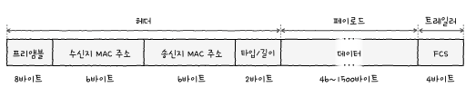

# 02. 물리 계층과 데이터 링크 계층
## 02-1. 이더넷
- 물리 계층과 데이터 링크 계층에서 밀접하게 연관됨
- 이더넷 ethernet
  - 유선 LAN 환경에서 대중적으로 사용되는 기술
  - 다양한 통신 매체들의 규격들과 송수신되는 프레임의 형태, 프레임을 주고받는 방법 등의 정의된 네트워크 기술

### 이더넷 표준
- 이더넷 표준 = IEEE 802.3

### 통신 매체 표기 형태
- [전송 속도]BASE-[추가 특성]
- 1. 전송 속도 Data rate
  - Unit: Mbps or Gbps
- 2. BASE baseband
  - 변조 타입(modulation type)을 의미함
  - 변조 타입: 비트 신호로 변환된 데이터를 통신 매체로 전송하는 방법
- 3. 추가 특성 additional distinction
  - 통신 매체의 특성 명시
  - 전송 가능한 최대 거리 or 물리 계층 인코딩 방식 or 레인 수

### 통신 매체 종류
- C: 동축 케이블
- T: 트위스티드 페어 케이블
- S: 단파장 광섬유 케이블
- L: 장파장 광섬유 케이블
- 10BASE-T 케이블 = 10Mbps 속도를 지원하는 트위스티드 페어 케이블

### 이더넷 프레임 ethernet frame
- 이더넷 네트워크에서 주고받는 프레임
- 
- 프리앰블 preamble
  - 이더넷 프레임의 시작을 알리는 8바이트(=64비트) 크기의 정보
  - 송수신지 간의 동기화를 위해 사용되는 정보
- MAC 주소
  - 네트워크 인터페이스마다 부여되는 6바이트 길이의 주소
  - LAN 내의 수신지와 송신지를 특정할 수 있음
  - 일반적으로 고유하고 변경되지 않음
  - NIC 장치가 네트워크 인터페이스 역할을 담당함
  - 48비트, 16진수 열두 자리로 구성
- 타입/길이
  - 타입: 어떤 정보를 캡슐화했는지 (=이더타입)
- 데이터
  - 상위 계층에서 전달받거나 상위 계층으로 전달해야 할 내용
- FCS (Frame Check Sequence)
  - 수신한 이더넷 프레임에 오류가 있는지 확인하기 위한 필드
  - CRC (Cyclic Resdundancy Check): 순환 중복 검사
  - CRC 값을 계산하여 FCS 필드 값과 비교함. 비교 값이 일치하지 않으면 프레임에 오류 존재

## 02-2. NIC와 케이블
- NIC (Network Interface Controller)
  - 호스트와 유무선 통신 매체를 연결하고 변환을 담당함
  - 호스트를 네트워크에 연결하기 위한 하드웨어
- NIC의 역할
  - 통신 매체에 흐르는 신호를 호스트가 이해하는 프레임으로 변환하거나 반대로 호스트가 이해하는 프레임을 통신 매체에 흐르는 신호로 변환
  - MAC주소를 통해 수신되는 프레임의 수신지 주소를 인식
- 트위스티드 페어 케이블
  - 유선 통신 매체
  - 구리 선으로 전기 신호를 주고받는 통신 매체
  - 케이블 본체 + 커넥터
  - 카테고리에 따라서 분류 가능함
  - 카테고리가 높을 수록 송수신할 수 있는 데이터양이 많고 더 빠른 전송 가능함
- 광섬유 케이블 Fiber optic cable
  - 싱글 모드 광섬유 케이블과 멀티 모드 광섬유 케이블로 분류
  - 장거리 전송에는 싱글 모드가 적합함

## 02-3. 허브
- 물리 계층의 허브는 여러 개의 호스트를 연결하는 장치임
- 1. 전달받은 신호를 다른 모드 포트로 그대로 다시 내보냄
- 2. 반이중 모드로 통신: 송수신을 번갈아가면서 통신
- 콜리전 도메인
  - collision: 동시에 허브에 신호를 송수신할 경우 충돌이 발생
  - collision domain: 충돌이 발생할 수 있는 영역
    - 허브에 연결된 모든 호스트는 같은 콜리전 도메인에 속함
- CSMA/CD
  - 충돌 문제를 해결하기 위한 프로토콜
  - CS (Carrier Sense)
    - 현재 통신 매체의 사용 가능 여부를 검사
  - MA (Multiple Access)
    - 복수의 호스트가 네트워크에 접근하려는 상황
  - CD (Collision Detection)
    - 충돌을 감지하면 전송이 중단되고, 충돌을 검출한 호스트는 다른 호스트에게 충돌 발생 여부를 고지
    - 잼 신호를 사용하여 충돌 발생 여부 고지
    - 충돌이 발생한 경우 임의의 시간을 대기 후 다시 전송함
## 02-4. 스위치
### 스위치
- 데이터 링크 계층의 네트워크 장비
- L2 스위치라고도 부름
- MAC 주소를 학습해 특정 MAC 주소를 가진 호스트에만 프레임을 전달할 수 있음
- 전이중 모드의 통신 지원
- 현재까지 자주 사용함
- 특징
  - MAC 주소 학습
    - 포트와 연결된 호스트의 MAC 주소 간의 연관 관계를 메모리에 테이블 형태로 기억
  - MAC 주소 테이블
    - 스위치는 MAC 주소 학습을 위해 포트와 연결된 호스트의 MAC 주소 간의 연관 관계를 메모리에 표 형태로 기억
### MAC 주소 학습
- 플러딩 Flooding
  - 허브처럼 송신지 포트를 제외한 모든 포트로 프레임을 전송하는 동작
- 필터링 filtering
  - 전달받은 프레임을 어디로 내본내고 어디로 내보내지 않을지 결정하는 스위치의 기능
- 포워딩 forwarding
  - 프레임이 전송될 포트에 실제로 프레임을 내보내는 것
- 에이징 aging
  - MAC 주소 테이블에 등록된 특정 포트에서 일정 시간 동안 프레임을 전송받지 못했다면 해당 항목을 삭제

> 브리지 bridge
>
> 네트워크 영역을 구획하여 콜리전 도메인을 나누거나 네트워크를 확장하는 용도로 사용하는 장비
> MAC 주소 학습 및 프레임 포워딩 및 필터링도 가능

### VLAN (Virtual LAN)
- 한 대의 스위치로 가상의 LAN을 만드는 방법
- 호스트의 물리적인 위치와 상관없이 논리적인 LAN을 구성

#### 포트 기반 VLAN
- 스위치의 포트가 VLAN을 결정하는 방식
- 특정 포트에 VLAN을 할당하고, 해당 포트에 호스트를 연결함으로써 VLAN에 포함시킬 수 있음
- VLAN Trunking
  - 두 대 이상의 VLAN 스위치를 효율적으로 연결하여 확장하는 방법
  - 스위치 간의 통신을 위한 트렁크 포트(= tagged port)에 VLAN 스위치를 서로 연결하는 방식

#### MAC 기반 VLAN
- 사전에 설정된 MAC 주소에 따라 VLAN을 결정
- 송수신하는 프레임 속 MAC 주소가 호스트가 속할 VLAN을 결정하는 방식