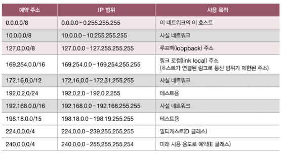

# 03. 네트워크 계층
## 03-1. LAN을 넘어서는 네트워크 계층
> 네트워크 계층, 라우팅, IP, IP주소, IPv4, IPv6, ARP
- LAN을 넘어서 다른 네트워크와 통신하기 위해서는 네트워크 계층의 역할이 필수적
- IP 주소를 이용해 송수신지 대상을 지정하고, 다른 네트워크에 이르는 경로를 결정하는 라우팅을 통해 다른 네트워크와 통신
### 데이터 링크 계층의 한계
1. 물리 계층과 데이터 링크 계층만으로는 다른 네트워크까지의 도달 경로를 파악하기 어려움
    - 라우팅 routing: 패킷이 이동할 최적의 경로를 결정하는 것
2. MAC 주소만으로는 모든 네트워크에 속한 호스트의 위치를 특정하기 어려움
### 인터넷 프로토콜
- 인터넷 프로토콜 Internet protocol (IP)
  - 네트워크 계층의 가장 핵심적인 프로토콜

#### IP 주소 형태
- IP 주소는 4바이트(32비트)로 표현할 수 있음
- 옥텟 Octet: 점(.)으로 구분된 8비트

#### IP의 기능
- IP 주소 지정
  - IP 주소를 바탕으로 송수신 대상을 지정하는 것
- IP 단편화
  - 전송하고자 하는 패킷의 크기가 MTU보다 클 경우, 이를 MTU 크기 이하의 복수의 패킷으로 나누는 것
  - MTU (Maximum Transmission Unit)
    - 한 번에 전송 가능한 IP 패킷의 최대 크기
    - 일반적으로 1500바이트
  - MTU 크기 이하로 나누어진 패킷은 수신지에 도착하면 다시 재조합됨
- IPv4
  - IPv4 패킷의 필드
  1. 식별자 identifier
     1. 패킷에 할당된 번호
     2. IPv4 패킷들이 어떤 메시지에서부터 쪼개졌는지를 인식하기 위해 사용
  2. 플래그 flag
     1. 총 세 개의 비트로 구성된 필드
     2. 첫 번째 비트: 항상 0으로 예약된 비트. 현재 사용되지 않음
     3. DF (Don't Fragment): IP 단편화를 수행하지 말라는 표시. 1로 설정된 경우 IP 단편화 수행 X
     4. MF (More Fragment): 단편화된 패킷이 더 있는 지를 나타냄. 0이라면 해당 패킷이 마지막 패킷, 1이라면 쪼개진 패킷이 더 존재함
  3. 단편화 오프셋 fragment offset
     1. 패킷이 단편화되기 전에 패킷이 초기 데이터에서 몇 번째로 떨어진 패킷인지를 나타냄
  4. TTL (Time To Live)
     1. 패킷의 수명을 의미
     2. 패킷이 하나의 라우터를 거칠 때마다 TTL이 1씩 감소하며, TTL 값이 0으로 떨어진 패킷은 폐기함
     3. 홉 hop: 패킷이 호스트 또는 라우터에 한 번 전달되는 것
     4. 무의미한 패킷이 네트워크 상에 지속적으로 남아있는 것을 방지하기 위함
  5. 프로토콜
     1. 상위 계층의 프로토콜이 무엇인지를 나타내는 필드
     2. 예) 6번 - TCP, 17번 - UDP
  6. 송신지 IP 주소와 수신지 IP 주소
  - 식별자, 플래그, 단편화 오프셋으로 단편화와 재조합
  - 프로토콜 필드로 상위 계층 프로토콜 파악
  - TTL로 남은 수명 파악
- IPv6
  - 16바이트 (128비트)로 주소를 표현
  - IPv6 패킷의 기본 헤더
    1.  다음 헤더 next header
        1.  상위 계층의 프로토콜을 가리키거나 확장 헤더를 가리킴
        2.  확장 헤더 extension header
            1.  기본 헤더와 페이로드 데이터 사이에 위치함
            2.  확장 헤더의 종류
                1.  Hop-by-hop options
                2.  destination options
                3.  routing
                4.  fragment
                5.  ESP
                6.  AH
    2.  홉 제한 hop limit 
        - IPv4 패킷의 TTL 필드와 비슷하게 패킷의 수명을 나타내는 필드
    3.  송신지 IP 주소, 수신지 IP 주소
        - IPv6 주소 지정이 가능
### ARP (Address Resolution Protocol)
- IP 주소를 통해 MAC 주소를 알아내는 프로토콜
- 동일 네트워크 내에 있는 송수신 대상의 IP 주소를 통해 MAC 주소를 알아낼 수 있음
1. ARP 요청
   - 호스트 A는 네트워크 내의 모든 호스트에게 브로트캐스트 메시지(= ARP 패킷)를 보냄
2. ARP 응답
   - 모든 호스트가 ARP 요청 메시지를 수신하지만, B를 제외한 나머지 호스트를 자신의 IP 주소가 아니므로 이를 무시
   - 호스트 B가 자신의 MAC 주소를 담은 메시지를 A에게 전송
   - 해당 유니캐스트 메시지는 ARP 응답이라는 ARP 패킷임
3. ARP 테이블 갱신
   - ARP 테이블: IP 주소와 그에 맞는 MAC 주소 테이블을 대응하는 표
- 다른 네트워크 내에 있을 경우
  - 라우터의 MAC 주소를 ARP 요청 - ARP 응답 과정을 통해 얻어 와서 패킷을 전송함   
### IP 단편화를 피하는 방법
- IP 단편화 없이 주고 받을 수 있는 최대 크기 = 경로 MTU 만큼 데이터를 전송해야 함 -> 경로 MTU 발견
- 경로 MTU 발견 (Path MTU discovery)
  - 경로 MTU를 구하고 해당 크기만큼만 송수신하여 IP 단편화를 회피하는 기술
## 03-2. IP 주소
> 클래스풀 주소 체계, 클래스리스 주소 체계, 서브넷 마스크, 공인 IP 주소, 사설 IP 주소, 정적 IP 주소, 동적 IP 주소, DHCP

### 네트워크 주소와 호스트 주소
- 한 IP 주소에서 네트워크 주소와 호스트 주소를 구분하는 범위는 유동적
### 클래스풀 주소 체계
- 클래스: 네트워크 크기에 따라 IP 주소를 분류하는 기준
- 클래스풀 주소 체계 classful addressing
  - 클래스를 기반으로 IP 주소를 관리하는 주소 체계
  - 클래스를 이용하면 필요한 호스트 IP 개수에 따라 네트워크 크기를 가변적으로 조정해 네트워크 주소와 호스트 주소를 구획할 수 있음
  - 호스트 주소가 전부 0인 IP 주소 = 해당 네트워크 자체를 의미하는 네트워크 주소
  - 호스트 주소가 전부 1인 IP 주소 = 브로드캐스트를 위한 주소
### 클래스리스 주소 체계
- 클래스풀 주소 체계는 다수의 IP 주소가 낭비될 가능성이 큼
- 더 유동적으로 네트워크를 구획할 수 있는 주소 체계가 필요함
#### 서브넷 마스크
- IP 주소상에서 네트워크 주소는 1, 호스트 주소는 0으로 표기한 비트열
- 서브넷팅 subneting: 서브넷 마스크를 이용해 클래스를 원하는 크기로 더 잘게 쪼개어 사용하는 것
#### 서브넷팅: 비트 AND 연산
- 피연산자가 모두 1인 경우에는 1, 아닌 경우에는 0
- 서브넷 마스크를 사용해 네트워크 주소와 호스트 주소를 구분하는 IP 주소 체계
#### 서브넷 마스크 표기: CIDR 표기법
- Classes Inter-Domain Routing notation
- IP 주소/서브넷 마스크상의 1의 개수로 표기하는 형식
- 예) 192.168.219.103/24
### 공인 IP 주소와 사설 IP 주소
#### 공인 IP 주소
- 전 세계에서 고유한 IP 주소
- 네트워크 간의 통신, 인터넷을 이용할 때 사용하는 IP 주소
- ISP나 공인 IP 주소 할당 기관을 통해 할당받을 수 있음
#### 사설 IP 주소와 NAT
- 사설 네트워크에서 사용하기 위한 IP 주소
- 사설 네트워크
  - 인터넷, 외부 네트워크에 공개되지 않은 네트워크
  - 일반적으로 라우터에 사설 IP 주소를 할당함
- NAT (Network Address Translation)
  - IP 주소를 변환하는 기술
  - 네트워크 내부에서 사용되는 사설 IP 주소와 네트워크 외부에서 사용되는 공인 IP 주소를 변환하는 데 사용됨
### 정적 IP 주소와 동적 IP 주소
- 호스트에 IP 주소를 할당하는 방법은 크게 두 가지로 나뉨
#### 정적 할당
- 호스트에 직접 수작업으로 IP 주소를 부여하는 방식
- IP 주소, 서브넷 마스크, 게이트웨이(라우터) 주소, DNS 주소를 입력하면 고정된 주소를 가지게 된다
> 기본 게이트웨이
>
> 게이트웨이: 서로 다른 네트워크를 연결하는 하드웨어적/소프트웨어적 수단
> 기본 게이트웨이: 호스트가 속한 네트워크 외부로 나가기 위한 기본적인 첫 경로
#### 동적 할당과 DHCP
- 정적 할당과 달리 IP 주소를 일일이 입력하지 않아도 호스트에 IP 주소가 동적으로 할당되는 방식
- DHCP (Dynamic Host Configuration Protocol)
  - IP 동적 할당에 사용되는 대표적인 프로토콜
  - IP 주소를 할당받고자 하는 호스트와 해당 호스트에게 IP 주소를 제공하는 DHCP 서버 간에 메시지를 주고받음으로써 이루어짐
  - DHCP로 할당받은 IP 주소는 임대 기간이 정해져 있음
  - 클라이언트(호스트)와 DHCP 서버 간에 주고받는 메시지의 종류
    1. DHCP Discover
        - 클라이언트는 DHCP Discover 메시지를 통해 DHCP 서버를 찾음 (= 브로드캐스트 전송)
        - 클라이언트는 아직 IP 주소를 할당받지 못했으므로 송신지 IP 주소는 0.0.0.0으로 설정됨
    2. DHCP Offer
        - DHCP 서버는 DHCP Discover 메시지를 받은 뒤 클라이언트에게 DHCP Offer 메시지를 보냄
        - 클라이언트에게 할당해 줄 IP 주소를 제안하는 메시지
        - IP 주소, 서브넷 마스크, 임대 기간 등의 정보 포함
    3. DHCP Request
        - DHCP Offer 메시지에 대한 응답 (= 브로드캐스트)
    4. DHCP Acknowledgment (DHCP ACK)
        - DHCP 서버는 클라이언트에게 DHCP ACK 응답을 보냄
        - 클라이언트는 할당받은 IP 주소를 자신의 IP 주소로 설정한 뒤 임대 기간 동안 해당 IP 주소를 사용함
### 예약 주소: 0.0.0.0 vs 127.0.0.1

- 루프백 주소 loopback address
  - 자기 자신을 가리키는 주소
  - localhost 라고도 함
  - 루프백 주소로 전송된 패킷은 자기 자신에게 되돌아옴
## 03-3. 라우팅
> 라우터, 라우팅 테이블, 정적 라우팅, 동적 라우팅, 라우팅 프로토콜
- 라우팅: 패킷이 이동할 최적의 경로를 설정한 뒤 해당 경로로 패킷을 이동시키는 것
### 라우터
- 네트워크 계층의 핵심 기능
- 일반적으로 공유기가 라우터의 역할을 대신함
- 홉(hop): 라우팅 도중 패킷이 호스트와 라우터 간에, 혹은 라우터와 라우터 간에 이동하는 하나의 과정
### 라우팅 테이블
- 특정 수신지까지 도달하기 위한 정보를 명시한 일종의 표와 같은 정보
- 수신지 IP 주소와 서브넷 마스크: 최종적으로 패킷을 전달할 대상을 의미
- 다음 홉: 최종 수신지까지 가기 위해 다음으로 거쳐야할 호스트의 IP 주소나 인터페이스를 의미. 게이트웨이라고도 함
- 네트워크 인터페이스: 패킷을 내보낼 통로. 인터페이스(NIC) 이름이 직접적으로 명시되거나 인터페이스에 대응하는 IP 주소가 명시되기도 함
- 메트릭 metric: 해당 경로로 이동하는 데에 드는 비용
- 디폴트 라우트 default route
  - 라우팅 테이블에 없는 경로로 패킷을 전송해야 할 경우, 기본적으로 패킷을 내보낼 경로를 설정함
  - 0.0.0.0/0으로 명시
### 정적 라우팅과 동적 라우팅
#### 정적 라우팅
- 사용자가 수동으로 직접 채워 넣은 라우팅 테이블의 항목을 토대로 라우팅되는 방식
#### 동적 라우팅
- 자동으로 라우팅 테이블 항목을 만들고, 이를 이용하여 라우팅하는 방식
- 동적 라우팅을 하면 라우팅 테이블 항목이 수시로 변함
- 라우팅 프로토콜을 통해 자동으로 채워진 라우팅 테이블 항목을 토대로 라우팅함
> AS (Autonomous System)
>
> 동일한 라우팅 정책으로 운용되는 라우터들의 집단 네트워크
> AS마다 인터넷 상에서 고유한 AS 번호가 할당됨
> AS 외부와 통실한 경우 AS 경계에서 AS 내외로 통신을 주고받을 수 있는 AS 경계 라우터(ASBR)를 이용함
### 라우팅 프로토콜
- 라우터끼리 자신들의 정보를 교환하며 패킷이 이동한 최적의 경로를 찾기 위한 프로토콜
- AS 내부: IGP(Interior Gateway Protocol)
- AS 외부: EGP(Exterior Gateway Protocol)

#### IGP: RIP와 OSDF
- RIP (Routing Information Protocol)
  - 최적의 경로를 선정할 때 거리 벡터를 사용함
  - 거리를 기반으로 최적의 경로를 찾는 라우팅 프로토콜
  - 거리 = 패킷이 경유한 라우터의 수, 홉의 수
  - 인접한 라우터끼리 경로 정보를 주기적으로 교환하며 라우팅 테이블을 갱신함
  - 라우터는 특정 수신지에 도달하기까지의 홉 수를 알 수 있음
  - 홉 수가 적을수록 라우팅 테이블상의 메트릭 값도 작아짐
- OSPF (Open Shortest Path First)
  - 최적의 경로를 선정할 때 링크 상태를 사용함
  - 현재 네트워크 상태를 그래프의 형태로 링크 상태 데이터베이스에 저장함
  - 라우터들의 연결 관계, 연결 비용 등 현재 네트워크 상태를 그래프로 표현하기 위한 데이터를 저장함
  - 최적의 경로를 결정하기 위해 대역폭을 기반으로 메트릭을 계산함
  - 대역폭이 높은 링크일수록 메트릭이 낮은 경로로 인식함
  - 네트워크의 구성이 변경되었을 때 라우팅 테이블이 갱신됨
  - 네트워크의 규모가 매우 커지면
    - AS를 AREA 단위로 나누고, 구분된 area 내에서만 링크 상태를 공유함
    - ABR(Area Boundary Rounter): area 경계에 있는 라우터. area 간의 연결을 담당함

#### EGP: BGP
- BGP (Border Gateway Protocol)
  - AS 간의 통신에서 사용되는 대표적인 프로토콜
  - AS 외부, 내부에 따라 eBGP, iBGP로 분류하기도 함
  - 피어 Peer
    - BGP 메시지를 주고받을 수 있도록 연결된 BGP 라우터
    - 피어 관계가 되도록 연결되는 과정을 피어링 peering 이라고 함
  - BGP의 속성 attribute: 경로에 대한 일종의 부가 정보
    1. AS-PATH 속성
        - 메시지가 수신지에 이르는 과정에서 통과하는 AS 목록
        - BGP는 AS 간 라우팅을 할 때 거치게 될 라우터의 수가 아닌 AS의 수를 고려함
        - BGP는 RIP처럼 단순히 수신지에 이르는 거리가 아닌 메시지가 어디를 거쳐 어디로 이동하는지를 나타내는 경로를 고려함 = BGP는 경로 벡터 라우팅 프로토콜의 일종
    2. NEXT-HOP 속성
        - 다음 홉, 다음으로 거칠 라우터의 IP 주소를 나타냄
    3. LOCAL-PREF 속성
        - AS 내부에서 어떤 경로를 선호할지에 대한 척도를 나타내는 속성
        - LOCAL-PREF 값이 클수록 우선으로 선택함
        - AS 관리 주체가 설정하는 정책의 영향을 받음

> BGP의 정책
>
> AS 간 라우팅에 있어 경로를 선택하는 중요한 판단 기준
> AS 관리 주체에 따라 각기 다른 상업적, 정치적 목적으로 상이한 정책을 사용할 수 있기 때문에 최적의 경로를 선택하는 기준은 AS 마다 다름