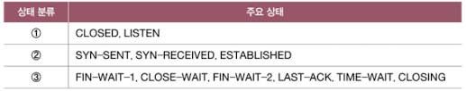

# 04. 전송 계층
## 04-1. 전송 계층 개요: IP의 한계와 포트
> 전송 계층, 신뢰할 수 없는 통신, 비연결형 통신, 포트, NAT, NAPT
전송 계층
- 네트워크 계층과 응용 계층 사이에 위치하여 신뢰할 수 있는 통신과 연결형 통신을 가능케 함
- IP의 한계를 극복하고 포트 번호를 통해 응용 계층의 애플리케이션 프로세스들을 식별
### 신뢰할 수 없는 통신과 비연결형 통신
- IP의 한계
  - 신뢰할 수 없는 프로토콜 unreliable protocol
    - IP 프로토콜이 패킷이 수신지까지 제대로 전송되었다는 보장을 하지 않음
    - 통신 과정에서 패킷의 데이터가 손상되거나 중복된 패킷이 전송되었더라도 확인 X, 재전송 X
    - = 최선형 전달 best effort delivery
  - 비연결형 프로토콜 connectless protocol
    - 송수신 호스트 간에 사전 연결 수립 작업을 거치지 않는 특징
    - 수신지를 향해 패킷을 보내기만 함

### IP의 한계를 보완하는 전송 계층
1. 전송 계층은 연결형 통신을 가능하게 함
    - TCP: 연결형 통신을 지원하는 대표적인 전송 프로토콜
2. 전송 계층은 신뢰성 있는 통신을 가능하게 함
    - TCP를 이용하여 패킷이 수신지까지 올바른 순서대로 확실히 전달되는 것을 보장함
### 응용 계층과의 연결 다리, 포트
#### 포트의 정의
- 포트 Port: 패킷이 실행 중인 특정 애플리케이션까지 전달되기 위해 패킷에 포함된 특정 애플리케이션을 식별할 수 있는 정보
#### 포트의 분류
- 전송 계층에서는 포트 번호를 통해 특정 애플리케이션을 식별함
- 잘 알려진 포트 well known port: system port 라고도 함. 0~1023
- 등록된 포트 registered port: 1024~49151. 잘 알려진 포트에 비해 덜 범용적이지만 자주 사용되는 애플리케이션 프로토콜에 할당함
- 동적 포트 dynamic port
  - = 사설 포트 Private port = 임시 포트 ephermeral port
  - 인터넷 할당 번호 관리 기관에 의해 할당된 애플리케이션 프로토콜이 없고, 특별히 관리되지 않음
  - 웹 브라우저 프로그램의 경우 임의의 번호를 할당하는 경우가 많음
> IANA(Internet Assigned Numbers Authority)
>
> 인터넷 할당 번호 관리 기관
### 포트 기반 NAT
- NAT
  - IP 주소를 변환하는 기술
  - 주로 네트워크 내부에서 사용되는 사설 IP 주소와 네트워크 외부에서 사용되는 공인 IP 주소를 변환하기 위해 사용
#### NAT 변환 테이블
- 다수의 사설 IP를 소수의 공인 IP 주소로 변환함
#### NAPT (Network Address Port Translation)
- = APT (Address Port Translation)
- 포트를 활용해 하나의 공인 IP 주소를 여러 사설 IP 주소가 공유할 수 있도록하는 NAT의 일종
### 포트 포워딩 (Port Forwarding)
- 네트워크 내 특정 호스트에 IP 주소와 포트 번호를 미리 할당하고, 해당 IP주소:포트번호로써 해당 호스트에게 패킷을 전달하는 기능
### ICMP (Internet Control Message Protocol)
- 네트워크 계층의 프로토콜
- IP의 신뢰할 수 없는 전송 특성과 비연결형 전송 특성을 보완하기 위한 네트워크 계층의 프로토콜
- IP 패킷의 전송 과정에 대한 피드백 메시지를 얻기 위해 사용
1. 전송 과정에서 발생한 문제 상황에 대한 오류 보고
2. 네트워크에 대한 진단 정보

## 04-2. TCP와 UDP
> TCP, MSS, TCP 세그먼트, 순서 번호, 확인 응답 번호, 쓰리 웨이 핸드세이크, TCP 상태, UDP, UDP 데이터그램
- TCP (Transmission Control Protocol): 신뢰할 수 있는 통신을 위한 연결형 프로토콜
- UDP (User Datagram Protocol): 신뢰성은 비교적 떨어지나 빠른 통신이 가능한 비연결형 프로토콜
### TCP 통신 단계와 세그먼트 구조
- TCP 통신 단계
  1. 연결 수립
  2. 데이터 송수신
  3. 연결 종료
- MSS (Maximum Segment Size)
  - TCP로 전송할 수 있는 최대 페이로드 크기
- TCP 세그먼트 헤더의 구조
  - 송신지 포트와 수신지 포트
  - 순서 번호 Sequence number
    - 순서 번호가 명시되는 필드
    - 순서 번호: 송수신되는 세그먼트의 올바른 순서를 보장하기 위해 세그먼트 데이터의 첫 바이트에 부여하는 번호
  - 확인 응답 번호 acknowledgement number
    - 상태 호스트가 보낸 세그먼트에 대한 응답
    - 다음으로 수신하기를 기대하는 순서 번호가 명시됨
  - 제어 비트 Control bit
    - 플래그 비트라고도 부름
    - 현재 세그먼트에 대한 부가 정보를 나타냄
  - 윈도우 Window
    - 수신 윈도우의 크기가 명시
    - 수신 윈도우: 한 번에 수신하고자 하는 데이터의 양
#### 제어 비트
- 기본적으로 8비트로 구성됨
- 제어 비트의 종류
  - ACK: 세그먼트의 승인을 나타내기 위한 비트
  - SYN: 연결을 수립하기 위한 비트
  - FIN: 연결을 종료하기 위한 비트
  - 각 비트가 1로 설정된 세그먼트를 칭함
#### 순서 번호와 확인 응답 번호
- TCP의 신뢰성을 보장하기 위해 사용되는 중요한 필드
- 순서 번호
  - 순서 번호 필드에 명시
  - 세그먼트의 올바른 송수신 순서를 보장하기 위한 번호
- 확인 응답 번호
  - 순서 번호에 대한 응답
  - 수신자가 다음으로 받기를 기대하는 순서 번호
  - 일반적으로 수신한 순서 번호 + 1로 설정됨
### TCP 연결 수립과 종료
#### 연결 수립: 쓰리 웨이 핸드셰이크
- three-way handshake
  1. SYN
  2. SYN + ACK
  3. ACK
- active open
  - 처음 연결을 시작하는 호스트의 연결 수립 과정
  - 주로 클라이언트에 의해 수행됨
- passive open
  - 연결 요청을 받고 나서 요청에 따라 연결을 수립하는 과정
  - 주로 서버에 의해 수행됨
#### 연결 종료
- four-way handshake
    1. FIN
    2. ACK
    3. FIN
    4. ACK
- active close
  - 먼저 연결을 종료하려는 호스트에 의해 수행됨
- passive close
  - 연결 종료 요청을 받아들이는 호스트에 의해 수행됨
### TCP 상태
- 상태 state: 현재 어떤 통신 과정에 있는지를 나타내는 정보
- TCP를 stateful protocol이라고도 함
- TCP의 상태

#### 연결이 수립되지 않은 상태
- CLOSED, LISTEN 상태를 유지함
- CLOSED
  - 아무런 연결이 없는 상태
- LISTEN
  - 일종의 연결 대기 상태
  - 일반적으로 서버로서 동작하는 passive open host는 LISTEN 상태를 유지함
#### 연결 수립 상태
- SYN-SENT, SYN-RECEIVED, ESTABLISHED
- SYN-SENT
  - 액티브 오픈 호스트가 SYN 세그먼트를 보낸 뒤 그에 대한 응답인 SYN+ACK 세그먼트를 기다리는 상태
  - 연결 요청을 보낸 뒤 대기하는 상태
- SYN-RECEIVED
  - 패시브 오픈 호스트가 SYN+ACK 세그먼트를 보낸 뒤 그에 대한 ACK 세그먼트를 기다리는 상태
- ESTABLISHED
  - 연결이 확립되었음을 나타내는 상태
  - 데이터를 송수신할 수 있는 상태
#### 연결 종료 상태
- FIN-WAIT-1, CLOSE-WAIT, FIN-WAIT-2, LAST-ACK, TIME-WAIT, CLOSED
- FIN-WAIT-1
  - 일반적인 TCP 연결 종료 과정에 있어 연결 종료의 첫 단계
  - 액티브 클로즈 호스트가 FIN 세그먼트로 연결 종료 요청을 보낸 상태
- CLOSE-WAIT
  - 종료 요청인 FIN 세그먼트를 받은 패시브 클로즈 호스트가 그에 대한 응답으로 ACK 세그먼트를 보낸 후 대기하는 상태
- FIN-WAIT-2
  - FIN-WAIT-1 상태에서 ACK 세그먼트를 받은 상태
  - 상대 호스트의 FIN 세그먼트를 기다리는 상태
- LAST-ACK
  - CLOSE-WAIT 상태에서 FIN 세그먼트를 전송한 뒤 이에 대한 ACK 세그먼트를 기다리는 상태
- TIME-WAIT
  - 액티브 클로즈 호스트가 FIN 세그먼트를 수신한 뒤, 이에 대한 ACK 세그먼트를 전송한 뒤 접어드는 상태
  - 액티브 클로즈 호스트는 일정 시간을 기다린 뒤 CLOSED 상태로 전이함
- CLOSING
  - 동시에 연결을 종료하려 할 때 전이되는 상태
  - 서로가 FIN 세그먼트를 보내고 받은 뒤 각자 그에 대한 ACK 세그먼트를 보냈지만 아직 자신의 FIN에 대한 ACK를 받지 못한 상태
### UDP 데이터그램 구조
- UDP: 비연결형 통신을 수행하는 신뢰할 수 없는 프로토콜
- stateless protocol이라고 하기도 함
- UDP 데이터그램 헤더
  - 송신지 포트와 수신지 포트
  - 길이: 헤더를 포함한 UDP 데이터그램의 바이트
  - 체크섬
    - 데이터그램 전송 과정에서 오류가 발생했는지 검사하기 위한 필드
    - 문제가 있다고 판단한 데이터그램은 폐기함
- 실시간 스트리밍 서비스, 인터넷 전화 등 실시간성이 강조되는 상황에서 TCP보다 많이 쓰임
## 04-3. TCP의 오류, 흐름, 혼잡 제어
> RTT, ARQ, 오류 제어, 흐름 제어, 슬라이딩 윈도우, 혼잡 제어
- TCP의 데이터 송수신 과정에서의 기능
- TCP는 재전송을 기반으로 다양한 오류를 제어하고, 흐름 제어를 통해 처리할 수 있을 만큼의 데이터를 주고받으며, 혼잡 제어를 통해 네트워크가 혼잡한 정도에 따라 전송량을 조절함
### 오류 제어: 재전송 기법
- 재전송 기반 오류 제어
#### 오류 검출과 재전송
- 체크섬 필드만으로는 신뢰성을 보장하기 어려움
- 체크섬은 세그먼트의 훼손 여부만을 알려줌
> RTT (Round Trip Time)
>
> 메시지를 전송한 뒤 그에 대한 답변을 받는 데까지 걸리는 시간
1. 중복된 ACK 세그먼트를 수신했을 때
    - 수신 호스트 측이 받은 세그먼트의 순서 번호 중 일부가 누락되었을 경우 중복된 ACK 세그먼트를 전송되게 됨
2. 타임아웃이 발생했을 때
    - 재전송 타이머 retransmission timer
      - 호스트가 세그먼트를 전송할 때마다 재전송 타이머를 시작함
      - 이 타이머의 카운트다운이 끝난 상황을 타임아웃이라고 함
      - 타임아웃이 발생할 때까지 ACK 세그먼트를 받지 못하면 세그먼트를 재전송함
#### ARQ: 재전송 기법
- Automatic Repeat Request
- 수신 호스트의 답변(ACK)과 타임아웃 발생을 토대로 문제를 진단하고, 문제가 생긴 메시지를 재전송함으로써 신뢰성을 확보하는 방식
#### Stop-and-Wait ARQ
- 제대로 전달했음을 확인하기 전까지 새로운 메시지를 보내지 않는 방식
- 장점: 높은 신뢰성 보장
- 단점: 네트워크의 이용 효율 저하
#### Go-Back-N ARQ
- 파이프라이닝 Pipelining
  - 연속해서 메시지를 전송할 수 있는 기술
- 파이프라이닝 방식을 활용해 여러 세그먼트를 전송하고, 도중에 잘못 전송된 세그먼트가 발생할 경우 해당 세그먼트부터 전부 다시 전송하는 방식
- 누적 확인 응답이라고도 함
> 빠른 재전송 fast retransmit
>
> 재전송 타이머가 만료되기 전이라도 세 번의 동일한 ACK 세그먼트가 수신되었다면 해당 세그먼트를 곧바로 재전송하는 기능
> 시간 낭비를 줄이며 빠르게 손실된 세그먼트를 재전송함으로써 성능을 높이는 기능
#### Selective Repeat ARQ
- 수신 호스트 측에서 제대로 전송받은 각각의 패킷들에 대해 ACK 세그먼트를 보내는 방식
- 개별 확인 응답
- 오늘날의 대부분의 호스트는 TCP 통신에서 Selective Repeat ARQ를 지원함
### 흐름 제어: 슬라이딩 윈도우
- 수신 버퍼
  - 수신된 세그먼트가 애플리케이션 프로세스에 의해 읽히기 전에 임시로 저장되는 공간
- 버퍼 오버플로 buffer overflow
  - 버퍼가 넘치는 문제 상황
- 슬라이딩 윈도우 sliding window
  - window
    - 송신 호스트가 파이프라이닝할 수 있는 최대량
    - 윈도우의 크기만큼 확인 응답을 받지 않고도 한 번에 전송 가능함
### 혼잡 제어
- 혼잡 윈도우 congestion window
  - 혼잡 없이 전송할 수 있을 법한 데이터양
  - 송신 호스트가 어느 정도의 세그먼트를 전송해야 혼잡을 방지할 수 있을지 직접 계산해야 함
  - 혼잡 제어 알고리즘 congestion control algorithm
    - AIMD (Additive Increase/Multiplicative Decrease)
      - 합으로 증가, 곱으로 감소
      - 혼잡이 감지되지 않으면 -> 혼잡 윈도우를 RTT마다 1씩 선형적으로 증가
      - 혼잡이 감지되면 -> 혼잡 윈도우를 절반으로 떨어뜨림
    - 느린 시작 알고리즘 slow start
      - 혼잡 윈도우를 1부터 시작해 문제가 없을 경우 수신된 ACK 세그먼트 하나당 1씩 증가시키는 방식
      - RTT마다 2배씩 증가
      - 타임아웃 발생 시 -> 혼잡 윈도우 값을 1로, 느린 시작 임계치를 혼잡이 감지되었을 시점의 혼잡 윈도우 값의 절반으로 초기화한 뒤 느린 시작 재개
      - 혼잡 윈도우 >= 느린 시작 임계치 -> 느린 시작 종료. 혼잡 윈도우를 절반으로 초기화한 뒤 혼잡 회피 수행
      - 세 번의 중복 ACK 발생 -> 빠른 재전송 후 빠른 회복 수행
    - 혼잡 회피 알고리즘 congestion avoidance
      - RTT마다 혼잡 윈도우를 1MSS씩 증가시키는 알고리즘
      - 혼잡 윈도우 크기를 선형적으로 증가시킴
    - 빠른 회복 알고리즘 fast recovery
      - 세 번의 중복 ACK 세그먼트를 수신했을 때 느린 시작은 건너뛰고 혼잡 회피를 수행하는 알고리즘
### ECN: 명시적 혼잡 알림
- 명시적 혼잡 알림 Explicit Congestion Notification
  - 혼잡을 회피하기 위해 네트워크 중간 장치의 도움을 받는 방법
  - 지원하는 호스트가 있고, 지원하지 않는 호스트가 있음
  - 중복된 ACK 세그먼트 수신이나 타임아웃 발생보다 더 빠르게 혼잡을 감지할 수 있음