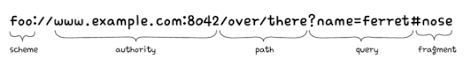
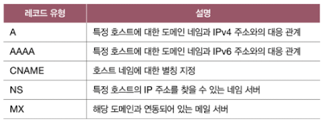
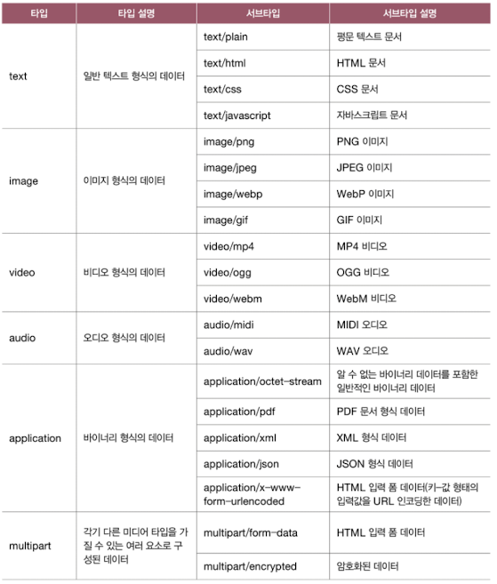
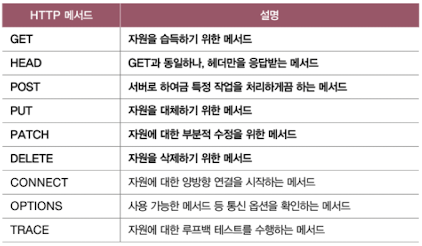
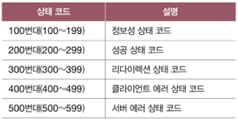
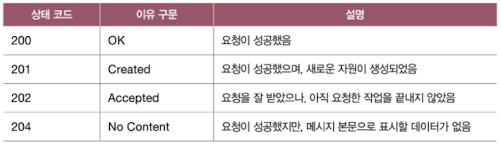
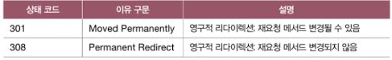
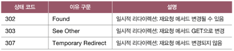
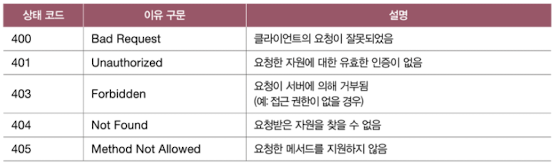

# 05. 응용 계층
## 05-1. DNS와 자원
> 도메인 네임, DNS, 네임 서버, DNS 캐시, 자원, URI, URL
- 도메인 네임: 메시지를 주고받고자 하는 대상을 파악하기 위해서 사용
- URL: 위치 기반의 식별자
- URN: 이름 기반의 식별자
### 도메인 네임과 네임 서버
- 도메인 네임 domain name
  - 사용자가 상대 호스트를 특정하기 위해 사용하는 것
  - 호스트의 IP 주소와 대응되는 문자열 형태의 호스트 특정 정보
  - 예) www.google.com
- 네임 서버 Name server: 도메인 네임과 IP 주소를 관리하는 서버
- DNS 서버: 도메인 네임을 관리하는 네임 서버
- 도메인 네임을 네임 서버에 질의하면 해당 도메인 네임에 대한 IP 주소를 알려줌
> hosts 파일
>
> 호스트마다 유지하는 개인 전화번호부 같은 파일
> 도메인 네임과 IP 주소의 대응 관계를 담은 파일
> 이를 토대로 도메인 네임에 대응하는 IP 주소를 식별할 수 있음

- 루트 도메인 > 최상위 도메인 TLD > 2단계 도메인 ...
- 루트 도메인 Root domain
  - 루트 도메인은 점(.)으로 표현되며, 도메인 네임의 마지막에 점이 찍힌 형태도 표기됨
- 최상위 도메인 TLD (Top-Leved Domain)
  - ex) com, net, org, kr...
- 2단계 도메인 second-level domain
  - 최상위 도메인의 하부 도메인
- 전체 주소 도메인 네임 FQDN: Fully-Qualified Domain Name
  - 도메인 네임을 모두 포함하는 도메인 네임
  - ex) www.example.com.
  - FQDN의 첫번째 부분을 호스트 네임 host name 이라 부르기도 함
- 도메인 네임 시스템 DNS (Domain Name System)
  - 계층적이고, 분산된 도메인 네임에 대한 관리 체계
  - 호스트가 이러한 도메인 네임 시스템을 이용할 수 있도록 하는 애플리케이션 계층 프로토콜을 의미하기도 함
> 서브 도메인 subdomain
>
> 다른 도메인이 포함된 도메인
> ex) mail.google.com은 google.com의 서브도메인

### 계층적 네임 서버
- 로컬 네임 서버 Local name server
  - 클라이언트와 맞닿아 있는 네임 서버
  - 일반적으로 ISP에서 할당해 주는 경우가 많음
  - 공개 DNS 서버를 이용할 수도 있음
  - 로컬 네임 서버가 대응되는 IP 주소를 모를 경우 루트 네임 서버에게 질의함
- 루트 네임 서버 root name server
  - 루트 도메인을 관장하는 네임서버
  - 질의에 대한 TLD 네임 서버의 IP 주소를 반환함
- TLD 네임 서버
  - TLD를 관리하는 네임 서버
  - 질의에 대해 TLD의 하위 도메인 네임을 관리하는 네임 서버 주소를 반환할 수 있음
- 책임 네임 서버 authoritative name server
  - 특정 도메인 영역을 관리하는 네임 서버
  - 자신이 관리하는 도메인 영역의 질의에 대하여 다른 네임 서버에게 떠넘기지 않고 곧바로 답할 수 있음 네임 서버
  - 로컬 네임 서버가 마지막으로 질의하는 네임 서버
- 도메인 네임 리졸빙 과정
  - 재귀적 질의 Recursive query
    - 클라이언트가 로컬 네임 서버에게 도메인 네임을 질의하면, 로컬 네임 서버가 루트 네임 서버에게 질의하고, 루트 네임 서버가 TLD 네임 서버에게 질의하고, 해당 과정을 반복하면서 최종 응답 결과를 역순으로 전달받는 방식
  - 반복적 질의 iterative query
    - 클라이언트가 로컬 네임 서버에게 IP 주소를 알고 싶은 도메인 네임을 질의
    - 로컬 네임 서버는 루트 도메인 서버에게 질의
    - 다음으로 로컬 네임 서버가 TLD 네임 서버에게 질의
    - 로컬 네임 서버가 다른 네임 서버에 대한 질의를 모두 담당함
  - 위 도메인 네임 리졸빙 과정은 단계가 아주 많음. 서버에 과부하가 생길 수 있음
  - DNS 캐시 DNS cache
    - 네임 서버들이 기존에 응답받은 결과를 임시로 저장했다가 추후 같은 질의에 이를 활용함
### 자원을 식별하는 URI
- 자원 Resource
  - 네트워크상의 메시지를 통해 주고받는 대상
  - 두 호스트가 네트워크를 통해 서로 정보를 주고받을 때, 송수신하는 대상
  - HTTP 요청 메시지의 대상이라고 표현하기도 함
- URI; Uniform Resource Identifeir
  - 자원을 식별할 수 있는 정보
  - URL; Uniform Resource Locator
  - URN; Uniform Resource Name
#### URL
- 오늘날 인터넷 환경에서 자원 식별에 더 많이 사용되는 방법
- 
1. scheme
    - URL의 첫 부분
    - 자원에 접근하는 방법을 의미
    - 일반적으로 사용할 프로토콜이 명시됨
    - ex) http, https
2. authority
    - 호스트를 특정할 수 있는 정보
    - IP 주소 혹은 도메인 네임
3. path
    - 자원이 위치한 경로
    - 슬래시를 기준으로 계층적으로 표현
4. Query
    - 물음표로 시작되는 <키=값> 형태의 데이터
    - 앰퍼샌드(&)를 사용하여 여러 쿼리 문자열을 연결함
5. Fragment
    - 자원의 한 조각을 가리키기 위한 정보
    - 흔히 HTML 파일의 특정 부분을 이동하기 위해 사용
#### URN
- 자원의 위치가 변경될 경우 URL로는 자원을 식별할 수 없음
- URN은 자원에 고유한 이름을 붙이는 이름 기반 식별자이므로 자원의 위치와 무관하게 자원을 식별할 수 있음
- ex) urn:ietf:rfc:2648
### DNS 레코드 타입
- 네임 서버는 DNS 자원 레코드라 불리는 정보를 저장하고 관리함
- 레코드 유형
    - 
## 05-2. HTTP
> HTTP 특성, HTTP 메시지 구조, 메서드, 상태 코드
- HTTP 특성
    1. 요청과 응답을 기반으로 동작
    2. 미디어 독립적
    3. 상태를 유지하지 않음
    4. 지속 연결을 지원함
### HTTP의 특성 
- HTTP; Hypertext Transfer Protocol
  - 응용 계층에서 정보를 주고받는 데 사용되는 프로토콜
#### 요청-응답 기반 프로토콜
- HTTP는 클라이언트와 서버가 서로 HTTP 요청 메시지와 응답 메시지를 주고받는 구조로 동작함
- 같은 메시지라도 요청인지 응답인지에 따라 구조가 다름
#### 미디어 독립적 프로토콜
- HTTP는 주고받을 자원의 특성과 무관하게 그저 자원을 주고받을 수단(인터페이스)의 역할을 함
- 미디어 타입 Media type
  - HTTP에서 메시지로 주고받는 자원의 종류
  - = MIME 타입 (Multipurpose Internet Mail Extensions Type)
  - 일종의 웹 세상에서 확장자와 같은 개념
  - ex) text/html, text/plain, image/png
  - 기본적으로 슬래시를 기준으로 하는 **타입/서브타입** 형식으로 구성됨
  - 타입: 데이터의 유형
  - 서브타입: 주어진 타입에 대한 세부 유형
  - 
  - type/subtype;parameter=value
    - ex) type/html;charset=UTF-8
    - 미디어타입이 HTML 문서 타입이며 HTML 문서 내에서 사용된 문자는 UTF-8로 인코딩되었음을 뜻함
#### 스테이트리스 프로토콜
- HTTP는 상태를 유지하지 않는 stateless protocol
- 서버가 HTTP 요청을 보낸 클라이언트와 관련된 상태를 기억하지 않는다는 의미
- 클라이언트의 모든 HTTP 요청은 기본적으로 독립적인 요청으로 간주
- 상태를 유지하지 않고 모든 요청을 독립적인 요청으로 처리 -> 특정 클라이언트가 특정 서버에 종속되지 않도록 함, 서버의 추가나 문제 발생 시 대처가 용이함
#### 지속 연결 프로토콜
- 비지속 연결: 추가적인 요청-응답을 하기 위해 다시 TCP 연결을 수립하는 것
- 지속 연결 Persistent connection
  - 최근 대중적으로 사용되는 HTTP 버전
  - = 킵 얼라이브 Keep-alive
  - 하나의 TCP 연결상에서 여러 개의 요청-응답을 주고받을 수 있는 기술
### HTTP 메시지 구조
- HTTP 메시지 = 시작 라인 + 필드 라인 + 메시지 본문
- 시작 라인 start-line
  - HTTP 메시지가 요청 메시지인지, 응답 메시지인지 표기
  - 요청 메시지: 요청 라인 request-line
    - [메서드] [요청 대상] [HTTP 버전]
    - 메서드 method
      - 클라이언트가 서버의 자원에 대해 수행할 작업의 종류
      - GET, POST, PUT, DELETE
    - 요청 대상 request-target
      - HTTP 요청을 보낸 서버의 자원
      - 쿼리가 포함된 URI의 경로가 명시됨
      - 예) `/hello?q=world`
    - HTTP 버전
      - 표기방식: `HTTP/<버전>`
      - 예) `HTTP/1.1`   
  - 응답 메시지: 상태 라인 status-line
    - [HTTP 버전] [상태 코드] [이유 구문]
    - 상태 코드 status code
      - 요청에 대한 경과를 나타내는 세 자리 정수
    - 이유 구문 reason phrase
      - 상태 코드에 대한 문자열 형태의 설명
    - ex) HTTP/1.1 200 OK
- 필드 라인
  - 0개 이상의 HTTP 헤더가 명시됨
  - = 헤더 라인
  - HTTP 헤더
    - HTTP 통신에 필요한 부가 정보
    - 콜론(:)을 기준으로 헤더 이름과 하나 이상의 헤더값으로 구성됨
    - 예) Host: www.example.com
- 메시지 본문 Message-body
  - json, html과 같은 다양한 콘텐츠 타입을 사용하여 명시
### HTTP 메서드

#### GET - 가져다주세요
- 특정 자원을 조회할 때 사용되는 메서드
#### HEAD - 헤더만 가져다주세요
- 응답 메시지에 메시지 본문이 포함되지 않음
- HEAD 메서드를 사용하면 서버는 요청에 대한 응답으로 응답 메시지의 헤더만 반환함
#### POST - 처리해 주세요
- 서버로 하여금 특정 작업을 처리하도록 요청하는 메서드
- 클라이언트가 서버에 새로운 자원을 생성하고자 할 때 사용함
- 성공적으로 POST 요청이 처리되어 새로운 자원이 생성되면 Location 헤더를 통해 새로 생성된 자원의 위치를 클라이언트에게 알려줄 수 있음
#### PUT - 덮어써 주세요
- 덮어쓰기를 요청하는 메서드
- 요청 자원이 없다면 메시지 본문으로 자원을 새롭게 생성하거나, 이미 자원이 존재한다면 메시지 본문으로 자원을 완전히 대체하는 메서드
#### PATCH - 일부 수정해 주세요
- 부분적 수정
#### DELETE - 삭제해 주세요
- 특정 자원을 삭제하고 싶을 때 사용하는 메서드
### HTTP 상태 코드
- 상태 코드: 요청에 대한 결과를 나타내는 세자리 정수
- 백의 자리수를 기준으로 유형을 구분할 수 있음
- 
#### 200번대: 성공 상태 코드
- 요청이 성공했음을 의미
- 
#### 300번대: 리다이렉션 상태 코드
- 리다이렉션 redirection과 관련된 상태 코드
- 리다이렉션
  - 요청을 완수하기 위해 추가적인 조치가 필요한 상태
  - 클라이언트가 요청한 자원이 다른 곳에 있을 때, 클라이언트의 요청을 다른 곳으로 이동시키는 것
  - 영구적인 리다이렉션 permanent redirection
    - 자원이 완전히 새로운 곳으로 이동하여 경로가 영구적으로 재지정되는 것
    - 기존의 URL에 요청 메시지를 보내면 항상 새로운 URL로 리다이렉트
    - `301(Moved Permanently)`, `308(Permanent Redirect)`
    - 
    - 재요청하는 메서드의 변경 여부 차이
  - 일시적인 리다이렉션 temporary redirection
    - 자원의 위치가 임시로 변경되었거나 임시로 사용할 URL이 필요한 경우 사용
    - `302(Found)`, `303(See Other)`, `303(Temporary Redirect)`
    - 
#### 400번대: 클라이언트 에러 상태 코드
- 클라이언트에 의한 에러가 있음을 알려주는 상태 코드
- 
- `400(Bad Request)`
- `401(Unauthorized)`
  - 특정 자원에 접근하기 위해 인증이 필요한 경우
  - WWW-Authenticate 헤더를 통해 인증 방법을 알려 주어야 함
- `403(Forbidden)`
  - 자원에 접근할 권한이 없음을 의미
- 인증: 자신이 누구인지 증명하는 것
- 권한 부여(인가): 인증된 주체에게 작업을 허용하는 것
- `404(Not Found)`
  - 접근하고자 하는 자원이 존재하지 않음
#### 500번대: 서버 에러 상태 코드
- 서버에 의한 에러가 발생했을 때 상태 코드
- 
- `502(Bad Gateway)`
  - 클라이언트와 서버 사이에 위치한 중간 서버의 통신 오류를 나타내는 상태 코드
- `503(Service Unavailable)`
  - 현재 서비스를 일시적으로 이용할 수 없음을 의미하는 상태 코드
### HTTP의 발전: HTTP/0.9에서 HTTP/3.0까지
- HTTP/2.0
  - 멀티플렉싱 기법을 도입
    - 여러 스트림을 이용해 병렬적으로 메시지를 주고받는 기술
    - 스트림별로 독립적인 송수신 가능
- HTTP/3.0
  - UDP를 기반으로 구현된 QUIC 프로토콜을 기반으로 동작
  - 비연결형이므로 상대적으로 더 빠름
## 05-3. HTTP 헤더와 HTTP 기반 기술
> HTTP 헤더, 캐시, 쿠키, 콘텐츠 협상
### HTTP 헤더
#### 요청 시 활용되는 HTTP 헤더
1. Host
    - 요청을 보낼 호스트를 나타내는 헤더
    - ex) Host: info.cern.ch
    - 주로 도메인 네임으로 명시됨
2. User-Agent
    - 웹 브라우저와 같이 HTTP 요청을 시작하는 클라이언트 측의 프로그램
    - 요청 메시지 생성에 관여한 클라이언트 프로그램과 관련된 다양한 정보 명시
3. Referer
    - 클라이언트가 요청을 보낼 때 머무르고 있던 URL 명시
    - 클라이언트의 유입 경로를 파악해 볼 수 있음
4. Authorization
   - 클라이언트의 인증 정보를 담는 헤더
   - 인증 타입과 인증을 위한 정보가 차례로 명시됨
   - `Authorization: <type> <credentials>`
   - 인증 타입
     - Basic: 사용자 아이디와 비밀번호를 콜론을 이용해 합친 뒤, Base64 인코딩한 값을 인증 정보로 삼는 방식
#### 응답 시 활용되는 HTTP 헤더
1. Server
   - 요청을 처리하는 서버 측의 소프트웨어와 관련된 정보 명시
2. Allow
   - 클라이언트에게 허용된 HTTP 메서드 목록을 알려주기 위해 사용됨
3. Retry-After
   - 자원을 사용할 수 있는 날짜 혹은 시간을 나타냄
4. Location
   - 클라이언트에게 자원의 위치를 알려 주기 위해 사용되는 헤더 
5. WWW-Authenticate
   - 자원에 접근하기 위한 인증 방식을 설명하는 헤더
#### 요청과 응답 모두에서 활용되는 HTTP 헤더
1. Date
   - 메시지가 생성된 날짜와 시각에 관련된 정보를 담은 헤더
2. Connection
   - 클라이언트의 요청과 응답 간의 연결 방식을 설정하는 헤더
   - ex) keep-alive, close
3. Content-Length
   - 본문의 바이트 단위 크기
4. Content-Type, Content-Language, Content-Encoding
   - 표현 헤더의 일종
   - 전송하려는 메시지 본문의 표현 방식을 설명하는 헤더
### 캐시

### 쿠키
### 콘텐츠 협상과 표현