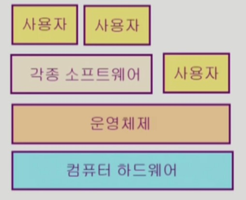
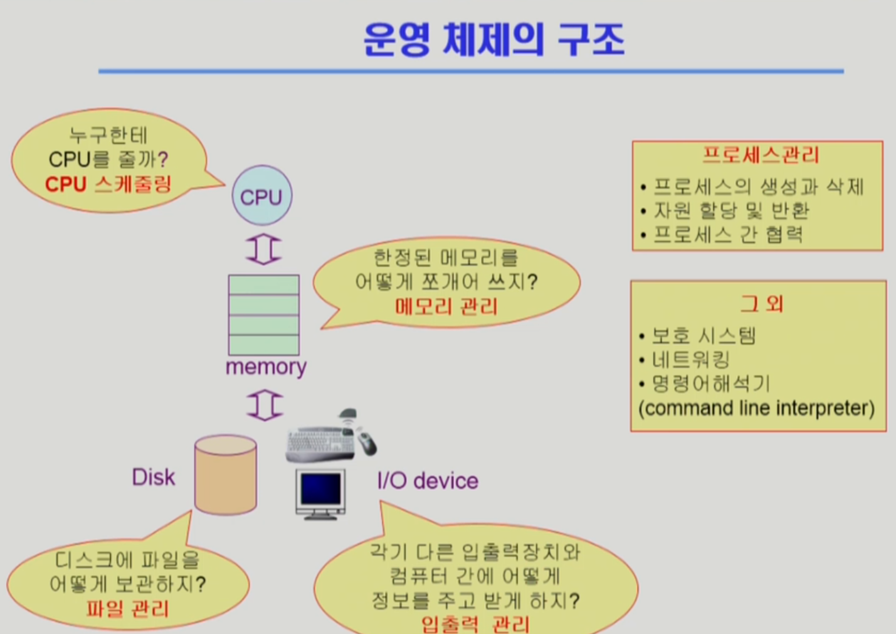

# 운영체제 개요

# 운영체제란 무엇인가?

## 운영체제 (Operating System, OS)

컴퓨터 하드웨어 바로 위에 설치되어 사용자 및 다른 모든 소프트웨어와 하드웨어를 연결하는 소프트웨어 계층

### 커널

운영체제의 핵심 부분으로 메모리에 상주하는 부분

- 좁은 의미의 운영체제 : 커널
- 넓은 의미의 운영체제 : 커널 + 각종 주변 시스템

# 운영체제의 목적

- 컴퓨터 시스템의 **자원을 효율적으로 관리**
- 컴퓨터 시스템을 편리하게 사용할 수 있는 환경을 제공

# 운영체제의 분류

## 동시 작업 가능 여부

- 단일 작업(Single Tasking) - 한 번에 하나의 작업만 처리
    - 예) MS-DOS 프롬프트 상에서는 한 명령의 수행을 끝내기 전에 다른 명령을 수행시킬 수 없음
- 다중 작업(Multi Tasking) - 동시에 두 개 이상의 작업을 처리
    - 예) UNIX, MS Windows 등에서는 한 명령의 수행이 끝나기 전에 다른 명령이나 프로그램을 수행할 수 있음

## 사용자의 수

- 단일 사용자(Single User)
    - MS-DOS, MS-Windows
- 다중 사용자(Multi User)
    - UNIX, NT Server

## 처리 방식

- 일괄 처리(Batch Processing)
    - 작업 요청을 일정량 모아서 한꺼번에 처리
    - 작업이 완전 종료될 때까지 기다려야 함
- 시분할(Time Sharing) - 현대적 방식
    - 여러 작업을 수행할 때 컴퓨터 처리 능력을 일정한 시간 단위로 분할하여 사용
    - 일괄 처리 시스템에 비해 짧은 응답 시간을 가짐
    - interactive한 방식
- 실시간(Real Time)
    - 정해진 시간 안에 어떠한 일이 반드시 종료됨을 보장하여야 하는 실시간 시스템을 위한 OS
    - 예) 원자로/공장 제어, 미사일 제어, 반도체 장비, 로보트 제어
    - 개념 확장 - Hard realtime system(경성 실시간 시스템), Soft realtime system(연성 실시간 시스템)

# 운영 체제의 예

## 유닉스(UNIX)

- 코드의 대부분을 C언어로 작성
- 높은 이식성
- 최소한의 커널 구조
- 복잡한 시스템에 맞게 확장 용이
- 소스 코드 공개
- 프로그램 개발에 용이
- 다양한 버전 - System V, FreeBSD, SunOS, Solaris, Linux

## DOS(Disk Operating System)

- MS사에서 1981년 IBM-PC를 위해 개발
- 단일 사용자용 운영체제, 메모리 관리 능력의 한계(주 기억 장치 : 640KB)

## MS Windows

- MS사의 다중 작업용 GUI 기반 운영 체제
- Plug and Play, 네트워크 환경 강화
- DOS용 응용 프로그램과 호환성 제공
- 불안정성
- 풍부한 지원 소프트웨어

## Handheld device를 위한 OS

- PalmOS, Pocket PC

# 운영체제의 구조

