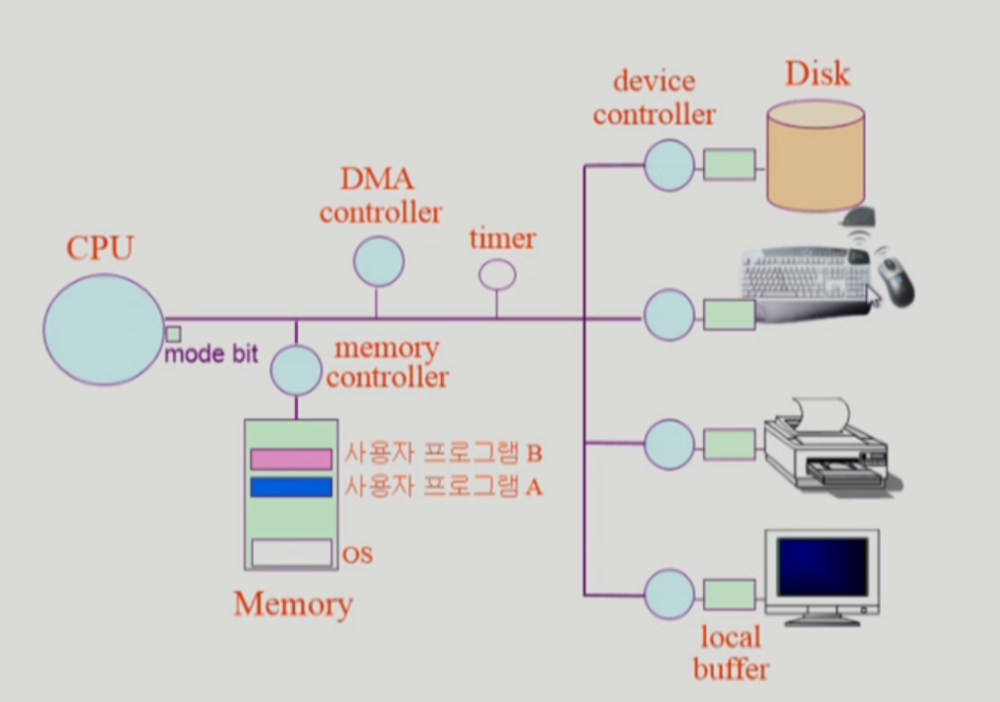
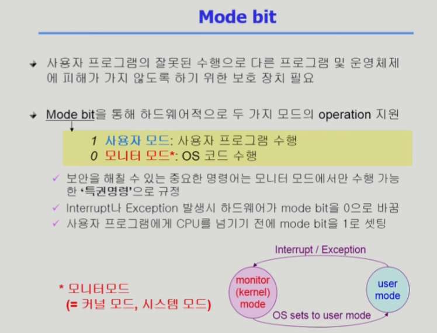
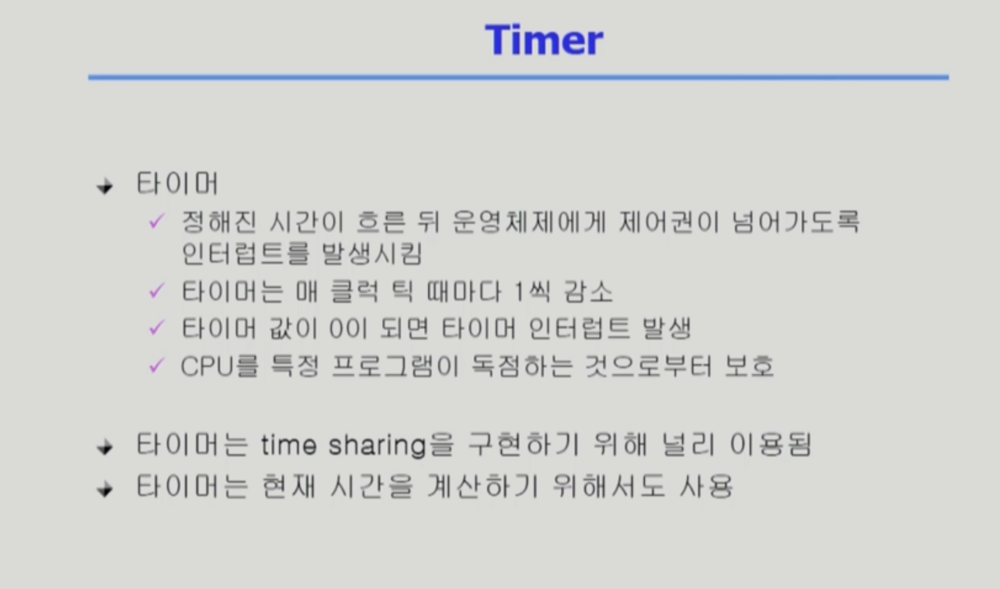
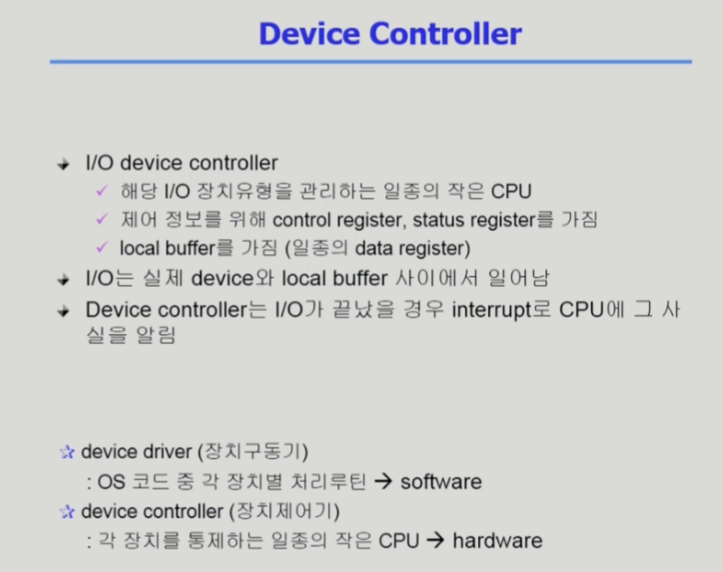
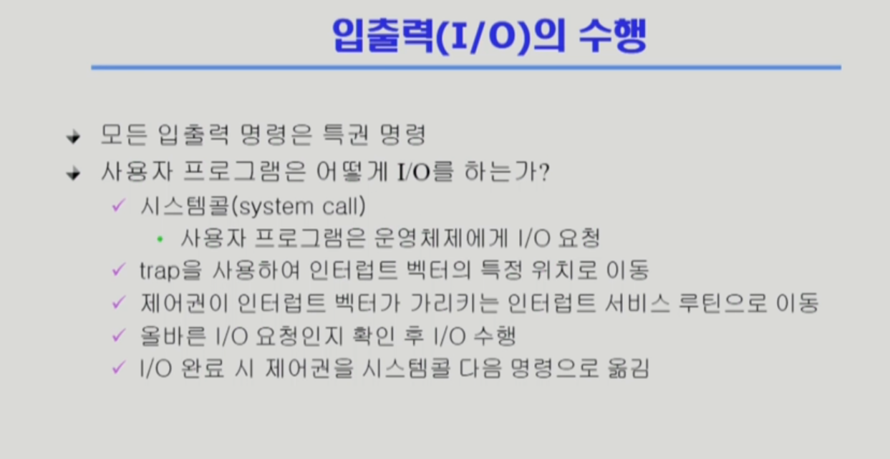
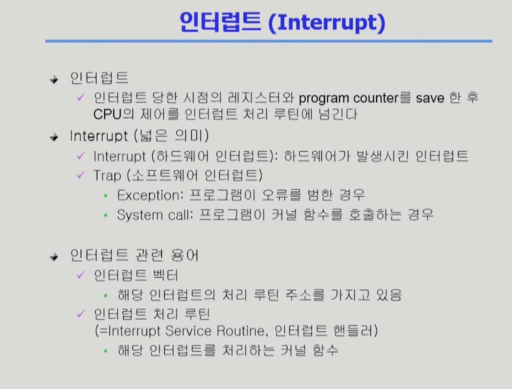

# 컴퓨터 시스템 구조

- 각각의 디바이스를 통제하는 것은 CPU의 역할이 아니라 각각에 붙어있는 Device Controller의 역할임 / 작은 CPU와 같은 역할을 함
- CPU의 작업 공간이 Memory인 것처럼 각각의 디바이스의 작업공간을 Local Buffer라고 함
- CPU 안에는 메모리보다 빠르면서 정보를 저장할 수 있는 작은 공간인 Register가 있음
- CPU안에 Mode bit이 있는데, CPU에서 실행되고 있는 것이 운영체제인지, 사용자 프로그램인지 구분하는 역할을 함
- CPU는 Memory에 있는 다음 명령을 가져와서 처리하는 작업을 반복함. 그 과정 중에 디바이스에서 scanf같은 Input 요청 등이 들어오면 **CPU**는 **각각의 컨트롤러**에게 작업을 지시함. 그리고 그 결과는 Interrupt Line을 통해 CPU가 알게 된다.
- **Timer**는 특정 프로그램이 CPU를 독점하는 것을 막기 위한 하드웨어
- 처음에는 OS가 CPU자원을 가지고 있다가 사용자 프로그램이 실행되면 OS가 Timer에 수십ms정도 특정 값을 세팅한 뒤에 사용자 프로그램에 CPU를 넘겨준다.
- 그 시간이 지나면 Timer가 CPU에게 Interrupt를 건다.
- CPU는 메모리로부터 Instruction을 가져와서 처리할 때마다 Interrupt Line을 체크한다. 만약 Interrupt가 들어온 게 없으면 다른 Instruction을 처리하고, 있다면 하던 일을 멈추고 CPU의 제어권이 사용자 프로그램에서 OS로 자동으로 넘어간다.
- OS는 다시 Timer에게 값을 세팅하고 다음 사용자 프로그램에게 CPU 제어권을 넘겨준다.
- 사용자 프로그램이 CPU가 아니라 I/O를 해야된다면, 자진해서 CPU 제어권을 OS로 넘겨주고 OS가 해당하는 작업을 다시 디바이스 컨트롤러에게 지시한다.
- DMA Controller(Direct Memory Access Controller)는 CPU 이외에 메모리에 접근할 수 있는 하드웨어. 원래는 CPU만 메모리에 접근할 수 있지만, 그러다보니 CPU가 I/O 장치에게 너무 인터럽트를 많이 당함. 그래서 보조적인 장치로 DMA Controller가 생김.
- I/O장치에서 Memory에 복사하는 명령은 CPU를 굳이 거칠 필요 없으므로 DMA Controller가 메모리에 복사해줌. 그리고 나서 한번만 CPU에게 인터럽트를 걸어서 복사가 다 됐다고 알려줌
- CPU와 DMA Controller가 동시에 메모리에 접근할 경우에는 문제가 생길 수 있음. 이러한 문제를 중재하기 위해 Memory Controller가 있음

# Mode Bit

- Mode Bit이 0이면 커널 모드, 1이면 사용자 모드
- 운영체제가 CPU에서 실행 중이면 커널 모드, 사용자 프로그램이 CPU에서 실행 중이면 사용자 모드임
- 보안 때문에 커널 모드일 때는 메모리 접근, I/O 디바이스를 접근하는 등 모든 권한을 사용할 수 있지만, 사용자 모드일 때는 제한된 권한만을 쓸 수 있음

# Timer

- 특정 프로그램이 CPU를 독점하는 것을 막기 위해서 정해진 시간을 타이머 할당한 뒤에 넘겨줌
- 타이머는 한 클럭 틱마다 1씩 감소하고 0이 되면 타이머 인터럽트가 발생

# Device Controller

- 각 I/O Device를 관리하는 일종의 작은 CPU
- 제어 정보를 위한 Control Register와 Status Register를 가지며, Local Buffer를 가짐
- Device Driver: OS 코드 중 각 장치 별 처리루틴으로 **소프트웨어**임
- Device Controller: 각 장치를 통제하는 일종의 작은 CPU로 **하드웨어**임

# 입출력의 수행

- 사용자 프로그램은 직접 I/O를 하지 못하고 OS에게 요청해서 해야 함
- **시스템 콜**(System Call) : 사용자 프로그램이 운영체제에게 I/O 요청해서 운영체제의 함수를 호출
- 어떤 사용자  프로그램이 I/O 요청을 한다면 **Trap(소프트웨어 인터럽트)**을 사용해 인터럽트 벡터의 특정 위치로 이동하고 제어권이 벡터가 가리키는 인터럽트 서비스 루틴으로 이동함
- OS는 I/O 요청이 올바른지 확인하고 I/O Controller에게 명령함
- I/O가 끝났을 때는 I/O Controller가 **Interrupt(하드웨어 인터럽트)**를 발생시킴

# 인터럽트 (Interrupt)

- Interrupt : 하드웨어가 발생시킨 인터럽트
- Trap : 소프트웨어가 발생시킨 인터럽트
    - Exception : 프로그램이 오류를 범한 경우
    - System Call : 프로그램이 커널 함수를 호출하는 경우
- 인터럽트 벡터 : 인터럽트의 종류가 여러 개 있고 각각 하는 일이 다름. 그리고 인터럽트 벡터는 해당 인터럽트 처리 루틴의 주소를 가지고 있음
- 인터럽트 처리 루틴(Interrupt Service Routine) : 운영체제를 만들 때 어떤 인터럽트는 어떤 루틴을 수행해야 하는지 정의가 되어 있는데, 그 때 실제 코드를 인터럽트 처리 루틴이라고 함