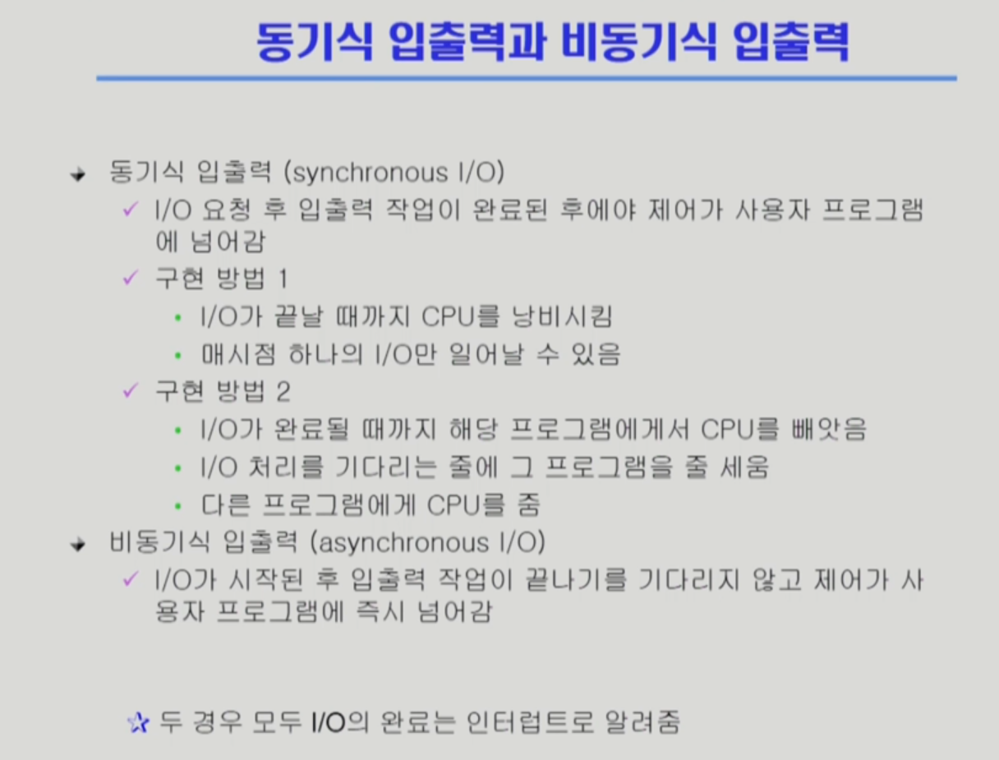
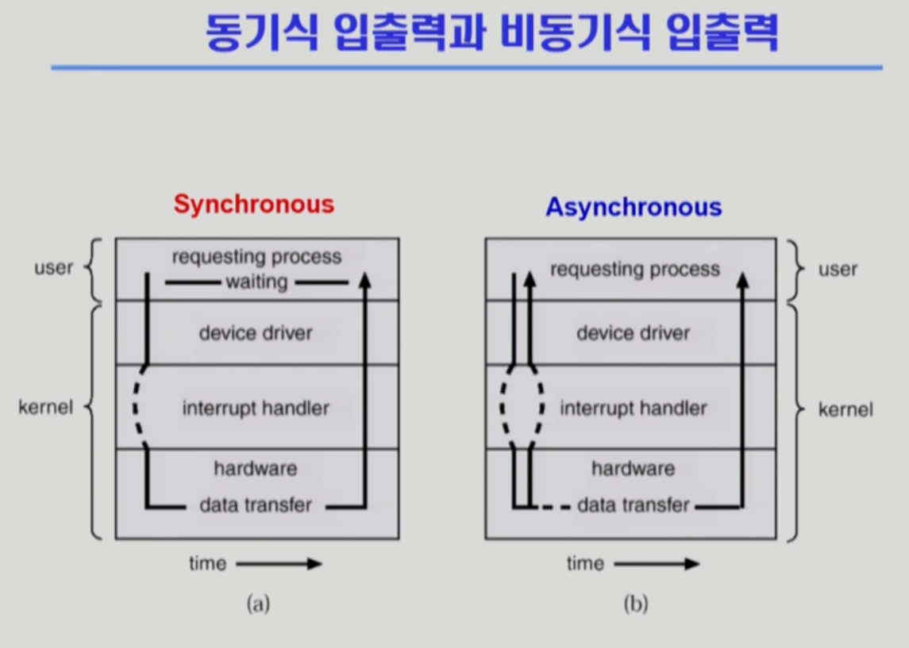
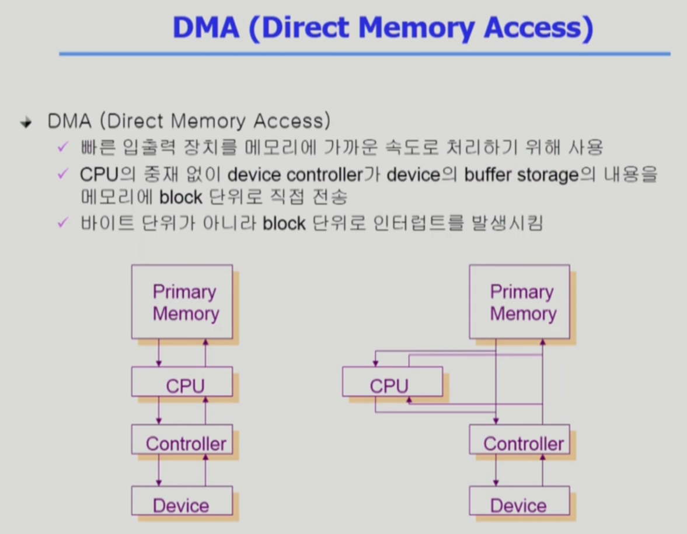
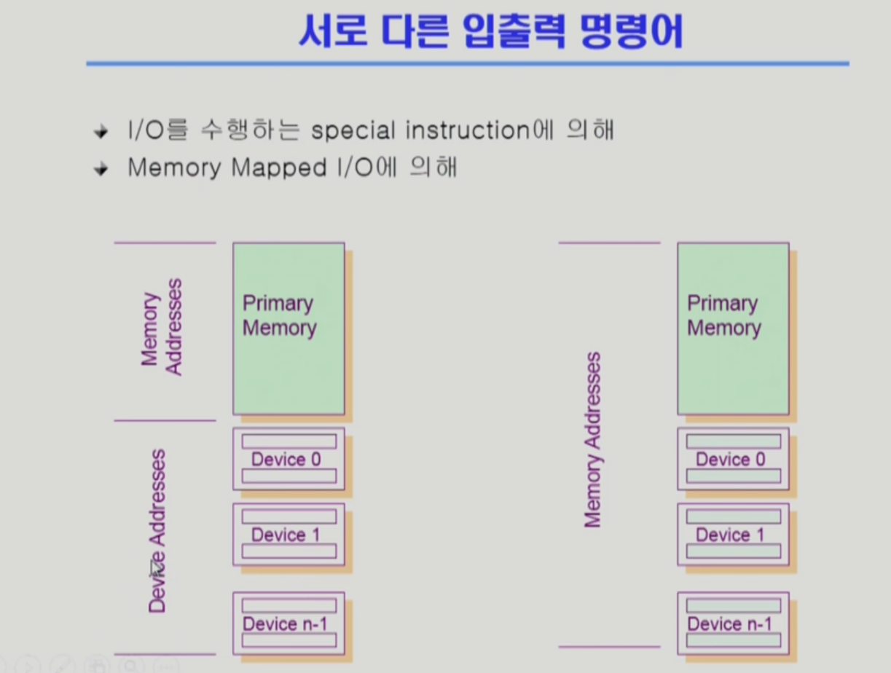
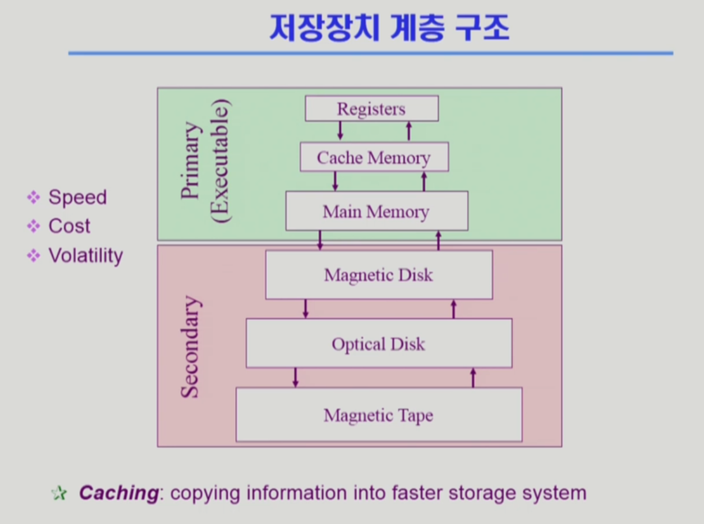
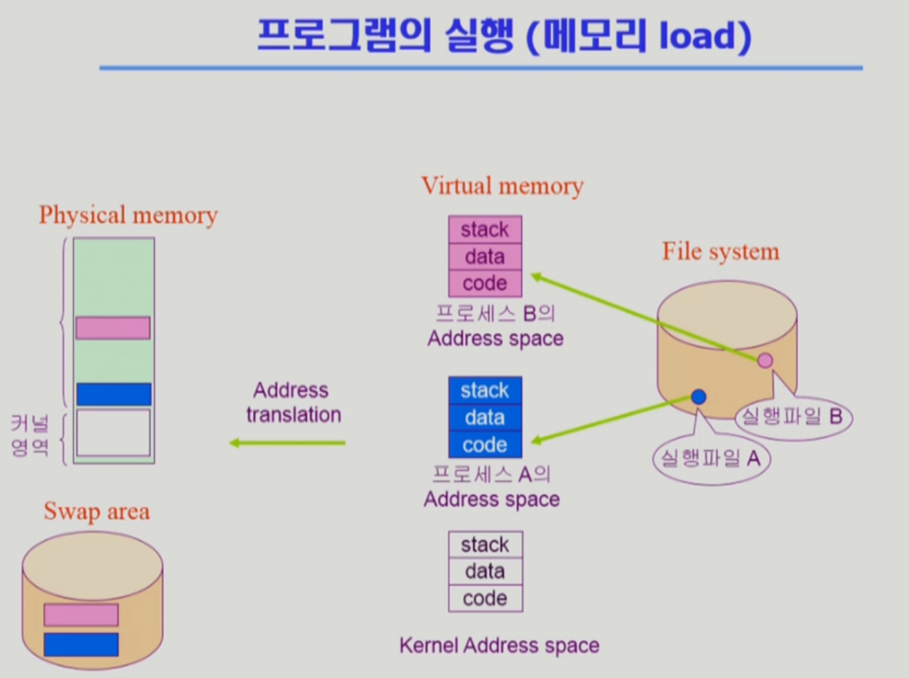
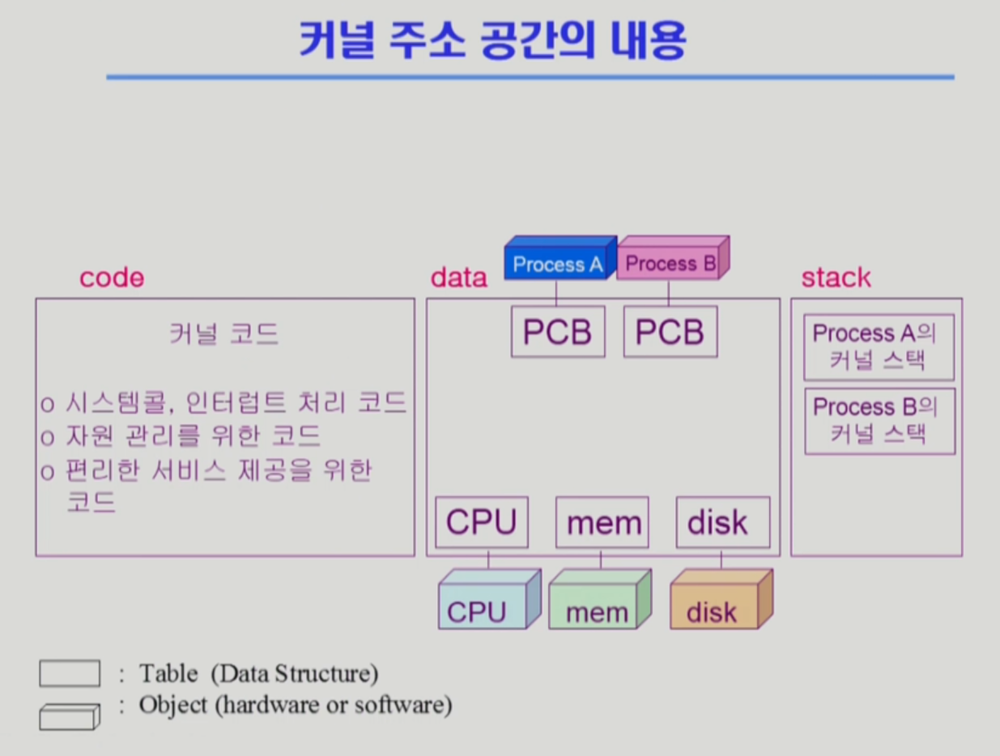
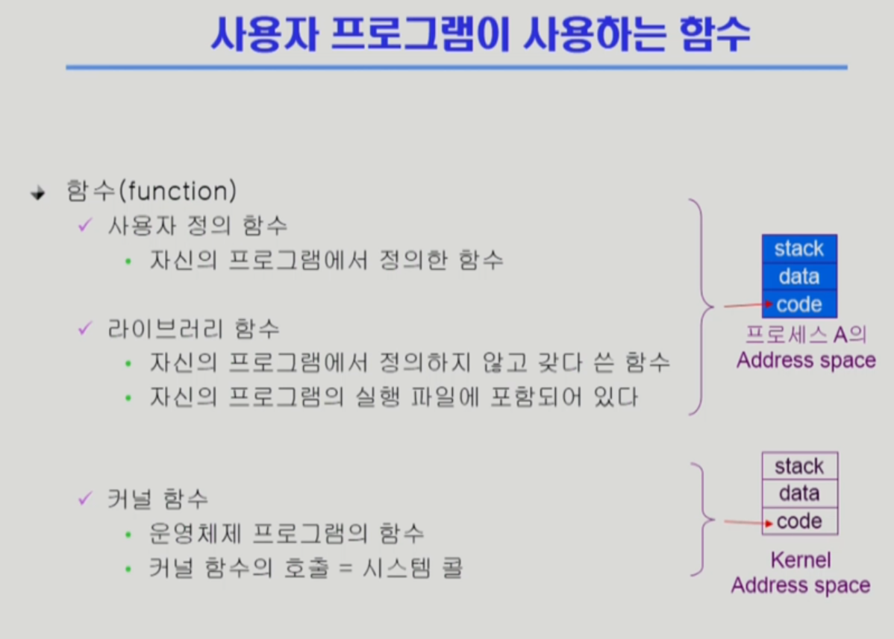
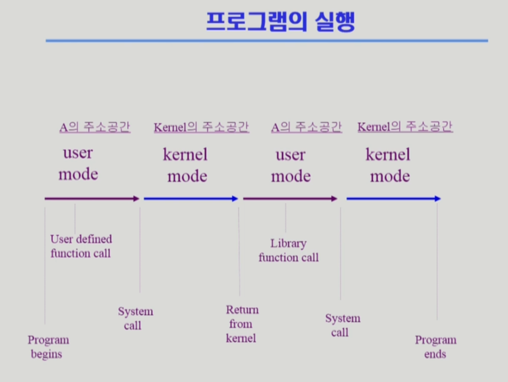

# 동기식 입출력 비동기식 입출력

- 동기식 입출력 : I/O를 요청한 후에 I/O 장치로부터 작업이 완료된 후에야 사용자 프로그램이 다른 일을 할 수 있는 것
- 비동기식 입출력 : I/O를 요청한 후에 작업이 끝나기를 기다리지 않고 제어가 사용자 프로그램에 즉시 넘어가는 것
- 작업이 끝났다는 것은 인터럽트를 통해서 알려줌
- 구현 방법 1 : CPU도 낭비지만 하나의 I/O장치가 하나의 작업 밖에 못함
- 구현 방법 2 : I/O를  요청한 프로그램은 어차피 일을 못하니까 그 프로그램을 제외하고 다른 프로그램에 CPU를 넘겨줌

# DMA (Direct Memory Access)

# 서로 다른 입출력 명령어

- 방식1 : Memory Address를 통해 메모리에 접근하고, 별도의 Device Address를 통해 Device에 접근하는 방식
- 방식2 : Memory Address 중 일부를 Device에 할당해 Memory Address를 통해 I/O장치에 접근하는 방식 (Memory Mapped I/O)

# 저장장치 계층 구조

- CPU가 직접 접근할 수 있는 메모리를 Primary, 아니면 Secondary
- CPU가 접근하려면 바이트 단위로 접근 가능해야 한다.
- DRAM은 바이트 단위로 주소를 매겨서 바이트 단위로 접근 가능함
- 하드디스크는 바이트 단위가 아니라 섹터 단위라서 접근 가능하지 않음
- Caching: 느린 매체에서 빠른 매체로 정보를 읽어들여서 사용하는 것

# 프로그램의 실행 (메모리 Load)

- 파일 시스템으로부터 프로그램을 메모리에 적재하기 위해서는 먼저 Virtual Memory로 변환하는 과정이 있음
- Virtual Memory는 각 프로세스마다 별도의 주소 공간을 만듦
- 0번지부터~n번지까지
- code는 코드를 저장, data는 변수나 전역 변수를 저장, stack은 프로세스가 실행하는 중에 함수 등을 저장
- Virtual Memory 중에 당장 필요한 부분은 메모리에 올라가지만 나중에 다시 쓰여야 하는 부분은 Swap Area에 저장됨
- Swap Area에 저장해서 가져오는 것을 Virtual Memory 기법이라고 하지만, 실제로는 각 프로그램마다 독자적으로 가지고 있는 주소 공간을 Virtual Memory라고 부름
- 프로세스 A의 1000번지 → 실제 메모리에서는 3000번지 이런 식으로 Address Translation(주소 변환)을 해서 사용함

# 커널 주소 공간의 내용

- 커널에는 커널의 핵심 코드나 자원 관리를 위한 코드, 편리한 서비스 제공을 위한 코드 등이 **code**영역에 있음
- **data**영역에는 핵심 자원들인 CPU, Memory, Disk등을 컨트롤하기 위한 자료구조와, 어떤 프로세스에게 자원을 줄 것인지, 얼마나 자원을 사용하고 있는지 등을 판단하기 위해 프로세스에 관한 자료구조인 **PCB(Process Control Block)**가 있음
- 운영체제도 함수구조로 코드가 짜여져 있기 때문에 함수를 호출하거나 리턴할 때 **stack**이 필요하므로 커널 스택이 존재함.
- 사용자 프로그램마다 커널 스택이 각각 존재함. 사용자 프로그램들이 커널의 코드를 공통적으로 불러다 쓰기 때문에, 어떤 사용자 프로그램이 어떤 코드를 실행중인지를 파악하기 위해 커널 스택이 각각 존재함

# 사용자 프로그램이 사용하는 함수

# 프로그램의 실행

