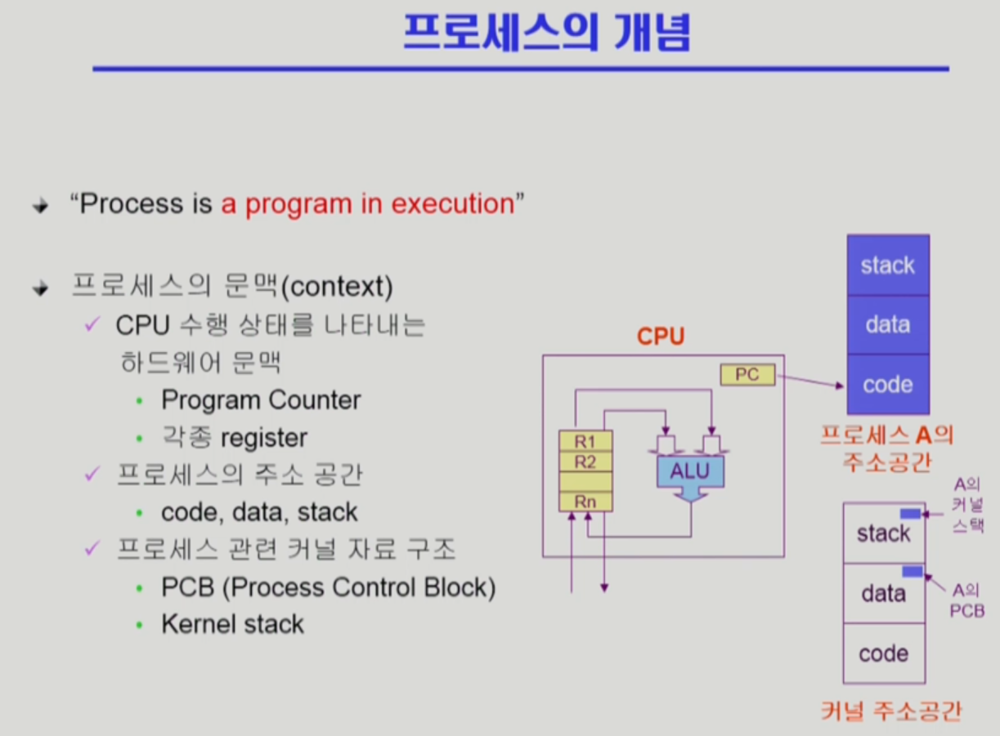
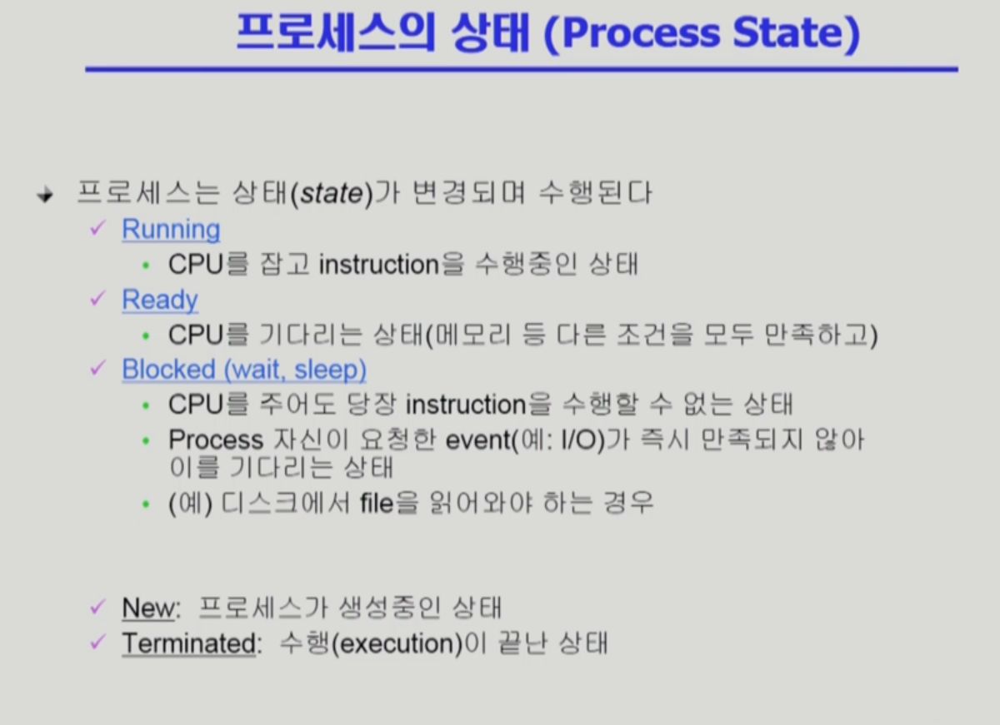
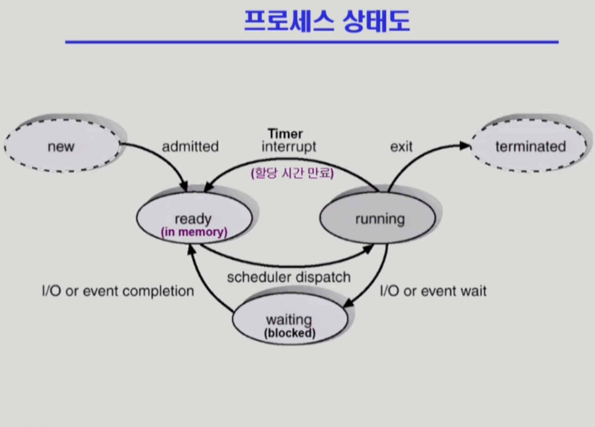
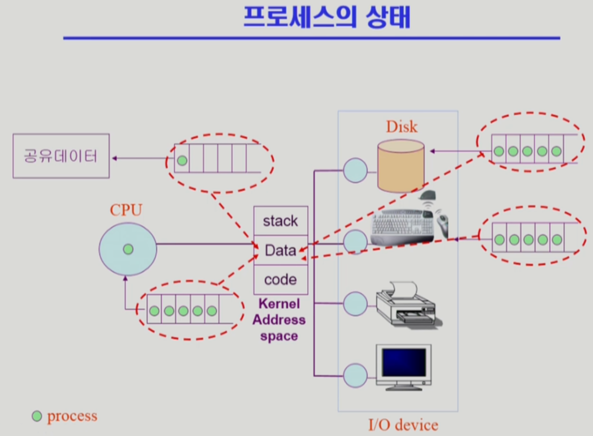
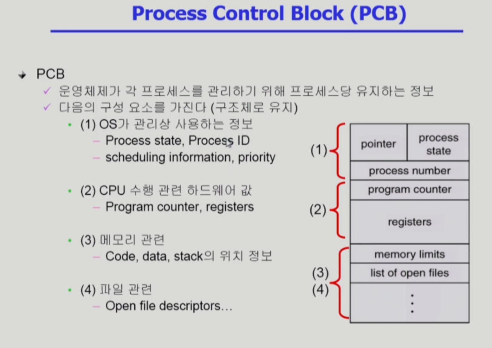
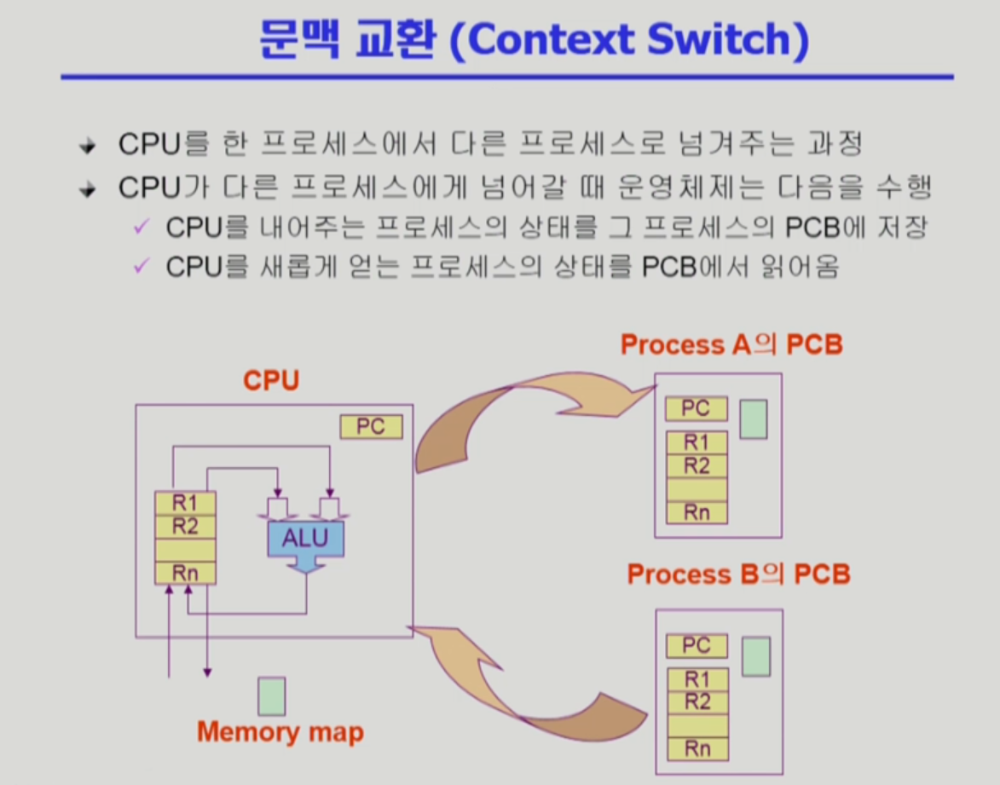
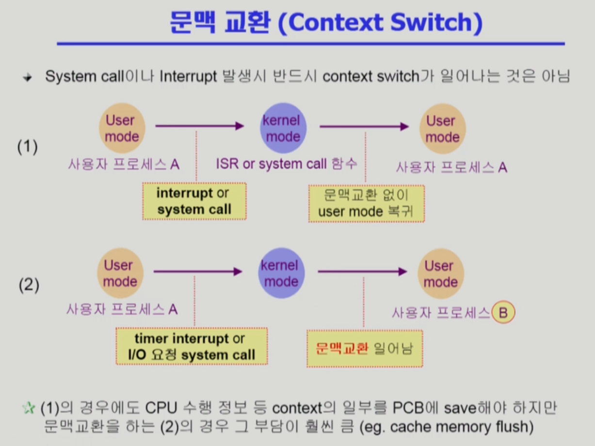
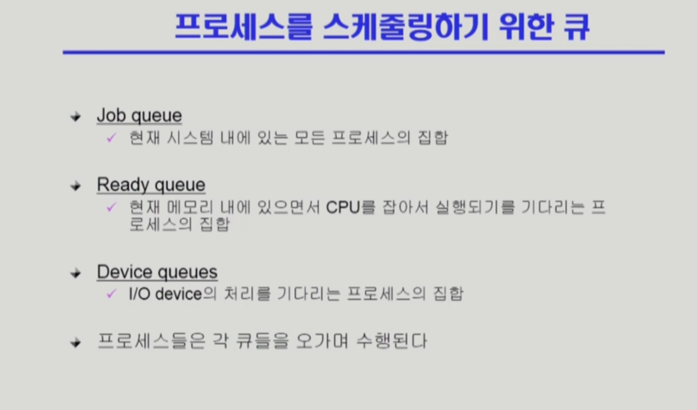
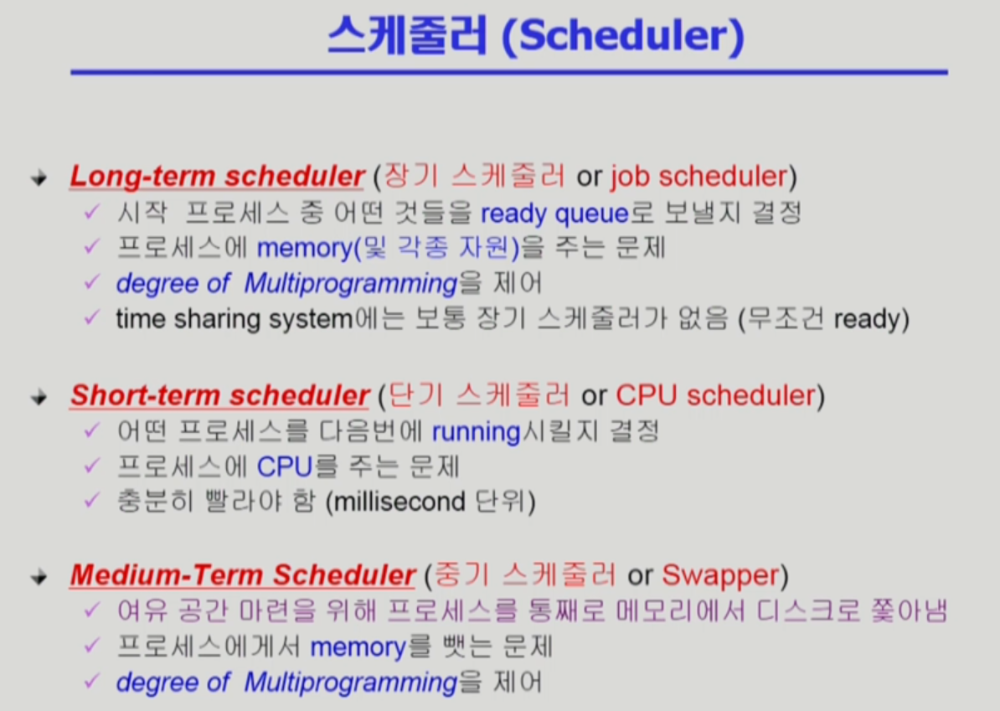
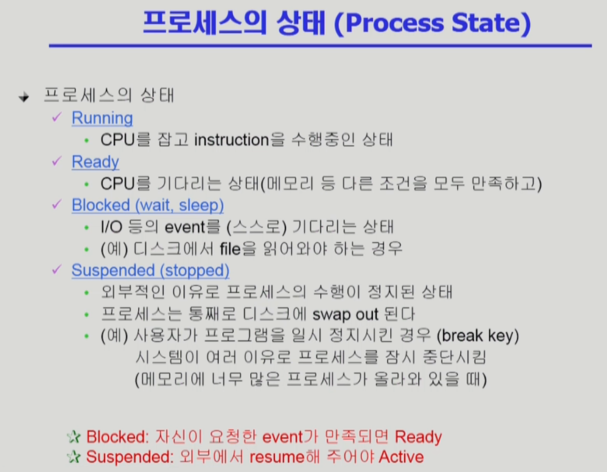

# 프로세스 1

slug: process-1
tags: OS
version: 1

# 프로세스의 개념

- 현재 시점에 CPU가 어디를 수행하고 있는지를 나타내는 하드웨어의 문맥이 Context
- 문맥은 크게 세 가지 정도로 설명할 수 있음
    - CPU와 관련된 하드웨어 문맥 - PC가 어디를 가리키는지, Register가 어떤 값을 가지고 있는지
    - 메모리와 관련한 주소공간 - code, data, stack에 어떤 내용이 들어 있는가
    - 프로세스 관련한 커널의 자료 구조 상태 - PCB, Kernel Stack

# 프로세스의 상태

- CPU가 하나라고 가정
- CPU를 잡고 명령을 수행하는 프로세스는 매 순간 하나임. 이 상태를 **Running**
- 모든 조건을 만족하고 CPU를 기다리고 있는 프로세스의 상태 **Ready**
- CPU를 주어도 I/O등의 event가 아직 만족되지 않아 아직 명령을 수행할 수 없는 상태 **Blocked**, **Wait**, **Sleep**
- 프로세스가 생성 중인 상태 **New**
- 프로세스가 종료 중인 상태 **Terminated**

# 프로세스 상태도

- 프로세스가 생성 중인 상태 New에서 생성되면 Ready 상태
- Ready 상태에는 최소한의 메모리는 가지고 있는 상태 Instruction을 가지고 있는 상태
- CPU를 얻으면 Running 상태
- I/O같은 작업 때문에 자진해서 CPU를 내놓는 경우 Waiting 상태
- Timer에 의해 시간이 다 되어서 CPU를 빼앗기는 경우 다시 Ready 상태
- 본인의 역할을 다하면 Terminated 상태

# 프로세스의 상태

- CPU는 빠르고 여럿이 공유하는 자원
- 한번에 하나의 Process가 CPU를 점유하고 사용하다가 시간이 다 되면 다시 Queue의 마지막에 위치함. 사실 라운드 로빈이나 우선순위에 따른 방식이 있음
- 디스크에서 무엇을 읽어와야 한다면 해당 프로세스는 Blocked로 바뀌면서 Disk의 Queue에 추가
- 디스크에서 읽어오는 작업이 끝나면 Disk Controller가 CPU에 인터럽트를 걸어서 커널 모드로 전환한 뒤 읽어온 데이터를 메모리에 저장하는 등의 작업과 해당 프로세스의 상태를 Ready로 바꾸는 작업을 하고 다시 CPU 대기 Queue에 추가
- 자원 중에는 소프트웨어 자원도 있음. 공유 데이터 같은 경우 동시에 접근하려고 하면 일관성이 깨질 수 있기 때문에 이 경우에도 자원 Queue에 대기하면서 Blocked 상태가 됨
- 놀이동산 비유
- 이러한 Queue는 **커널의 Data 공간**에 생성되어 관리

# PCB (Process Control Block)

- 운영체제가 각 프로세스를 관리하기 위해 프로세스마다 유지하는 정보
- process state: 프로세스 상태. Ready, Running, Blocked, …
- PID(Process Id) : 프로세스마다의 고유한 숫자
- 우선순위, 스케줄링 정보
- CPU 수행을 위한 Process Counter나 Register 같은 하드웨어 값
- 메모리 관련 주소 정보
- 이 프로세스가 오픈하고 있는 파일 정보

# Context Switch

- CPU를 한 프로세스에서 다른 프로세스로 넘겨주는 과정
- 문맥 교환 시에 어떤 작업이 필요한가
- 한 프로세스가 CPU를 빼앗겨야 하는 시점에 CPU에 존재하던 기존 정보들을 다 지우면 안되고 다음에 CPU를 얻었을 때 재개하기 위해서 문맥을 기억해야 함
- 그래서 이러한 문맥을 커널의 data영역에 해당 프로세스의 PCB에 저장
- 다음에 CPU를 얻었을 때 해당 프로세스의 문맥을 PCB로부터 받아와서 다시 CPU에 복원하고 작업을 진행

- System call이나 Interrupt발생 시 프로세스가 OS로 제어권을 넘겨주는 것은 Context Switch가 아니다.
- 실제 프로세스가 A → B로 바뀌어야 Context Switch
- Timer Interrupt나 I/O를 요청하는 System Call이 발생했을 때에 문맥교환이 일어나는 것

# 프로세스를 스케줄링하기 위한 큐

- Job Queue에는 시스템 내에 있는 모든 프로세스가 들어 있음
- Ready Queue 목록 + Device Queues 목록 = Job Queue 목록

# 스케줄러

- 순서를 정해주는 것이 스케줄러
- CPU scheduler = Short-term scheduler 굉장히 짧은 단위로 스케줄이 일어나기 때문
- Job scheduler = Long-term scheduler
- 프로세스에 memory 및 각종 자원을 주는 문제
- 하지만 보통 우리가 사용하는 시스템(time sharing system)에는 장기 스케줄러가 없음
- 그럼 degree of Multiprogramming을 어떻게 제어하느냐
- Swapper = Medium-Term Scheduler를 통해서 제어함
- 현재 시스템에서는 시작 프로세스에게 무조건 메모리를 줌
- 그러다보니까 너무 많은 프로그램이 메모리에 올라가 있으면 문제가 됨
- 그래서 Swapper를 사용해서 일부 프로그램을 골라서 메모리에서 통째로 쫒아냄

# 프로세스의 상태

- Blocked는 요청한 일을 대기하면서 기다리고 있는 상태
- Suspended는 외부에서 정지를 시켜놓은 상태