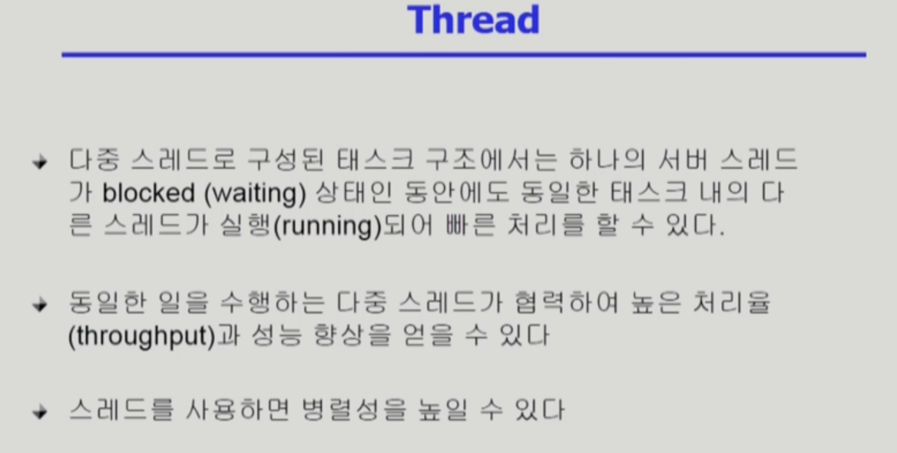

# 프로세스 2

slug: process-2
tags: OS
version: 1

# Thread

- **프로세스 내부의 CPU 수행 단위가 여러 개 있는 것**을 **쓰레드**라고 함
- 별도로 갖는 부분 : Program Counter, Register Set, Stack Space
- 공유하는 부분(= task라고도 함) : Code Section, Data Section, OS Resources
- 하나의 프로세스 안에 쓰레드가 여러 개 있으면 Task는 한 개만 있는 구조
- 

- 프로세스마다 code, data, stack으로 구성된 주소공간이 만들어짐
- 그리고 프로세스를 관리하기 위해 운영체제 내에 PCB가 있어 프로세스의 상태를 나타내고 프로세스의 아이디도 나타내고 함
- 동일한 일을 하고 있는 프로세스가 여러 개 있다면 별도의 프로세스로 각각 만들면 같은 일을 하는 메모리 주소공간이 너무 많이 만들어져서 낭비가 됨
- 그래서 프로세스는 하나만 띄워놓고, 현재 CPU가 code의 어느 부분을 실행하고 있는가에 대한 정보인 **PC**와 **Register**만 별도로 두는 것
- CPU 수행 단위가 여러개 있게 되면 함수를 호출하게 되면 그 공간도 별도로 분리가 되어야 함
- 그래서 Thread마다 **Stack공간**도 별도로 갖게 됨
- Thread는 같은 프로세스 안에서 공유할 수 있는 건 최대한 공유하고 분리되어야 하는 것만 분리시키는 것
- 별도로 가지고 있는 것은 CPU 수행에 관련된 정보만 따로 둠

- 스레드를 이용하면 빠른 응답성과 자원을 절약할 수 있는 이점이 있음
- 프로세스를 여러 개 띄워놓게 되면 각각이 메모리에 올라가야 되기 때문에 메모리 낭비가 심함
- CPU가 여러 개 달린 컴퓨터에서만 얻을 수 있는 장점이 스레드를 사용하면 병렬성을 높일 수 있음

# Single and Multithreaded Processes

# Benefits of Threads

- 응답성
    - 사용자 입장에서 빠르다
- 자원 공유
    - Binary Code, Data, 프로세스 자원을 공유
- 경제성
    - 프로세스를 하나 만드는 건 오버헤드가 큼
    - 근데 프로세스 안에 스레드를 하나 만드는 건 작은 것만 추가하면 되기 때문에 오버헤드가 크지 않음
    - Context Switching이 일어나는 것도 오버헤드가 큼
    - 하지만 쓰레드 간의 Context Switching은 오버헤드가 작음
    - Unix의 일종인 Solaris운영체제의 경우 프로세스 생성은 30배가 들고, 컨텍스트 스위칭은 5배가 더 든다.
- 멀티프로세서 구조에서 유용함

# Implementation of Threads

- Kernel Threads
    - 쓰레드가 여러 개 있다는 사실을 운영체제가 알고 있음
    - 한 쓰레드에서 다른 쓰레드로 CPU가 넘어가는 것도 커널이 스케줄링하듯이 넘겨줌
- User Threads
    - 라이브러리를 통해서 지원
    - 운영체제는 하나의 프로세스 안에 여러 개의 쓰레드가 있다는 것을 모름
    - 유저 프로그램이 스스로 여러 개의 쓰레드를 관리하는 것
    - 구현 상의 제약점이 있을 수도 있음