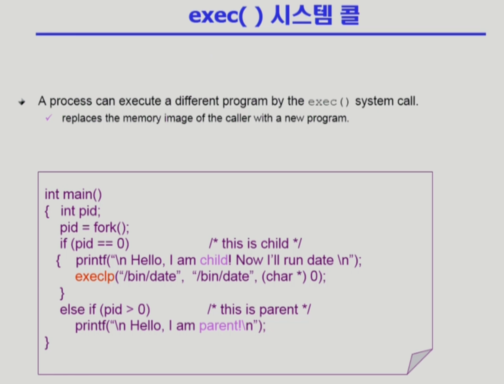

# 프로세스 관리

slug: process-management
tags: OS
version: 1

# 프로세스 생성

- 누가 프로세스를 만드는가?
- 부모 프로세스가 자식 프로세스를 만듦
- 보통 복제해서 생성함
- 부모 프로세스와 자원을 공유하는 경우도 있고 공유하지 않는 경우도 있음
- Copy-on-write (COW) 기법이라고 함

- 부모의 주소 공간을 그대로 복사. 운영체제에 있는 PCB, 자원들의 데이터도 똑같이 복사함
- 그리고 자식은 그 공간에 새로운 프로그램을 덮어 씌움
- fork()라는 시스템 콜
- 그 다음 exec()이라는 시스템 콜로 새로운 프로그램을 메모리에 올림

# 프로세스 종료

- exit() 시스템 콜로 종료가 됨
- 프로세스가 종료될 때 부모에게 wait() 시스템 콜을 통해 output data를 전달
- abort() 시스템 콜로 강제종료가 될 경우도 있음
- 부모가 exit()되는 경우에는 자식 프로세스를 먼저 kill한 다음에 단계적으로 종료됨

# fork() 시스템 콜

- fork() 함수를 실행하면, 자식 프로세스는 프로세스과 똑같이 **문맥**을 복사
- pid = fork(); 시점 다음 시점부터 각자 실행되므로, 부모 프로세스는 Hello, I am parent!를 출력, 자식 프로세스는 Hello, I am child!를 출력하게 됨

# exec() 시스템 콜

- exec()은 새로운 프로세스로 다시 태어나는 것