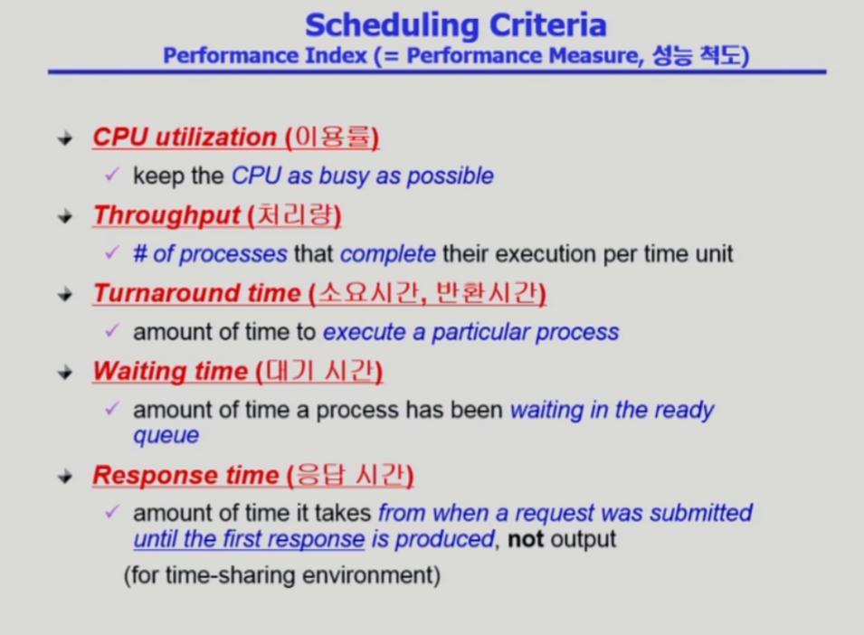

# CPU 스케줄링

slug: cpu-scheduling
version: 1

# 프로그램 실행에서 CPU와 I/O 버스트

- 컴퓨터 프로그램이 실행될 때 다음과 같은 단계를 거침
- CPU Burst : CPU에서 Instruction을 실행하는 단계
- I/O Burst : 오래 걸리는 I/O를 거치는 단계
- I/O가 빈번하게 끼어들지 않는 프로그램은 CPU 버스트가 길 것이고, 사람과 인터렉션이 많은 프로그램은 I/O 버스트가 길어지고 상대적으로 CPU 버스트가 짧아질 것임

- I/O bound job이 많은 프로그램은 사람과 인터렉션하는 프로그램인 경우가 많음
- CPU bound job이 많은 프로그램은 인터렉션이 적은 프로그램임
- 그럼 CPU를 둘 중 어떤 프로그램에게 줘야 할까?
- I/O bound job은 잠깐 CPU를 주면 다시 I/O를 하러 갈 거니까 여기 주는 게 유리
- 그리고 사람과 인터렉션하는 프로그램인데 늦게 주면 사용자 경험이 나빠짐
- 근데 대부분 두 가지 job이 섞여있는 프로그램이므로 스케줄링을 잘해서 줘야 함

# CPU Scheduler & Dispatcher

- CPU Scheduler : 운영체제 안에 있는 CPU 스케줄링하는 코드를 Scheduler라고 따로 명명해놓음. 그냥 운영체제의 일부임
- Dispatcher : Scheduler에 의해서 선택된 프로세스에게 실제로 제어권을 넘기는 코드. 여기서 Context Switch가 일어남
- 1, 4번의 경우에는 **비선점(nonpreemptive)** - 일단 한 번 줬으면 자진해서 내놓기 전까지 빼앗지 않는 것
- 나머지는 **선점(preemptive)** - CPU를 계속 쓰고 싶지만 정책 상 번갈아가면서 써야되므로 빼앗는 경우

# 스케줄링 성능 척도

- 크게 세가지로 구성되어 있음 - 이용률, 처리량, 시간
- 짧은 시간에 많은 처리량으로 CPU가 놀지 않고 많은 일을 하는 것(CPU 이용률)이 좋은 것
- 기다리는 시간을 세 가지로 또 나눔
- 응답 시간 : 프로세스가 CPU를 쓰기 위해 대기하다가 처음 CPU을 갖게 되는 시간
- 대기 시간 : CPU를 쓰기 위해 대기하는 전체 시간 (기다리는 시간의 합)
- 소요시간 : CPU를 사용한 시간과 기다리는 시간을 모두 합한 값

# 스케줄링 알고리즘

## FCFS (First-Come First-Served)

- 먼저 온 프로세스가 먼저 CPU를 받음
- 다 쓰고 나갈 때까지 CPU를 빼앗지 않음 (non-preemptive)
- 인간 세상에서 많이 쓰는 방법. 그렇지만 CPU 스케줄링에서는 비효율적인 방법
- 앞에 긴 프로세스가 있어서 평균 대기 시간이 17초

- 순서를 바꿔서 사용시간이 짧은 프로세스가 먼저 온다면 평균 대기시간이 3초로 확 줄어듦
- 콘보이(호위) 효과 : CPU를 많이 필요로 하지 않는 프로세스들이, CPU를 오랫동안 사용하는 프로세스가 끝나기를 기다리는 현상

## SJF (Shortest-Job-First)

- 가장 길이가 짧은 프로세스에게 먼저 CPU를 주는 것
- 가장 좋은 **최적의 방법(Optimal)**. 다른 어떤 알고리즘을 쓰더라도 이 방식보다 평균 대기 시간이 짧을 수는 없음. **minimum average waiting time**을 보장함
- SJF도 두 가지 방법이 있음
- non-preemptive한 방법 : 한번 CPU를 잡으면 이번 CPU Burst가 완료될 때까지 CPU를 선점 당하지 않음
- preemptive한 방법 : CPU를 잡고 있는 프로세스의 남은 Burst time보다 더 짧은 CPU burst time을 가진 프로세스가 들어오면 CPU를 빼앗김 (SRTF라고도 부름)
- preemptive한 방법이 더 Optimal한 방법임

### Non-preemptive SJF

- 먼저 들어온 친구는 7초짜리지만 가장 먼저 들어왔으므로 선점해서 사용
- 7초 이후에 P1의 프로세스가 끝나고 나서 P2, P3, P4가 순서대로 들어와 있지만, P3가 Burst Time이 1초로 가장 짧으므로 P3가 선점해서 사용
- 평균 대기 시간 4초

### Preemptive SJF

- 먼저 들어온 P1이 먼저 들어와서 선점해서 사용
- 하지만 2초 뒤에 P2가 도착했을 때 P1은 남은 Burst time이 5초, P2는 4초임
- 2초 시점에 P1은 P2에게 CPU를 빼앗김(선점)
- 4초 시점에 Burst Time이 2초 남은 P2는 1초인 P3에게 CPU를 빼앗김(선점)
- 평균 대기 시간 3초 (가장 옵티멀한 방법)
- SJF 방식들은 Burst Time이 짧은 프로세스만 계속해서 들어온다면 그 프로세스들이 선점하게 되므로 긴 프로세스들은 **Starvation** 발생. 계속 CPU를 얻지 못할 수도 있음

### 과연 프로세스의 CPU Burst Time을 미리 알  수 있는가?

- 프로세스가 CPU를 위해 들어오는 시점에 CPU Burst time을 미리 알 수가 없음
- 그럼 SJF는 쓸 수 없을까?
- 예측을 하면 됨
- CPU를 길게 길게 쓰는 프로세스는 앞으로도 길게 쓰는 경향이 있고, 짧게 짧게 쓰는 프로세스는 앞으로도 짧게 쓰는 경향이 있음
- 과거의 CPU Burst를 가지고 예측
- n + 1번째 CPU Burst를 예측한다면,  (n + 1번째 CPU Burst Time 추정) = α * (실제 n번째 CPU Burst Time) + (1 - α) * (n번째 CPU Burst Time 추정치)로 α를 이용해 가중치를 줌
- 어느 쪽에 얼마나 가중치를 주느냐
- 점화식을 풀면 n + 1번째 예측치를 위해서는 이전 1 ~ n번째까지의 실제 Burst Time과 초기 예측치가 합쳐진 값이 됨
- 그리고 (1 - α)^f 만큼 앞선 실제 Burst Time에 곱해지므로 가장 최근 Burst Time을 많이 반영하고 초기 Burst Time을 적게 반영한다는 것을 의미함

## Priority Scheduling

- 프로세스에 각각 Priority Number를 부여
- 우선순위가 더 적은 프로세스에게 CPU를 할당
- Preemptive와 Nonpreemptive가 있음
- 역시 우선순위가 낮은 프로세스는 영원히 실행되지 않을 수 있음
- 해결책 - Aging
- 우선 순위가 낮아서 CPU를 못 써도 오래 기다릴 때 우선 순위를 조금씩 높여서 사용할 수 있도록 하는 것

## Round Robin (RR)

- 현재 CPU Scheduling에서 사용하는 알고리즘의 근간
- 각 프로세스에게 동일한 크기의 할당 시간(Time Quantum)을 할당
- 컴퓨터 시스템 구조에서 Timer에서 시간을 세팅하고 CPU를 할당할 때, 이 알고리즘이 가장 효과적
- q large - 즉 할당 시간이 너무 길면 FCFS와 똑같아짐
- q small - 즉 할당 시간이 너무 짧으면 컨텍스트 스위칭이 너무 자주 일어나서 오버헤드가 커짐

### 예제

- 프로세스 길이가 Long time, Short time이 섞여있을 때는 도움이 됨
- 근데 Homogeneous한 job들만 있을 때는 효과적이지 않음

## Multilevel Queue

- CPU가 여러 개가 아니라 하나인데, 여러 줄로 줄 서는 것
- Ready Queue를 여러 개로 분할하고, 각 큐가 우선순위가 있음

- 어떤 예제는 이런 식으로 더 많은 큐가 있음
- 시스템과 관련된 프로세스의 큐는 가장 높은 우선순위
- 그다음 우선순위는 사람과 인터렉티브해야 하는 프로세스의 큐에 부여
- 프로세스가 해당 프로세스의 큐에 한번 줄 서면 다른 큐로 갈 수 없음

## Multilevel Feedback Queue

- 멀티레벨 큐인데, 프로세스가 다른 큐로 이동 가능

- Multilevel Feedback Queue를 구현한 하나의 구현 방식
- 프로세스 처음에 q = 8 큐로 들어와서 8초 이내로 끝나면 나가면 됨
- 8초 이내로 안 끝나면 q = 16 큐로 신분이 떨어짐
- 추가로 16초를 써도 안 끝나면 FCFS큐로 신분이 떨어짐

## Multiple-Processor Scheduling

- CPU가 여러 개 있는 특별한 환경에서의 이야기