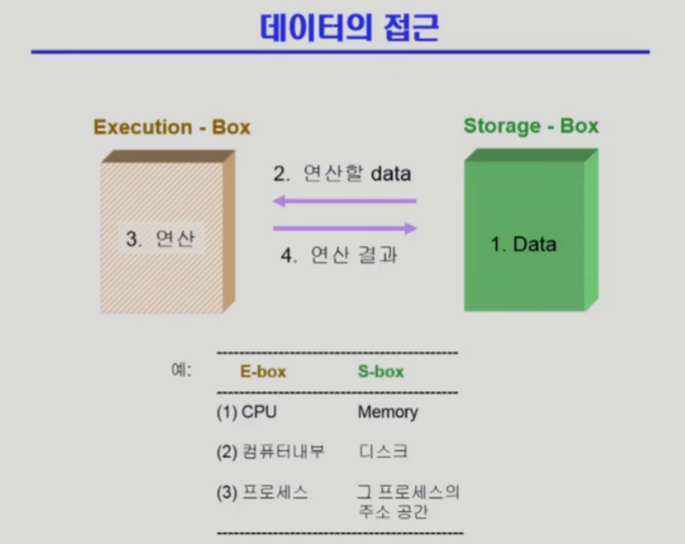
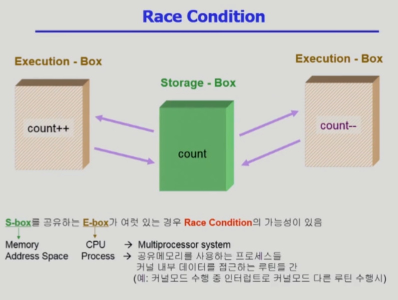
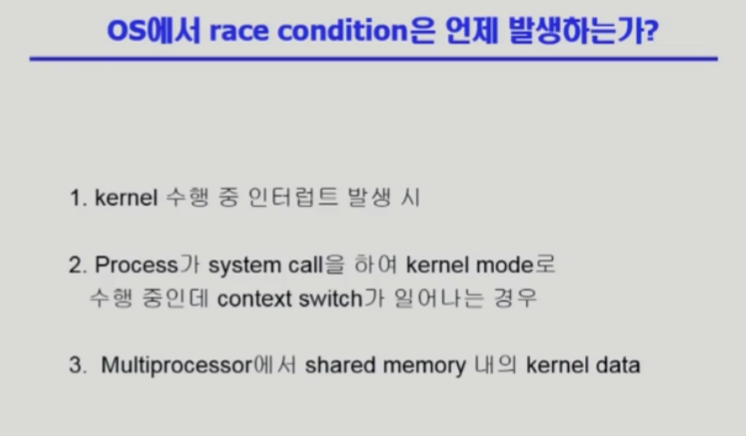
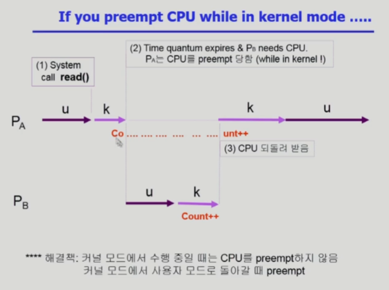
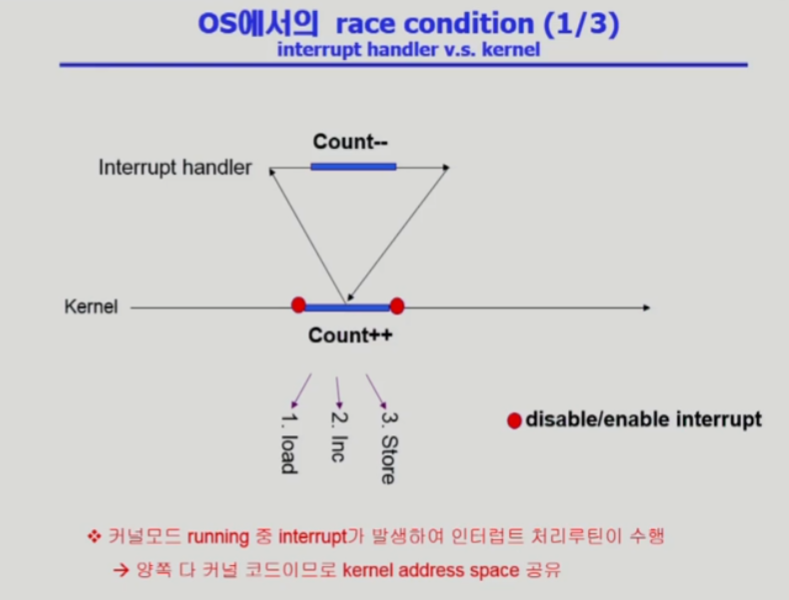
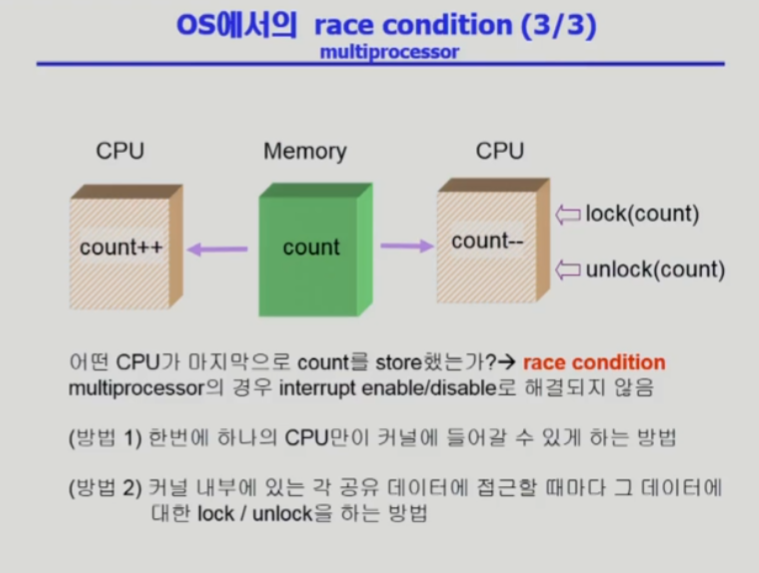
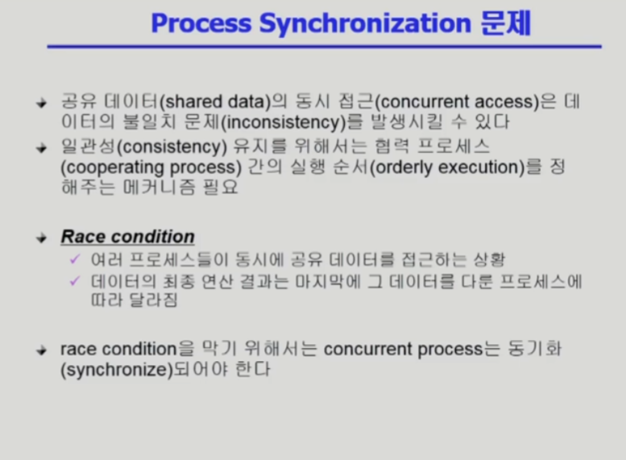

# 병행 제어 1

description: 데이터 접근 시 경쟁 상태가 발생할 수 있으며, 이를 해결하기 위해 프로세스 간 실행 순서를 정하고 Lock을 사용하는 것이 중요하다. 커널 모드에서의 Context Switch와 인터럽트 처리 시 Race Condition을 방지하기 위한 방법도 설명된다.
slug: process-synchronization-1
tags: OS
version: 1

# 데이터의 접근

- 연산을 할 때는 항상 외부 Storage에서 데이터를 들고 와서 작업하고 다시 내보내는 것을 반복함

# 경쟁 상태

- 근데 여러 곳에서 같은 데이터를 가져가서 작업할 경우 문제가 생김
- 이러한 문제를 Race Condition이라고 함
- CPU가 여러 개 있으면 이러한 문제가 생길 수 있으나 CPU가 하나라고 이러한 문제가 생기지 않는 것은 아님
- CPU가 하나지만 운영체제가 끼어들었을 때 Race Condition이 발생할 수 있음
- 커널의 데이터를 프로세스가 동시에 건드린다면 문제가 발생할 수 있음

### 커널 모드에서 수행 중 Context Switch가 일어나는 경우

- 프로세스 A가 유저 모드로 실행되다가 시스템 콜을 해서 커널의 코드를 실행 중이다가 CPU가 프로세스 B로 넘어갔을 경우
- 공교롭게도 프로세스 B도 Count라는 변수를 건드리게 됐다면 Race Condition 발생
- 해당 프로세스의 퀀텀 타임이 끝났더라도 커널 모드의 코드가 실행중이라면 선점하지 않도록 하면 해결 가능

### 커널 모드 수행중 인터럽트가 들어왔을 경우

- 커널 모드에서 수행하다가 인터럽트가 들어오면 현재 문맥을 저장하고, 인터럽트 처리 루틴을 먼저 처리하고 다시 돌아옴
- 공교롭게 인터럽트 처리 루틴에서 같은 Count 변수를 건드리게 됐다면 Race Condition 발생
- 해결책으로는 Count와 같은 변수를 건드리는 동안에는 인터럽트를 disable시키고, 끝난 후에 enable시키는 것

### Multiprocessor 상황일 때 동시에 공유 메모리에 접근하는 경우

- 해결책 1: A CPU가 커널 모드로 실행중이면 다른 CPU는 들어가지 못하도록 차단. 비효율적인 오버헤드가 발생
- 해결책 2: 공유 데이터만 막는 것. 어떤 데이터에 접근할 때 Lock을 걸고 데이터를 작업하고 나서 Unlock

# Process Synchronization 문제

- 일관성 유지를 위해서는 협력 프로세스 간의 실행 순서를 정해주어야 함