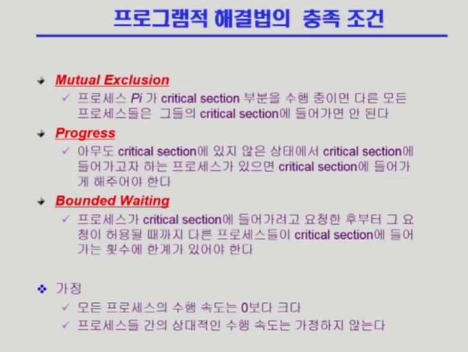
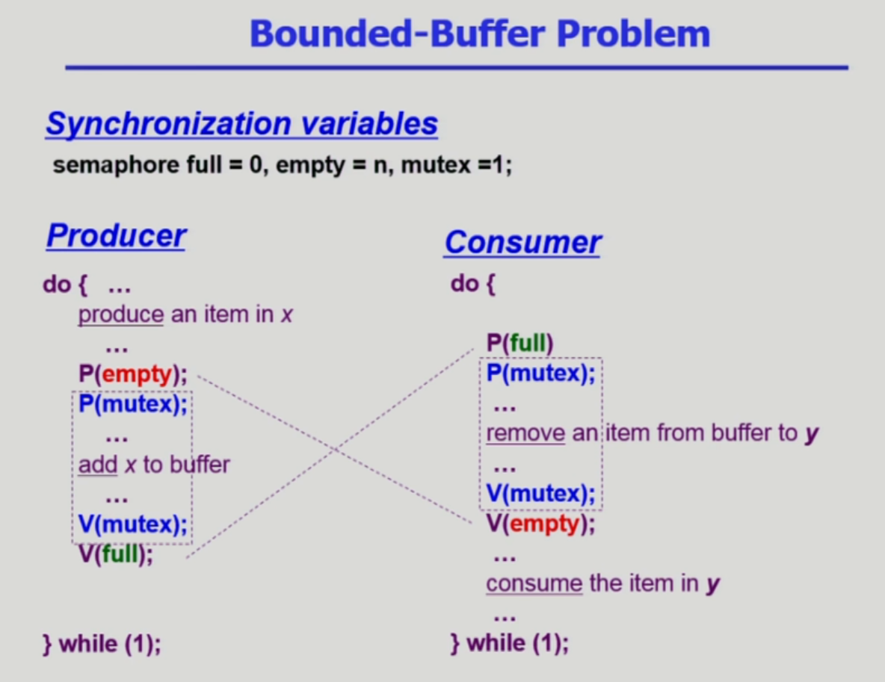
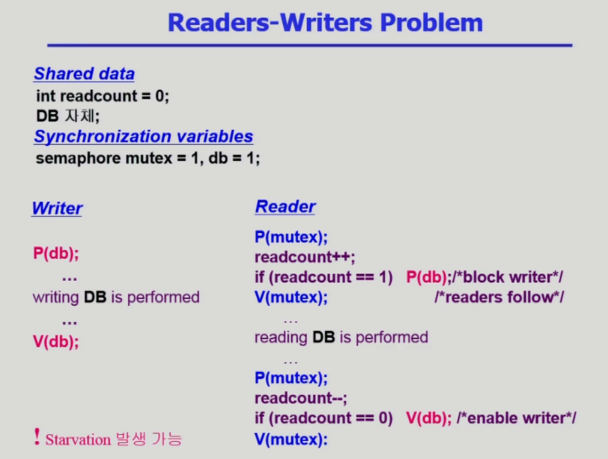

# 병행 제어 2

description: 공유 데이터에 접근하는 Critical Section 문제를 해결하기 위해 상호 배제, 진행, 유한 대기 조건을 충족해야 하며, 세마포어와 다양한 알고리즘을 통해 동시 접근을 관리할 수 있다. Block/Wakeup 방식이 일반적으로 더 좋지만, Critical Section이 짧을 경우 Busy-wait 방식이 유리할 수 있다.
slug: process-synchronization-2
version: 1

# Critical Section Problem

- 어떤 프로그램을 만들더라도, 공유 데이터에 접근하는 Critical Section과 아닌 Section들의 연속들로 구성됨
- Critical Section에 들어갈 때 동시 접근 문제가 발생하므로 그 전(Entry Section)에 코드를 추가하고 빠져나올 때(Exit Section) 또 코드를 추가하면 됨

## 프로그램적 해결법의 충족 조건

- 그래서 프로그램적으로 동시 접근을 해결하기 위해서는 다음을 충족시키는 조건이 필요함
- **Mutual Exclusion** (상호 배제) : 주어진 시간에 오직 하나의 프로세스나 스레드만이 Critical Section이나 특정 공유 자원에 접근할 수 있어야 함 ⇒ 공유 자원의 무결성과 일관성을 보장하고 Race Condition을 방지하기 위해
- **Progress** (진행) : Critical Section을 수행 중인 프로세스가 없는데 차례가 아니라고 못 들어가면 안됨
- **Bounded Waiting** (유한 대기) : 기다리는 시간이 유한해야 함 = Starvation을 막아야 함

## 알고리즘 1

- turn이라는 Synchronization Variable 즉 동기화 변수를 만들어서 사용
- Critical section을 들어가기 전에 turn변수를 체크
- turn은 현재 누구 차례인지를 나타냄
- Critical Section에 들어갈 수 있는 자기 턴이 오기 전까지 내 CPU 시간을 다 쓰면서 계속 while문으로 체크를 해줌
- 상대방이 내 차례로 바꿔주기 전까지 Critical Section에 들어가고 싶어도 못 들어가는 알고리즘 구조

## 알고리즘 2

- Critical Section에 들어가고 싶다는 의사 표현을 하는 flag 변수를 사용
- 들어가기 전에 flag를 들고, 상대방의 flag가 내려갔을 때 Critical Section에 진입해 작업을 수행하고 최종적으로 flag를 내림
- 근데 만약 동시에 true인 채로 첫번째 line에 머물러 있다면?
- 서로 계속 양보하는 상황 발생 가능

## 알고리즘 3 - Peterson’s Algorithm

- 세 가지 조건을 만족하는 잘 동작하는 알고리즘
- Critical Section에 들어가기 전에 Flag를 든 다음에 turn을 상대방 턴으로 바꿈
- 그리고 상대방이 Flag를 들고 있고, turn이 상대방 턴일 경우를 둘 다 만족하는 경우에만 기다림
- **Busy Waiting** = Spin Lock : 자원을 계속해서 쓰면서 대기하는 비효율적인 기다림

## Synchronization Hardware

- 동기화를 도와줄 수 있는 하드웨어적인 지원이 있으면 이 문제는 대단히 쉽게 풀림
- 기계어 연산으로 **Test_and_Set()**이 지원이 된다면 쉽게 풀림
- Test_and_Set(a) : a의 값을 읽어간 뒤에 a의 값을 1로 세팅해주는 atomic한 연산

# 세마포어

- 세마포어는 일종의 추상 자료형
- 추상 자료형이기 때문에 실제 구현이 어떻게 되는지는 관심사가 아님
- 위의 예를 보면, 변수 S가 있을 때, 변수의 값은 **정수**로 정의
- 그리고 자료형에 대해서 정의되는 연산은 P(S)연산, V(S)연산으로 정의
- P는 자원을 획득하는 연산, V는 자원을 반납하는 과정

- 세마포어를 지원한다면 다음과 같이 코딩하면 됨
- mutex는 Mutual Exclusion의 약자.
- 근데, mutex가 0이면 체크하려고 CPU를 낭비하지 않는 게 더 낫지 않나? = Busy waiting 문제

# Block / Wakeup 구현

- Busy Waiting 문제를 해결할 방법
- Semaphore를 구조체로 정의
- 기본 value 변수와 함께 리스트 구조 L을 추가로 정의
- L에 프로세스들을 Block해놓고 value값이 생기면 다음 프로세스를 깨워서 사용시킴

## Block/Wakeup 방식 구현

- S.value가 음수인 상황에서도 -1을 해줌
- S.value가 음수인 상황은 프로세스가 이미 자원들을 다 사용해서 여분이 없다는 것을 의미
- V연산에서 S.value를 +1했는데도 값이 양수가 안됐다? = 지금 자원을 기다리는 프로세스가 존재한다는 의미
- 기존 세마포어 방식과 달리 여기에서 S.value의 의미는 남아있는 자원의 개수가 아니라, 자원의 여분이 없어서 프로세스가 잠들어있다를 의미함

# 어떤 방식이 나은가?

- 일반적으로는 Block/Wakeup 방식이 좋음
- 하지만 Critical Section의 길이가 너무 짧을 때는, 프로세스를 Block하고 Wakeup하는 것도 오버헤드가 될 수 있기 때문에 이러한 경우에는 Busy-wait방식이 나을 수도 있음

# 세마포어의 두 가지 타입

- Counting Semaphore: 1보다 더 큰 숫자를 사용하는 경우. 자원 카운팅에 보통 사용
- Binary Semaphore: 동시 접근을 못하게 Mutual Exclusion을 위한 용도에 보통 사용

# 데드락과 기아상태

- 데드락 : 둘 이상의 프로세스가 서로 상대방에 의해 충족될 수 있는 자원을 무한히 기다리는 현상
- 기아 상태 : 각각의 입장에서 굶어죽는 느낌
- 데드락은 기아 상태와는 조금 다르게 서로 얽혀서 기다리는 현상 느낌

# 동기화와 관련된 전통적인 세 가지 문제

## 공유 버퍼 문제 (생산자-소비자 문제)

- 생산자가 빈 버퍼를 확인한 직후 CPU를 빼앗겼을 때 다른 생산자가 해당 버퍼를 채워넣은 경우 다시 생산자가 해당 버퍼를 채워넣을 것이므로 데이터가 유실될 수 있음
- 소비자 프로세스가 가져갈 버퍼를 확인한 직후 CPU를 빼앗겼을 때 다른 소비자가 해당 버퍼를 가져간 경우 기존 소비자 프로세스는 데이터를 가져갈 수 없음
- 따라서 확인하고 버퍼에 락을 걸고 작업 후 락을 풀어야 이러한 문제를 해결할 수 있음

### 구현

- 생산자 입장
    - P(empty) : 빈 버퍼를 얻는 과정
    - P(mutex) : 공유 버퍼에 락을 거는 과정
    - V(mutex) : 작업을 마치고  공유 버퍼의 락을 푸는 과정
    - V(full) : 내용이 들어 있는 버퍼를 만들어주고 필요한 소비자가 있다면 깨워주는 과정
- 소비자 입장
    - P(full) : 내용이 들어 있는 버퍼를 획득하는 과정
    - P(mutex) : 공유 버퍼에 락을 거는 과정
    - V(mutex) : 작업을 마치고 공유 버퍼의 락을 푸는 과정
    - V(full) : 빈 버퍼 하나를 추가해주고 생산자가 기다리고 있었다면 깨워주는 과정

## 읽기 쓰기 문제

- 읽는 프로세스와 쓰는 프로세스가 존재함
- 읽고 쓰는 작업은 DB에게 많이 존재하기 때문에 이 슬라이드에서 공유 데이터를 DB로 함
- DB에 한 프로세스가 write중일 때 다른 프로세스가 접근하면 안됨
- readcount가 양수라면 현재 Reader가 접근 중임
- readcount가 0이라면 writer가 접근할 수 있음
- mutex : readcount에 Reader 여럿이 접근해서 바꿨을 때 하나만 반영되면 안되므로 락을 걸어야함. 그때 사용하는 변수
- db : Reader가 읽고 있을 때와 Writer가 쓰고 있을 때를 구분하기 위해 사용하는 바이너리 세마포어

### 구현

- Writer는 수행 전에 db에 락을 걸고, 수행 후에 db에 락을 푸는 과정

## 식사하는 철학자 문제

- 문제 설명
    - 철학자가 하는 일은 생각하거나, 식사를 함
    - 철학자들이 원탁에 앉아서 생각하거나 식사를 한다고 가정
    - 철학자들은 동기화 되어 있지 않고, 식사를 하는 철학자도 있고 생각을 하는 철학자도 있음
    - 이때 젓가락은 각 철학자 좌우에 젓가락이 하나씩 존재함
    - 젓가락 한 쌍이 있어야 식사를 할 수 있음
    - 따라서 젓가락은 **공유 데이터**가 됨
- 코드 설명
    - 철학자 i는 P(chopstick[i]) 왼쪽 젓가락과 P(chopstick[(i + 1) % 5]) 오른쪽 젓가락을 잡고 밥을 먹은 뒤 V(chopstick[i]) 왼쪽 젓가락과 V(chopstick[(i + 1) % 5]) 오른쪽 젓가락을 내려놓음
    - 그리고 생각을 함
    - 이를 반복
- 모든 철학자가 배가 고파서 왼쪽 젓가락을 모두 가져가는 순간 그 누구도 식사를 할 수 없게 됨

### 해결책

- 최대 4명만 앉을 수 있도록 하면 데드락은 발생하지 않음
- 젓가락 한 쌍을 모두 잡을 수 있을 때만 집을 수 있도록 권한을 주기
- 짝수는 왼쪽부터, 홀수는 오른쪽부터 잡도록 하면 어느 하나의 자원이 더 중요한 자원이 되고 해당 자원을 가진 사람이 식사를 할 수 있음

### 구현

# 모니터

- 세마포어는 들어갈 때 P연산하고 나갈 때 V연산을 해야 하는데, 이 순서가 바뀌거나 하는 한번의 사소한 실수로 모든 시스템에 치명적인 영향이 생길 수 있음
- 프로세스 동기화를 더 쉽게 할 수는 없을까?

- 고급 프로그래밍 언어 차원에서 제공하는 동기화 수단
- 객체 지향 프로그래밍
- 공유 데이터에 접근할 때는 모니터 안에 있는 procedure를 통해서만 접근할 수 있도록 함
- monitor가 동시 접근에 대한 모든 프로세스를 책임짐

- 모니터에서는 세마포어의 S변수처럼 **condition 변수**를 사용함

## 모니터에서 공유 버퍼 문제

## 모니터에서 식사하는 철학자 문제

