# 데드락

slug: deadlock
version: 1

# 교착 상태(Deadlock)

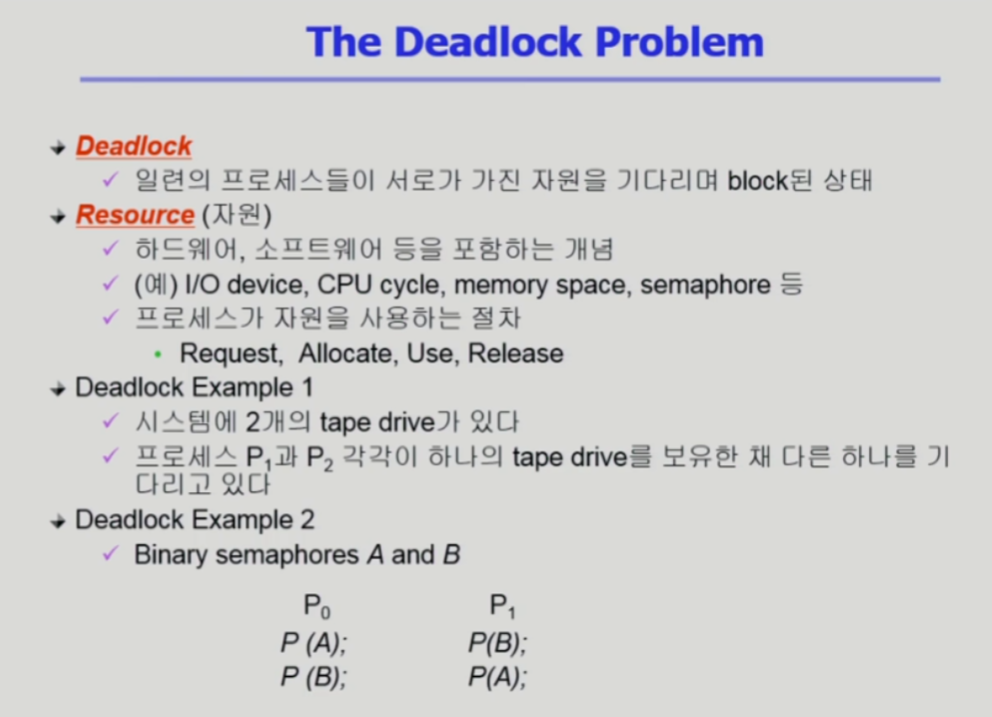

- 일련의 프로세스가 서로가 이미 가지고 있는 자원을 기다리면서 block되어 있는 상태

# 데드락 발생의 네 가지 조건

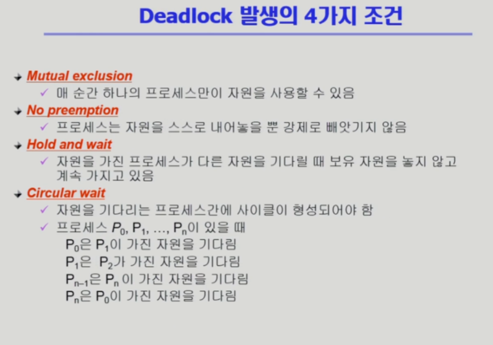

- 상호배제: 매 순간 하나의 프로세스만 자원을 사용할 수 있음
- 비선점: 프로세스가 자원을 강제로 빼앗기지 않고 스스로 내어놓음
- 점유 대기 : 자원을 가진 프로세스가 다른 자원을 기다릴 때 보유한 자원을 내놓지 않고 계속 가짐
- 순환 대기 : 자원을 기다리는 프로세스 간에 사이클이 형성되어야 함

# 자원 할당 그래프

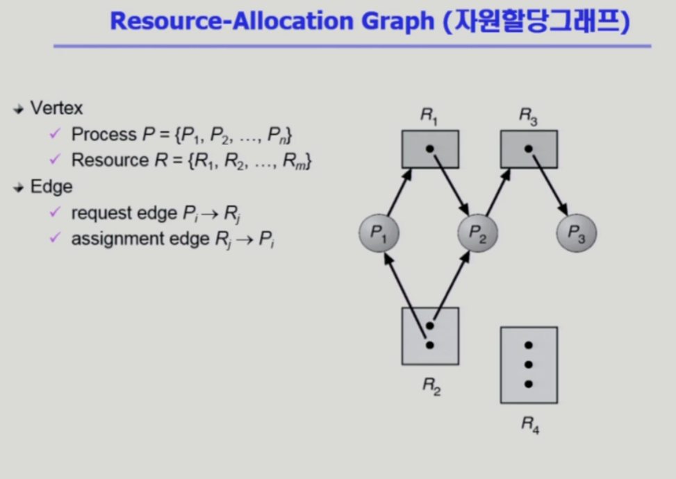

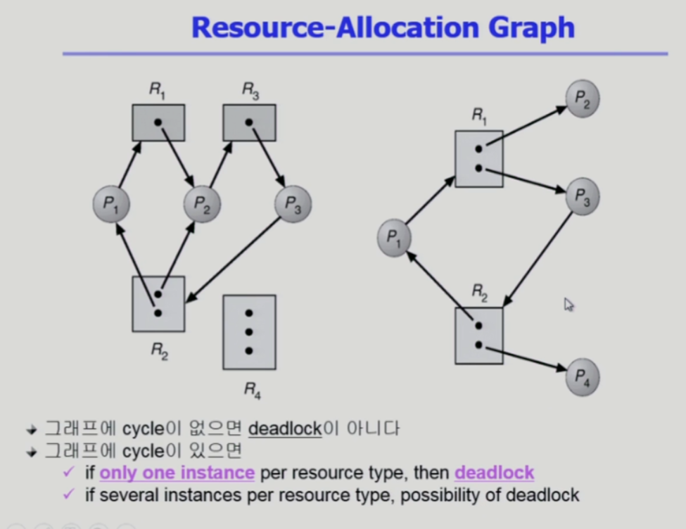

- 사이클이 생기면 Deadlock
- 근데 자원 안의 instance의 개수가 중요한데, instance의 개수가 여러 개면 데드락이 발생하는지 따져봐야함

# 데드락의 처리 방법

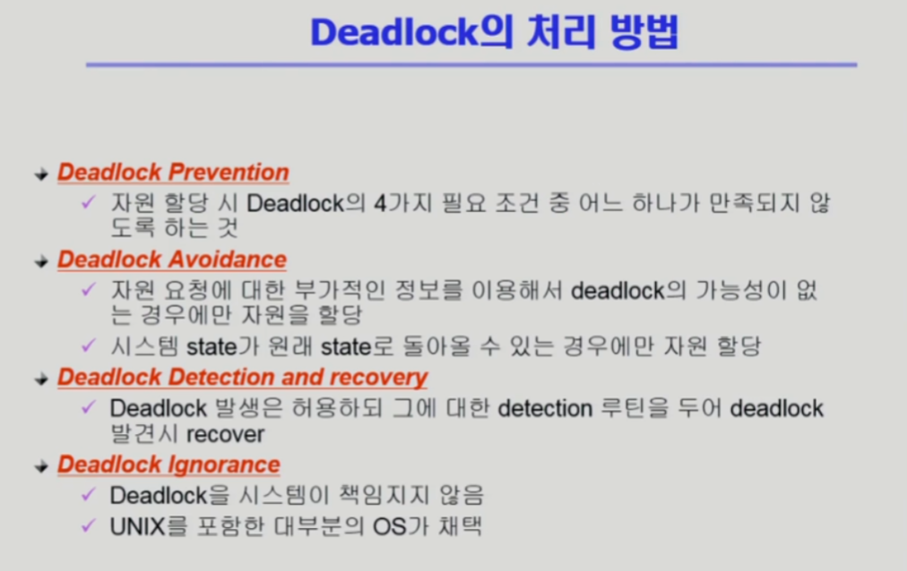

## Deadlock Prevention

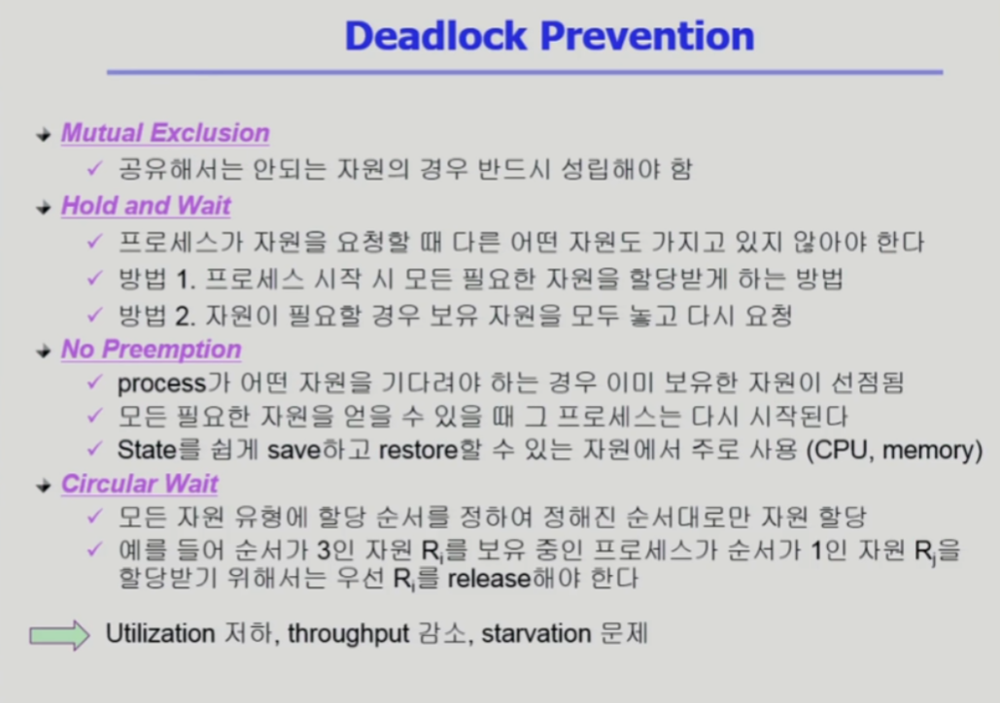

- 데드락을 미연에 방지하는 방법 중 Prevention은 가장 강력한 방법들임
- 상호배제 x : 주어진 시간에 오직 하나의 프로세스나 스레드만이 공유 자원에 들어가야 한다는 상호배제 특성 상 이 요소가 깨져버리면, 일관성이나 무결성이 유지되지가 않음
- 점유 대기 : 내가 가진 자원은 그대로 유지하면서 다른 자원을 기다리는 점유 대기. 프로세스가 자원을 요청할 때 자원을 가진 상태로는 요청 못하게 하는 방법
    - 방법 1 : 프로세스 시작할 때 필요한 자원을 다 주는 방법? ⇒ 자원 낭비
    - 방법 2 : 자원이 필요할 때 일단 가지고 있는 자원을 다 던지고 다시 받기
- 비선점 : 필요한 자원이 있어서 대기할 때 이미 가지고 있는 자원은 선점 가능하도록 설정
- 순환 대기 : 모든 자원 유형에 할당 순서를 먼저 정해놓고 정해진 순서로만 할당 가능하도록 설정
- 이러한 Deadlock Prevention방법은 쓸데없이 자원을 줬다가 뺐었다가 내놓았다가 하는 방식 때문에 비효율적임

## Deadlock Avoidance

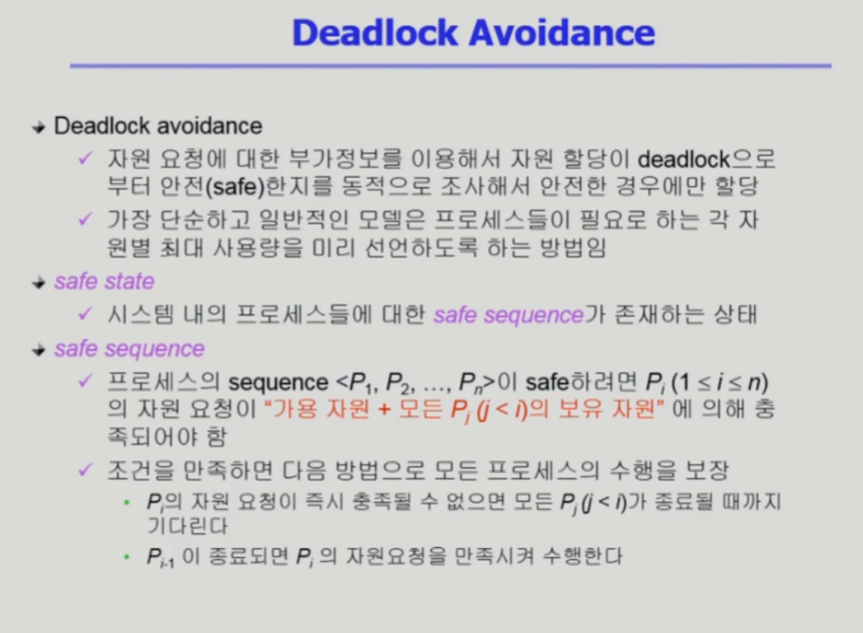

- Deadlock의 조건이 존재하도록 허용하지만 프로세스나 스레드가 자원을 요청했을 때 Deadlock이 발생할 수 있는지 여부를 동적으로 결정하는 방법

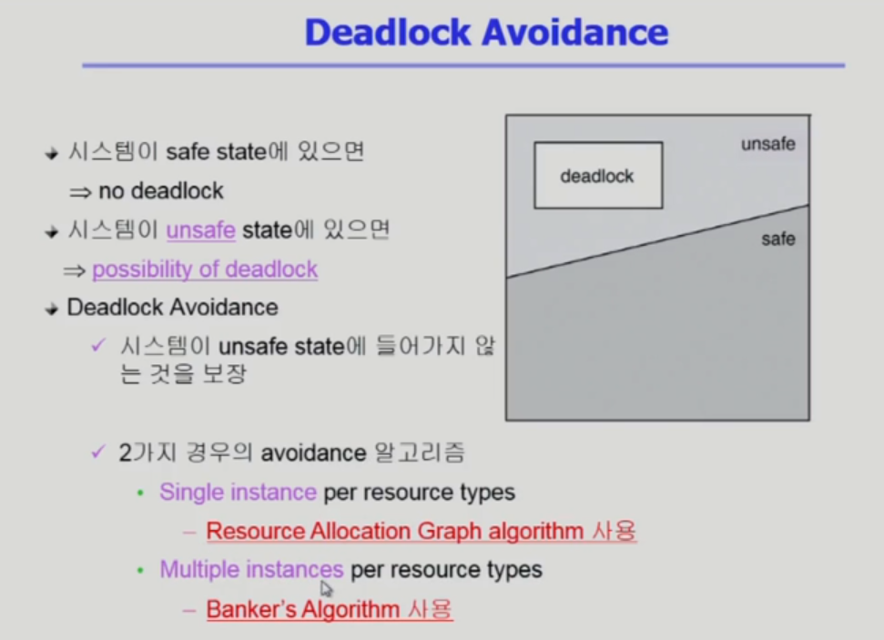

- 안전한 상태
    - 모든 프로세스가 성공적으로 완료될 수 있는 프로세스 실행 시퀀스가 하나 이상 존재
- 안전하지 않은 상태
    - 자원 요청을 허용했을 때 잠재적으로 교착 상태가 발생할 수 있는 경우
    - 안전하지 않은 상태라고 Deadlock이 무조건 발생하는 건 아니지만 가능성이 있음
- 교착 상태 방지 알고리즘은 시스템의 현재 상태와 잠재적인 향후 요청을 기반으로 자원 요청을 허용할지 여부를 동적으로 결정

## Resource Allocation Graph algorithm

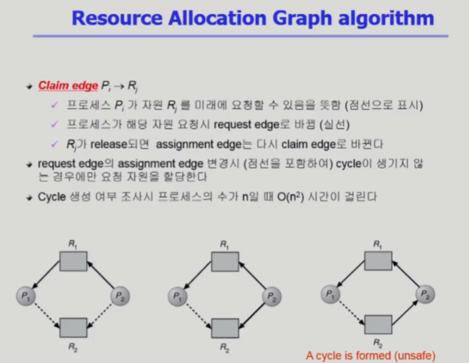

- 자원 타입 당 인스턴스가 하나인 경우
- 그래프를 통해 해결하는 RAG알고리즘

## Banker’s Algorithm

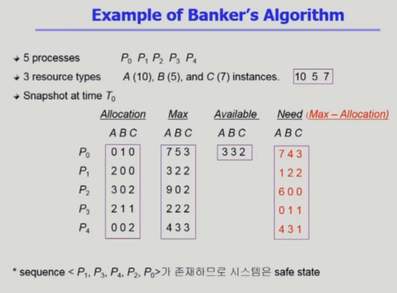

- 프로세스는 최대 자원 요구 사항을 미리 선언함
- 시스템은 그럼 현재 할당된 자원, 요청된 자원의 할당을 시뮬레이션, 어떤 순서로 모든 프로세스의 요구 사항을 충족할 수 있는지 결정
- 만약 안전한 상태로 유지된다면 자원이 부여됨
- 안전하지 않다면 프로세스는 대기하게 됨

## Deadlock Detection and Recovery

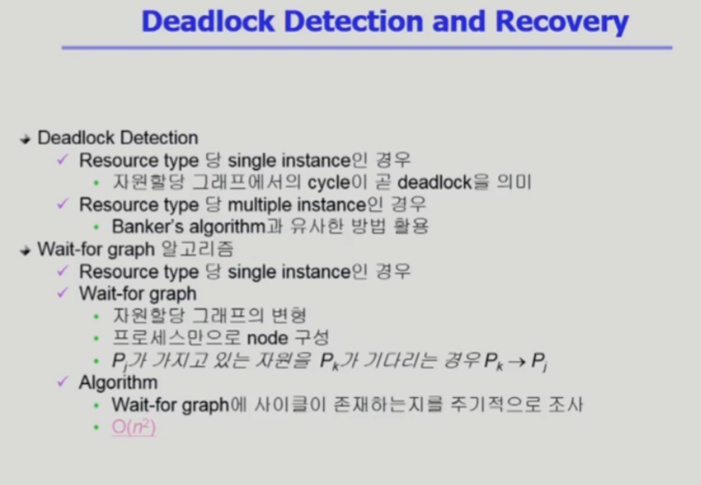

- 자원이 충분한데 데드락이 발생할 수 있을 가능성 때문에 자원을 안 주는 것은 비효율적이므로 뭔저 자원을 줘놓고 데드락이 발생했을 때 처리하는 방식

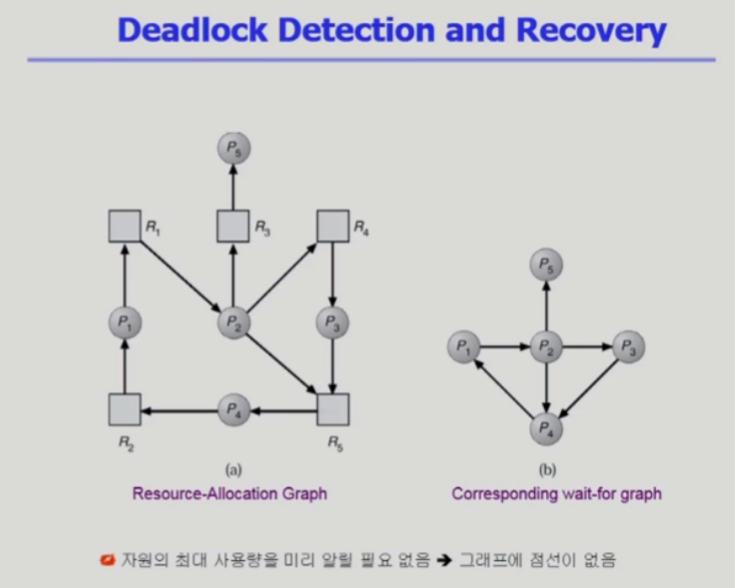

- a그래프는 사이클이 2개가 있음 ⇒ 데드락 발생
- 하지만 일단 자원을 다 줌. 자원의 최대 사용량은 관심사항이 아님

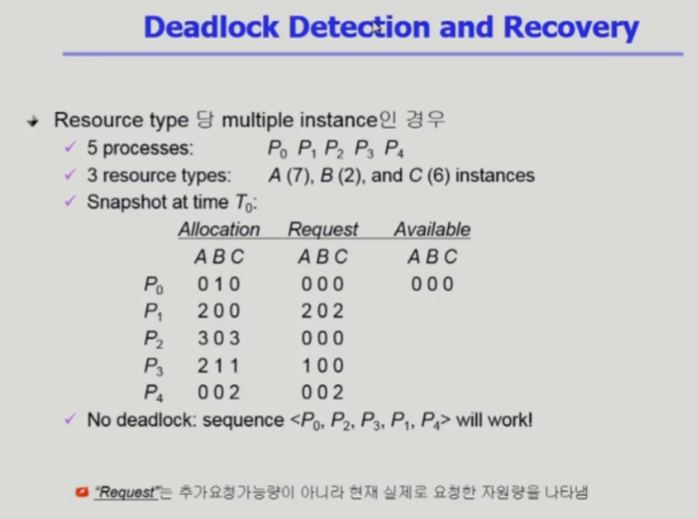

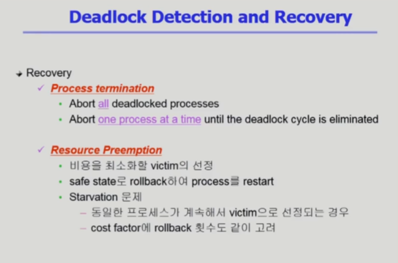

- 리커버리 방법
- 프로세스 종료
    - all : 전부 죽이기
    - 하나씩 죽이면서 데드락이 풀리는지 확인
- 자원 선점
    - 비용을 최소화할 수 있는 프로세스를 선정
    

## Deadlock Ignorance

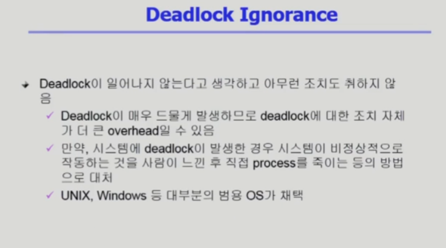

- OS가 데드락에 대해서는 관여안함
- 현대 운영체제는 이 방식을 채택함