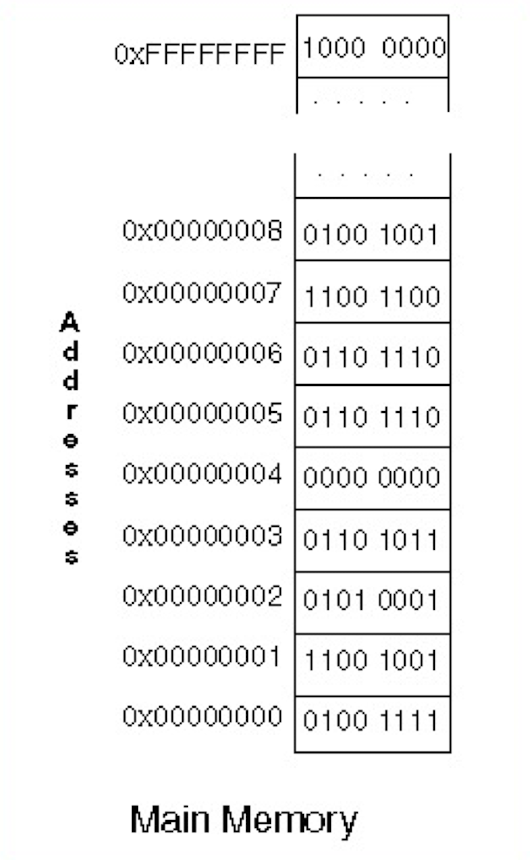
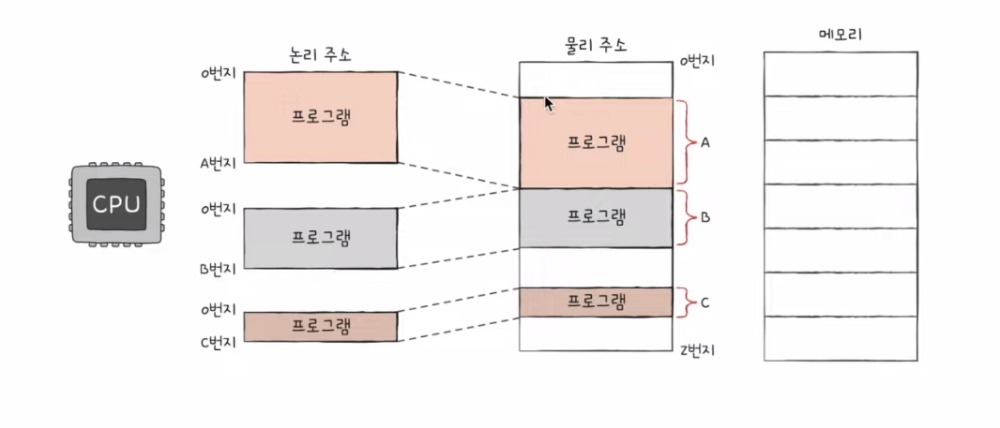
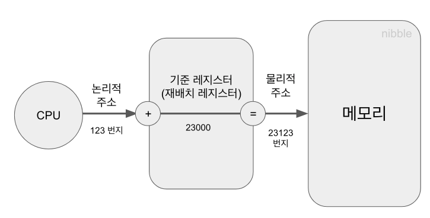
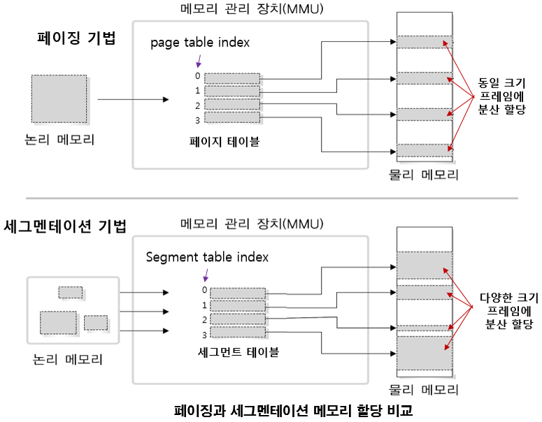

# 메모리 관리

slug: memory-management
tags: OS
version: 1

<aside>
💡

한정된 메모리 공간을 어떻게 하면 효율적으로 관리할 수 있을까?

</aside>

CPU는 2차 메모리 즉 저장장치에 직접 접근할 수 없으며 필요한 데이터를 메인 메모리에서 가져와야 합니다. 하지만 메모리 공간은 한정적입니다. 여러 개의 프로그램을 동시에 실행해야 하는 운영체제는 한정적인 메모리 공간을 최대한 효율적으로 관리해서 CPU에게 필요한 데이터를 빨리 제공해야 하는 것이 목표입니다. CPU는 주소 값을 통해 메모리에 접근하기 때문에 주소 공간에 대해 먼저 알아봅시다.

# 주소 공간(Address Space)

운영체제에서 주소 공간이란 프로세스가 접근할 수 있는 메모리 주소 범위를 의미합니다. 각 메모리 주소는 1 바이트(8 비트)를 가리키며, 주소 하나가 비트가 아니라 8비트 (1바이트) 단위를 식별합니다. 

위의 그림을 보면 주소 00000000은 데이터 01001111에 대응됩니다. 이는 주소 0번지에 01001111이라는 바이트가 저장되어 있다는 의미입니다. 그리고 이진수 01001111은 16진수로 0x4F, 10진수로 79에 해당합니다. 

운영체제 입장에서 메모리 주소는 매우 중요한 정보입니다. 따라서 메모리를 효율적으로 관리하고 각 프로세스에 독립적인 주소 공간을 할당하기 위해 **가상 메모리(Virtual Memory)** 라는 개념을 사용합니다. 가상 메모리는 페이징(Paging)이나 세그멘테이션(Segmentation) 같은 방식을 통해 물리적인 메모리와 매핑됩니다.

# 논리 주소 vs 물리 주소

## 논리 주소 (Logical Address)

논리 주소는 프로세스가 실행되는 동안 CPU가 참조하는 주소입니다. 프로세스에 접근할 때 실제 메모리 위치가 아니라 가상 메모리의 위치에 접근하므로 **가상 주소(Virtual Address)**라고도 부릅니다. 논리 주소는 CPU안의 특정 유닛이 생성하고 MMU(Memory Management Unit, 메모리 관리 유닛)가 물리 주소로 변환합니다. 이점으로는 프로세스마다 고유한 논리 주소 공간을 갖기 때문에 서로 다른 프로세스가 동일한 논리 주소를 사용할 수 있고, 사용자는 논리 주소만 참조하고 물리 주소의 위치에 대해서는 알 필요가 없습니다.

## 물리 주소 (Physical Address)

물리 주소는 메인 메모리의 실제 위치를 나타내는 주소입니다. 물리 주소는 CPU가 직접 접근하는 메모리의 실제 위치이기 때문에 하드웨어적으로 중요합니다. 이 물리 주소는 MMU에 의해 논리 주소에서 변환되어 생성됩니다. 또한 물리 주소는 실제 위치이므로 시스템 전체에서 유일하며, 특정 메모리 셀을 고유하게 식별합니다.

## 왜?

운영체제는 메모리에 대해서 논리 주소와 물리 주소를 별도로 운영합니다. 이는 프로세스 간의 독립성이나 메모리 보호, 그리고 효율적인 메모리 관리 등을 보장하기 위한 중요한 설계입니다.

- 프로세스 간의 독립성 : 운영체제는 여러 프로세스를 동시에 실행합니다. 이때 각 프로세스가 자신만의 고유한 메모리 공간을 갖도록 보장해야 하는데, 논리 주소를 사용하면 모든 프로세스가 같은 논리 주소 공간을 가지지만 실제로는 서로 다른 물리 주소에 매핑되도록 관리할 수 있습니다.
- 메모리 보호 : 논리 주소를 통해 운영체제가 프로세스에 접근할 수 있는 물리 메모리의 범위를 제한할 수 있습니다. 이는 프로세스가 자신에게 할당된 주소 공간을 벗어나 다른 프로세스의 메모리나 운영체제의 메모리에 접근하는 것을 방지합니다.
- 효율적인 메모리 관리 : 논리 주소와 물리 주소를 구분하면, 프로세스가 실행 중에 필요한 만큼 메모리를 동적으로 할당받고 필요하지 않은 메모리는 해제하는 **동적 메모리 할당**과 운영체제가 자주 사용되지 않는 메모리 페이지를 2차 메모리(디스크)로 옮기고 필요한 페이지만 물리 메모리에 유지하는 **페이지 교체**와 같은 고급 메모리 관리 기법을 적용할 수 있습니다.

# 주소 바인딩 (Address Binding)

주소 바인딩은 운영체제에서 프로그램의 논리 주소를 물리 주소로 변환하는 과정을 말합니다. 프로그램은 실행될 때 특정 메모리 위치에 적재되어야 하는데 이 과정에서 주소 바인딩을 통해 논리 주소를 물리 주소와 연결시킵니다. 주소 바인딩은 프로그램 작성 시점, 컴파일 시점, 로드 시점, 실행 시점에 따라 여러 방식으로 이루어 질 수 있습니다.

## 컴파일 타임 바인딩(Compile-Time Address Binding)

컴파일러가 소스 코드를 컴파일할 때 물리 주소를 결정하는 방식입니다. 즉, 컴파일 시에 모든 메모리 주소가 고정되며 실행 시에 별도의 주소 변환 과정이 필요없습니다.

- 프로그램이 항상 동일한 물리적 위치에 적재되어야 함
- 컴파일 시에 물리 주소가 정해지기 때문에 메모리 관리 유연성이 떨어짐
- 실행 중에 메모리를 동적으로 할당하거나 해제하는 것이 어려움
- 주소 변환이 필요없기 때문에 실행 속도가 빠름
- 프로그램이 특정 메모리 위치에만 적재될 수 있기 때문에 다중 프로세스 환경에서는 비효율적임
- 가상 메모리 같은 동적 메모리 관리 기법을 사용할 수 없음
- 초기 시스템이나 임베디드 시스템에 활용

## 로드 타임 바인딩(Load-Time Binding)

프로그램을 실행 파일로 만든 후, 이를 메모리에 로드하는 시점에 물리 주소가 결정되는 방식입니다. 실행 파일에 있는 모든 주소는 로드 시점에 물리 주소로 변환됩니다.

- 프로그램이 로드될 때마다 새로운 물리 주소에 적재될 수 있음
- 로더가 프로그램을 적재할 때 필요한 주소 변환 작업을 수행함
- 실행 중에는 메모리 위치를 변경할 수 없기 때문에 동적 메모리 관리는 어려움
- 간단한 운영체제 환경에서 사용

## 실행 시간 바인딩(Runtime Binding)

프로그램이 실행되는 동안에 동적으로 논리 주소를 물리 주소로 변환하는 방식입니다. 이 방식은 CPU가 명령어를 실행할 때마다 주소 변환이 이루어지며, 주로 가상 메모리 시스템에서 사용됩니다.

- 주소 변환이 실행 시점에 이루어지기 때문에 프로그램이 실행 중에 메모리 위치를 변경할 수 있음
- 주소 변환은 MMU가 담당하며 CPU가 참조하는 논리 주소를 물리 주소로 변환함
- 동적 로드, 동적 링크, 가상 메모리 관리 같은 고급 기법을 사용할 수 있음
- 매우 높은 유연성을 제공하며, 여러 프로세스가 동시에 실행될 때 효과적임
- 주소 변환 작업이 실행 중에 반복적으로 수행되기 때문에 오버헤드가 발생
- 가상 메모리, 현대 OS에서 사용

# MMU(Memory-Management Unit)

MMU는 CPU와 메모리 사이에 위치한 **하드웨어** 장치로, 프로세스가 사용하는 논리 주소를 실제 메모리의 물리 주소로 변환하는 역할을 합니다. 현대 운영체제에서 사용하는 가상 메모리 시스템에서 중요한 역할을 하며, 메모리 보호와 주소 변환을 효율적으로 수행합니다.

## MMU Scheme 동작 과정

1. 논리 주소 생성
    1. 프로세스가 실행될 때 CPU는 명령어와 데이터를 참조하기 위해 논리 주소를 생성
    2. ex) 논리 주소 : 0x1A3F, 페이지 크기: 4KB, 페이지 번호 : 1, 오프셋 : 0x03F
2. 페이지 테이블 참조
    1. MMU는 논리 주소의 페이지 번호(Page Number)를 이용해 페이지 테이블(Page Table)을 참조하고 해당 페이지가 어느 물리 페이지 프레임에 매핑되어 있는 지 확인
    2. ex) 페이지 테이블 참조 결과 페이지 번호 1은 물리 페이지 프레임 5와 매핑되어 있음
3. 물리 주소 생성
    1. MMU는 페이지 테이블에서 얻은 물리 페이지 프레임 번호와 논리 주소의 오프셋을 결합해 최종 물리 주소를 생성
    2. ex) 물리 페이지 프레임: 0x5000, 오프셋 : 0x03F, 최종 물리 주소: 0x503F

# 동적 로딩 (Dynamic Loading)

필요한 코드와 데이터를 실행 시점에 동적으로 메모리에 적재하는 기법입니다. 프로그램의 전체 내용을 메모리에 한 번에 적재하지 않고, 실제로 필요한 부분만 메모리에 올려서 메모리 사용량을 줄일 수 있습니다. 다만 실행 중에 주소 변환 오버헤드가 발생합니다.

# 동적 링킹 (Dynamic Linking)

실행 시점에 라이브러리 함수와의 연결을 동적으로 수행하는 방식입니다. 프로그램 실행 시, 필요한 라이브러리를 로드하고 링킹하여 사용할 수 있습니다. 이는 공유 라이브러리를 사용할 때 유용합니다. 메모리 사용량을 절감하고 라이브러리 업데이트가 용이하지만 실행 중 링킹 오버헤드가 발생합니다.

- 실행파일에 라이브러리 코드가 포함되지 않으며, 프로그램이 실행되면서 라이브러리 함수를 호출할 때 라이브러리에 대한 연결이 이루어짐
- 라이브러리 호출 부분에 라이브러리 루틴의 위치를 찾기 위한 stub라는 작은 코드를 둠
- 라이브러리가 이미 메모리에 존재하면 그 루틴의 주소로 가고 없으면 디스크에서 읽어옴

## 정적 링킹

- 라이브러리가 프로그램의 실행 파일 코드에 포함
- 실행 파일의 크기가 커짐
- 동일한 라이브러리를 각각의 프로세스에 메모리에 올리므로 메모리 낭비가 심함

# 연속 할당과 불연속 할당

## 연속 할당(Continuous Allocation)

연속 할당은 메모리의 연속된 공간에 데이터를 배치하는 방식입니다. 하나의 프로세스가 메모리에 적재될 때 필요한 메모리 공간을 하나의 연속된 블록으로 할당받습니다. 모든 할당된 메모리 블록들이 물리적으로 연속된 공간에 위치하므로 효율적인 접근이 가능하지만, 단편화 문제가 발생할 수 있습니다. 초기 메모리 관리 방식에서 많이 사용됐습니다.

예시로는 배열(Array)이 있습니다.

## 불연속 할당(Discontinuous Allocation)

불연속 할당은 메모리의 연속된 공간이 아닌 여러 개의 분산된 블록에 데이터를 배치하는 방식입니다. 메모리 단편화 문제를 줄일 수 있습니다. 페이징과 세그멘테이션 같은 메모리 관리 기법에서 사용됩니다. 연속 할당에 비해 메모리 활용도가 높지만 주소 변환이 필요하기 때문에 약간의 오버헤드가 발생할 수 있습니다.

예시로는 링크드 리스트(Linked List)가 있습니다.

현대 운영체제의 가상 메모리 시스템은 불연속 할당 방식을 주로 사용합니다.

# 고정 분할 방식과 가변 분할 방식

## 고정 분할 방식(Fixed Partition)

고정 분할 방식에서는 메모리를 고정된 크기의 여러 개의 분할(partition)으로 나누어 프로세스가 할당받을 수 있도록 관리합니다. 각 분할의 크기는 운영체제가 결정하며 할당할 때 프로세스는 하나의 분할을 독점적으로 사용합니다. 메모리를 미리 나누어 두기 때문에 할당과 회수 과정이 단순하지만 내부 단편화가 발생할 수 있습니다. 하지만 미리 나누어 둔 분할을 전부 가져가므로 외부 단편화는 발생하지 않습니다.

## 가변 분할 방식(Variable Partition)

가변 분할 방식에서는 프로세스의 크기에 맞게 메모리를 동적으로 할당하는 방식입니다. 메모리 공간을 필요에 따라 나누고, 프로세스가 종료되면 해당 공간을 반환해 다른 프로세스가 사용할 수 있습니다. 프로세스가 요청한 메모리 크기만큼 할당할 수 있으므로 메모리 낭비가 줄지만 메모리 내에 작은 빈 공간들이 생겨 새로운 프로세스를 적재할 수 없게 되는 외부 단편화가 발생할 수 있습니다. 이러한 외부 단편화를 해결하기 위해 압축(Compression) 기법을 사용할 수 있습니다. 압축 기법은 메모리의 빈 공간을 한 곳으로 모으는 작업입니다.

# 동적 메모리 할당 문제

가변 분할 방식에서 주소 공간의 크기가 n이 프로세스를 메모리에 올릴 때 물리적 메모리 내의 가용 공간 중에서 어떤 위치에 올릴 것인지를 결정하는 문제입니다.

- 최초 적합 (First Fit)
    - size가 n 이상인 것 중 최초로 발견한 hole에 할당
- 최적 적합 (Best Fit)
    - size가 n 이상인 것 중 가장 작은 hole을 찾아서 할당
    - hole들의 리스트가 크기 순으로 정렬되지 않은 경우 모든 hole을 탐색해야 함
    - 많은 수의 아주 작은 hole이 생성되게 됨
- 최악 적합 (Worst Fit)
    - 가장 큰 hole에 할당
    - 역시 hole을 탐색해야 함
    - 상대적으로 아주 큰 hole이 생성됨

# 페이징과 세그멘테이션

## 페이징 (Paging)

페이징은 고정된 크기의 블록으로 메모리를 나누어 관리하는 메모리 관리 기법입니다. 프로세스의 논리적 주소 공간을 **페이지**로 나누고 물리적 메모리는 프레임이라는 동일한 크기의 **블록**으로 나눕니다.

### 동작 방식

1. 페이지 분할 : 프로세스가 메모리에 적재될 때 프로세스의 논리적 주소 공간이 일정한 크기의 페이지로 나뉩니다.
2. 프레임 할당 : 물리적 메모리도 같은 크기의 프레임으로 나뉘며, 각 페이지는 가능한 프레임에 할당됩니다.
3. 페이지 테이블 : 페이지와 프레임 간의 매핑 정보를 저장하는 데이터 구조로 프로세스가 메모리를 접근할 때 논리 주소를 물리 주소로 변환합니다.
4. 주소 변환 : CPU가 생성한 논리 주소는 페이지 번호와 오프셋으로 나뉘며 페이지 테이블을 통해 물리적 주소가 계산됩니다.

### 장점

- 외부 단편화 해결 : 메모리 공간이 고정된 크기로 나뉘어 있어 외부 단편화 문제가 발생하지 않음
- 효율적 메모리 활용 : 프로세스가 물리적으로 연속된 메모리 공간에 위치할 필요가 없으므로 메모리의 활용도가 높아짐

### 단점

- 내부 단편화 발생 : 페이지 크기보다 작은 데이터가 페이지에 할당되면 남는 공간이 낭비될 수 있음
- 오버헤드 : 페이지 테이블을 관리하기 위한 추가적인 메모리와 처리 비용이 발생
- 페이지 폴트(Page Fault) : 필요한 페이지가 메모리에 없을 경우 디스크에서 해당 페이지를 가져와야 하므로 성능 저하가 발생할 수 있음

## 세그멘테이션 (Segmentation)

세그멘테이션은 가변 크기의 세그먼트로 메모리를 나누어 관리하는 기법입니다. 각 세그먼트는 프로세스의 논리적 구조에 따라 나뉘며, 코드, 데이터, 스택 등의 논리적 부분으로 구분됩니다.

### 동작 방식

1. 세그먼트 분할 : 프로세스가 메모리에 적재될 때, 논리적 구조에 따라 여러 개의 가변 크기 세그먼트로 나뉨
2. 세그먼트 테이블 : 각 세그먼트의 시작 주소(기준 주소)와 크기(limit)을 저장하는 데이터 구조
3. 주소 변환 : 논리 주소는 세그먼트 번호와 오프셋으로 구성되며, 세그먼트 테이블을 참조해 물리 주소로 변환됨

### 장점

- 논리적 구조 반영 : 세그멘테이션은 프로세스의 논리적 구조(코드, 데이터, 스택 등)를 그대로 반영하므로 관리가 용이
- 모듈화 지원 : 각각의 세그먼트를 독립적으로 관리할 수 있어 모듈화와 보호 기능을 지원
- 내부 단편화 해소 : 세그먼트 크기가 가변적이므로 필요한 만큼의 메모리를 할당해 내부 단편화가 발생하지 않음

### 단점

- 외부 단편화 발생 : 가변 크기 세그먼트가 메모리에 적재되기 때문에 외부에 사용하지 않는 작은 공간들로 인해 외부 단편화가 발생할 수 있음
- 복잡한 메모리 관리 : 가변 크기의 세그먼트를 관리하고 할당하는 과정이 복잡함
- 압축 필요 : 외부 단편화 문제를 해결하기 위해 메모리 압축이 필요할 수 있으모 이는 추가 오버헤드를 초래

## 페이지드 세그멘테이션 (Paged Segmentation)

현대 운영체제에서는 페이징과 세그멘테이션을 혼합한 페이지드 세그멘테이션을 일반적으로 사용합니다. 이를 통해 두 기법의 단점을 보완하고 장점을 극대화할 수 있습니다.

### 동작 방식

1. 프로세스는 논리적으로 여러 세그먼트로 나뉨
2. 각 세그먼트는 다시 고정 크기의 페이지로 나뉘어 물리적 메모리에 할당됨
3. 세그먼트 테이블은 각 세그먼트 페이지 테이블 시작 주소를 가리키고, 페이지 테이블을 통해 실제 물리 주소가 계산됨

### 장점

- 내부 단편화 감소 : 페이징을 사용해 고정 크기 단위로 할당함으로써 내부 단편화 문제를 해결
- 외부 단편화 감소 : 세그먼트를 페이지로 나누어 관리함으로써 외부 단편화 문제를 줄일 수 있음
- 모듈성 유지 : 세그멘테이션의 논리적 구조를 해치지 않고 그대로 사용하므로 모듈화와 보호 기능을 유지할 수 있음