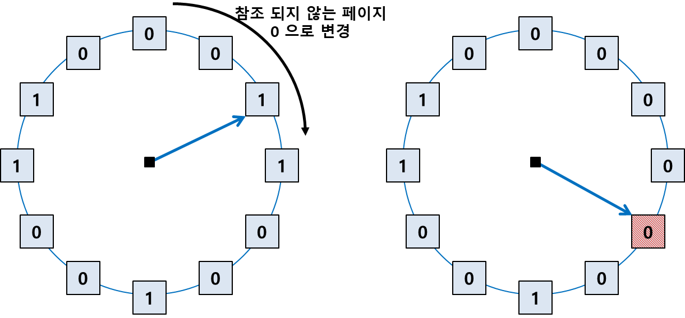

# 가상 메모리

slug: virtual-memory
tags: OS
version: 1

# 요구 페이징

요구 페이징은 프로그램 실행 시 프로세스를 구성하는 모든 페이지를 한꺼번에 올리는 것이 아니라 당장 사용할 페이지만 메모리에 올리는 방식입니다. 따라서 특정 페이지에 대한 요청이 CPU로부터 들어온 후에 해당 페이지를 메모리에 적재합니다.

요구 페이징은 당장 필요한 페이지만 메모리에 적재하기 때문에 메모리 사용량이 감소하고 프로세스 전체를 메모리에 올리는 데 소요되는 입출력 오버헤드를 줄입니다. 추가적으로 물리적 메모리의 용량 제약을 벗어나 물리적 메모리보다 더 큰 프로그램도 실행할 수 있습니다.

각 페이지가 메모리에 존재하는지 여부를 판단하기 위해 요구 페이징에서 **유효-무효 비트(Valid-InValid Bit)**를 표시합니다. 이러한 비트는 각 프로세스를 구성하는 모든 페이지에 존재해야 하므로 페이지 테이블에 각 항목 별로 저장됩니다.

프로세스가 실행되기 전에는 모든 페이지의 유효-무효 비트가 i로 초기화되어 있지만, 만약 특정 페이지가 필요에 의해 메모리에 적재되는 경우 해당 페이지의 유효-무효 비트는 v로 바뀝니다.

그런데 만약 CPU가 현재 참조하려는 페이지가 메모리에 있지 않다면, **MMU**가 **페이지 부재(Page Fault)**라는 소프트웨어 인터럽트를 발생시키고 페이지 부재 처리 루틴을 거쳐 해당 페이지를 메모리에 적재합니다.

# 페이지 부재 (Page Fault)

1. 프로세스가 실행되고 CPU가 특정 페이지에 접근하려고 할 때, 먼저 해당 페이지가 메모리에 있는 확인해야 합니다. 이는 페이지 테이블에서 해당 페이지의 valid bit를 확인함으로써 이루어집니다. valid bit가 1이면 해당 페이지는 메모리에 존재하므로 CPU는 메모리에서 해당 페이지를 참조해 연산을 수행합니다.
2. 만약 valid bit가 0이라면 MMU는 page fault trap을 발생시킵니다. 그럼 CPU의 제어권이 커널모드로 넘어가고 운영체제의 페이지 처리 루틴이 실행됩니다. 이때 운영체제는 invalid한 경우라면 프로세스를 종료시키고 정당한 page fault라면 free frame을 할당받습니다. 만약 free frame이 없다면 swap out을 진행합니다.
3. 할당 받은 프레임에 페이지를 로드하기 위해 운영체제는 디스크에 I/O 요청을 하고 페이지 부재를 발생시킨 프로세스는 CPU를 선점당하고 블락됩니다. 이때 PCB에 레지스터 상태 및 PC값을 저장함으로써 나중에 다시 CPU를 할당받았을 때 다음 명령을 수행할 수 있습니다.
4. 디스크에서 I/O가 완료되어 인터럽트가 발생하면 페이지 테이블에서 해당 페이지의 비트를 valid로 수정하고, 블락 상태에 있던 프로세스를 ready로 변경시켜 ready queue로 이동시킵니다.
5. 이후 이 프로세스가 다시 CPU를 할당받으면 PCB에 저장되어 있던 값을 복원시켜 다음 명령을 수행합니다.

페이지 부재 발생은 요청된 페이지를 디스크로부터 메모리로 읽어오는 오버헤드가 생기므로 페이지 부재가 적게 발생할수록 요구 페이징의 성능이 향상될 수 있습니다.

페이지 부재 발생 빈도를 낮추기 위해서는 페이지의 크기를 적절히 선택하고, 페이지 교체 알고리즘을 통해 사용 빈도가 낮은 페이지를 교체하는 것이 중요합니다.

페이지 하나의 크기가 너무 작다면 페이지 테이블의 메모리 사용량이 늘어날 뿐더러, 한번에 로드할 수 있는 데이터의 양이 적으므로 페이지 폴트 빈도가 늘어날 수 있습니다. 반대로 페이지 하나의 크기가 너무 크다면 내부 단편화 문제가 발생할 수 있습니다.

# 페이지 교체 알고리즘

페이지 폴트가 발생하면 요청된 페이지를 디스크에서 메모리로 읽어와야 하는데, 이때 free frame이 존재하지 않을 수 있습니다. 이 때 메모리에 이미 올라와 있는 페이지 중 하나를 swap out해야 하는데, 이를 페이지 교체라고 하며 어떤 프레임에 있는 페이지를 swap out할 것인지를 결정하는 알고리즘을 페이지 교체 알고리즘이라고 합니다.

## 최적 페이지 교체 (Optimal Page Replacement)

페이지 폴트를 최소화하는 방법은 메모리에 올라와 있는 페이지들 중에서 앞으로 가장 사용되지 않을 페이지를 swap out하는 것입니다. 이를 바탕으로 한 최적 알고리즘을 발레디의 최적 알고리즘이라고 합니다. 하지만, 어떤 페이지가 어떤 순서로 참조될지 미리 알고 있지 않으므로 현실적으로 구현하기 어렵습니다.

## 선입선출 알고리즘(FIFO, First-In First-Out)

선입 선출 알고리즘은 페이지 교체 시 물리적 메모리에 가장 먼저 올라온 페이지를 우선적으로 내쫒은 알고리즘입니다. 이는 페이지가 앞으로 참조될 가능성을 고려하지 않고 물리적 메모리에 들어온 순서만을 고려해 내쫒을 대상을 선정하기 때문에 비효율적일 수 있습니다.

## LRU (Least Recently Used) 알고리즘

LRU 알고리즘은 가장 오래전에 참조된 페이지는 앞으로도 빠른 시간 내 참조되지 않을 것이라는 가정하에 해당 페이지를 내쫒는 알고리즘입니다. 이는 메모리의 참조 성향 중 하나인 시간 지역성을 활용한 알고리즘입니다. 시간 지역성이란 최근에 참조된 페이지가 가까운 미래에 다시 참조될 가능성이 높은 성질을 말합니다.

## LFU (Least Frequently Used) 알고리즘

LFU 알고리즘은 과거에 참조 횟수(reference count)가 가장 적었던 페이지를 내쫒는 알고리즘입니다. 이때 참조 횟수를 계산하는 방식에 따라 Incache-LFU와 Perfect-LFU로 나뉘는데, 전자는 메모리에 올라운 후부터 참조 횟수를 계산하며, 후자는 페이지의 과거 총 참조 횟수를 계산합니다.

LRU는 직전에 참조된 시점만을 반영하지만, LFU는 참조횟수를 이용해 장기적인 시간 규모에서의 참조 성향을 고려할 수 있다는 장점이 있습니다. 하지만 시간에 따른 참조횟수의 변화를 반영하지는 못하며 구현이 복잡하다는 단점을 가지고 있습니다.

## NUR (Not Used Recently) = 클럭 알고리즘

NUR 알고리즘은 LRU를 근사시킨 알고리즘으로 최근에 사용하지 않은 페이지를 교체하는 기법입니다. LRU는 가장 오래전에 참조된 페이지를 교체하는 것에 비해 클럭 알고리즘은 오랫동안 사용하지 않은 페이지 중 하나를 교체합니다. 구현이 더 간단하면서도 비슷한 성능을 제공합니다.

NUR 알고리즘은 페이지가 사용된 상태를 추적하기 위해 페이지마다 참조 비트(Reference Bit)와 변경 비트(Modify Bit)를 사용합니다. 이 두 비트를 조합해 페이지의 우선 순위를 결정하고 교체할 페이지를 선택합니다.

### 참조 비트

- 페이지가 참조될 때마다 1로 설정
- 일정한 시간 간격마다 운영 체제가 모든 페이지의 참조 비트를 0으로 초기화
- 참조 비트가 0인 페이지는 일정 시간동안 사용되지 않았음을 의미

### 변경 비트

- 페이지가 수정될 때 1로 설정
- 페이지가 디스크에 쓰여질 필요가 있는지 여부를 나타냄
- 변경 비트가 1인 페이지는 디스크에 기록해야 하므로 교체 비용이 더 높을 수 밖에 없음

NUR 알고리즘은 LRU, LFU와는 다르게 하드웨어적인 지원으로 동작하기 때문에 페이지 관리에 훨씬 효율적이며 빨라서 대부분의 시스템에서 페이지 교체 알고리즘으로 NUR 알고리즘을 채택하고 있습니다.

# 스레싱 (Thrashing)

스레싱은 할당받은 페이지 프레임의 크기가 작아 집중적으로 참조되는 페이지들의 집합을 메모리에 한꺼번에 적재하지 못하면서 페이지 폴트가 자주 발생하고, 이에 따라 CPU 사용률이 급격히 떨어지는 과정을 의미합니다.