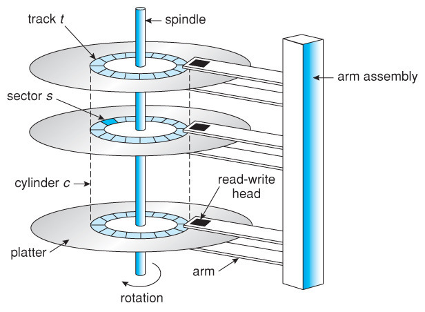

# 입출력 시스템

slug: io-system
tags: OS
version: 1

# 디스크 구조

디스크는 대용량 데이터를 영구적으로 저장하는 대표적인 저장 장치입니다. 이차 메모리라고도 합니다.

## **디스크의 물리적 구조**

HDD는 여러 개의 자기 디스크 플래터로 구성되며, 각 플래터는 양면에 데이터를 저장할 수 있습니다. 플래터는 고속으로 회전하며, 데이터를 읽고 쓰기 위해 디스크 헤드(head)가 움직입니다.

### **디스크의 주요 구성 요소**

1. 플래터(Platter)
    1. 디스크의 원형 판으로, 자성 물질로 코팅돼 데이터를 저장
    2. 플래터는 여러 개의 동심원 형태의 트랙(track)으로 나뉘며, 각각의 트랙은 다시 섹터(sector)로 나뉨
2. 트랙(Track)
    1. 플래터의 표면에 데이터를 저장할 수 있는 동심원 형태의 경로
    2. 각 트랙은 고유 번호를 가짐
3. 섹터(Sector)
    1. 트랙을 다시 고정된 크기(일반적으로 512byte or 409byte)의 블록으로 나눈 것
    2. 디스크에서 가장 작은 데이터 저장 단위
4. 실린더(Cylinder)
    1. 여러 플래터에서 동일한 트랙 번호를 갖는 트랙의 집합
    2. 실린더를 기준으로 데이터를 읽고 쓰면 디스크 헤드를 플래터 간에 이동할 필요가 없어 효율적임
5. 디스크 헤드(Head)
    1. 데이터를 읽고 쓰는 장치로, 플래터의 표면 위에 위치
    2. 플래터와 직접 접촉하지 않고, 미세한 간격을 두고 동작
    3. 플래터의 양면에 각각 하나의 디스크 헤드가 배치
6. 암(Arm)
    1. 디스크 헤드를 이동시키는 기계적 부품으로, 플래터의 회전 방향에 따라 트랙 위로 디스크 헤드를 이동시킴
7. 스핀들(Spindle)
    1. 플래터를 고정하고 회전시키는 축
    2. 디스크의 회전 속도는 일반적으로 분당 회전 수(RPM)로 표시되며, 일반적으로 5400RPM, 7200RPM, 고성능 디스크는 10,000RPM 이상

## 디스크의 논리적 구조

운영 체제는 디스크의 물리적 구조를 기반으로 데이터를 저장하고 관리합니다. 디스크의 논리적 구조는 블록 단위로 데이터를 관리하며, 블록은 디스크의 섹터와 관계됩니다.

1. 블록(Block)
    1. 운영 체제가 데이터를 관리하는 단위로, 일반적으로 하나의 블록은 여러 개의 섹터로 구성됨
    2. 일반적인 블록 크기는 4KB 또는 8KB
2. 파일 시스템(File System)
    1. 디스크 블록을 효율적으로 관리하고, 데이터를 저장하는 구조와 규칙을 정의
    2. 대표적인 파일 시스템: FAT32, NTFS, ext4
3. 디스크 파티션(Partition)
    1. 하나의 디스크를 여러 개의 논리적 영역으로 나누어 관리하는 방식
    2. 각 파티션은 독립적인 파일 시스템을 가질 수 있음
4. 부트 블록(Boot Block)
    1. 디스크의 첫 번째 블록으로, 운영 체제 부팅에 필요한 코드를 저장
5. 수퍼 블록(Super Block)
    1. 파일 시스템의 메타데이터를 저장하는 블록

## 디스크 접근 방식

디스크에 데이터를 읽고 쓰기 위해서는 디스크 헤드를 적절한 위치로 이동시켜야 합니다. 디스크 접근 속도는 다음 세 가지 단계로 결정됩니다.

### 탐색 시간(Seek Time)

- 디스크 헤드가 원하는 트랙으로 이동하는 데 걸리는 시간
- 탐색 시간은 디스크 접근 속도에 가장 큰 영향을 줌

### 회전 지연(Rotational Latency)

- 디스크가 회전하여 원하는 섹터가 디스크 헤드 아래로 올 때까지의 지연 시간
- 디스크의 회전 속도(RPM)에 따라 달라짐
- 평균 회전 지연 시간 = 한 바퀴 / 2

### 전송 시간(Transfer Time)

- 디스크에서 데이터를 실제로 전송하는 시간
- 섹터 크기와 디스크의 데이터 전송 속도에 따라 결정

# 디스크 스케줄링

디스크 스케줄링은 디스크 헤드의 이동을 최적화하여 디스크 접근 속도를 향상시키기 위한 기법입니다. 운영 체제는 디스크 요청을 효율적으로 처리하기 위해 다양한 스케줄링 알고리즘을 사용합니다.

## FCFS (First Come First Serve)

- 요청이 들어온 순서대로 처리하는 방식
- 간단하지만, 디스크 헤드 이동 거리가 길어질 수 있음

## SSTF (Shortest Seek Time First)

- 디스크 헤드와 가장 가까운 요청을 먼저 처리하는 방식
- 평균 탐색 시간을 줄일 수 있지만, 특정 요청이 무한정 지연될 수 있음

## SCAN

- 디스크 헤드가 한 방향으로 이동하며 요청을 처리하고 끝에 도달하면 반대 방향으로 이동
- 디스크 헤드의 이동 거리를 최소화할 수 있음

## C-SCAN (Circular SCAN)

- SCAN과 유사하지만, 한 방향으로만 이동하며 끝에 도달하면 다시 시작점으로 .
- 일정한 응답 시간을 제공할 수 있음