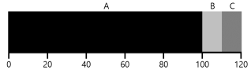
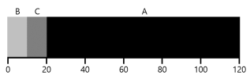
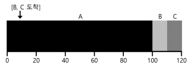

# 운영체제 개요

## 운영체제(OS, Operating System) 란?

하드웨어 위에 설치되어 사용자 및 다른 모든 소프트웨어와 하드웨어를 연결하는 소프트웨어 계층  
  
프로그램을 쉽게 실행하고, 동시에 여러 개의 프로그램을 실행하고, 프로그램 간 메모리를 공유하는 등 다양한 일을 할 수 있게 해줌

## 운영체제의 목적

1. 컴퓨터 시스템을 편리하게 사용할 수 있는 환경 제공  
   여러 사용자들과 여러 프로그램들이 **각각 다른 컴퓨터에서 수행되는 것** 같은 환상 제공  
   하드웨어를 다루는 복잡한 부분을 운영체제가 대행

2. 컴퓨터 시스템의 자원을 효율적으로 관리
   > **여기서 자원이란?**  
   > CPU, 메모리, I/O 장치, SSD 등 컴퓨터 하드웨어를 의미

   주어진 자원을 **효율성있게, 형평성있게 관리**함  
   실행중인 프로그램들에게 짧은 시간씩 CPU 를 번갈아 할당함 -> **CPU 스케줄링**  
   메모리 공간을 적절히 분배함 -> **메모리 관리**  
   디스크에 들어온 요청을 효율적으로 처리함 -> **디스크 스케줄링**  
   CPU 와 I/O 간 속도 차이를 극복함 -> **인터럽트, 캐싱**

## CPU 스케줄링

> **스케줄링 평가 항목**  
> 반환시간(Turnaround Time), 공정성(Fairness)  
> 이 둘은 서로 상반되는 목표임
> - **반환 시간**  
    작업이 완료된 시간 - 작업이 시스템에 도착한 시간
>
> 또한 시작할 때 아래와 같은 가정을 하고 점점 완화할 것
> 1. 모든 작업은 같은 시간동안 실행
> 2. 모든 작업은 동시에 도착
> 3. 각 작업은 시작되면 완료될 때까지 실행
> 4. 모든 작업은 CPU만 사용
> 5. 각 작업 실행 시간은 사전에 알 수 있음

### 선입선출

**선입선출(FIFO, First In First Out)** 과 선도착선치(FCFS, First Come First Served)는 동치어  
  
그냥 단순하게 **먼저 도착한 작업을 먼저 처리**하는 방식

단순하고 구현하기 쉽지만, 작업 시간에 따라 `Convoy Effect`가 발생할 수 있음
> **Convoy Effect란?**  
> 사용시간이 짧은 프로세스들이 사용시간이 긴 프로세스에 의해 오래 기다리는 현상  
>   
> 벌써 반환시간이 구릴거같이 생겼음

### 최단 작업 우선

`Convoy Effect`를 해결하기 위해 나온 방법  
**최단 작업 우선(SJF, Shortest Job First)**  
스케줄링 이름 그대로 **짧은 작업부터 처리**함  
  
FIFO에 비해 반환 시간을 절반 이상 감소시킨 모습

하지만 현실은 호락호락하지 않음  
지금은 모든 작업이 동시에 도착함을 가정하고 있음  
만약 A가 t = 0에 도착하고, 나머지가 t = 10에 도착한다면?  
  
결국 똑같은 문제가 또 발생함  
**비선점(non-preemptive) 스케줄러**라 발생하는 문제!

### 최단 잔여시간 우선

이제 선점형 스케줄러로 변경함  
**최단 잔여시간 우선(STCF, Shortest Time-to-Completion First)**  
언제든 새로운 작업이 들어오면 잔여 실행 시간을 계산해 **가장 적은 잔여 실행 시간을 가진 작업을 우선**함  
  
위의 문제가 또 해결됨  
언제 어떤 작업이 들어오던 STCF라면 최적의 반환시간을 내줄 것!

#### 그러면 STCF가 제일 좋은 스케줄링인가?

만약 **작업 길이를 미리 알고, 작업이 CPU만 사용하며, 평가 기준이 반환시간**이라면 좋은 스케줄링  
하지만, `시분할 컴퓨터`의 등장으로 많은 것이 바뀜
> **시분할(Time-sharing) 컴퓨터**  
> 여러 프로세스가 사용하는 시스템에서 컴퓨터가 자원을 시간적으로 분할하여 모두 독립된 컴퓨터를 사용하는 느낌을 주는 것

이로 인해 새로운 평가 기준이 생김

- **응답 시간(Response Time)**  
  작업이 스케줄 된 시간 - 작업이 시스템에 도착한 시간

### 라운드 로빈

응답 시간을 해결하기 위해 나옴  
**라운드 로빈(RR, Round-Robin)**  
작업을 **일정 시간 실행한 후 큐의 다음 작업**으로 넘어감  
  
이 일정 시간을 타임 슬라이스(Time Slice) 혹은 스케줄링 퀀텀(Scheduling Quantum)이라 함

타임 슬라이스가 짧을수록 응답 시간이 좋아지지만, 너무 짧아지면 문맥 교환 비용이 커지게 됨

## 메모리 관리

프로그램을 실행하면 디스크에서 우선 가상 메모리에 자기만의 영역이 생기고, 실제 메모리에는 당장 필요한 부분만 올려놓게 됨  
이후 메모리가 가득 차서 자리를 비워야 한다면 디스크 스왑 영역으로 보관하게 됨  
디스크라 전원이 꺼져도 사라지지는 않지만 프로세스가 이미 다 사라졌기에 의미가 없어서 사라짐

이 상황에서 어떤 페이지를 메모리에서 쫒아낼지 정해야 함

### 최적 교체 정책

구현하기 불가능하지만 비교를 위해 나온 정책  
**최적 교체 정책(The Optimal Replacement Policy)**  
  
가장 **나중에 접근될 페이지를 교체**하는 것이 가장 적은 횟수의 캐시 미스를 발생시킨다는 것

> **구현도 못할텐데 왜 있죠?**  
> 어떤 정책을 비교할때 그냥 히트율이 80%에요! 하면 주관적이기 때문에 잘 모름  
> 가장 완벽한 방법의 히트율이 82%인데 이 방법은 80%에요! 하면 갑자기 쩔어보임  
> 이를 통해 가장 이상적인 경우와 얼마나 차이나는지 알 수 있음

### 선입선출

익숙한 그 이름  
  
늘 그렇듯이 먼저 들어온 페이지를 먼저 내보냄

매우 **구현하기 쉽지만** 최적 교체 정책과 비교했을때 눈에 띄게 **성능이 좋지 않고 각 페이지의 중요도를 판단할 수 없음**!

### 무작위 선택

말 그대로 **무작위**로 페이지를 내보냄  
  
이걸 알아볼 가치가 있을까?

선입선출과 무작위 선택은 `Belady's Anomaly`를 발생시킴

> **Belady's Anomaly란?**  
> 캐시의 크기가 커짐에 따라 캐시 히트율이 더 좋아져야 하는데 그렇지 않은 현상  
> 선입선출, 무작위 선택이 이런 변칙적인 행동을 보임  
> ex)  
>   
>   
> 캐시 크기가 커졌음에도 불구하고 page fault 횟수가 늘어남

### LRU, LFU

미래 예측을 위해 과거 이력을 활용하기 시작함  
**LFU(Least-Frequently-Used)**  
가장 **적은 빈도로 사용된 페이지를 교체**함

**LRU(Least-Recently-Used)**  
가장 **오래 전에 사용한 페이지를 교체**함

두 정책 모두 지역성의 원칙(principle of locality) 에 기반한 정책  
  
LRU로 테스트한 결과 놀라운 성능을 보임

과거 이력을 활용한다는 것은 즉 과거 이력을 저장해둬야 한다는 것  
이는 오히려 성능을 저하시킬 수 있기에 세심히 작업해야 함  
이 작업을 효율적으로 하기 위해 약간의 하드웨어 지원을 받음  
ex) use bit  
나중에 공부해보자

## 디스크 스케줄링

I/O 비용은 크기 때문에 어떤 I/O를 먼저 처리할지 잘 결정해야 함  
작업 스케줄링과 다르게 탐색과 회전 지연 정도를 예측하면 각 요청이 얼마나 걸릴지 알 수 있음  
즉, 처리할 수 있는 가장 빠른 요청을 선택할 수 있고, 이에 따라 짧은 작업 우선(SJF, Shortest Job First) 원칙을 따르려고 함

### 선입선출

또 그 이름  
이름만 봐도 어떻게 작동할지 알거같고 구려보임

### 최단 탐색 시간 우선

초기에 사용된 접근 방법  
**최단 탐색 시간 우선(SSTF, Shortest-Seek-Time-First)**  
  
트랙을 기준으로 I/O 요청 큐를 정렬하여 가장 가까운 트랙의 요청이 우선 처리됨
현재 30번 섹터에 위치해있다면 먼저 21번 섹터를 방문한 후 2번 섹터를 방문할 것

위 방법엔 2가지 문제가 있음

1. **드라이브의 구조가 운영체제에게 공개되어 있지 않음**  
   운영체제는 드라이브를 그저 블럭들의 배열로 인식함  
   하지만 이 문제는 SSTF 대신 가장 가까운 블럭 우선(NBF, Nearest-Block-First) 방식으로 해결할 수 있음
2. **기아 현상(Starvation)**  
   사실상 핵심 문제  
   위 상황에서 가장 안쪽 트랙에 있는 섹터가 지속적으로 요청된다면 다른 트랙에 있는 요청들은 무시됨

### 엘리베이터

`SCAN`, `C-SCAN` 이라고도 부름  
트랙의 순서에 따라 디스크를 앞뒤로 가로지르며 처리함

몇 가지 변종이 있음

- F-SCAN  
  스위프 하는 동안 새로운 요청이 도착하면 다음 번 서비스 될 큐에 삽입  
  이 방법을 사용해 현재 요청과 가깝지만 늦게 도착한 요청의 처리를 지연시켜 멀리 떨어진 요청의 기아 현상을 없앰
- C-SCAN(Circular SCAN)  
  디스크를 한 방향으로 스위프하지 않고 밖에서 안으로 다시 안에서 밖으로 스위프함

