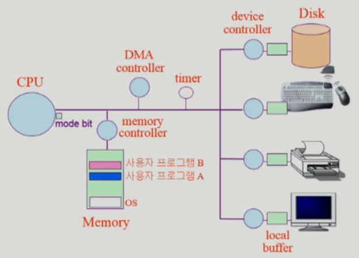

~~# 컴퓨터시스템의 구조

## 운영체제의 분류

크게 동시 작업 가능 여부, 사용자의 수, 처리 방식으로 나눌 수 있음

### 동시 작업 가능 여부

- **단일 작업(Single Tasking)**  
  한 번에 하나의 작업만 처리함  
  초창기 운영체제의 구조
- **다중 작업(Multi Tasking)**  
  동시에 두 개 이상의 작업 처리

### 사용자의 수

- **단일 사용자(Single User)**  
  혼자만 사용할 수 있는 운영체제  
  ex) MS-DOS, MS Windows
- **다중 사용자(Multi User)**  
  한 대의 컴퓨터에 여러 사용자가 터미널 형태로 접속할 수 있는 것  
  다중 작업에 더해 권한 문제도 생길 수 있음  
  ex) UNIX, NT Server

### 처리 방식

- **일괄 처리(Batch Process)**  
  작업을 편한대로 일정량 모아서 **한꺼번에 처리**하는 것  
  작업이 완전히 종료될 때까지 기다려야 함
- **시분할(Time Sharing)**  
  여러 작업을 수행할 때 컴퓨터 처리 능력을 **일정한 시간 단위로 분할**하여 사용  
  **짧은 응답 시간**을 가짐
- **실시간(Realtime OS)**  
  **정해진 시간 안에 어떠한 일이 반드시 종료**됨이 보장되어야 함  
  ex) 원자로, 미사일 제어, 반도체 장비

## 컴퓨터 시스템 구조

  
운영체제가 메모리에 상주하며 실행되고 있음  
프로그램을 실행하면 해당 프로그램이 메모리에 올라가고 프로세스가 됨  
I/O 장치를 전담하는 작은 CPU 같은 `Device Controller` 가 있음  
각 `Device Controller`도 본인의 작업 공간이 필요하고 그것이 `Local buffer`  
사용자 프로그램의 잘못된 수행으로 다른 프로그램 및 운영 체제에 피해가 가지 않도록 하는 장치가 `Mode Bit`

> **Mode Bit란?**  
> Mode Bit를 통해 하드웨어적으로 두가지 모드 지원
> 1. **사용자 모드**  
     사용자 프로그램 수행
> 2. **모니터 모드**  
     OS 코드 수행  
     커널 모드, 시스템 모드 라고도 부름
>
> 보안을 해칠 수 있는 명령어는 모니터 모드에서만 수행 가능  
> Interrupt나 Exception 발생시 Mode Bit를 0으로 바꿈!

### 인터럽트

정상적인 실행 흐름을 중단시키고, 특정한 처리를 수행하기 위해 운영체제에 알리는 것  
인터럽트를 확인하기 위해 매 명령 `Interrupt Line`을 확인함!  
인터럽트가 들어오면 레지스터와 프로그램 카운터를 저장 후 CPU의 제어를 인터럽트 처리 루틴에 넘김

- **타이머 인터럽트**  
  한번 프로세스에 CPU를 넘겨주면 다시 직졉 가져올 수 없음  
  특정 시간이 지나면 다시 운영체제에게 제어권이 넘어가도록 인터럽트를 발생시키는 장치가 `Timer`  
  타이머 인터럽트를 기반으로 프로세스 스케줄링, 시간 기반 이벤트 처리를 진행함

크게 하드웨어 인터럽트, 소프트웨어 인터럽트가 있으며 주로 인터럽트라 하면 하드웨어 인터럽트를 의미함  
소프트웨어 인터럽트는 `Trap`이라고 지칭함

### 시스템 콜

이것 또한 인터럽트임!  
일반 어플리케이션이 운영체제의 기능을 이용하기 위해 커널 함수를 호출하는 것  
대표적으로 I/O 작업은 프로그램이 직접 할 수 없기 때문에 시스템 콜을 통해 요청함

## 동기식 입출력과 비동기식 입출력

- 동기식 입출력(Synchronous I/O)  
  I/O 요청 후 입출력 작업이 완료되어야 제어가 프로그램에 넘어감
- 비동기식 입출력(Asynchronous I/O)  
  I/O 시작 후 입출력 작업이 끝나기를 기다리지 않고 즉시 제어가 넘어감

두 방법 모두 작업의 완료를 인터럽트로 알려주게 됨

## DMA

빠른 입출력 장치를 메모리에 가까운 속도로 처리하기 위해 사용
