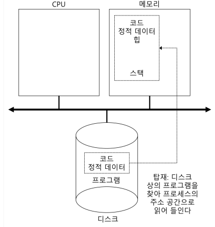
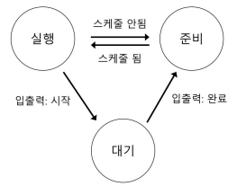
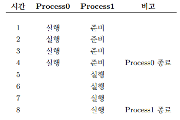
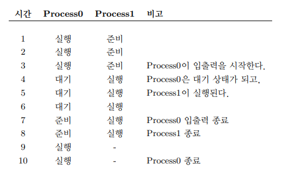

# 프로세스 관리

프로그램 자체는 디스크 상에 존재하며 **실행을 위한 명령어와 정적 데이터**의 묶음  
이 묶음을 읽고 실행하여 프로그램을 실행하는 것이 운영체제의 역할

## 프로세스

**프로세스(Process)** 는 실행 중인 프로그램  
프로세스의 하드웨어 상태 중 가장 중요한 구성 요소는 **메모리**  
명령어와 실행 프로그램이 읽고 쓰는 데이터는 메모리에 저장됨

**레지스터** 또한 프로세서의 하드웨어 상태를 구성하는 요소  
전에 배웠듯이 PC는 어느 명령어를 실행 중인지 알려줌

### 프로세스 생성

프로그램이 어떻게 프로세스로 변형되는지 알아보자

1. 프로그램 코드와 정적 데이터를 **메모리, 프로세스의 주소 공간에 탑재(Load)** 함  
   프로그램은 디스크 또는 SSD에 실행 파일 형식으로 존재하며, 운영체제는 해당 바이트를 읽어 메모리에 저장해야 함  
   초기에는 프로그램 실행 전 코드와 데이터를 모두 메모리에 넣었지만, 현대에는 이 작업을 늦추며 페이징(Paging)과 스와핑(Swapping) 개념이 생김
2. 프로세스를 실행시키기 전 일정량의 메모리가 프로그램의 **실행시간 스택(Runtime-Stack) 용도로 할당**함  
   main() 함수의 인자인 argc, argv 벡터를 사용해 초기화 함
3. 프로그램의 힙(Heap)을 위한 메모리 영역을 할당함  
   malloc()을 호출하여 **필요한 공간을 요청**하고, free()를 호출하여 **사용했던 공간을 반환**함
4. 이제 main() 루틴으로 분기함으로써, 운영체제는 **CPU를 새로 생성된 프로세스에게 넘김**

### 프로세스 상태

프로세스 상태를 단순화하면 크게 3가지로 나눠짐  

1. **실행(Running)**  
   프로세스가 **프로세서에서 실행 중**  
   즉, 명령어를 실행하고 있음
2. **준비(Ready)**  
   실행할 준비가 되어 있지만 다른 프로세스를 실행하고 있는 등의 이유로 **대기 중**
3. **대기(Blocked)**  
   다른 사건을 기다리는 동안 **프로세스의 수행을 중단**시키는 연산  
   ex) I/O 요청을 한 후 대기 상태가 됨

CPU만 사용하는 간단한 예시를 보면 아래와 같이 진행됨  
  
첫 번째 프로세스가 실행된 후 종료됨  
이후 다른 프로세스에게 실행 기회를 넘김

여기서 입출력이 생기면 더 복잡해짐  
  
첫 번째 프로세스가 어느 정도 실행한 후 입출력을 요청함  
그 순간 프로세스가 대기 상태가 되고 다른 프로세스에게 실행 기회를 넘김

이 간단한 예시에서 조차 운영체제는 할일이 많음  
우선, Process0이 입출력 요청 시 Process1의 실행 여부를 결정함  
이후 Process0의 입출력이 완료되었지만, Process1을 마저 실행함  
이러한 결정은 스케줄러에 따라 결정

> **프로세스 제어 블럭(PCB, Process Control Block)**  
> 프로세스의 관리를 위한 정보를 저장하는 자료 구조  ㅡㅁ
> 다수의 프로그램을 동시에 실행할 수 있도록 이 자료 구조를 이용해 실행 중인 프로그램을 관리함

ㅇㄹ
