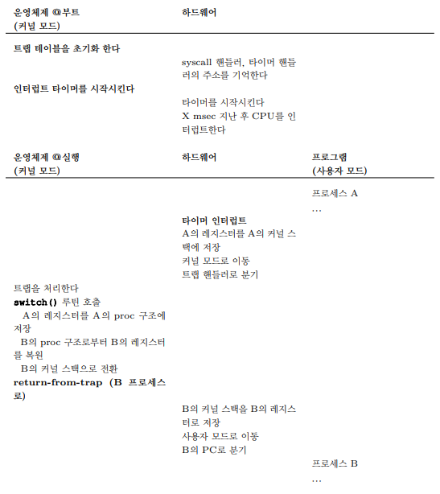
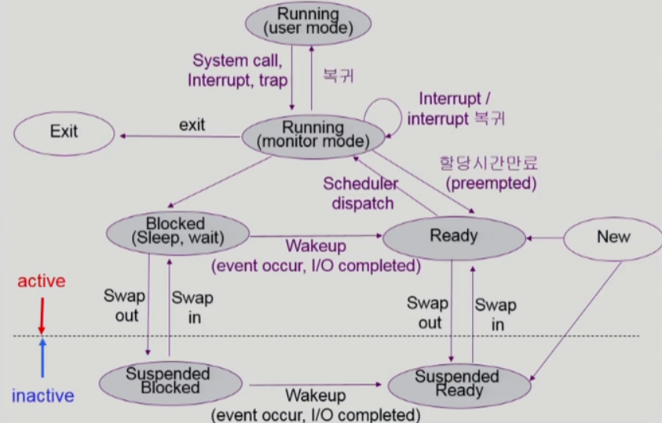

# 프로세스 관리

프로그램 자체는 디스크 상에 존재하며 **실행을 위한 명령어와 정적 데이터**의 묶음  
이 묶음을 읽고 실행하여 프로그램을 실행하는 것이 운영체제의 역할

## 프로세스

**프로세스(Process)** 는 실행 중인 프로그램

> **프로세스 제어 블럭(PCB, Process Control Block)**  
> 프로세스의 관리를 위한 정보를 저장하는 자료 구조  
> 다수의 프로그램을 동시에 실행할 수 있도록 이 자료 구조를 이용해 실행 중인 프로그램을 관리함  
> **레지스터, 프로그램 카운터, 메모리 위치 정보** 등을 저장

프로세스의 하드웨어 상태 중 가장 중요한 구성 요소는 **메모리**  
명령어와 실행 프로그램이 읽고 쓰는 데이터는 메모리에 저장됨

**레지스터** 또한 프로세서의 하드웨어 상태를 구성하는 요소  
전에 배웠듯이 PC는 어느 명령어를 실행 중인지 알려줌

이러한 프로세스의 상태, 메모리, PCB, 커널 스택을 합쳐 **프로세스의 문맥(context)** 이라고 함

### 프로세스 생성

프로그램이 어떻게 프로세스로 변형되는지 알아보자

1. 프로그램 코드와 정적 데이터를 **메모리, 프로세스의 주소 공간에 탑재(Load)** 함  
   프로그램은 디스크 또는 SSD에 실행 파일 형식으로 존재하며, 운영체제는 해당 바이트를 읽어 메모리에 저장해야 함  
   초기에는 프로그램 실행 전 코드와 데이터를 모두 메모리에 넣었지만, 현대에는 이 작업을 늦추며 페이징(Paging)과 스와핑(Swapping) 개념이 생김
2. 프로세스를 실행시키기 전 일정량의 메모리가 프로그램의 **실행시간 스택(Runtime-Stack) 용도로 할당**함  
   main() 함수의 인자인 argc, argv 벡터를 사용해 초기화 함
3. 프로그램의 힙(Heap)을 위한 메모리 영역을 할당함  
   malloc()을 호출하여 **필요한 공간을 요청**하고, free()를 호출하여 **사용했던 공간을 반환**함
4. 이제 main() 루틴으로 분기함으로써, 운영체제는 **CPU를 새로 생성된 프로세스에게 넘김**

### 프로세스 상태

프로세스 상태를 단순화하면 크게 3가지로 나눠짐  

1. **실행(Running)**  
   프로세스가 **프로세서에서 실행 중**  
   즉, 명령어를 실행하고 있음
2. **준비(Ready)**  
   실행할 준비가 되어 있지만 다른 프로세스를 실행하고 있는 등의 이유로 **대기 중**
3. **대기(Blocked)**  
   다른 사건을 기다리는 동안 **프로세스의 수행을 중단**시키는 연산  
   ex) I/O 요청을 한 후 대기 상태가 됨

CPU만 사용하는 간단한 예시를 보면 아래와 같이 진행됨  
  
첫 번째 프로세스가 실행된 후 종료됨  
이후 다른 프로세스에게 실행 기회를 넘김

여기서 입출력이 생기면 더 복잡해짐  
  
첫 번째 프로세스가 어느 정도 실행한 후 입출력을 요청함  
그 순간 프로세스가 대기 상태가 되고 다른 프로세스에게 실행 기회를 넘김

이 간단한 예시에서 조차 운영체제는 할일이 많음  
우선, Process0이 입출력 요청 시 Process1의 실행 여부를 결정함  
이후 Process0의 입출력이 완료되었지만, Process1을 마저 실행함  
이러한 결정은 스케줄러에 따라 결정

## 문맥 교환

스케줄러의 결정으로 CPU가 한 프로세스에서 다른 프로세스로 넘겨주는 과정을 **문맥 교환(Context Switch)** 이라고 함

현재 실행 중인 프로세스의 **레지스터 값을 커널 스택 같은 곳에 저장**하고, 곧 실행될 프로세스의 **커널 스택으로부터 레지스터 값을 복원** 하는 것  
이 작업 후 마지막으로 `return-from-trap` 명령어가 실행되며 다른 프로세스로 리턴하여 실행을 다시 이어감

프로세스 A에서 프로세스 B로 변경하는 간단한 예시를 보자  

1. 타이머 인터럽트 혹은 I/O 요청 시스템 콜이 발생하면 A의 레지스터는 A의 커널 스택에 저장함
2. 커널 모드로 이동 및 트랩 핸들러로 분기
3. 트랩을 처리함
4. switch() 루틴 호출
    1. A의 레지스터를 A의 프로세스 구조체에 저장
    2. B의 레지스터 구조체에서 B의 레지스터 복원
    3. B 커널 스택으로 스택 포인터를 바꿈
5. `return-from-trap` 수행
6. B의 커널 스택을 B의 레지스터로 저장
7. 사용자 모드로 이동
8. B의 PC로 분기
9. 문맥 교환 완료

## 스케줄러

### 스케줄링을 위한 큐

- Job Queue  
  현재 시스템 내에 있는 **모든 프로세스**의 집합
- Ready Queue  
  메모리 내에 있으면서 **CPU를 기다리는 프로세스**의 집합
- Device Queues  
  **입출력 장치 처리를 기다리는 프로세스**의 집합

  
마치 Java Linked List 구조체와 같이 head, tail이 있고, 그 내부 node로 PCB를 가지고 있는 형식

### 스케줄러(Scheduler)

여기서 나오는 스케줄러는 **운영체제에서 스케줄링을 하는 코드**를 의미함

- **장기 스케줄러(Long-term Scheduler, Job Scheduler)**  
  시작 프로세스 중 어떤 것을 `ready queue`로 보낼지 결정함  
    
  위와 같이 처음에 프로세스를 시작시키는 역할  
  **시분할 시스템에는 보통 없음**
- **단기 스케줄러(Short-term Scheduler, CPU Scheduler)**  
  어떤 프로세스를 다음에 `running` 상태로 변경할지 결정함  
  프로세스에게 CPU를 부여함  
  속도가 충분히 빨라야 함
- **중기 스케줄러(Medium-term Scheduler, Swapper)**  
  여유공간 마련을 위해 **프로세스를 통째로 메모리에서 디스크로 쫒아냄**  
  이 쫒아낸 상태를 `Suspended`라고 함

> **Suspended**  
> 외부적인 이유로 프로세스의 수행이 정지된 상태  
> 프로세스가 통째로 디스크에 swap out 됨  
> ex) 사용자가 프로그램을 일시 정지, 운영 체제가 프로세스를 잠시 중단시킴  
> Blocked는 자신이 요청한 event가 만족되면 ready이고, Suspended는 외부에서 다시 resume해야 active

`Suspended`까지 반영한 자세한 프로세스 상태도를 보면 아래와 같음  

## 쓰레드

CPU 수행 단위를 **쓰레드(Thread)** 라고 부름  
프로세스와 매우 유사하지만 쓰레드들은 **주소 공간을 공유**하기 때문에 동일한 값에 접근할 수 있음  

쓰레드의 상태는 프로세스의 상태와 매우 유사함  
프로그램 카운터, 연산을 위한 레지스터를 가지고 있음  
2개의 쓰레드가 하나의 프로세서에서 실행 중이라면 쓰레드 또한 `context switch`를 통해 교체해야 함  
이로 인해 PCB와 유사한 쓰레드 제어 블럭(TCB, Thread Control Block)가 필요함

### 프로세서와의 차이

1. 주소 공간  
   프로세스와 달리 문맥 교환 과정에서 주소 공간을 그대로 사용하면 됨  
   즉, 사용하고 있던 페이지 테이블을 그대로 사용하면 됨
2. 스택  
   기존 프로세스 주소 공간 모델에는 스택이 하나만 존재하며, 주로 주소 공간 하부에 위치함  
   반면에 멀티 쓰레드 프로세스의 경우 각 쓰레드가 독립적으로 실행되며, 여러 루틴들을 호출할 수 있음  
   그로 인해 주소 공간에는 **쓰레드마다 스택이 할당**됨  
     
   이전만큼 깔끔하지는 않지만, 스택의 크기가 작아도 되기에 대부분 문제가 생기지 않음

### 장점

1. 다중 스레드로 구성된 구조의 경우 하나의 서버 스레드가 `blocked` 상태인 동안 다른 스레드가 `running` 상태로 빠른 처리가 가능함  
   즉, 응답성이 빠름
2. 동일한 일을 수행하는 여러 스레드가 협력해 성능 향상을 얻음
3. 병렬성을 높일 수 있음
4. 자원 공유로 인해 효율성 상승

