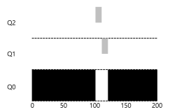

# CPU 스케줄링

> **스케줄링 평가 항목**  
> 반환시간(Turnaround Time), 공정성(Fairness)  
> 이 둘은 서로 상반되는 목표임
> - **반환 시간**  
    작업이 완료된 시간 - 작업이 시스템에 도착한 시간
>
> 또한 시작할 때 아래와 같은 가정을 하고 점점 완화할 것
> 1. 모든 작업은 같은 시간동안 실행
> 2. 모든 작업은 동시에 도착
> 3. 각 작업은 시작되면 완료될 때까지 실행
> 4. 모든 작업은 CPU만 사용
> 5. 각 작업 실행 시간은 사전에 알 수 있음

## 선입선출

**선입선출(FIFO, First In First Out)** 과 선도착선치(FCFS, First Come First Served)는 동치어  
  
그냥 단순하게 **먼저 도착한 작업을 먼저 처리**하는 방식

단순하고 구현하기 쉽지만, 작업 시간에 따라 `Convoy Effect`가 발생할 수 있음
> **Convoy Effect란?**  
> 사용시간이 짧은 프로세스들이 사용시간이 긴 프로세스에 의해 오래 기다리는 현상  
>   
> 벌써 반환시간이 구릴거같이 생겼음

## 최단 작업 우선

`Convoy Effect`를 해결하기 위해 나온 방법  
**최단 작업 우선(SJF, Shortest Job First)**  
스케줄링 이름 그대로 **짧은 작업부터 처리**함  
  
FIFO에 비해 반환 시간을 절반 이상 감소시킨 모습

하지만 현실은 호락호락하지 않음  
지금은 모든 작업이 동시에 도착함을 가정하고 있음  
만약 A가 t = 0에 도착하고, 나머지가 t = 10에 도착한다면?  
  
결국 똑같은 문제가 또 발생함  
**비선점(non-preemptive) 스케줄러**라 발생하는 문제!

## 최단 잔여시간 우선

이제 선점형 스케줄러로 변경함  
**최단 잔여시간 우선(STCF, Shortest Time-to-Completion First)**  
언제든 새로운 작업이 들어오면 잔여 실행 시간을 계산해 **가장 적은 잔여 실행 시간을 가진 작업을 우선**함  
  
위의 문제가 또 해결됨  
언제 어떤 작업이 들어오던 STCF라면 최적의 반환시간을 내줄 것!

### 그러면 STCF가 제일 좋은 스케줄링인가?

만약 **작업 길이를 미리 알고, 작업이 CPU만 사용하며, 평가 기준이 반환시간**이라면 좋은 스케줄링  
하지만, `시분할 컴퓨터`의 등장으로 많은 것이 바뀜
> **시분할(Time-sharing) 컴퓨터**  
> 여러 프로세스가 사용하는 시스템에서 컴퓨터가 자원을 시간적으로 분할하여 모두 독립된 컴퓨터를 사용하는 느낌을 주는 것

이로 인해 새로운 평가 기준이 생김

- **응답 시간(Response Time)**  
  작업이 스케줄 된 시간 - 작업이 시스템에 도착한 시간

## 라운드 로빈

응답 시간을 해결하기 위해 나옴  
**라운드 로빈(RR, Round-Robin)**  
작업을 **일정 시간 실행한 후 큐의 다음 작업**으로 넘어감  
  
이 일정 시간을 타임 슬라이스(Time Slice) 혹은 스케줄링 퀀텀(Scheduling Quantum)이라 함

타임 슬라이스가 짧을수록 응답 시간이 좋아지지만, 너무 짧아지면 문맥 교환 비용이 커지게 됨

## 멀티 레벨 피드백 큐

**멀티 레벨 피드백 큐(MLFQ, Multi-Level Feedback Queue)**

크게 2가지 문제를 해결하고자 만들어짐

1. **짧은 작업을 먼저 실행시켜 반환 시간을 최적화**  
   SJF나 STCF의 경우 작업 **실행 시간을 미리 알 수 없기에** 불가능했음
2. **대화형 사용자를 위해 응답시간 최적화**  
   RR과 같은 알고리즘의 경우 응답시간은 단축시키지만 **반환 시간이 좋지 않음**

### 기본 규칙

**여러 개의 큐**로 구성되며, 각각 **다른 우선순위**를 배정받음  
하나의 큐에 둘 이상의 작업이 존재할 수 있으며, 이들은 모두 같은 우선 순위를 가짐  
이 작업들 간에는 **RR 알고리즘**이 사용됨

MLFQ의 핵심은 **우선순위**  
각 작업에 고정된 우선순위를 부여하지 않고 **작업의 특성에 따라 동적으로 우선순위를 부여**함

> **기본 규칙**
> 1. A의 우선순위가 B보다 높으면 A 실행
> 2. A의 우선순위가 B와 같으면 RR 방식으로 실행
> 3. 작업이 시스템에 진입하면 가장 높은 우선순위 부여
> 4. 주어진 타임 슬라이스를 모두 사용하면 우선순위가 낮아짐. 반대의 경우 우선순위 유지

오래 실행되는 CPU 위주의 작업 A와 짧은 대화형 작업 B가 있다고 가정하자  
  
규칙 3번에 의해 처음 작업이 시스템에 진입하면 가장 높은 우선순위가 부여되면서 먼저 실행되게 됨  
즉, **짧은 작업이라고 가정**하는 것  
만약 진짜 짧은 작업일 경우 빨리 실행되고 종료될 것이며,
짧은 작업이 아니라면 점점 우선순위가 낮아지며 긴 배치형 작업처럼 동작함  
이렇게 **SJF를 근사**할 수 있음

이때 단순하게 4번까지의 규칙만 적용한다면 3개의 문제가 발생할 수 있음

1. 기아 상태  
     
   시스템에 너무 많은 대화형 작업이 진입한다면 항상 높은 우선순위에서 CPU를 독점하게 됨  
   결국, 긴 시간동안 CPU 시간을 할당받지 못하고 **기아 상태(starvation)가 발생**함

2. 스케줄러 악용  
   또한, 프로그램 작성자가 스케줄러를 속여 타임 슬라이스가 끝나기 직전 아무 입출력 요청을 내리도록 설정하면
   **계속해서 같은 큐**에 머물러 CPU를 거의 독점할 수 있게 됨

3. 프로그램 특성 변경  
   CPU 위주의 작업이 시간이 흐름에 따라 대화형 작업으로 바뀔 수도 있음  
   현재 방식으로는 다른 대화형 작업과 같은 대우를 받을 수 없게됨

여기서 1, 3번 문제들을 방지하기 위해 규칙이 하나 추가됨
> 일정 시간이 지나면 모든 작업을 최상위 큐로 이동

  
단순히 주기적으로 모든 작업을 최상위 큐로 이동하는 것만으로 문제 2개가 해결됨

마지막으로 이제 2번 문제를 해결하기 위해 4번 규칙을 보완하게 됨
> 주어진 시간 할당량을 소진하면, 우선 순위가 낮아짐

각 단계에서 CPU 총 사용 시간을 측정하여 정확히 타임 슬라이스가 아닌 타임 슬라이스에 해당하는 시간을 모두 소진하면 강등당하는 것  
  
내성이 없으면 왼쪽과 같이 타임 슬라이스 직전에 계속해서 양도해 CPU를 독점하지만, 규칙 보완으로 오른쪽과 같이 해결됨

> **규칙 총정리**
> 1. A의 우선순위가 B보다 높으면 A 실행
> 2. A의 우선순위가 B와 같으면 RR 방식으로 실행
> 3. 작업이 시스템에 진입하면 가장 높은 우선순위 부여
> 4. 주어진 시간 할당량을 소진하면, 우선 순위가 낮아짐. 반대의 경우 우선순위 유지
> 5. 일정 시간이 지나면 모든 작업을 최상위 큐로 이동