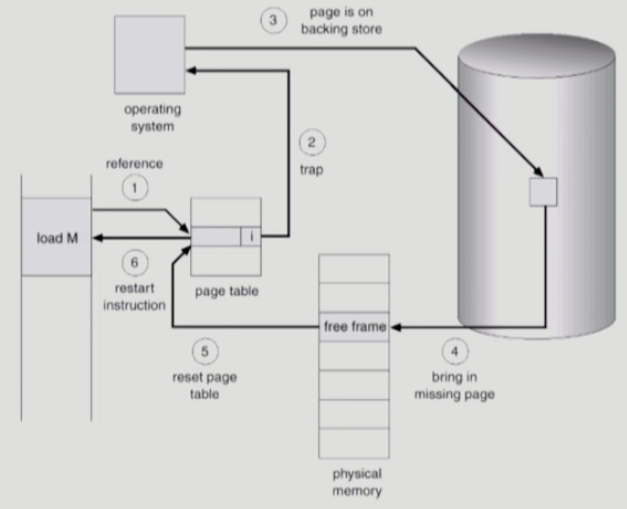
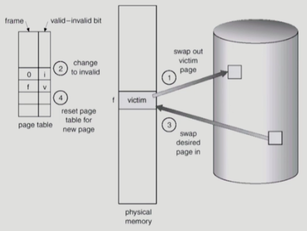
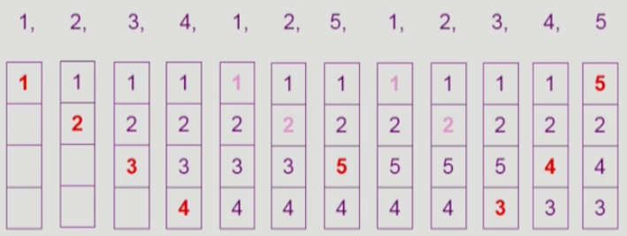
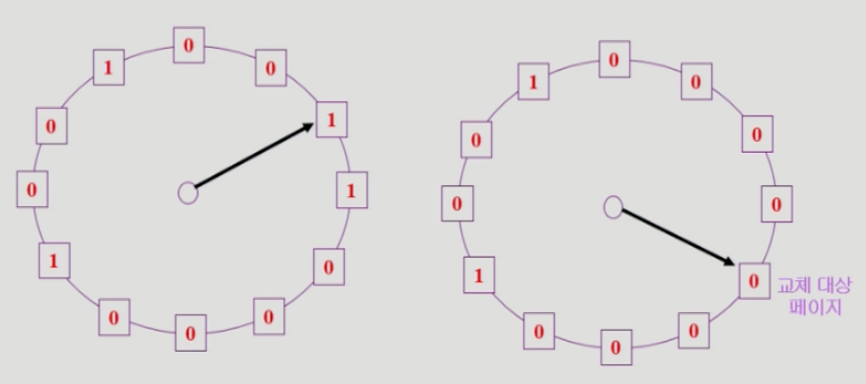
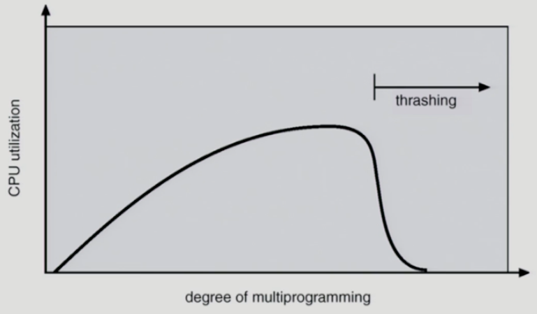

[페이징](페이징.md) 기법을 사용한다고 가정함  
실제로 거의 대부분 운영체제는 페이징을 사용함  
## Demand Paging
**필요한 페이지만 메모리**에 올리는 것  
이를 통해 I/O 양을 감소하고, 메모리 사용량을 감소하고, 빠른 응답시간을 가지려고 하는 것  
한정된 메모리 공간을 더 잘 사용하게 됨  

여기서 **valid/invalid bit**가 필요하게 됨  
invalid가 가지는 의미는 **사용 되지 않는 주소 영역**이거나 **페이지가 물리적 메모리에 없는 경우**를 말함  
처음에는 모든 페이지가 invalid이며, **invalid bit가 set 되어 있으면 page fault가 발생**했다고 함  
### Page Fault
page fault 발생 시 MMU가 트랩을 발생시킴  
이후 커널 모드로 들어가 page fault handler가 Invoke 됨  

이후 아래의 과정을 따라 처리함  
  
1. **잘못된 요청**인지 확인  
   잘못된 주소이거나 protection이 위반된 요청의 경우 거부함  
2. **빈 페이지 공간**을 가져옴  
   만약 없다면? 뺏음!
3. 해당 페이지를 **디스크에서 메모리로 읽어옴**  
   디스크 I/O가 끝나기 전까지 CPU가 block 당함  
   이후 읽기가 끝나면 bit를 valid로 변경 후 ready queue에 프로세스를 넣고 대기함  
4. 프로세스가 **다시 CPU를 잡고 실행**됨  
5. 중단된 명령 마저 실행  

이 page fault가 얼마나 나는지에 속도가 걸림  
발생을 최소화하기 위한 방법으로 **빈 페이지 공간을 어떻게 뺏을지** 잘 골라야 함  
  
가장 좋은 것은 곧바로 사용되지 않을 페이지를 쫒아내는 것  
### Replacement Algorithm
page-fault rate를 최소화하는 것이 목표  
우선 늘 그렇듯 비교하기 위해 가장 이상적인 알고리즘을 만들자
#### Optimal Algorithm
**가장 먼 미래에 참조되는 페이지를 교체**함  
구현하려면 **미래에 참조될 페이지를 모두 알고 있어야 함**  
실제로는 불가능하지만 성능 비교용 알고리즘  
#### FIFO(First In First Out) Algorithm
**가장 먼저 들어온 것**을 먼저 내쫒음  
딱봐도 구리고 뇌빼고 만든 것 같음  

심지어 Belady's Anomaly도 발생함  
페이지 프레임 수가 많아졌는데 page fault가 더 많이 발생할 가능성이 있음!!!!!  
> **Belady's Anomaly란?**  
> 캐시의 크기가 커짐에 따라 캐시 히트율이 더 좋아져야 하는데 그렇지 않은 현상  
> ex)    
>     
>     
> 캐시 크기가 커졌음에도 불구하고 page fault 횟수가 늘어남  
#### LRU(Least Recently Used) Algorithm
**가장 오래 전에 참조된 페이지**을 지움  
  
미래를 모르니 과거를 참조하는 것  
#### LFU(Least Frequently Used) Algorithm
**참조 횟수가 가장 적은 페이지**를 지움  
#### Clock Algorithm
LRU의 근사한 알고리즘  
이름이 second chance algorithm, NUR(Not Used Recently), NRU(Not Recently USed)로 여러개임  

reference bit를 사용해 교체 대상 페이지를 선정함  
  
**reference bit가 0인 것**을 찾을 때까지 포인터를 이동함  
그때 발견하는 1들은 모두 0으로 교체함  
**한 바퀴 되돌아와서도 0**이면 그 페이지는 교체당함  
만약 자주 사용되는 페이지라면 **한 바퀴 돌아도 1**일 것

**modified bit**라는 비트도 존재하는데 이는 페이지에 **쓰기까지 발생했을때 1로 변경**됨  
왜냐하면 이 페이지에서 I/O가 발생했다면 그 페이지를 쫒아낼 때 **그 내용을 반영**해줘야 하기 때문  

### 쓰레싱(Thrashing)
프로세스의 원할한 수행에 필요한 최소한의 page frame을 할당받지 못한 경우 발생  
  
page fault가 굉장히 자주 발생하며, CPU 사용량이 감소함  
CPU 사용률이 감소하니 운영체제는 프로그램을 더 메모리에 넣게 됨  
이후 악순환 발생  

이를 해결하기 위해 최소한의 page frame은 할당해야 함  