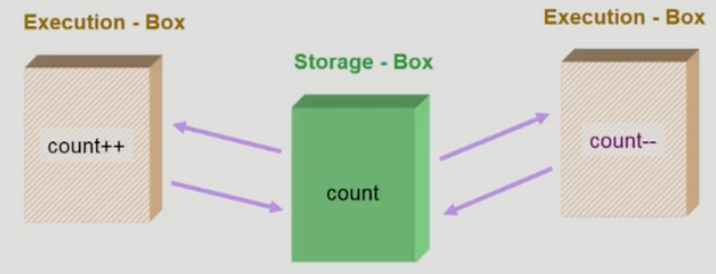
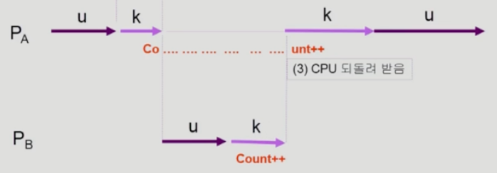
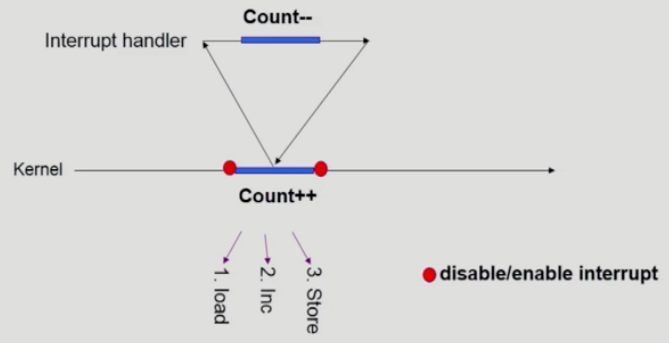
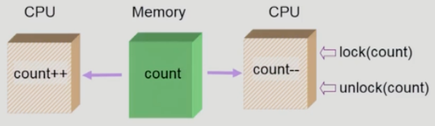

# 경쟁 조건

**공유 자원을 둘 이상의 쓰레드 혹은 프로세스가 읽거나 쓰면서 결과값이 의도와 달라질 수 있는 상황**

연산을 할떄는 항상 어디선가 데이터를 가져와 연산을 한 후 다시 그 위치에 가져다 놓는 방식으로 진행됨  
이때 **데이터를 가져오는 곳**을 `Storage-Box`라 하고, 그 데이터로 **연산을 진행하는 곳**을 `Execution-Box`라 칭함  
`S-Box`와 `E-Box`의 대표적인 예시로는 아래가 있음

1. 메모리와 CPU
2. 디스크와 컴퓨터 내부
3. 프로세스의 주소 공간과 프로세스

위 상황에서 만약 **하나의 Storage-Box를 공유하는 Execution-Box가 여럿**인 경우 문제가 발생함  

이러한 상황을 경쟁 조건 즉, `Race Condition`이라 함

사실 프로세스는 **서로 주소 공간을 공유하지 않기 때문에** 평범한 상황에서는 잘 발생하지 않음  
그렇다면 운영체제에서 어떤 상황에 발생할까?

1. **프로세스가 시스템 콜을 사용해 커널 모드로 수행 중 [문맥 교환](문맥%20교환.md) 발생**  
   두 프로세스 간 주소 공간은 데이터를 공유하지 않지만, 시스템 콜을 하는 동안은 **공유하는 커널 데이터를 접근**하게 됨  
   user mode에서는 상관 없지만 kernel mode에서 데이터를 읽은 후, 그 사이 인터럽트가 발생해 문제가 발생한 모습

   해결책은 간단함  
   **커널 모드 수행중에는 CPU를 선점하지 않는 것**  
   약간 공평하지 않지만 손쉽게 문제 해결 가능
2. **커널 수행 중 인터럽트 발생**  
   1번 문제는 단순히 `Context Switch`를 막으면 끝났지만, 인터럽트의 경우 조금 다름  
   
   인터럽트 처리 루틴 또한 커널 코드이므로 커널 주소 공간을 공유하며 억제할 수 없음

   이 또한 해결책은 간단함  
   그냥 **인터럽트를 비활성화** 시켜버림  
   물론 인터럽트는 중요한 일이지만 저 명령어 몇줄 하는동안 멈춰도 큰 문제 없다
3. **멀티프로세서에서 공유 메모리 내의 커널 데이터**  
   각자 자기 일 할때는 상관 없음  
   하지만 둘 다 시스템콜을 사용해 커널 모드로 들어가 커널 주소 공간을 건드린다면?  
   
   이건 위 상황보다 조금 더 머리가 아파짐  
   CPU 자체가 여러개이기 때문에 **인터럽트를 막더라도 다른 CPU에서 그 값을 못가져가는 것은 아님!!**

   가장 뇌빼기 해결방법은 **한번에 하나의 CPU만**이 커널에 들어갈 수 있게 함  
   그냥 보기만 해도 다른 CPU에서 오버헤드가 잔뜩 생길거같은 방법

   굳이 커널 자체에 못오게 하는 것이 아니라 그 데이터만 접근 못하면 되는 것 아닌가?  
   그래서 나온 방법이 **공유 데이터에 접근할 때 그 데이터에 [락](락.md)** 을 하는 방법