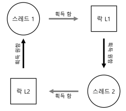

둘 이상의 프로세스 또는 쓰레드들이 **공유 자원을 획득하기 위해 서로 영원히 대기**하는 상황  

### 발생 조건
네가지 조건이 충족되어야 함
1. **상호 배제(Mutual Exclusion)**  
   쓰레드가 자신이 필요로 하는 자원에 대한 독자적인 제어권을 주장  
   ex) 락 획득
2. **점유 및 대기(Hold-and-wait)**  
   자신에게 할당된 자원을 점유한 채 다른 자원을 대기함
3. **비선점(No preemption)**  
   자원을 점유하고 있는 쓰레드로부터 강제로 빼앗을 수 없음
4. **순환/환형 대기(Circular wait)**  
   각 쓰레드는 하나 이상의 자원을 가지고 있는 쓰레드들과 순환 고리가 있음

### 예방
네 조건 중에 **하나라도 만족시키지 않는다면** 교착 상태는 발생하지 않는다는 점을 이용
- **순환 대기**  
  코드를 짤때 순환 대기가 발생하지 않도록 코드를 작성하는 것  
  가장 간단한 방법은 락 획득을 하는 **전체 순서(total ordering)** 를 정하면 됨
- **점유 및 대기**  
  원자적으로 모든 락을 단번에 획득하도록 하면 예방할 수 있음
- **비선점**
- **상호 배제**
### 회피
교착 상태를 예방하는 대신 회피하는 것이 더 유용할 때가 있음  
실행 중인 여러 쓰레드가 **어떤 락을 획득하게 될 것인지에 대해 전반적으로 파악**하고 있어야 하며 그것을 바탕으로 쓰레드들을 스케줄링하여 교착 상태가 발생하지 않도록 그때그때 보장함  
유명한 예로 Dijkstra의 은행원 알고리즘 (Banker’ s Algorithm)이 있음
### 발견 및 복구
교착 상태 발생을 허용하고, **교착 상태를 발견하면 복구**하는 방법  
운영체제가 일 년에 한 번 멈춘다고 했을 때 재부팅을 하고 다시 작업을 처리하는 식  
교착 상태 발견은 주기적으로 실행되며 자원 할당 그래프를 그려서 사이클이 생겼는지를 검사함  