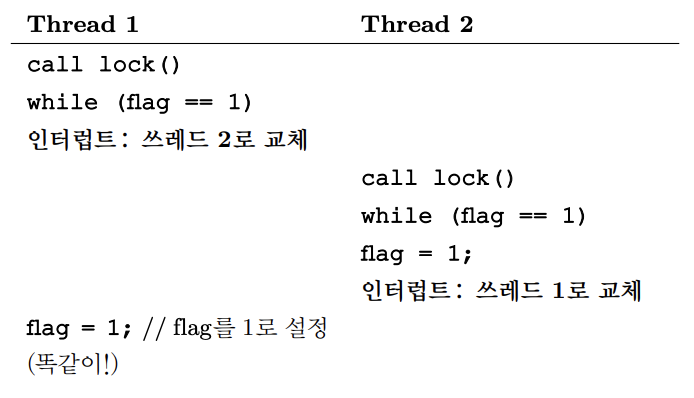

# 락
여러 개의 명령어를 원자적으로 실행하고 싶지만 단일 프로세서의 인터럽트로 인해 불가능했기에 생긴 개념  
소스 코드의 **임계 영역을 락(lock)으로 둘러** 그 임계 영역이 마치 **하나의 원자 단위 명령어**인 것처럼 실행되도록 함

## 기본 개념
공유 변수 `balance`에 1을 추가하는 간단한 임계 영역이 있다고 가정  
여기서 락을 사용하면 아래와 같이 사용할 수 있음
```c
lock_t mutex;
...
lock(&mutex);
balance = balance + 1;
unlock(&mutex);
```
락은 결국 하나의 변수이므로 사용하기 위해서는 위 `mutex`와 같이 먼저 선언해야 함  
락 변수는 락의 상태를 나타내며, 크게 2개의 상태가 있음
1. **사용 가능(available)**  
   어느 [쓰레드](쓰레드.md)도 락을 가지고 있지 않음
2. **사용 중(acquired)**  
   임계 영역에서 정확히 하나의 쓰레드가 락을 획득함  
   이 락 자료 구조에는 락을 보유한 쓰레드에 대한 정보나 락을 대기하는 쓰레드의 정보도 저장할 수 있음  
   `lock()`과 `unlock()`루틴은 간단함  
   `lock()`을 통해 락 획득을 시도한 후 아무도 락을 가지고 있지 않으면 락을 획득하여 임계 영역으로 진입하고, 이미 락을 보유한 쓰레드가 존재한다면 `lock()`함수가 리턴하지 않음  
   락을 획득하고 임계 영역으로 진입한 쓰레드를 **락 소유자(owner)** 라 부름  
   락 소유자가 `unlock()`을 호출하면 대기중이던 쓰레드가 락의 상태가 변경됨을 인지하고 임계 영역 내로 진입하게 됨

## Pthread 락
쓰레드 간 **상호 배제(Mutual Exclusion)** 기능을 제공하기 때문에 POSIX 라이브러리는 이 락을 `mutex`라 부름  
아래와 같은 코드를 발견하면 위에서 언급한 코드와 같은 역할을 함
```c
pthread_mutex_t lock = PTHREAD_MUTEX_INITIALIZER;

Pthread_mutex_lock(&lock);
balance = balance + 1;
Pthread_mutex_unlock(&lock);
```
다른 변수를 보호하기 위해 다른 락을 사용할 수도 있으므로 변수 명을 지정해 `lock()`과 `unlock()`에 전달하고 있는 모습

## 락 구현
### 락 평가 기준
락의 목표를 이해하고 효율을 어떻게 평가할지 정해야 함
1. 상호 배제 지원
   가장 기본적인 역할
2. 공정성(fairness), 유한 대기(Bounded Waiting)
   락 획득에 대한 공정한 기회가 주어지고, 기아 현상이 발생하는지 확인
3. 성능(performance), 진행(Progress)
   락 사용 시간적 오버헤드를 평가해야 함  
   더 자세히는 경쟁이 전혀 없는 경우와 경쟁이 있는 경우를 나눠서 평가해야 함

### 인터럽트 제어
단일 프로세스 시스템에서 사용된 방법  
말 그대로 임계 영역 내에서는 인터럽트를 비활성화 함
```c
void lock() {
	DisableInterrupts();
}
void unlock() {
	EnableInterrupts();
}
```
#### 장점
1. **단순함**  
   당연히 단일 프로세서에서 인터럽트가 발생하지 않는다면 누군가 끼어들 수 없음
#### 단점
1. **쓰레드에게 특권 부여**  
   쓰레드가 **인터럽트를 활성화/비활성화하는 특권(priviledged) 연산을 허가**해야 함  
   악의적인 프로그램이 시작과 동시에 `lock()`을 걸어 프로세서를 독점하거나, 무한 반복문에 들어가 시스템을 마비시킬 수 있음  
   이런 경우 운영체제는 시스템의 제어권을 다시 얻을 수 없음
2. **멀티프로세서 적용 불가**  
   특정 프로세서에서의 인터럽트 비활성화는 다른 프로세서에 영향을 주지 않음  
   이제는 멀티 프로세서가 훨씬 흔하기 때문에 의미 없음
3. **중요한 인터럽트를 놓칠 수 있음**  
   CPU가 읽기 요청을 마치고 인터럽트를 보내 프로세스를 깨워야하는데 이를 놓친다면 이 프로세스는 깨지 못함
4. **비효율적**  
   일반적인 명령어에 비해 인터럽트를 비활성화시키는 코드는 최신 CPU에서 느리게 작동함
### Peterson의 알고리즘
처음 운영체제의 지원을 받지 않고 `load`와 `store` 명령어만 사용하여 Dekker의 알고리즘이 만들어짐  
이후 Peterson이 그 방법을 개선함
```c
int flag[2];
int turn;

void init() {
	flag[0] = flag[1] = 0;
	turn = 0;
}

void lock() {
	flag[self] = 1;
	turn = 1 - self;
	while ((Flag[1-self] == 1) && (turn == 1 - self))
		;
}

void unlock() {
	flag[self] = 0;
}
```
`turn`만 사용하면 임계 영역에 진입하지 않을 프로세스도 사용해야 하고, `flag`만 사용하면 둘이 동시에 `flag`를 들고 무한히 기다리는 현상이 발생함  
그 단점들을 개선하고자 만들어진 방법  
사용하고자 할때 우선 **`flag`를 1로 만든 후 본인의 `turn`이 오기 전까지 기다림**

하지만 하드웨어 지원 없이 락을 구현하는 이러한 접근은 **하드웨어로부터 약간의 지원을 받으면 훨씬 쉽게 해결**할 수 있다는 것을 알게 된 후로 필요 없어짐  
초창기 멀티프로세서 시절부터 하드웨어가 지원하며, 최근 하드웨어에서는 메모리 모델 변경으로 사용할 수도 없기 때문에 역사의 뒤안길로 사라짐
### Test-And-Set
멀티프로세서에서 위 방법이 의미가 없어 락 지원을 위한 하드웨어를 설계하기 시작  
이후 가장 기본적으로 나온 방법으로 **Test-And-Set** 명령어 또는 **원자적 교체(Atomic Exchange)**라 불림

간단한 예제를 보자
```c
typedef struct __lock_t {
	int flag;
} lock_t;

void lock(lock_t *mutex) {
	while (mutex->flag == 1)
	;
	mutex->flag = 1;
}

void unlock(lock_t *mutex) {
	mutex->flag = 0;
}
```
아이디어는 간단함  
`flag`라는 변수를 사용해 **쓰레드가 락을 획득**하였는지 나타냄  
첫 쓰레드가 `lock()`을 호출해 플래그가 **1인지 검사**(test)하고, 플래그 값을 **1로 설정**(set)하여 이 쓰레드가 **락을 보유**(hold)함을 나타냄  
만약 다른 쓰레드가 임계 영역 내에 있을 때 다른 쓰레드가 `lock()`을 호출하면 while문으로 **spin-wait** 하며 프래그를 초기화하기를 기다림


여기에는 두가지 문제가 있음
1. **정확성**  
   병행 프로그래밍을 생각해보면 답이 나옴  
     
   도중에 **인터럽트가 발생**해 `flag`가 0인 상태로 두 쓰레드 모두 값을 가져가면 임계 영역에 두 쓰레드 모두 접근할 수 있게 됨
2. **성능**  
   사용 중인 락을 대기하는 방법인 spin-wait는 플래그의 값을 무한히 검사함  
   이는 문맥 교환이 있기 전까지 락을 소유한 쓰레드조차 실행할 수 없기 때문에 매우 손해가 큼

### 스핀 락
위 예제의 [Test-And-Set](#Test-And-Set)은 하드웨어 지원 없이는 동작이 불가능함  
이 개념에 근간해 시스템에서 락 구현을 위한 명령어를 제공함

Test-And-Set의 동작을 c언어로 작성하면 아래와 같음
```c
int TestAndSet(int *old_ptr, int new) {
	int old = *old_ptr;
	*old_ptr = new;
	return old;
}
```
`ptr`이 가리키고 있던 예전 값을 반환하고, 동시에 `new`에 새로운 값을 저장함  
핵심은 이 동작들이 **원자적으로 수행**된다는 것

이 강력해진 명령어만으로 간단한 **스핀 락(Spin Lock)** 을 만들 수 있음
```c
typedef struct __lock_t {
	int flag;
} lock_t;

void init(lock_t *lock) {
	lock->flag = 0;
}

void lock(lock_t *lock) {
	while (TestAndSet(&lock->flag, 1) == 1)
	;
}

void unlock(lock_t *lock) {
	lock->flag = 0;
}
```
처음 쓰레드가 `lock()`을 호출하면 `TestAndSet(flag, 1)`이 0을 반환함  
이후 해당 쓰레드가 락을 획득하게 됨  
그 상태로 다음 쓰레드가 `lock()`을 호출하여 `TestAndSet(flag, 1)`을 실행하면 `flag`의 값인 1을 반환하는 동시에 다시 1로 설정함  
락을 보유하고 있는 쓰레드가 `flag`를 0으로 설정하는 순간, 대기중인 쓰레드가 0을 반환받으며 다시 `flag`를 1로 변경함

이는 가장 기초적인 형태의 락으로, 락을 획득할 때까지 CPU 사이클을 소모하며 회전(spin)함  
이렇게 계속 CPU와 메모리를 사용하며 기다리는 것을 **Busy Waiting**이라 부름  
이 방식을 제대로 사용하기 위해서는 **선점형 스케줄러**를 사용하여야 함  
선점형이 아니면, while문을 회전하며 대**기하는 쓰레드가 영원히 CPU를 독점**할 것

#### 평가
이제 스핀 락을 [락 평가 기준](#락%20평가%20기준)으로 평가해보자
1. **상호 배제 지원**  
   임의의 시간에 **단 하나의 쓰레드만이 임계 영역에 진입**할 수 있도록 하므로 제대로 동작함
2. **공정성**  
   어떠한 공정성도 **보장해 줄 수 없음**  
   심지어 while문을 회전 중인 쓰레드가 영원히 그 상태에 남아 **기아 상태**가 될 수 있음
3. **성능**  
   단일 CPU의 경우 성능 오버헤드가 상당히 큼  
   락을 가지고 있는 쓰레드가 선점된 경우, 나머지 락을 획득하려고 하는 모든 쓰레드를 하나씩 깨우며 작동하게 됨  
   반면 쓰레드의 개수와 CPU의 개수가 비슷하다면 꽤 합리적임  
   락을 획득하기 위해 while문을 실행하는 것이 사이클을 낭비하지 않기 때문
### Compare-And-Swap
SPARC에서는 Compare-And-Swap, x86에서는 Compare-And-Exchange라 불림  
의사코드를 보면 아래와 같음
```c
int CompareAndSwap(int *ptr, int expected, int new) {
	int actual = *ptr;
	if (actual == expected)
		*ptr = new;
	return actual;
}
```
기본 개념은 **`ptr`이 가리키고 있는 주소의 값이 `exepcted`와 일치하는지 검사**하는 것  
일치한다면 `ptr`이 가리키는 주소의 값을 새로운 값으로 변경하고, 아니라면 아무것도 하지 않음  
이후 원래의 메모리 값을 반환해 `CompareAndSwap`을 호출한 코드가 락 성공 여부를 알 수 있게 함  
전체적인 코드가 `Test-And-Set`과 유사함
```c
void lock(lock_t *lock) {
	while (CompareAndSwap(&lock->floag, 0, 1) == 1)
	;
}
```
이 부분만 이렇게 바뀜

단순히 이 변경만으로 훨씬 더 강력해짐  
이는 **대기 없는 동기화**(wait-free synchronization)을 배울때 알 수 있다고 함

> **💡 Compare-And-Set과 차이**  
> Compare-And-Swap은 메모리 값을 반환하지만, Compare-And-Set은 `actual`과 `expected`의 값이 같은 경우 `true`, 반대의 경우 `false`를 반환함  
> Java의 Concurrent 자료구조는 Compare-And-Set을 사용하고 있었음  
> 아마 속도의 차이로 추정  
> 근거: https://bugs.openjdk.org/browse/JDK-8141640

### Load-Linked 그리고 Store-Conditional
MIPS 구조에서는 Load-Linked와 Store-Conditional 명령어를 앞뒤로 사용해 락이나 병행 연산을 위한 자료 구조를 만들 수 있음  
의사 코드는 아래와 같음
```c
int LoadLinked(int *ptr) {
	return *ptr;
}

int StoreConditional(int *ptr, int value) {
	if (no one has updated *ptr since the LoadLinked to this address) {
		*ptr = value;
		return 1;
	} else {
		return 0;
	}
}
```
`LoadLinked`는 일반 로드 명령어와 같이 **메모리 값을 레지스터에 저장**함  
차이점은 `StoreConditional`에서 발생  
**동일한 주소에 다른 스토어 명령이 없었던 경우**에만 저장에 성공하고 `LoadLinked`가 탑재했던 값을 갱신함  
만약 실패한 경우 `ptr`이 가리키는 `value`의 값이 갱신되지 않고 0을 반환함

이 두 명령어를 사용해 락을 만들면 아래와 같은 코드가 나옴
```c
void lock(lock_t *lock) {
	while (1) {
		while (LoadLinked(&lock->flag) == 1)
			;
		if (StoreConditional(&lock->flag, 1) == 1)
			return;
	}
}
```
whlie문을 돌며 `flag`가 0이 되기를 기다리고, 락을 획득 가능한 상태가 되면 `StoreConditional`명령어로 락 획득을 시도함  
이후 성공하면 쓰레드는 `flag`값을 1로 변경하고 임계 영역에 진입함

위 코드를 더 간단하게 바꿀 수도 있음
```c
void lock(lock_t *lock) {
	while (LoadLinked(&lock->flag) || !StoreConditional(&lock->flag, 1))
		;
}
```
조금 생각해보면 왜 같은 코드인지 알 수 있음
### Fetch-And-Add
원자적으로 **특정 주소의 예전 값을 반환하며 값을 증가**시킴  
의사 코드는 아래와 같음
```c
int FetchAndAdd(int *ptr) {
	int old = *ptr;
	*ptr = old + 1;
	return old;
}
```

이 명령어를 사용해 **티켓 락**이라는 것을 만듦  
우선 코드는 아래와 같음
```c
typedef struct __lock_t {
	int ticket;
	int turn;
} lock_t;

void lock_init(lock_t *lock) {
	lock->ticket = 0;
	lock->turn = 0;
}

void lock(lock_t *lock) {
	int myturn = FetchAndAdd(&lock->ticket);
	while (lock->turn != myturn)
		;
}

void unlock(lock_t *lock) {
	FetchAndAdd(&lock->turn);
}
```
하나의 쓰레드가 락 획득을 원하면 `FetchAndAdd`명령어를 실행함  
리턴값은 해당 쓰레드의 차례를 나타냄  
이후 전역 공유 변수인 `lock->turn`을 사용해 어느 쓰레드의 차례인지 판단함  
만약 쓰레드가 `myturn == turn`에 부합하면 그 쓰레드의 차례인 것

이전 방법들고 다른 점은 모든 쓰레드들이 각자의 순서를 가지고 있다는 것
이는 당장 `Test-And-Set`만 생각해도 어떤 쓰레드는 계속 회전만 하고 있을 수 있음을 생각하면 중요한 차이  