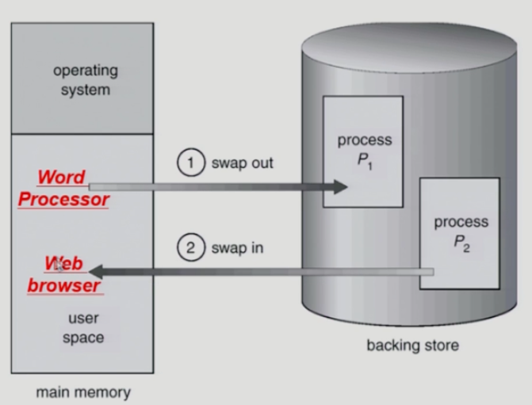
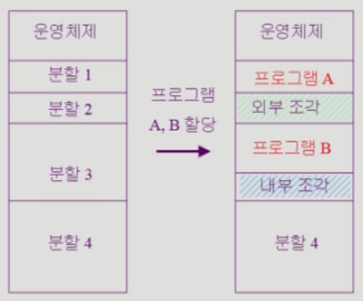
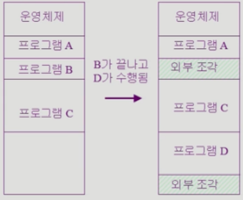
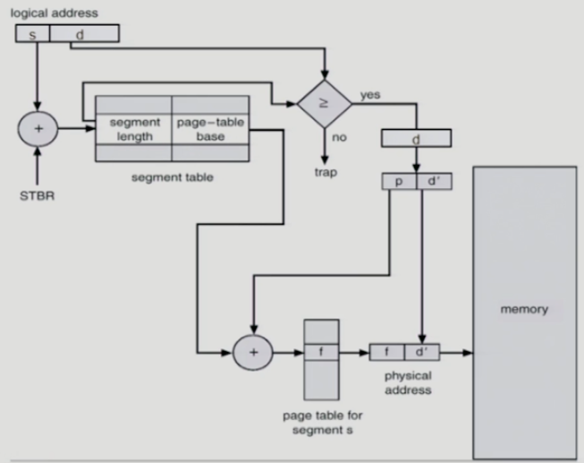

## Dynamic Loading
프로세스 전체를 미리 다 올리는 것은 비효율적임  
프로세스의 **해당 루틴이 불려질 때 메모리에 load** 함  

이는 운영체제의 특별한 지원 없이 프로그램 자체에서 구현할 수 있음  
사실 현대 운영체제에서는 이 점에서 Dynamic Loading이라 부를 수 없음  
## Overlays
`Dynamic Loading`과 의미는 같음  
프로세스 부분 중 **실제 필요한 정보만**을 올리는 것  

하지만 등장하게 된 배경이 다름  
**메모리의 크기가 작아 프로세스의 크기가 메모리보다 큰 시절**에 해야했음  
개발자가 직접 어떤 부분을 메모리에 올리고 내릴지 `Manual Overlay`를 해야해서 매우 복잡했음  
## Swapping

프로세스를 **일시적으로 메모리에서 `Backing Store`로 쫒아내는 것  **
  
일반적으로 중기 스케줄러에 의해 swap out 프로세스가 선정됨  
swap out되면 suspended 상태가 되며, 다시 swap in 될 때 풀림  

우선순위가 낮은 프로세스가 우선적으로 swap out 되며, 그 반대로 높은 프로세스를 우선적으로 메모리에 올림  
[주소 변환](주소%20변환.md) 과정에서 **compile time이나 load time binding**을 사용할 경우 **원래 사용하던 메모리 위치**로 돌아와야 하지만, **execution time binding**을 사용하면 이후 **빈 메모리 아무곳**에나 올릴 수 있음  

디스크에서 I/O 작업이 오래걸리는 것처럼 메모리에서 읽고 쓰는 이 작업들도 당연히 오래걸림  
swap out은 보통 프로세스 전체를 쫒아내는 것을 의미함  
당장 그 **프로세스에서 필요한 부분만** 올리고, 지금 필요없는 부분들은 내리는 것이 **[페이징](페이징.md)**  
페이징에서 쫒겨난 페이지들을 페이지가 swap out 됐다고 하기도 함  
## Dynamic Linking
프로그램에서 라이브러리를 사용하면 결국 실행 파일이 만들어질 때, 해당 **라이브러리의 코드가 연결(Linking)** 되어야 함  
크게 2가지 방법이 있음  
1. **Static Linking**  
   라이브러리의 **코드가 실행 파일에 포함**됨  
   실행 파일의 크기가 커지며, 동일한 라이브러리가 각 프로세스에 올라가므로 메모리 낭비가 발생  
   이런 방식으로 동작하는 라이브러리는 static library
2. **Dynamic Linking**  
   라이브러리의 코드가 **별도의 파일로 존재**함  
   그 라이브러리가 실제로 사용되는 그 시점에 파일을 찾아 사용하는 것  
   해당 위치를 알고 있어야 사용할 수 있으므로, 그 위치를 찾기 위한 `stub`이라는 작은 코드만 있음  
   운영체제의 도움이 필요함  
   이런 방식으로 동작하는 라이브러리는 shared library

## 물리 메모리 할당
할당 방법에는 2가지가 있음
### 연속 할당(contiguous allocation)
주소 변환이 쉬움  
그냥 베이스 레지스터에 주소 값 더해주면 끝  
사실 이건 현대 운영체제에서 전혀 쓰고있지 않으니 알아만 두자  

여기서 또 내부적으로 2가지 방법이 있음
#### 고정 분할(fixed partition) 방식
물리적 **메모리를 미리 영구적으로 분할**함  
분할의 크기는 서로 동일할 수도 다를 수도 있음  
분할 하나 당 하나의 프로그램을 적재함  
  
듣기만 해도 **끔찍한 방식**  
동시에 메모리에 load되는 프로그램 수도 고정되고, 프로그램 크기도 제한됨  
또한, 분할이 작아 사용하지 못하는 외부 조각과 분할이 딱 맞지 않아 남는 내부 조각이 발생  
#### 가변 분할(variable partition) 방식
그냥 **메모리에 쭉 나열**함  
이러면 빈 공간 없이 할당할 수 있음  
  
하지만 이후 중간에 할당된 메모리가 빠졌을때 외부 조각이 발생할 수 있음  
이렇게 어느 크기의 메모리가 어디에 비어있어 알아야 함  
이런 가용 메모리 공간을 **hole**이라 하며, 운영체제가 이런 정보를 알아야 함  
이후 이 정보를 이용해 메모리를 할당해야 함  
   
여기서 작은 문제가 생김  
가변 분할 방식에서 크기가 n인 요청을 만족하는 가장 적절한 hole을 찾을 수 있어야 함  
그냥 가장 먼저 넣을 수 있는 곳에 넣는 방법은 First-fit  
넣을 수 있는 가장 작은 hole에 넣는 방법은 Best-fit  
가장 큰 hole에 넣는 Worst-fit  
### 불연속 할당(noncontiguous allocation)
크게 3가지가 있음  
#### 페이징(paging)
[페이징](페이징.md) 참조
#### 세그멘테이션(segmentation)
[세그멘테이션](세그멘테이션.md) 참조
#### Paged Segmentation
페이징과 세그멘테이션을 혼합한 방식  
페이징에서 **낭비되는 주소 공간**을 없애기 위해 프로세스 전체 주소 공간을 위해 하나의 페이지 테이블을 두는 대신, **논리 세그먼트마다 따로 페이지 테이블**을 만드는 것  

익숙한 구조인 코드, 힙, 스택 구조를 예시로 보자  
힙과 스택 사이에 낭비되는 공간이 없도록 코드, 힙, 스택으로 세그먼트를 나누고 각 세그먼트에 대해 페이지 테이블을 만드는 것  
  
세그먼트는 물리 주소 시작 위치인 **베이스(base) 레지스터**, 크기를 나타내는 **바운드(bound)/리미트(limit) 레지스터**가 존재함  
이와 비슷하지만 여기서는 베이스 레지스터가 **세그먼트 페이지 테이블의 시작 주소**를 가짐  
바운드 레지스터는 **페이지 테이블의 끝**을 나타내기 위해 사용됨  