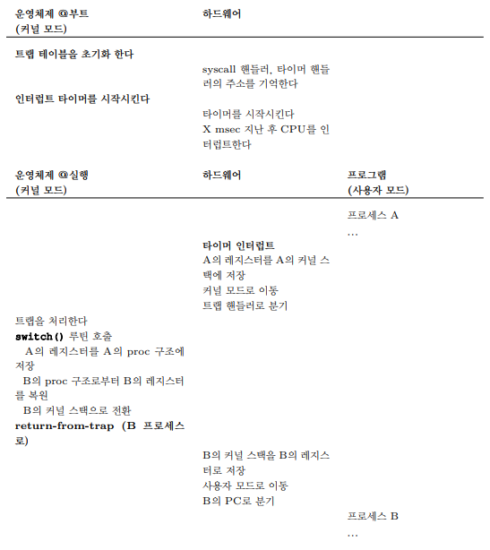

스케줄러의 결정으로 CPU가 한 프로세스에서 다른 프로세스로 넘겨주는 과정을 **문맥 교환(Context Switch)** 이라고 함

현재 실행 중인 프로세스의 **레지스터 값을 커널 스택 같은 곳에 저장**하고, 곧 실행될 프로세스의 **커널 스택으로부터 레지스터 값을 복원** 하는 것    
이 작업 후 마지막으로 `return-from-trap` 명령어가 실행되며 다른 프로세스로 리턴하여 실행을 다시 이어감

프로세스 A에서 프로세스 B로 변경하는 간단한 예시를 보자    

1. 타이머 인터럽트 혹은 I/O 요청 시스템 콜이 발생하면 A의 레지스터는 A의 커널 스택에 저장함
2. 커널 모드로 이동 및 트랩 핸들러로 분기
3. 트랩을 처리함
4. switch() 루틴 호출
    1. A의 레지스터를 A의 프로세스 구조체에 저장
    2. B의 레지스터 구조체에서 B의 레지스터 복원
    3. B 커널 스택으로 스택 포인터를 바꿈
5. `return-from-trap` 수행
6. B의 커널 스택을 B의 레지스터로 저장
7. 사용자 모드로 이동
8. B의 PC로 분기
9. 문맥 교환 완료