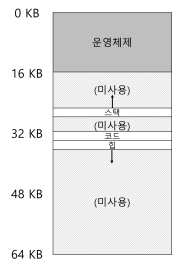
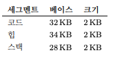

**특정 길이를 가지는 연속적인 주소 공간**  
MMU 안에 오직 하나의 베이스와 바운드 쌍만 존재하는 것이 아니라 **주소 공간의 논리적인 세그먼트(segment) 마다 베이스와 바운드 쌍이 존재**함  

## 예시
많이 봐왔던 그림을 기준으로 코드, 스택, 힙 세 종류의 세그먼트가 있다고 하자  
  
운영체제는 각 세그먼트를 서로 다른 위치에 배치해 사용되지 않는 주소가 물리 메모리를 차지하는 것을 방지할 수 있음  
기존 스택과 힙 사이 사용하지 않는 공간이 아주 많았던 것에 비해 **사용 중인 메모리에만 물리 공간을 할당**함  

## 구조
이에 따라 **MMU의 구조**가 다음과 같음  
  
늘 그렇듯 base와 limit이 적혀있고, 이를 사용해 어떤 세그먼트가 어느 위치에 어느 크기로 존재하는 지 알 수 있음  

여기서 본인의 크기를 벗어난 잘못된 주소를 접근할때 발생하는 것이 그 유명한 **segment fault**  

또 2개의 레지스터가 더 존재함  
1. segment-table base register(STBR)
   물리적 메모리에서 segment table의 위치
2. segment-tabel length register(STLR)
   프로그램이 사용하는 segment의 수
마치 각 세그먼트에 base와 limit이 존재하듯 세그먼트 테이블에도 존재하는 모습  

당연히 세그먼트 테이블도 [페이징](페이징.md)과 같이 protection bit가 존재하고, 그 구조는 valid bit와 read/write/execution bit로 이루어져 있음  

페이징과 비교해 의미 단위로 구분되기 때문에 공유나 보안 측면에 있어 페이징보다 효율적임  
단, 세그먼트의 길이가 다 다르기 때문에 **외부 조각 이슈는 여전히 생김**  

이 세그먼트와 페이징의 장점을 섞어 만든 것이 [Paged Segmentation](메모리%20할당.md#Paged%20Segmentation) 임  