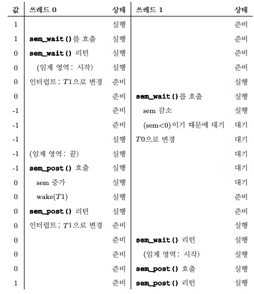

**세마포어(Semaphore)**  
정수 값을 갖는 객체로 공유 자원에 대한 접근을 제한하는 방법으로 사용됨

### 정의

두 개의 루틴으로 조작할 수 있음  
POSIX 표준에서 두 개의 루틴은 `sem_wait()`와 `sem_post()`임  
전통적인 연산에서는 `P`와 `V`로 부름

초기 값에 의해 동작이 결정되므로 사용하기 전 값을 초기화 해야 함

```c
#include <semaphore.h>

sem_t s;
sem_init(&s, 0, 1);
```

세마포어 `s`를 선언한 후, 세 번째 인자로 1을 전달해 값을 1로 초기화 함  
두 번째 인자는 모든 예제에서 0이고 쓰레드 간 세마포어를 공유한다는 것을 의미함

이후 `sem_wait()`와 `sem_post()`를 사용해 세마포어를 다룰 수 있음

```c
int sem_wait(sem_t *s) {
	decrement the value of semaphore s by one;
	wait if value of semaphore s is negative;
}

int sem_post(sem_t *s) {
	increment the value of semaphore s by one;
	if there are one or more threads waiting. wake one;
}
```

우선 `sem_wait()` 함수는 세마포어 값이 **1 이상이면 즉시 리턴**하고, 아니라면 **세마포어 값이 1 이상이 될 때까지 대기**시킴  
다수의 쓰레드가 `sem_wait()`을 호출할 수 있기 때문에, 대기큐에는 다수의 쓰레드가 존재 가능

다음으로 `sem_post()`함수는 대기하지 않음  
그냥 **세마포어 값을 증가시키고 대기 중인 쓰레드 중 하나를 깨움**

마지막으로 세마포어가 음수라면, 이는 현재 대기 중인 쓰레드의 개수과 같음

### 이진 세마포어

이제 세마포어를 이용해 [락](락.md)을 만들 것

```c
sem_t m;
sem_init(&m, 0, 1);
sem_wait(&m);
sem_post(&m);
```

첫번째 쓰레드가 `sem_wait()`을 호출해 세마포어 값을 1에서 0으로 만들고, 세마포어의 값이 음수가 아니므로 임계 영역에 진입함  
만약 그대로 첫번째 쓰레드의 작업이 끝나면 `sem_post()`를 호출하고, 세마포어 값이 다시 1로 돌아오며 대기중인 쓰레드가 없기에 아무도 깨우지 않고 끝남

하지만, 락을 아직 보유하고 있을때 다른 쓰레드가 `sem_wait()`을 호출한다면?  
두번째 쓰레드는 세마포어 값을 0에서 -1로 만들고, 세마포어의 값이 음수이므로 자러감  
이후 첫번째 쓰레드가 작업이 끝나면 **`sem_post()`를 호출해 세마포어를 0으로 만들고, 해당 쓰레드를 깨움**

전체적인 흐름은 아래와 같음  

락은 **사용 가능, 사용 중 두 개의 상태만 존재하므로 이진 세마포어(Binary Semaphore)** 라 불림

## 대표적인 문제

### 생산자/소비자(유한 버퍼) 문제

Dijkstra가 세마포어를 발명하게 된 이유

여러 개의 생산자 쓰레드와 소비자 쓰레드가 있다고 가정  
**생산자는 데이터를 만들어 버퍼에 넣고, 소비자는 버퍼에서 데이터를 꺼내서 사용**
> 실제로 멀티 쓰레드 웹 서버의 경우 생산자는 HTTP 요청을 작업 큐에 넣고, 소비자 쓰레드는 이 큐에서 요청을 꺼내 처리함

이때, **유한 버퍼가 공유 자원**이기 때문에 [경쟁 조건](경쟁%20조건.md)을 방지하기 위해 동기화가 필요함  
실제 코드로 알아보자

```c
int buffer;
int count = 0;

void put(int value) {
	assert(count == 0);
	count = 1;
	buffer = value;
}

int get() {
	assert(count == 1);
	count = 0;
	return buffer;
}
```

`put()`은 `assert`를 사용해 버퍼가 비어있다고 가정하고, 값을 공유 버퍼에 넣은 후 `count`를 1로 설정함  
`get()`은 `assert`를 사용해 버퍼가 차있다고 가정하고, 값을 꺼낸 후 버퍼가 비었다고 설정하며, 읽은 값을 리턴함

이 작업을 생산자 쓰레드들과 소비자 쓰레드들에서 동시에 수행했을 때 아무런 **동기화 관련 코드가 없으므로 잘못 작동**할 것

#### 첫번째 방법

당연히 `put()`과 `get()`에 임계 영역이 있으므로 무언가가 더 필요함  
`empty`와 `full`이라는 두 개의 세마포어를 사용해 버퍼 공간이 비었는지 확인

```c
int buffer[MAX];
int fill = 0;
int use = 0;

void put(int value) {
	buffer[fill] = value;
	fill = (fill + 1) % MAX;
}

int get() {
	int tmp = buffer[use];
	use = (use + 1) % MAX;
	return tmp;
}

sem_t empty;
sem_t full;

void *producer(void *arg) {
	int i;
	for (i = 0; i < loops; i++) {
		sem_wait(&empty);
		put(i);
		sem_post(&full);
	}
}

void *consumer(void *arg) {
	int i, tmp = 0;
	while (tmp != -1) {
		sem_wait(&full);
		tmp = get();
		sem_post(&empty);
		printf("%d\n", tmp);
	}
}

int main(int argc, char *argv[]) {
	...
	sem_init(&empty, 0, MAX);
	sem_init(&full, 0, 0);
	...
}
```

만약 `MAX`가 1이고, 생산자와 소비자 쓰레드가 각 하나씩 있고, CPU도 하나라고 가정하자  
소비자 쓰레드가 `sem_wait(&full)`을 호출해 `full`의 값이 -1로 감소하고 소비자는 대기함  
이후 생산자 쓰레드가 `sem_wait(&empty)`를 호출하고, `empty` 변수가 `MAX`인 1에서 0으로 감소함  
음수가 아니므로 데이터 값을 버퍼에 넣음  
다음 `sem_post(&full)`을 호출해 `full`의 값을 -1에서 0으로 변경하고 소비자 쓰레드를 깨움

마치 제대로 동작하는 것 같지만 여기서 `MAX`가 1보다 크고, 생산자와 소비자 쓰레드가 여러개라면 문제가 발생함  
첫번째 생산자 쓰레드가 버퍼에 값을 넣고 `fill`을 1로 변경하기 전에 인터럽트가 걸리면, 두번째 생산자 쓰레드는 똑같이 같은 공간에 데이터를 넣어버림

#### 상호 배제 추가

상호 배제를 고려하지 않아 위의 문제가 발생함  
변수 `mutex`를 추가하자

```c
sem_t empty;
sem_t full;
sem_t mutex;

void *producer(void *arg) {
	int i;
	for (i = 0; i < loops; i++) {
		sem_wait(&mutex);
		sem_wait(&empty);
		put(i);
		sem_post(&full);
		sem_post(&mutex);
	}
}

void *consumer(void *arg) {
	int i, tmp = 0;
	while (tmp != -1) {
		sem_wait(&mutex);
		sem_wait(&full);
		tmp = get();
		sem_post(&empty);
		sem_post(&mutex);
		printf("%d\n", tmp);
	}
}

int main(int argc, char *argv[]) {
	...
	sem_init(&empty, 0, MAX);
	sem_init(&full, 0, 0);
	sem_init(&mutex, 0, 1);
	...
}
```

그냥 `mutex` 세마포어만 추가됨  
하지만 이제는 다른 문제가 발생함  
바로 [교착 상태](교착%20상태.md)

#### 교착 상태 방지

소비자가 먼저 실행되고, `mutex`를 획득한 후 `full`에 대해 `sem_wait()`를 호출함  
아직 데이터가 없으므로 소비자는 대기함  
여기서 문제는 아직 `mutex`를 반납하지 않음!!!  
이후 생산자가 먼저 `mutex`에 대해 `sem_wait()`을 호출하게 되고, 영원히 기다리게 됨

이 문제를 해결하기 위해 락의 범위를 줄여야 함

```c
sem_t empty;
sem_t full;
sem_t mutex;

void *producer(void *arg) {
	int i;
	for (i = 0; i < loops; i++) {
		sem_wait(&empty);
		sem_wait(&mutex);
		put(i);
		sem_post(&mutex);
		sem_post(&full);
	}
}

void *consumer(void *arg) {
	int i, tmp = 0;
	while (tmp != -1) {
		sem_wait(&full);
		sem_wait(&mutex);
		tmp = get();
		sem_post(&mutex);
		sem_post(&empty);
		printf("%d\n", tmp);
	}
}

int main(int argc, char *argv[]) {
	...
	sem_init(&empty, 0, MAX);
	sem_init(&full, 0, 0);
	sem_init(&mutex, 0, 1);
	...
}
```

멀티 쓰레드 프로그램에서도 사용 가능한 유한 버퍼 완성

### Reader-Writer 락

이제 더 융통성 있는 락 기법이 필요함  
다양한 자료 구조에서 사용할 수 있도록 해보자

리스트에 삽입하고 간단한 검색을 하는 연산이 여러개 있다고 가정  
삽입 연산은 리스트의 상태를 변경하지만, 검색은 단순히 읽기만 하므로 동시에 수행할 수 있음  
이런 상황을 위해 만들어진 락이 **Reader-Writer 락**

코드는 아래와 같음

```c
typedef struct __rwlock_t {
	sem_t lock;
	sem_t writelock;
	int readers;
} rwlock_t;

void rwlock_init(rwlock_t *rw) {
	rw->readers = 0;
	sem_init(&rw->lock, 0, 1);
	sem_init(&rw->writelock, 0, 1);
}

void rwlock_acquire_readlock(rwlock_t *rw) {
	sem_wait(&rw->lock);
	rw->readers++;
	if (rw->readers == 1)
		sem_wait(&rw->writelock);
	sem_post(&rw->lock);
}

void rwlock_release_readlock(rwlock_t *rw) {
	sem_wait(&rw->lock);
	rw->readers--;
	if (rw->readers == 0)
		sem_post(&rw->writelock);
	sem_post(&rw->lock);
}

void rwlock_acquire_writelock(rwlock_t *rw) {
	sem_wait(&rw->writelock);
}

void rwlock_release_writelock(rwlock_t *rw) {
	sem_post(&rw->writelock);
}
```

writer가 데이터를 삽입하기 위해 `writelock`을 기다리게 만드는 구조  
reader가 읽기를 마치고 `readers`가 0이 되는 순간 `writelock`을 풀어주기 때문에 문제가 해결됨

단, 보면 알듯이 공정성에서는 문제가 있음  
`reader`가 계속 생겨 `writer`에게 기아 현상이 발생할 수도 있음  
이 문제를 위해 `writer`가 대기중이면 `reader`는 락을 획득하지 못하게 만들 수 있음

### 식사하는 철학자

다섯 명의 철학자가 식탁 주위를 둘러앉음  
총 다섯 개의 포크가 철학자와 철학자 사이에 하나식 놓여 있고, 철학자는 생각하는 시간과 식사하는 시간이 있음  
생각하는 시간에는 포크가 필요하지 않지만, 식사하는 시간에는 자신의 왼쪽 오른쪽 포크를 들어야 식사할 수 있음

간단하게 의사 코드로 작성하면 아래와 같음

```c
while (1) {
	think();
	getforks();
	eat();
	putforks();
}
```
