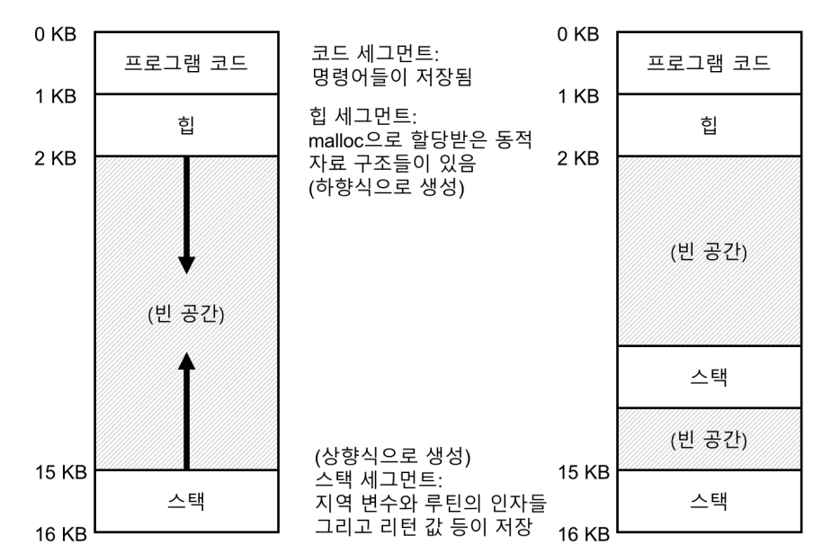
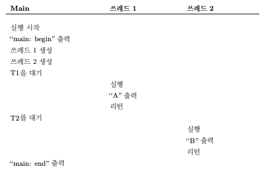
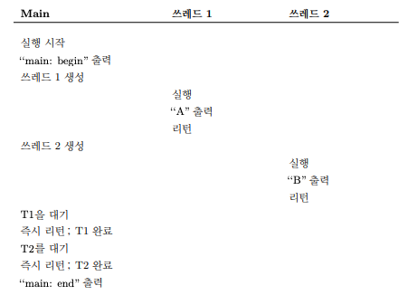
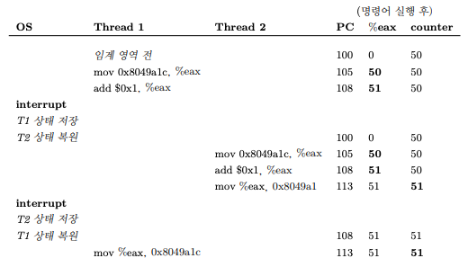

# 쓰레드

쓰레드(Thread)의 상태는 프로세스의 상태와 매우 유사함  
프로세스와 같이 명령어를 어디서 불러 들일지 추적하는 프로그램 카운터(PC)가 존재하고, 두 개의 쓰레드가 하나의 프로세서에서 실행 중이라면 실행하고자 하는 쓰레드는 [문맥 교환](문맥%20교환.md)을 통해 실행
중인 쓰레드와 교체함

차이점으로는 프로세스가 문맥 교환을 위해 PCB를 사용한다면, 쓰레드는 TCB(Thread Control Block)이 있음  
또 스택에서 차이가 발생함  
고전 프로세스 주소 공간 모델에는 스택이 하나만 존재함  
  
반면 멀티 쓰레드 프로세스의 경우 각 쓰레드가 독립적으로 실행되므로 주소 공간에 하나의 스택이 아니라 **쓰레드마다 스택이 할당**됨  
이 스택은 쓰레드-로컬 저장소(Thread-Local Storage)라 부르며, 쓰레드에서 할당되는 변수들이나 매개변수, 리턴 값 등은 여기에 저장됨

단, 여기서 발생하는 문제는 **정교한 주소 공간 배치**가 무너진다는 점  
원래는 스택과 힙이 위 아래로 독립적으로 확장되기 때문에 주소 공간에 더 이상 공간이 없는 경우에만 문제가 생겼지만, 이제는 구조가 깔끔하지 않음  
다행히, 스택의 크기가 크지 않아도 되기 때문에 보통 문제가 되지 않음

## 쓰레드 생성

한 쓰레드는 "A"를 출력하고, 다른 쓰레드는 "B"를 출력하는 프로그램을 가정

```c
#include <stdio.h>
#include <assert.h>
#include <pthread.h>

void *mythread(void *arg) {
	printf("%s\n", (char *) arg);
	return NULL;
}

int main(int argc, char *argv[]){
	pthread_t p1, p2;
	int rc;
	printf("main: begin\n");
	rc = pthread_create(&p1, NULL, mythread, "A");
	assert(rc &=& 0);
	rc = pthread_create(&p2, NULL, mythread, "B");
	assert(rc &=& 0);
	rc = pthread_join(p1, NULL); assert(rc &=& 0);
	rc = pthread_join(p2, NULL); assert(rc &=& 0);
	printf(“main: end\n ”);
	return 0;
}
```

두 개의 쓰레드 T1, T2 생성 후 메인 쓰레드는 `pthread_join`을 호출해 쓰레드 동작의 종료를 대기함

여기서 쓰레드를 생성하고 대기하는 과정에서 실행 순서는 어떻게 흘러갈지 알 수 없음  

  
위와 같이 쓰레드를 전부 생성하고 대기하는 과정에서 쓰레드가 실행될 수도 있고, 쓰레드를 생성하자 마자 해당 쓰레드가 실행될 수도 있음  
심지어 쓰레드 2가 먼저 실행되면서 B가 먼저 출력될 수도 있음

이렇게 단순한 작업도 쓰레드를 사용하는 순간 어떤 쓰레드가 언제 실행되는 지 알기 어려움  
하지만 여기서 또 복잡해지는 부분이 생김

## 데이터의 공유

2개의 쓰레드가 공유 데이터를 접근하기 위해 상호작용 하는 것을 가정

```c
#include <stdio.h>
#include <pthread.h>
#include “mythreads.h”

static volatile int counter = 0;

void *mythread(void *arg) {
	printf(“%s: begin\n”, (char *) arg);
	int i;
	for (i = 0; i < 1e7; i++) {
		counter = counter + 1;
	}
	printf(“%s: done\n”, (char *) arg);
	return NULL;
}

int main(int argc, char *argv[]) {
	pthread_t p1, p2;
	printf(“main: begin (counter = %d)\n”, counter);
	Pthread_create(&p1, NULL, mythread, “A”);
	Pthread_create(&p2, NULL, mythread, “B”);
	
	Pthread_join(p1, NULL);
	Pthread_join(p2, NULL);
	printf(“main: done with both (counter = %d)\n”, counter);
	return 0;
}
```

이 코드만 보면 공유 변수인 `counter`에 각 쓰레드가 수를 10,000,000번씩 더해 총 20,000,000이 나올 것으로 예상됨  
하지만 실행 결과는 아래와 같이 나옴

```
main: begin (counter = 0)
A: begin
B: begin
A: done
B: done
main: done with both (counter = 19345221)
```

이는 컴파일러가 생성한 코드를 이해할 필요가 있음

```assembly
mov 0x8049a1c, %eax
add $0x1, %eax
mov %eax, 0x8049a1c
```

`counter` 변수의 메모리 주소의 값을 읽어 eax 레지스터에 넣음  
이후 `eax` 레지스터에 1을 더하는 연산을 실행하고, 그 값을 다시 원래 메모리 주소에 저장함

이때, 만약 위 2개의 명령어를 실행하고 **문맥 교환이 발생**해 다른 쓰레드로 넘어간다면?  
쓰레드 2에서는 아직 변하지 않은 값을 읽고 그 값에 1을 더하게 됨  
이후 두 쓰레드에서 모두 명령을 마무리하면 `counter`에 2를 더했음에도 불구하고 1만 더해지는 것  
이 과정에서 손실이 발생해 최종 결과가 20,000,000이 아닌 더 적은 값이 나오는 것

이 상황을 자세히 보면 아래와 같음  


위 예시처럼 명령어 실행 순서에 따라 결과가 달라지는 상황을 [경쟁 조건](경쟁%20조건)(race condition)이라 함  
경쟁 조건에 처한 경우 **실행할 때마다 다른 결과**를 얻게 됨  
이렇게 컴퓨터는 일반적으로 **결정적 결과**를 내지만, 결과가 어떠할지 알지 못하거나 실행할 때마다 결과가 다른 경우를 **비결정적(Indeterminate) 결과**라 함

멀티 쓰레드가 같은 코드를 실행할 때 경쟁 조건이 발생하기 때문에 이러한 부분을 **임계 영역**이라 부름  
보통, 공유 변수(공유 자원)을 접근하고 **하나 이상의 쓰레드에서 동시에 실행되면 안되는 코드**를 의미함

이러한 코드에서 필요한 것은 **상호 배제**라 함  
하나의 쓰레드가 **임계 영역내의 코드를 실행 중일때 다른 쓰레드가 실행할 수 없도록 보장**하는 것  