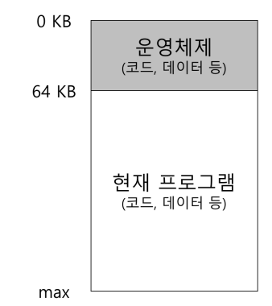
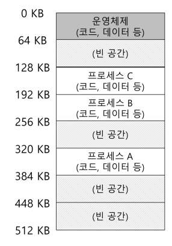
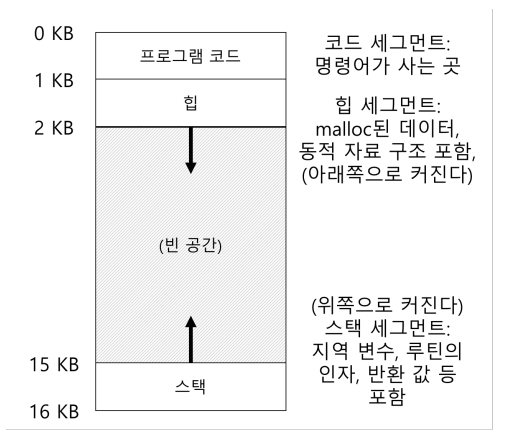

## 초기 메모리
많은 개념을 사용자에게 제공하지 않음  
아래와 같이 아주 단순하게 생김  
 
운영체제는 **메모리에 상주하는 라이브러리의 집합**이고, 가상화가 존재하지 않았으므로 나머지 메모리를 **하나의 프로세스가 사용**함  

### 멀티프로그래밍과 시분할
멀티프로그래밍과 시분할의 시대가 도래하면서, **여러 프로세스가 [문맥 교환](문맥%20교환.md)을 통해 실행**되며 CPU 이용률을 증가시킴  
이후 대화식 이용의 개념이 중요하게 됨  

시분할을 구현하기 위해 하나의 프로세스를 짧은 시간동안 실행시키는 과정에서, 해당 프로세스를 중단할 때 중단 시점의 상태를 디스크에 저장하고 다른 프로세스의 상태를 탑재했었음  
하지만 이 방법은 너무 느리게 작동하였고, 프로세스 전환 시 **프로세스를 메모리에 유지**하며 구현하는 방향으로 발전함  
  
3개의 프로세스가 있고, 각 프로세스가 512KB 물리 메모리에서 각기 작은 부분을 할당받은 상태  
이렇게 설계된 메모리를 이제 효율적으로 구현하고, 메모리를 보호하는 것이 중요한 문제로 떠오르게 됨  
## 주소 공간
문제 해결을 위해 운영체제는 **사용하기 쉬운 메모리** 개념을 만드려고 함  
이 개념을 위해 나온 것이 **주소 공간(address space)**  

주소 공간은 실행 프로그램의 모든 메모리 상태를 가지고 있음  
  
1. **코드(code, 명령어)**  
   주소 공간의 위쪽에 위치하며, 실행할 명령어를 저장함
2. **스택(stack)**  
   함수 호출 체인 상 현재 위치, 지역 변수, 함수 인자와 반환 값 등 저장
3. **힙(heap)**  
   동적으로 할당되는 메모리를 위해 사용  
   C언어의 `malloc()`, C++나 Java의 `new`를 통해 동적으로 할당받음

프로그램 코드는 **정적**이기 때문에 메모리에 저장하기 쉬움  
그래서 **주소 공간 상단에 배치**하고, 정해진 양의 메모리만 요구함  

나머지는 프로그램 실행과 더불어 **확장되거나 축소**될 수 있음  
확장할 수 있어야 하기에 **양 끝단에 배치해 서로 반대 방향으로 확장**함  
관례적으로 힙이 상단, 스택이 하단에 위치하지만 바꿀 수도 있음  

물론 여러 [쓰레드](쓰레드.md)가 주소 공간에 공존하면 위와 같은 주소 공간을 사용할 수 없게 됨  

### 목표
운영체제가 이런 일을 할 때, **메모리를 가상화(virtualizing memory)** 한다고 함  

실행 중인 프로그램은 자신이 특정 주소의 메모리에 탑재되고, 매우 큰 주소 공간을 가진다고 생각함  
하지만, 실제로 프로세스는 **가상 주소(virtual address)** 로 부터 `load` 연산을 수행하면 운영체제는 하드웨어의 지원을 통해 **실제 물리 주소를 읽도록 [주소 변환](주소%20변환.md)을 보장**해야 함  

이러한 가상 메모리 시스템의 목표로는 크게 3가지가 있음  
1. **투명성(transparency)**  
   실행 중인 프로그램이 **가상 메모리의 존재를 인지하지 못하도록** 하는 것  
   마치 자신이 전용 물리 메모리를 소유한 것처럼 행동해야 함  
2. **효율성(efficiency)**  
   가상화가 **시간과 공간 측면에서 효율적**이여야 함  
3. **보호(protection)**  
   프로세스와 운영체제를 **다른 프로세스로부터 보호**해야 함  
   즉, 자신의 주소 공간 밖의 어느 것도 접근할 수 있어서는 안됨  
   프로세스들을 서로 **고립(isolate)** 시켜야 함