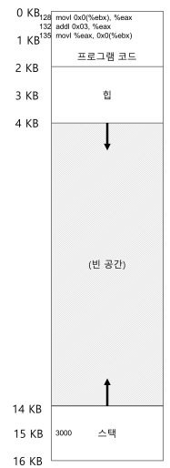
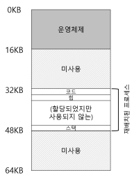

하드웨어-기반 주소 변환(hareware-based address translation) 혹은 주소 변환(address translation) 이라 부름  

하드웨어는 주소 변환을 통해 명령어 반입, 탑재, 저장 등 **가상 주소를 정보가 실제로 존재하는 물리 주소로 변환**함  
프로그램이 자신의 **전용 메모리를 소유**하고, 그 안에 자신의 코드와 데이터가 있다는 환상을 가지게 하는 것이 목표  

## 가정
여러가지 비현실적 가정을 하고 가상화를 진행한 후 가정들을 완화하자  
1. 사용자의 주소 공간은 물리 메모리에 연속적으로 배치됨  
2. 주소 공간의 크기는 너무 크지 않음. 물리 메모리 크기보다 작음  
3. 각 주소 공간의 크기는 같음  

## 사례
아주 간단한 코드를 예로 살펴보자
```c
void func() {
	int x = 3000;
	x = x + 3;
}
```
컴파일러는 이 코드를 어셈블리 코드로 변환함  
그 결과는 x86 기준 아래와 같음
```assembly
movl 0x0(\%ebx), \%eax;
addl \$0x03, \%eax;
movl \%eax, 0x0(\%dbx);
```
여기서 `ebx`는 주로 메모리 주소를 저장하는 레지스터이고, `eax`는 주로 연산을 담당하는 레지스터  
`x`의 주소가 `ebx`에 저장되어 있다고 가정하고 이 주소에 저장된 값을 `eax`에 넣음  
이후 `eax`에 3을 더하고, 마지막으로 `eax`의 값을 같은 위치의 메모리에 저장함  

이때 메모리 상황을 그림으로 보면 아래와 같음  
  
명령어는 주소 128에 위치하고, 변수 `x`의 값은 스택의 15KB에 위치함  
그림에서 `x`의 초기 값은 3000이며, 명령어가 실행되면 아래와 같은 메모리 접근이 발생함

1. 주소 128의 명령어를 반입
2. 명령어 실행 -> 15KB에서 탑재
3. 주소 132의 명령어를 반입
4. 명령어 실행 -> 메모리 참조 없음
5. 주소 135의 명령어를 반입
6. 명령어 실행 -> 15KB에 저장

프로그램 관점에서 주소 공간은 0부터 16KB까지 이며, 모든 메모리 참조는 이 범위 내에 있어야 함  
하지만 운영체제는 메모리 가상화를 위해 물리 메모리 주소 0이 아닌 다른 곳에 위치시키고 싶음  

이를 직관적으로 해결하면 아래와 같음  
  
물리 메모리의 첫 슬롯은 운영체제 자신이 사용하며, 이 예시에서는 물리 주소 32KB에 시작하는 슬롯에 재배치한 모습  
다른 16KB~32KB, 48KB~64KB는 비어있음  
## 동적 재배치
하드웨어 기반 주소 변환 첫 번째 실현 사례  
**베이스와 바운드(base and bound)** 나 **동적 재배치(dynamic relocation)** 이라 불림  

각 CPU마다 2개의 하드웨어 레지스터가 요구됨  
1. **베이스(base) 레지스터**
2. **바운드(bound) 또는 한계(limit) 레지스터**

이 2개의 프로세스는 **원하는 위치에 주소 공간을 배치하고, 오직 자신의 주소 공간에만 접근한다는 것을 보장**함  

각 프로그램은 주소 0에 탑재되는 것처럼 작성되고 컴파일 됨  
이후 프로그램 시작 시 운영체제가 **프로그램이 탑재될 물리 메모리 위치를 결정**하고, **베이스 레지스터를 그 주소로 지정**함  
만약 32KB에 프로세스를 저장하기로 했다면 베이스 레지스터 값이 32KB가 되는 것  

이후 프로세스에 의해 생성되는 모든 주소가 아래 방법으로 프로세서에 의해 변환됨  
```
physical address = virtual address + base
```
프로세스가 생성하는 메모리 참조 주소는 **가상 주소**이며, 하드웨어는 이를 이용해 **물리 주소**를 생성함  
이렇게 가상 주소에서 물리 주소로의 변환이 **주소 변환**  

이제 베이스 레지스터의 사용처는 이해함  
그렇다면 **바운드/한계 레지스터**의 사용처는?  
보호를 지원하기 위해 존재함!  
메모리 참조가 합법적인지 확인하기 위해 **가상 주소가 바운드 안에 있는지 확인**함  
만약 바운드코다 크거나 음수인 가상 주소를 참조하면 `CPU`는 예외를 발생시키고 프로세스를 종료함  

두 가지 방식 중 하나로 정의할 수 있는데 하나는 주소 공간의 크기를 저장해 베이스 레지스터 값을 더하기 전 비교하는 것이고, 다른 하나는 주소 공간의 마지막 물리 주소를 저장해 베이스 레지스터 값을 더한 후 비교하는 것  
논리적으로는 동일함  

이러한 베이스 레지스터와 바운드 레지스터를 `CPU` 내에 존재하는 하드웨어 구조이며, 이렇게 **주소 변환에 도움을 주는 프로세서**의 일부를 **메모리 관리 장치(MMU, Memory Management Unit)** 이라 부름  
더 정교한 메모리 관리를 위해 점점 `MMU`가 추가될 것

> 💡 **하드웨어 기반 첫 성공 사례면 소프트웨어 기반 주소 변환도 있나요?**  
> 
> 하드웨어 지원이 없을 때 엉성하게 소프트웨어만으로 재배치를 수행함  
> 이는 **정적 재배치(static relocation)** 이라 불림  
> 
> **로더(loader)** 라 불리는 소프트웨어가 실행하고자 하는 모든 주소를 원하는 물리 메모리로 변경해줌  
> 만약 주소 1000에 있는 명령어를 가져오고 싶고, 프로그램 주소 공간이 3000부터 할당된 경우 4000으로 간단하게 바꿔주는 형식  
> 
> 하지만 잘못된 주소로의 접근을 막는 **보호 기능**이 없는 점, 한번 배치되면 **재배치가 어렵다**는 단점이 있음