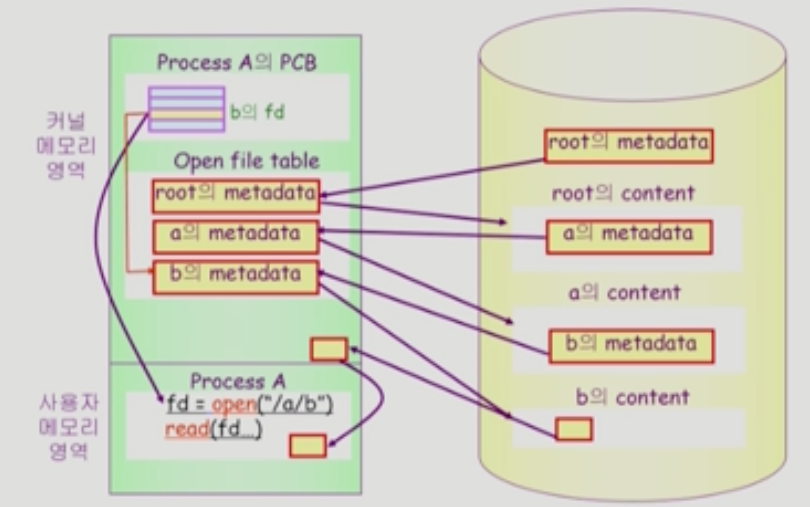
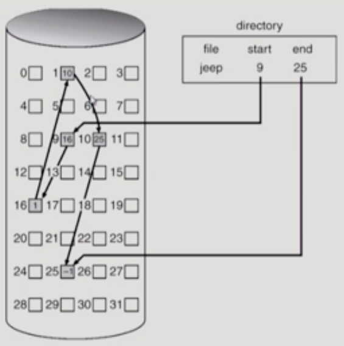

## 파일
관련 정보를 이름을 가지고 모아둔 것  
주로 HDD같은 비휘발성 보조기억장치에 저장됨  
운영체제는 다양한 저장 장치를 파일이라는 단위로 다루고 있음  
### 파일 속성(File Attribute, Metadata)
파일 자체의 내용이 아니라 관리하기 위한 정보들  
ex) 파일 이름, 유형, 저장된 위치, 크기, 접근 권한, 시간, 소유자, ....
### 파일 시스템
운영체제에서 파일을 관리하는 소프트웨어  
파일과 메타 데이터를 같이 관리함  
### 디렉토리
디렉토리도 파일이지만 메타데이터 중 일부를 보관하고 있는 특별한 파일  
그 디렉토리에 속한 파일 이름이나 메타데이터를 가지고 있음  
### 파티션
하나의 디스크에는 여러개의 파티션이 존재함  
그 파티션을 파일 시스템을 깔거나 스와핑에 사용하는 등 다양한 용도로 사용함  
### 파일 열기
파일을 여는 간단한 명령을 실행했다고 하자  
```c
fd = open("/a/b");
read(fd...)
```
  
우선 root의 메타데이터를 **open file table**로 가져옴  
이후 해당 메타데이터에서 a의 메타데이터의 위치를 찾아 또 가져옴  
똑같은 과정으로 b의 메타데이터도 가져옴  

이렇게 메타데이터를 open file table로 가져와두기 때문에 이후 이 프로세스에서 파일을 열때 또 루트 -> a -> b로 가져올 필요 없이 바로 PCB에서 가져올 수 있음!!  
이렇게 버퍼 캐시로 가져와도 무조건 CPU는 운영체제에게 한번 넘어가고 이후 캐시에서 가져오게 됨  

각 프로세스의 PCB의 **fd가 해당 메타데이터가 open file table의 어느 위치에 존재하는지 저장**함  
이후 그 정보를 통해 open file table에 접근하여 가져오는 것  
open file table은 프로세스에 소속되지 않고 **전역적으로 관리**되며, **system-wide open file table** 이라고도 불림  
단, 해당 프로세스가 어떤 파일을 접근하고 있는지는 알아야 하므로 프로세스 별로 그 정보를 가지고 있음  

## 파일 보호
각 파일에 대해 누구에게 어떤 유형의 접근을 허락할 지 정해야 함  
1. **Access control Matrix**  
   각 사용자마자 각 파일에 어떤 접근 권한이 있는지 표로 만드는 것  
   너무 테이블이 커짐  
   그래서 사용 권한이 있는 사용자만 LinkedList 형태로 연결하는 방법이 **Access Control List** 라 부름  
   사용자 별로 각 파일의 접근 권한을 LinkedList 형태로 연결하는 방법은 **Capability** 라 부름  
2. **Grouping**  
   owner, group, public으로 그룹을 나눠 단 9비트로 권한을 표시하는 것  
   ex) rwxr--r--  
3. **Password**  
   파일마다 비밀번호를 검  
   외워야해서 힘듬  

## 마운팅
  
루트 파일 시스템 특정 디렉토리에 다른 파티션의 파일 시스템을 마운팅하면 해당 파티션의 루트 디렉토리에 접근하는 것과 같아지게 하는 것  

## 할당
### 연속 할당(Contiguous Allocation)
  
말 그래도 연속된 디스크 공간에 할당하는 것  
- **장점**  
  I/O가 빠름  
  즉시 접근 가능  
- **단점**  
  외부 조각 이슈가 발생함  
  파일 크기 확장에 제한이 있음  
  뒤에 비어있는 블럭이 없어지면 확장할 수 없음  
  즉, 어느정도 커질지 예상해야 하는데 그거부터 어렵고 내부 조각 이슈가 발생함  

### Linked Allocation
  
LinkedList 처럼 다음 위치가 어딘지 각각 가지고 있음  
- **장점**  
  외부 조각이 발생하지 않음  
- **단점**  
  즉시 접근이 불가능함  
  중간 섹터에서 오류가 발생하면 뒷 파일을 전부 유실함  
  포인터를 위한 공간을 남겨야 함  

여기서 포인터를 위한 공간을 남겨야 한다는 점을 바꾼 것이 **File-Allocation Table(FAT) 파일 시스템**  

### Indexed Allocation
  
인덱스를 담은 섹터를 하나 할당하고 그 안에 인덱스를 저장함  
- **장점**  
  외부 조각이 발생하지 않음  
  즉시 접근 가능  
- **단점**  
  너무 작은 파일의 경우 공간이 낭비됨  
  너무 큰 파일의 경우 하나의 블럭으로 인덱스를 담지 못함  

하나의 블록으로 담지 못하는 것을 해결하기 위해 **linked scheme, multi-level index**가 나옴  

## UNIX 파일 시스템
  
- **Boot block**  
  부팅에 필요한 정보를 저장함  
- **Super block**  
  파일 시스템에 관한 총체적인 정보를 저장함  
- **Inode list**  
  파일 이름을 제외한 모든 메타데이터를 저장함  
- **Data block**  
  파일이 실제 내용을 보관함  

