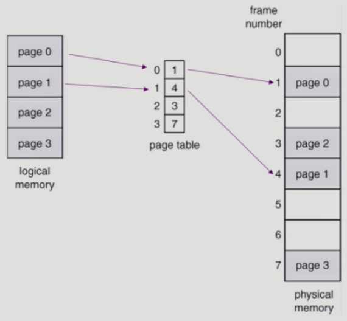
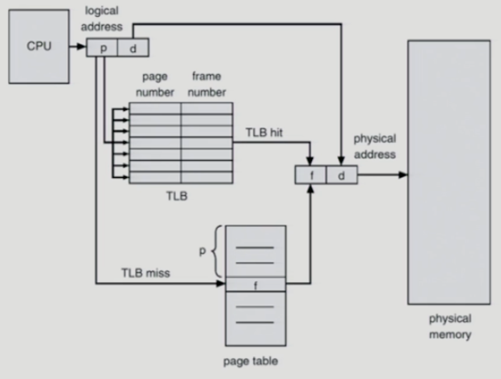
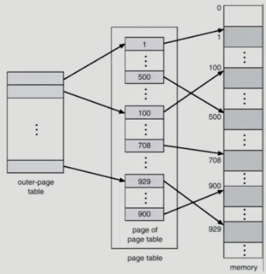
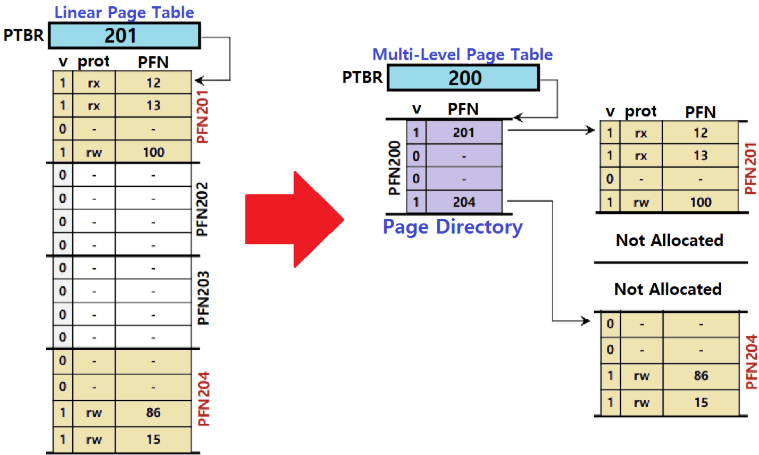
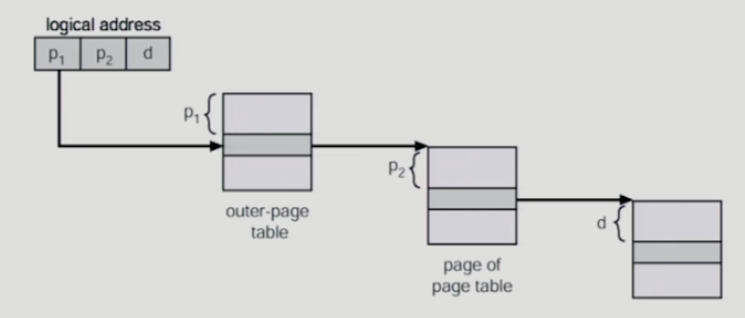

프로세스의 **메모리 공간을 페이지 단위로 잘라 서로 다른 물리 메모리**에 올라갈 수 있도록 하는 것  
페이지 단위로 메모리에 불연속하게 저장되며, 사용하지 않는 페이지는 backing storage에 넣을 수 있음  
물리 메모리도 **동일한 크기의 frame**으로 나눠둠  
외부 조각이 발생하지 않지만, 내부 조각은 발생할 수 있음  

## 페이지 테이블
이렇게 나눠져 저장된 페이지는 page table을 사용해 [주소 변환](주소%20변환.md)을 진행함  
  
어떤 페이지는 메모리에 올라가 있지 않을 수도 있음  
사실 비트가 하나 있어서 메모리에 올라가 있는지 아닌지 알 수 있음  
페이지 내에서는 위치가 변하지 않기 때문에 페이지의 위치와 offset만 알면 항상 접근할 수 있는 것  

페이지 테이블은 메인 메모리에 상주하며, **page-table base register(PTBR)** 이 페이지 테이블을 가리킴  
단, 이렇게 되면 메모리에 접근하기 위해 먼저 메인 메모리에 존재하는 페이지 테이블을 조회해야 하므로 시간이 2배가 걸리는 것  
이를 해결하기 위해 **translation lock-aside buffer(TLB)** 가 존재함  
주소 변환을 빠르게 하기 위한 캐시 메모리  

여기까지 반영한 큰 흐름은 아래와 같음  
  
페이지 테이블은 모든 페이지가 들어 있으므로 페이지 번호 위치로 가서 가져오면 됨  
하지만 TLB의 경우 일부 페이지만 들어있으므로 어떤 페이지의 정보인지 page number 정보를 추가로 저장해야 함  
참고로 context switch가 발생하면 TLB를 다 지워야 함  

결국에는 TLB를 전부 탐색해 해당 page number가 존재하는지 확인하고, TLB miss가 발생하면 페이지 테이블로 넘어가야 함  
이 TLB 탐색 속도를 빠르게 하기 위해 **associative register**라는 병렬 탐색이 가능한 특수한 레지스터를 사용하게 됨  

## Two-Level Page Table
32비트 주소 체계를 사용하면 총 4G의 주소 공간을 표현할 수 있음  
page entry가 각각 4B라면 프로세스 당 4M의 페이지 테이블이 요구됨  
하지만, 대부분 4G보다 훨씬 적게 사용하므로 페이지 테이블 공간이 낭비되게 됨  

이 상황을 페이지 테이블을 페이지로 만들며 해결함  
  
이젠 주소 변환에 메모리 접근을 2번 해야함  
시간상으로는 손해지만, 공간적으로 이득을 보기 위해 사용하는 것  
접근도 두번 해야돼서 느리고, 페이지 테이블도 많아져서 메모리도 더 먹을텐데 왜 사용하나요?  

그렇지 않음!!  
사용된 주소 공간의 크기에 비례해 페이지 테이블 공간이 할당되기 때문에 더 작은 크기의 페이지 테이블로 공간이 할당됨  
또 페이지 테이블이 페이지 단위로 분할되어 있으므로 운영체제는 그냥 페이지 풀에 있는 빈 페이지를 가져다 사용하면 됨  
  
원래는 사용하지 않을 공간이어도 미리 연속적인 메모리 공간에 할당해야 했음  
연속적으로 할당해야 페이지 테이블을 조회하니까 당연함  
> 💡 **엥 위 그림에 v랑 prot은 뭔가요?**  
> 
> 페이지 테이블 첫 설명에 말했듯이 페이지를 저장할 때 **페이지의 정보를 저장하는 비트**들이 있음  
> protection bit와 valid-invalid bit  
> 
> **protection bit**: 페이지에 대한 접근 권한 (read/write/read-only)  
> **valid-invalid bit**: 해당 주소의 frame에 프로세스를 구성하는 유효한 내용이 있음  

하지만 이를 하나의 페이지를 더 만듦으로써 연속적으로 할당해야 하는 페이지의 크기가 줄어듬!  
이는 곧 사용하지 않는 메모리를 아낄 수 있게 만들어줌  

  
이후 위와 같은 구조를 통해 페이지 테이블을 타고 들어가며 실제 메모리를 찾음  
## 역 페이지 테이블
여기서 더 공간을 절약하기 위해 **역 페이지 테이블(inverted page tabe)** 이 존재함  

프로세스 당 하나씩 페이지 테이블을 만들지 않고 시스템에 단 하나의 페이지 테이블만 둠  
페이지 테이블은 가상 주소를 물리 주소로 변환한다면, 역 페이지 테이블은 해당 물리 페이지를 사용 중인 프로세스 번호, 페이지 번호를 가지고 있음  

대신 페이지 번호로 물리 주소를 찾으려면 해당 테이블을 다 찾으며 페이지 번호를 찾아야 함  
여기서 탐색 속도 향상을 위해 associative register를 사용하거나 해시 테이블 구조를 사용함  
## 공유 페이지
만약 같은 프로그램을 3번 실행했다고 가정하자  
그러면 서로 **다른 프로세스라 하더라도 같은 코드를 공유**함  
그렇다면 그 페이지를 굳이 프로세스마다 할당할 필요가 없음!  

단, 여기에는 조건이 있음
1. read-only여야 함  
2. 모두 동일한 논리 주소에 위치해야 함  
   물리 주소는 서로 당연히 같지만 논리 주소까지 같아야 함  
   이는 이미 컴파일이 끝난 코드에서 주소 변환이 이뤄졌기 때문!!

여기서 페이징과 세그멘테이션의 장점을 혼합한 방식이 [Paged Segmentation](메모리%20할당.md#Paged%20Segmentation) 임  