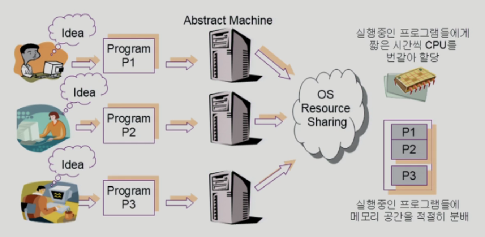
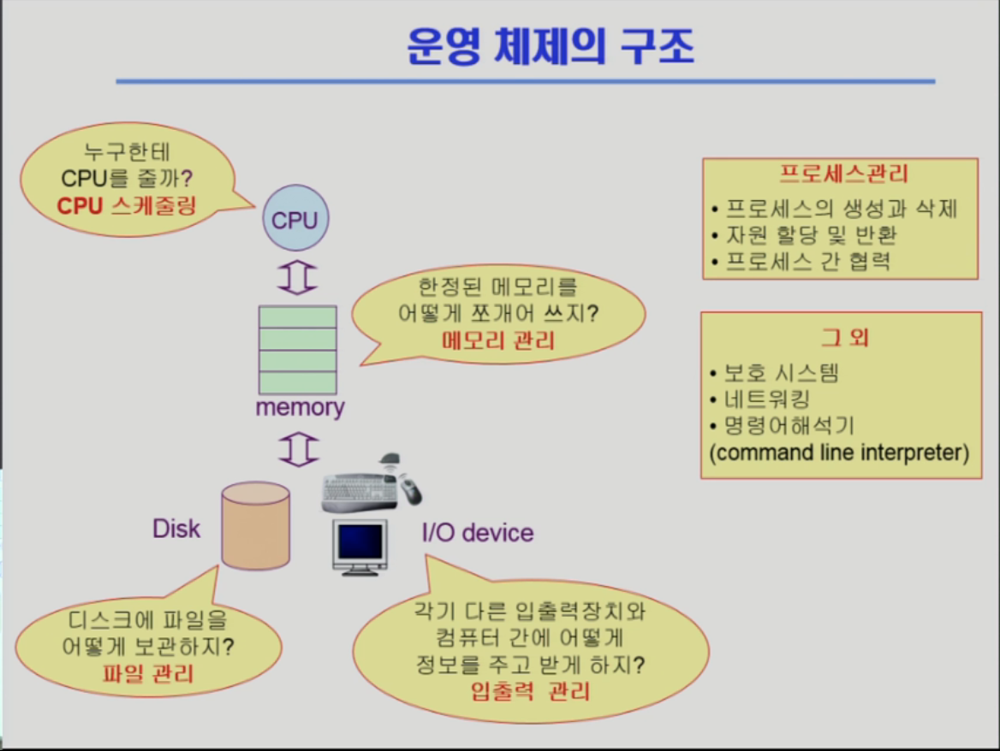
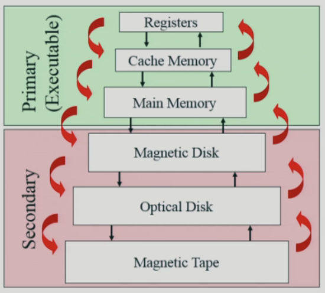

# 운영체제 개요

[용어 참고](https://inpa.tistory.com/entry/%F0%9F%91%A9%E2%80%8D%F0%9F%92%BB-multi-programming-tasking-processing#%EB%8B%A8%EC%9D%BC_%ED%94%84%EB%A1%9C%EC%84%B8%EC%8A%A4_single_process)

## 운영체제(Operating System)

컴퓨터 하드웨어 바로 위에 설치되어 사용자 및 다른 모든 소프트웨어와 하드웨어를 연결하는 소프트웨어 계층

### 커널

- OS의 핵심 부분으로 메모리에 상주하는 부분
- 운영체제의 각종 기능들 중 사용자와 실행 프로그램 위해 매우 빈번하게 사용되는 부분
- 컴퓨터 처음 부팅(Booting) 시 주기억 장치에 적재
- 시스템의 운영 종료(Shutdown)될 때까지 주기억 장치에 남아있음
  - 주기억 장치에 남아있는 이유
    - 빨리 실행돼야 할 프로그램 디스크에 두었을 경우 실행될 때마다 주기억 장치로 불러야함
    - 디스크와 주기억 장치 사이의 입출력에 해당하는 일은 많은 시간 요구 ⇒ 시스템 성능 저하
- 운영체제의 핵심
- = 핵(Neucleus), 관리자(Supervisor), 메모리 상주(Memory Resident) 프로그램
- 예 ) IO.SYS , MSDOS.SYS , COMMAND.COM

## 운영체제 목적

- 컴퓨터 시스템을 편리하게 사용할 수 있는 환경 제공
  - 동시 사용자/프로그램들이 각각 독자적 컴퓨터에서 수행되는 것 같은 환상 제공
  - HW를 직접 다루는 복잡한 부분을 OS가 대행
- 컴퓨터 시스템의 자원을 효율적으로 관리
  - CPU, 메모리, I/O 장치 등의 효율적인 관리
    - **효율성**  
      주어진 자원으로 최대한의 성능을 내도록 함
    - **형평성**  
      특정 사용자/프로그램의 지나친 불이익이 발생하지 않도록 자원 분배
  - 사용자 및 OS 자신의 보호
  - 프로세스, 파일, 메시지 등을 관리
    

## 운영체제의 분류

### a. 동시 작업 가능 여부

#### 단일 작업 (single tasking)

- 한 번에 하나의 작업만 처리
- 예) MS-DOS 프롬프트 상에서는 한 명령의 수행을 끝내기 전에 다른 명령 수행 불가능

#### 다중 작업 (multi tasking)

- 동시에 두 개 이상의 작업 처리
- 예) UNIX, MS Windows 등에서는 한 명령의 수행이 끝나기 전에 다른 명령이나 프로그램 수행 가능

### b. 사용자의 수

#### 단일 사용자 (single user)

- 예) MS-DOS, MS Windows

#### 다중 사용자 (multi user)

- 예) UNIX, NT server

### c. 처리 방식

#### 일괄 처리 (Batch Processing)

- 작업 요청의 일정량을 모아서 한꺼번에 처리
- 작업이 완전 종료될 때까지 기다려야 함
- 다수 개의 프로그램 읽어 저장해 놓고, 한 번에 한 개씩의 프로그램 실행시켜 주는 방식
- 여러 개의 프로그램을 같이 읽어 저장하는 이유
  - 소모되는 시간 줄임
  - 처리해야 할 작업(Job)들을 한꺼번에 여러개 준비시킴(Single-stream) → 다음 작업의 처리 자연스럽게 연결되도록 함  
     ⇒ Job-to-job의 Transition을 Smooth하게 함
- 예) 초기 Punch Card 처리 시스템

#### 시분할 (Time Sharing)

- 여러 작업을 수행할 때 컴퓨터 처리 능력을 일정한 시간 단위로 분할하여 사용
- 일괄 처리 시스템에 비해 짧은 응답 시간을 가짐
- Interactive한 방식
- 예) UNIX

#### 실시간 (Realtime OS)

- 정해진 시간 안에 어더한 일이 반드시 종료됨이 보장되어야 하는 실시간 시스템을 위한 OS
- 예) 원자로/공장 제어, 미사일 제어, 반도체 장비, 로보트 제어
- 종류
  - Hard Realtime System
  - Soft Realtime System

## 운영체제 종류

- 서버용 OS
  - Linux
- PC용 OS
  - MacOS, Windows
- 스마트디바이스용 OS
  - IOS, Android
- Open Source Software
  - Linux, Android
  - open하는 이유?
    - 특정 제품이 시장을 장악하게 되는 것을 막기 위해
    - 시장의 점유율을 갖기 위해서

## 관련 용어

### Time sharing

- 다중 사용자 지원
- 컴퓨터 응답 시간을 최소화하는 시스템

### Multitasking

- 프로세스는 한번 CPU를 사용할때 아주 짧은 시간(quantum)만 실행되도록 하여 각 프로그램의 작업을 아주 작은 단위로 번갈아 가며 처리
  ⇒ 작업 응답 시간을 최소화
- 단일 CPU에서 여러 개의 작업을 동시에 처리

### Multiprocessing

- 여러 CPU에서 하나의 응용 프로그램을 병렬로 실행해서 속도를 높이는 기법
- 다중 CPU가 병렬로 동시에 작업을 처리

### Multiprogramming

- 여러개의 프로그램이 동시에 실행된다는 의미
- CPU 사용률을 극대화

### Multiprocessor

- 하나의 컴퓨터에 CPU (processor)가 여러 개 붙어 있음을 의미
- 주로 `or`이 붙으면 하드웨어

## OS의 예

### UNIX

- 코드의 대부분을 C언어로 작성
- 높은 이식성
- 최소한의 커널 구조
- 복잡한 시스템에 맞게 확장 용이
- 소스 코드 공개
- 프로그램 개발에 용이
- 다양한 버전
  - System V, FreeBSD, SunOS. Solaris
  - Linux

### DOS (Disk Operating System)

- MS사에서 1981년 IBM-PC를 위해 개발
- 단일 사용자용 운영체제
- 메모리 관리 능력의 한계

### MS Windows

- MS사의 다중 작업용 GUI 기반 운영 체제
- Plug and Play
- 네트워크 환경 강화
- DOS용 응용 프로그램과 호환성 제공
- 풍부한 자원 소프트웨어

## 운영체제의 구조

## 저장장치 계층구조와 캐싱

## 플레시 메모리

- 반도체장치
- NAND형(스토리지), NOR형(임베디드 코드저장용) 등
- 특징
  - 전원이 나가도 내용이 저장됨
  - 전력 소모가 적음
  - 물리적인 충격에 강함
  - 크기가 작음
  - 가벼움
- 단점
  - 쓰기 횟수 제약
- 사용 형태
  - 휴대폰, PDA 등 임베디드 시스템 구성용
  - USB용 메모리 스틱
  - 디지털 카메라 등의 SD 카드
  - 모바일 장치 뿐 아니라 대용량 시스템에서 SSD란 이름으로 HDD 대체 시도
