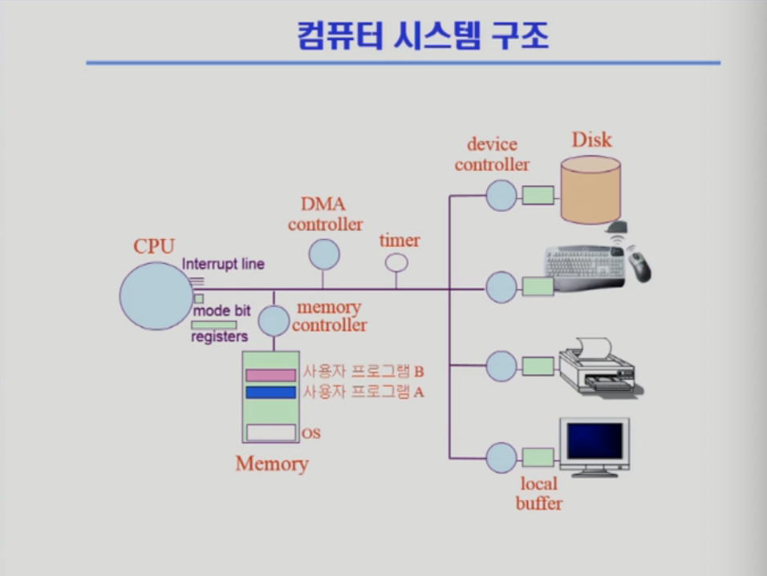
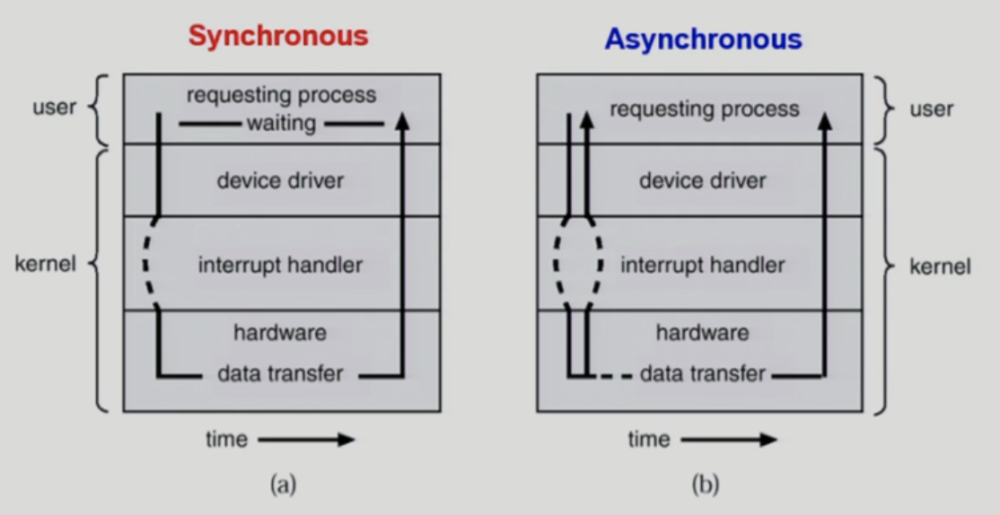
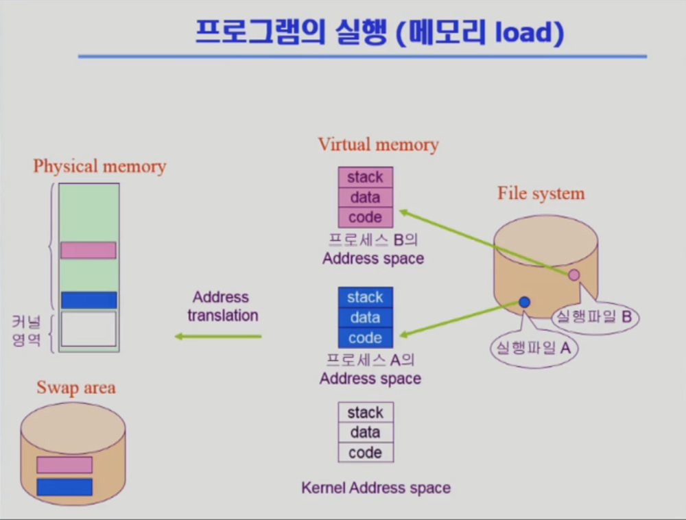

# 컴퓨터 시스템의 구조

## Memory

- CPU의 작업 공간
- CPU는 매 순간 메모리의 기계어를 하나씩 읽어서 실행

## Mode bit

- 사용자 프로그램의 잘못된 수행으로 다른 프로그램 및 OS에 피해가 가지 않도록 하기 위한 보호 장치 필여
- Mode bit을 통해 하드웨어적으로 2가지 모드의 operation 지원
  - 사용자 모드 (1) : 사용자 프로그램 수행
  - 모니터 모드 = 커널 모드 = 시스템 모드 (0) : OS 코드 수행
- 보안을 해칠 수 있는 중요한 명령어는 모니터 모드에서만 수행 가능한 '특권명령'으로 규정
- Interrupt나 Exception 발생 시 하드웨어가 mode bit를 0으로 바꿈
- 사용자 프로그램에게 CPU를 넘기기 전에 mode bit를 1로 세팅

## Timer

- 정해진 시간이 흐른 뒤 OS에게 제어권이 넘어가도록 인터럽트를 발생시킴
- 매 클럭 틱 때마다 1씩 감소
- 타이머 값이 0이 되면 타이머 인터럽트 발생
- CPU를 특정 프로그램이 독점하는 것으로부터 보호
- time sharing을 구현하기 위해 널리 이용됨
- 현재 시간을 계산하기 위해서도 사용

## Device Controller

- I/O Device Controller
  - 해당 I/O 장치 유형을 관리하는 일종의 작은 CPU
  - 제어 정보를 위해 control register, status register를 가짐
  - local buffer (일종의 data register)를 가짐
- I/O는 실제 device와 local buffer 사이에서 발생
- Device Controller는 I/O가 끝났을 경우, 인터럽트로 CPU에 그 사실을 알림

#### Device Driver (장치 구동기)

- OS 코드 중 각 장치별 처리 루틴
  ⇒ Software

#### Device Controller (장치 제어기)

- 각 장치를 통제하는 일종의 작은 CPU
  ⇒ Hardware

## 인터럽트

- 인터럽트 당한 시점의 레지스터와 program counter를 저장한 후 CPU의 제어를 인터럽트 처리 루틴에 넘긴다.

### 인터럽트 종류

#### **Interrupt(하드웨어 인터럽트)**

- 하드웨어가 발생시킨 인터럽트
- Timer, Disk Controller 등

#### **Trap (소프트웨어 인터럽트)**

- Exception : 프로그램이 오류를 범한 경우
- System Call : 프로그램이 커널 함수를 호출하는 경우

### I/O의 수행

- 모든 입출력 명령은 특권 명령
- 사용자 프로그램은 System Call을 통해 운영체제에게 I/O 요청
- trap을 사용하여 인터럽트 벡터의 특정 위치로 이동
- 제어권이 인터럽트 벡터가 가리키는 인터럽트 서비스 루틴으로 이동
- 올바른 I/O 요청인지 확인 후 I/O 수행
- I/O 완료 시 제어권을 시스템콜 다음 명령으로 옮김

### 시스템 콜 (System Call)

- 사용자 프로그램이 OS의 서비스를 받기 위해 커널 함수를 호출하는 것

### 인터럽트 벡터

- 해당 인터럽트의 처리 루틴 주소를 가지고 있음

### 인터럽트 처리 루틴 (= 인터럽트 핸들러)

- 해당 인터럽트를 처리하는 커널 함수

## I/O

### 동기식 입출력 (Synchronous I/O)

- I/O 요청 후 입출력 작업이 완료된 후에야 제어가 사용자 프로그램에 넘어감
- 구현 방법 1
  - I/O가 끝날 때까지 CPU를 낭비시킴
  - 매시점 하나의 I/O만 발생할 수 있음
- 구현 방법 2
  - I/O가 완료될 때까지 해당 프로그램에게서 CPU를 빼앗음
  - I/O 처리를 기다리는 줄에 그 프로그램을 줄 세움
  - 다른 프로그램에게 CPU를 줌

### 비동기식 입출력 (Asynchronous I/O)

- I/O가 시작된 후 입출력 작업이 끝나기를 기다리지 않고 제어가 사용자 프로그램에 즉시 넘어감

## DMA (Direct Memory Access)

- 빠른 입출력 장치를 메모리에 가까운 속도로 처리하기 위해 사용
- CPU의 중재 없이 device controller가 device의 buffer storage의 내용을 메모리에 block 단위로 직접 전송
- 바이트 단위가 아니라 block 단위로 인터럽트를 발생시킴

## 서로 다른 입출력 기계어

### I/O를 수행하는 special instruction에 의해

### Memory Mapped I/O에 의해

## 프로그램의 실행

## 커널 주소 공간의 내용

## 사용자 프로그램이 사용하는 함수

- 사용자 정의 함수 & 라이브러리 함수 => 프로세스 Address Space의 code
- 커널 함수 => Kernel Address Space의 code

### 사용자 정의 함수

- 자신의 프로그램에서 정의한 함수

### 라이브러리 함수

- 자신의 프로그램에서 정의하지 않고 갖다 쓴 함수
- 자신의 프로그램의 실행 파일에 포함되어 있음

### 커널 함수

- 운영체제 프로그램의 함수
- 커널 함수의 호출 (System Call)
