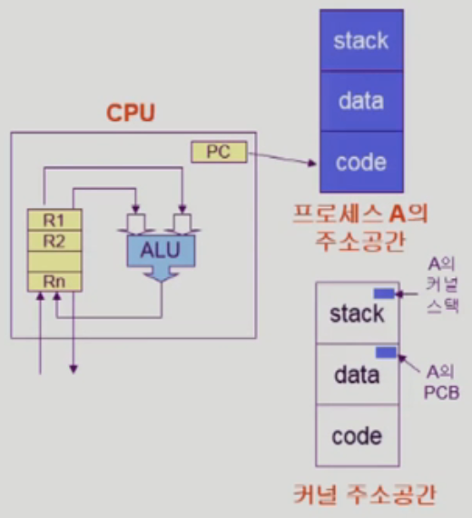
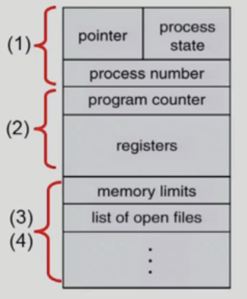
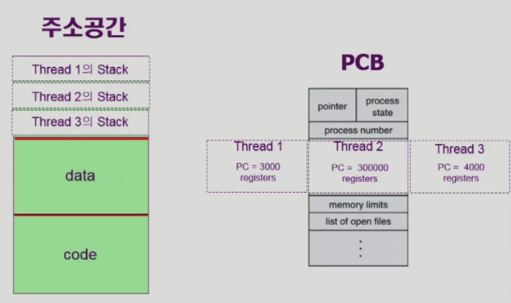
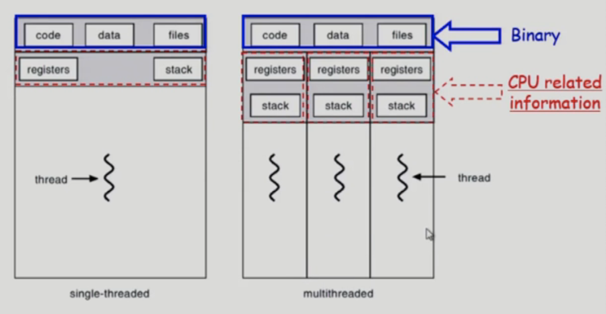
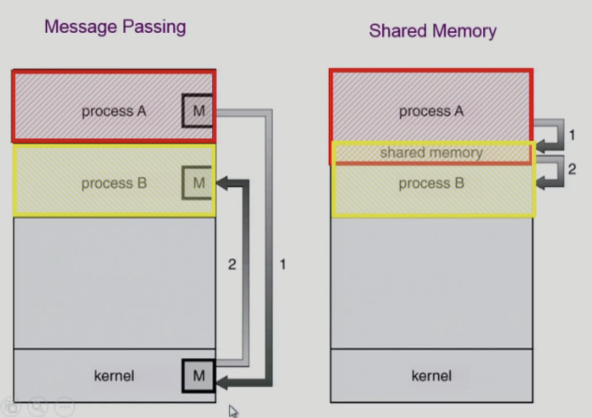

# 프로세스 관리

## 프로세스

### 프로세스

- 실행 중인 프로그램

### 프로세스의 문맥

- CPU 수행 상태를 나타내는 하드웨어 문맥
  - Program Counter
  - Register
- 프로세스의 주소 공간
  - Code, Data, Stack
- 프로세스 관련 커널 자료 구조
  - PCB (Process Control Block)
  - Kernel Stack



## 프로세스의 상태


### Running

- CPU를 잡고 명령어를 수행 중인 상태

### Ready

- CPU를 기다리는 상태 (메모리 등 다른 조건을 모두 만족)

### Blocked (wait, sleep)

- CPU를 주어도 당장 명령어를 수행할 수 없는 상태
- Process 자신이 요청한 이벤트가 즉시 만족되지 않아 이를 기다리는 상태
- 예) 디스크에서 파일을 읽어와야 하는 경우

### Suspended (stopped)

- 외부적인 이유로 프로세스의 수행이 정지된 상태
- 프로세스는 통째로 디스크에 swap out 된다.
- 예) 사용자가 프로그램을 일시 정지시킨 경우, 시스템이 여러 이유로 프로세스를 잠시 중단

### New

- 프로세스가 생성 중인 상태

### Terminated

- 수행(Execution)이 끝난 상태

#### Blocked와 Suspended의 차이

- Blocked : 자신이 요청한 이벤트가 만족되면 Ready
- Suspended : 외부에서 resume해 주어야 Active


## PCB (Process Control Block)



- 운영체제가 각 프로세스를 관리하기 위해 프로세스 당 유지하는 정보

(1) OS가 관리상 사용하는 정보

- Process state, Process ID
- Scheduling information, Priority

(2) CPU 수행 관련 하드웨어 값

- Program Counter, Registers

(3) 메모리 관련

- Code, Data, Stack의 위치 정보

(4) 파일 관련

- Open File Descriptors

## 문맥 교환 (Context Switch)


- CPU를 한 프로세스에서 다른 프로세스로 넘겨주는 과정
- CPU가 다른 프로세스에게 넘어갈 때 운영체제는 다음을 수행
  - CPU를 내어주는 프로세스의 상태를 그 프로세스의 PCB에 저장
  - CPU를 새롭게 얻는 프로세스의 상태를 PBC에서 읽어옴
- System Call이나 Interrupt 발생 시 반드시 context switch가 일어나는 것은 아님
  - (1)의 경우에도 CPU 수행 정보 등 context의 일부를 PCB에 저장해야 하지만, 문맥 교환을 하는 (2)의 경우는 그 부담이 훨씬 크다. (cache memory flush)  
    

## 프로세스 스케줄링 큐


## 스케줄러 (Schedular)

### Long-term scheduler (= Job schedular)

- 시작 프로세스 중 어떤 것을 ready queue로 보낼지 결정
- 프로세스에 memory 및 각종 자원을 주는 문제
- degree of Multiprogramming을 제어
- time sharing system에는 보통 장기 스케줄러가 없음 (무조건 ready)

### Short-term scheduler (= CPU schedular)

- 어떤 프로세스를 다음번에 running 시킬지 결정
- 프로세스에 CPU를 주는 문제
- 충분히 빨라야 함 (millisecond 단위)

### Medium-term scheduler (= Swapper)

- 여유 공간 마련을 위해 프로세스를 통째로 메모리에서 디스크로 쫓아냄
- 프로세스에게서 memory를 뺏는 문제
- degree of Multiprogramming을 제어

## Thread

- 프로세스 중에서 CPU 수행의 단위
- 구성
  - Program Counter
  - Register Set
  - Stack Space
- Thread가 다른 thread와 공유하는 부분
  - code section
  - data section
  - OS resources
- 장점
  - 다중 스레드로 구성된 태스크 구조에서는 하나의 서버 스레드가 blocked(waiting) 상태인 동안에도 동일한 태스크 내의 다른 스레드가 실행(running)되어 빠른 처리 가능
  - 동일한 일을 수행하는 다중 스레드가 협력하여 높은 처리율(throughput)과 성능 향상을 얻을 수 있다.
  - 스레드를 사용하면 병렬성을 높일 수 있다.




### Benefits of Threads

- Responsiveness
- Resource Sharing
- Economy
- Utilization of MP Architectures
  - 병렬적으로 작업 수행

### Thread의 분류

- OS가 쓰레드의 존재를 알고 있음 => Kernel Threads
- OS가 쓰레드의 존재를 모름 => User Threads
- 빠른 처리 => Real-time Threads

## 프로세스 생성

- 부모 프로세스가 자식 프로세스를 생성
- 프로세스의 트리(계층 구조) 형성
- 프로세스는 자원을 필요로 함
  - OS로부터 받음
- 자원의 공유
  - 부모와 자식이 모든 자원을 공유하는 모델
  - 일부를 공유하는 모델
  - 전혀 공유하지 않는 모델
- 수행 (Execution)
  - 부모와 자식은 공존하며 수행되는 모델
  - 자식이 종료(terminate)될 때까지 부모가 기다리는(wait) 모델
- 주소 공간 (Address space)
  - 자식은 부모의 공간을 복사함 (binary & OS data)
  - 자식은 그 공간에 새로운 프로그램을 올림
- 예) UNIX
  - `fork()` 시스템 콜이 새로운 프로세스를 생성
    - 부모를 그대로 복사 (OS data except PID + binary)
    - 주소 공간 할당
  - `exec()` 시스템 콜을 통해 새로운 프로그램을 메모리에 올림

## 프로세스 종료

- 프로세스가 마지막 명령을 수행한 후 운영체제에게 이를 알려줌 (`exit`)
  - 자식이 부모에게 output data를 보냄 (via `wait`)
  - 프로세스의 각종 자원들이 운영체제에게 반납됨
- 부모 프로세스가 자식의 수행을 종료시킴 (`abort`)
  - 자식이 할당 자원의 한계치를 넘어섬
  - 자식에게 할당된 태스크가 더 이상 필요하지 않음
  - 부모가 종료(`exit`)하는 경우
    - OS는 부모 프로세스가 종료하는 경우 자식이 더 이상 수행되도록 두지 않는다.
    - 단계적인 종료

## 프로세스와 관련된 시스템 콜

### `fork()` 시스템 콜

```c
int main() {
	int pid;

	pid = fork();
	if (pid == 0) {
		printf("\n Hello, I am child!\n");
	}
	else if (pid > 0) {
		printf("\n Hello, I am parent!\n");
	}
}
```

### `exec()` 시스템 콜

```c
int main() {
	int pid;

	pid = fork();
	if (pid == 0) {
		printf("\n Hello, I am child! Now I'll run date\n");
		execlp("/bin/date", "/bin/date", (char*) 0);
	}
	else if (pid > 0) {
		printf("\n Hello, I am parent!\n");
	}
}
```

### `wait` 시스템 콜


- 프로세스 A가 `wait()` 시스템 콜을 호출하면
  - 커널은 child가 종료될 때까지 프로세스 A를 sleep 시킨다. (block 상태)
  - 자식 프로세스가 종료되면 커널은 프로세스 A를 깨운다. (ready 상태)

### `exit` 시스템 콜

- 프로세스의 종료
- 자발적 종료
  - 마지막 statement 수행 수 `exit()` 시스템 콜을 통해
  - 프로그램에 명시적으로 적어주지 않아도 main 함수가 리턴되는 위치에 컴파일러가 넣어줌
- 비자발적 종료
  - 부모 프로세스가 자식 프로세스를 강제 종료시킴
    - 자식 프로세스가 한계치를 넘어서는 자원 요청
    - 자식에게 할당된 태스크가 더 이상 필요하지 않음
  - 키보드로 kill, break 등을 친 경우
  - 부모가 종료하는 경우
    - 부모 프로세스가 종료하기 전에 자식들이 먼저 종료됨

## 프로세스 간 협력

- 독립적 프로세스 (Independent Process)
  - 프로세스는 각자의 주소 공간을 가지고 수행되므로 원칙적으로 하나의 프로세스는 다른 프로세스의 수행에 영향을 미치지 못한다.
- 협력 프로세스 (Cooperating Process)
  - 프로세스 협력 메커니즘을 통해 하나의 프로세스가 다른 프로세스의 수행에 영향을 미칠 수 있다.
- 프로세스 간 협력 메커니즘 (IPC; Interprocess Communication)  
  
  - message passing
    - 메시지를 전달하는 방법
    - 커널을 통해 메시지 전달
  - shared memory
    - 주소 공간을 공유하는 방법
    - 서로 다른 프로세스 간에도 일부 주소 공간을 공유하게 하는 메커니즘이 있다.

\+ thread는 사실상 하나의 프로세스이므로 프로세스간 협력으로 보기 어렵지만 동일한 프로세스를 구성하는 스레드들 간에는 주소 공간을 공유하므로 협력이 가능하다

### Message Passing

- 프로세스 사이에 공유 변수를 일체 사용하지 않고 통신하는 시스템
- 방법1. Direct Communication
  - 통신하려는 프로세스의 이름을 명시적으로 표시
- 방법2. Indirect Communication
  - mailbox 또는 port를 통해 메시지를 간접 전달
