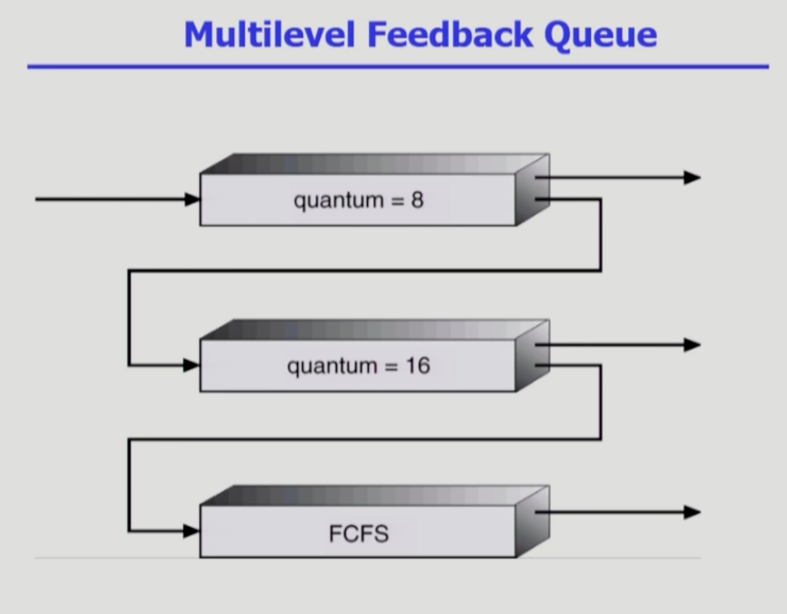

# CPU 스케줄링

## CPU Scheduling

- ready queue에 대기하는 프로세스 중 누구에게 CPU를 줄 것인가를 결정하는 작업
- 컴퓨터 시스템 안에는 I/O bound job과 CPU bound job이 섞여 있음
  => 여러 프로그램들을 적절히 스케줄링 해주는 것
- 2가지 이슈
  1.  당장 어떤 프로세스에게 CPU를 줄 것인지 결정
  2.  특정 프로그램에 CPU를 준 다음에는 CPU를 특정 시점에 가져갈 것인지 OR 해당 작업을 끝낼 때까지 기다릴 것인지를 결정
- CPU 스케줄러가 필요한 상황  
  a. 비선점형 스케줄링

  - Running -> Blocked
    - I/O 요청을 하는 시스템 콜
  - Terminated

  b. 선점형 스케줄링

  - Running -> Running
    - 할당 시간 만료로 인한 타이머 인터럽트
  - Blocked -> Ready
    - I/O 완료 후 인터럽트

- 모든 프로그램의 실행은 CPU burst와 I/O burst를 번걸아가는 구조
- 사용자와의 상호작용이 자주 있는 경우 -> I/O burst가 빈번하게 발생
- 유전자 염시 서열 분석과 같이 오랜 시간 연산이 필요한 거대한 작업 -> CPU burst가 길어지는 구조

### CPU burst

- 프로그램을 실행할 때, CPU에서 인스트럭션을 실행하는 단계
- 사용자 프로그램이 CPU를 직접 가지고 빠른 명령을 수행하는 단계
- 사용자 프로그램은 CPU 내에서 일어나는 명령이나 메모리에 접근하는 일반 명령을 사용할 수 있다.
- CPU burst가 긴 프로그램 => CPU bound job

### I/O burst

- 커널에 의해 I/O 작업을 진행하는 비교적 느린 단계
- 모든 입출력 명령을 특권 명령으로 규정하여 사용자 프로그램이 직접 수행할 수 없도록 한다.
- 대신 OS를 통해 서비스를 대행하도록 한다.
- CPU burst가 짧은 프로그램 => I/O bound job

### Dispatcher

- CPU의 제어권을 CPU scheduler에 의해 선택된 프로세스에게 넘긴다. (문맥 교환)

### Nonpreemptive VS Preemptive

- Nonpreemptive(비선점) : 하나의 프로세스가 CPU를 할당 받으면, 작업 종료 후 CPU 반환 시까지 다른 프로세스가 CPU를 점유할 수 없는 스케줄링 방식
- Preemptive(선점) : 하나의 프로세스가 CPU를 차지하고 있을 때, 우선 순위가 높은 다른 프로세스가 현재 프로세스를 중단시키고 CPU를 점유하는 스케줄링 방식

## 스케줄링 성능 척도

### 시스템 입장에서의 성능 척도

**1. CPU Utilization(이용률)**

- 전체 시간 중 CPU가 일한 시간 비율

**2. Throughput(처리량)**

- 주어진 시간동안 몇 개의 작업을 완료했는지

### 프로세스 입장에서의 성능 척도

**1. Turnaround Time(소요시간/반환시간)**

- 프로세스가 CPU를 요청한 시점부터 자신이 원하는 만큼 CPU를 다 쓰고 CPU burst가 끝날 때까지 걸린 시간
- (ready queue에서 기다린 시간) + (실제 CPU를 사용한 시간)
- 프로세스의 시작과 종료 시간이 아님

**2. Waiting Time(대기 시간)**

- CPU burst 기간 중 프로세스가 ready queue에서 CPU를 얻기 위해 기다린 시간의 합
- 시분할 시스템의 경우, 한 번의 CPU burst 중에도 준비 큐에서 기다린 시간이 여러번 발생 가능

**3. Response Time(응답 시간)**

- 프로세스가 ready queue에 들어온 후 처음으로 CPU를 획득하기까지 기다린 시간
- time-sharing 환경에 적합한 성능 척도로, 사용자 입장에서 가장 중요한 성능 척도

## CPU Scheduling Algorithms

### FCFS(First-Come First-Served)

- 비선점(nonpreemptive)
- 먼저 온 순서대로 처리하는 방식
- 어떤 프로세스가 먼저 실행되느냐에 따라 전체 대기 시간에 상당한 영향을 미침
  - CPU를 오래 쓰는 프로세스가 먼저 와서 CPU를 할당받으면, 나머지 프로세스는 전부 기다려야 함 => 비효율적
- Convoy effect
  - 긴 프로세스 하나 때문에 짧은 프로세스 여러 개가 기다리는 현상

### SJF(Shortest-Job-First)

- CPU burst가 가장 짧은 프로세스에게 제일 먼저 CPU를 할당하는 방식
- 평균 대기 시간을 가장 짧게 하는 최적 알고리즘
- `비선점`에서의 SJF
  - CPU를 잡으면 더 짧은 프로세스가 들어와도 CPU burst가 완료될 때까지 CPU를 선점당하지 않음
- `선점`에서의 SJF
  - = SRTF(Shorest-Remaining-Time-First)
  - CPU를 잡았더라도 더 짧은 프로세스가 들어오면 CPU를 빼앗김
- 문제점
  - Starvation(기아)
    - 자신보다 우선순위 높은 프로세스 때문에 오랫동안 cpu 할당을 받지 못하는것
  - CPU burst 시간 알 수 없음
    - 과거 CPU 사용 시간을 통해 추정만 가능

### HRN(Highest Response Ratio Next)

- 비선점(nonpreemptive)
- 대기 중인 프로세스 중 현재 Response Ratio가 가장 높은 것을 선택
- `Response Ratio = (대기 시간 + 서비스 시간)/서비스 시간`
- SJF와 Aging 기법을 합쳐 기아 현상을 보완한 기법
- 긴 작업과 짧은 작업 간의 불평등 완화

### Priority Scheduling

- 우선 순위가 제일 높은 프로세스에게 CPU 할당
- 일반적으로 우선 순위 값이 작을수록 높은 우선순위를 갖는다.
- `비선점`에서의 Priority Scheduling
  - CPU를 잡으면 더 높은 우선순위를 가진 프로세스가 들어와도 CPU burst가 완료될 때까지 CPU 선점 불가능
- `선점`에서의 Priority Scheduling
  - CPU를 잡았더라도 더 높은 우선 순위를 가진 프로세스가 들어오면 CPU를 빼앗김
- SJF는 일종의 우선 순위 스케줄링
  - 예상되는 다음 CPU burst 시간을 우선 순위로 기준
- 문제점인 Starvation를 `Aging`을 통해 해결
  - 아무리 우선 순위가 낮은 프로세스라 하더라도 시간이 오래 지나면 우선 순위를 높여주는 기법

### Round Robin

- 선점(preemptive)
- 각 프로세스는 동일한 크기의 할당 시간인 time quantum을 가진다.
- 할당 시간이 지나면 프로세스는 CPU를 빼앗기고, ready queue 맨 뒤에 가서 줄을 서게 된다.
- 짧은 응답 시간 보장
  - CPU를 최초로 얻기까지 걸리는 시간이 짧음.
  - n개의 프로세스가 ready queue에 있고, 할당 시간이 q time unit인 경우, 어떤 프로세스도 `(n-1)*q time unit` 이상 기다리지 않는다.
- 대기 시간이 자신이 CPU를 사용하는 양에 비례
- 성능

  - time quantum이 커질수록, FCFS에 가까워짐
  - time quantum이 작을수록, context switch 오버헤드 증가

- 일반적으로 SJF보다 평균 turnaround time이 길지만, response time이 짧음
- 시간이 오래 걸리는 작업과 짧게 걸리는 작업이 섞여 있을 때는 효율적
- 모든 시간이 동일한 작업만 있을 때는 비효율적

### Multi-Level Queue

- ready queue를 우선순위에 따라 여러 개로 분할하는 방식
  - 빠른 응답을 필요로 하는 대화형 작업 -> 전위 큐
  - 계산 위주의 작업 -> 후위 큐
- 전위 큐에서는 주로 Round-Robin 작업을, 후위 큐에서는 주로 FCFS 스케줄링 기법 사용
- 멀티 레벨 큐 자체에 대한 스케줄링이 필요

  - **Fixed Priority Scheduling**

    - 전위 큐에 있는 프로세스에게 우선적으로 CPU가 할당되고, 전위 큐가 비어있는 경우에만 후위 큐에 있는 프로세스에게 CPU가 할당된다.
    - Starvation 가능성 존재

  - **Time Slice**
    - 각 큐에 CPU time을 적절한 비율로 할당한다.

### Multi-Level Feedback Queue

- 프로세스가 여러 개로 분할된 ready queue 내에서 다른 큐로 이동이 가능
- aging 기법으로 구현 가능
  - 우선 순위가 낮은 큐에서 오래 기다렸다면 우선 순위가 높은 큐로 승격하는 방식
- 멀티 레벨 피드백 큐를 정의하는 요소
  - 큐의 수
  - 각 큐의 스케줄링 알고리즘
  - 프로세스를 상위 큐로 승격하는 기준
  - 프로세스를 하위 큐로 강등하는 기준
  - 프로세스가 도착했을 때 들어가는 큐를 결정하는 기준
    - 보통 처음 들어오는 프로세스는 우선순위가 가장 높은 큐에 CPU 할당 시간을 짧게 하여 배치
    - 주어진 할당 시간 안에 작업을 완료하지 못하면 CPU 할당 시간을 조금 더 주되, 우선순위가 한 단계 낮은 큐로 강등

## 특수한 Scheduling

### Multi-Processor Scheduling

- CPU가 여러 개인 시스템 환경에서 사용하는 기법
- **Homogeneous processor**
  - queue에 한 줄로 세워서 각 프로세서가 알아서 꺼내가게 할 수 있다.
  - 반드시 특정 프로세서에서 수행되어야 하는 프로세스가 있는 경우에는 문제가 더 복잡해진다.
- **Load sharing**
  - 일부 프로세서에 작업이 몰리지 않도록 부하를 적절히 공유하는 메커니즘이 필요
  - 별개의 큐를 두는 방법 VS 공동 큐를 사용하는 방법
- **Symmetric Multiprocessing (SMP)**
  - 각 프로세서가 각자 알아서 스케줄링을 결정
- **Asymmetric Multiprocessing**
  - 하나의 프로세서가 시스템 데이터의 접근과 공유를 책임지고, 나머지 프로세서는 거기에 따름

### Real-time Scheduling

- **Hard Real-time System**
  - 정해진 시간 안에 반드시 작업이 끝나도록 스케줄링해야 한다.
- **Soft Real-time System**
  - 데드라인이 존재하기는 하지만 지키지 못했다고 해서 위험한 상황에 발생하지는 않는다.
  - 일반 프로세스에 비해 높은 우선 순위를 갖도록 구현

### Thread Scheduling

- **Local Scheduling**

  - 유저 레벨 스레드의 경우, 사용자 수준의 스레드 라이브러리에 의해 어떤 스레드를 스케줄할지 결정

- **Global Scheduling**
  - 커널 레벨 스레드의 경우, 일반 프로세스처럼 커널의 단기 스케줄러가 어떤 스레드를 스케줄할 지 결정

## Algorithm Evaluation

### Queueing Models

- 확률 분포로 주어지는 arrival rate와 service rate 등을 통해 각종 performance index 값을 계산
- 최근에는 시스템에서 직접 돌리는 방식을 선호하기 때문에 사용 빈도가 떨어지는 방법

### Implementation & Measurement

- 실제 시스템에 알고리즘을 구현하여 실제 작업(workload)에 대해서 성능을 측정 비교

### Simulation

- 알고리즘을 모의 프로그램으로 작성 후 trace를 입력으로 하여 결과 비교
- 구현보다 훨씬 간단
