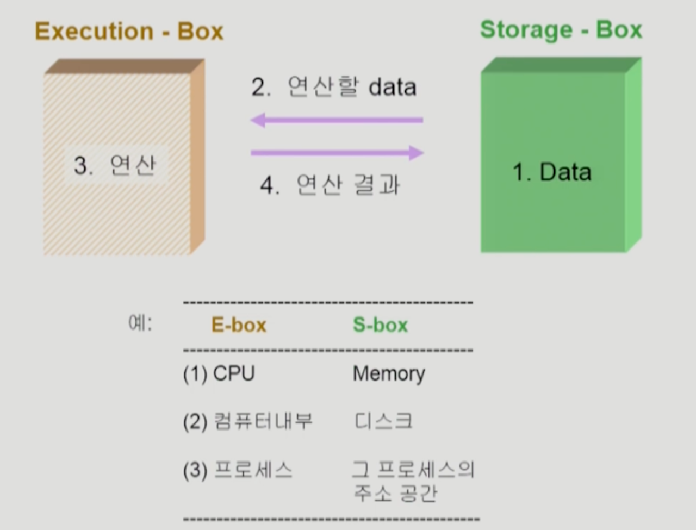
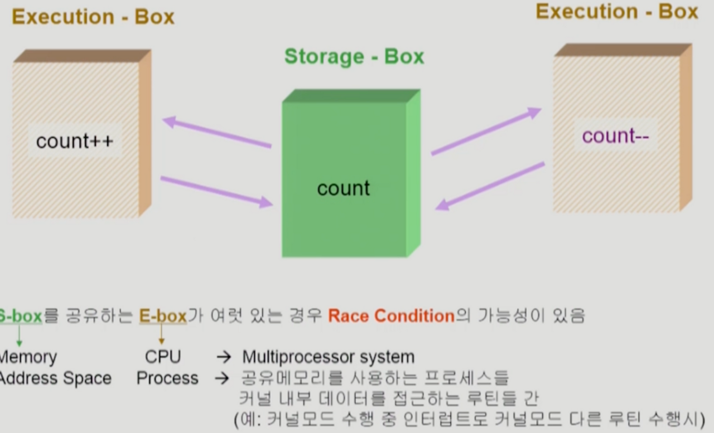
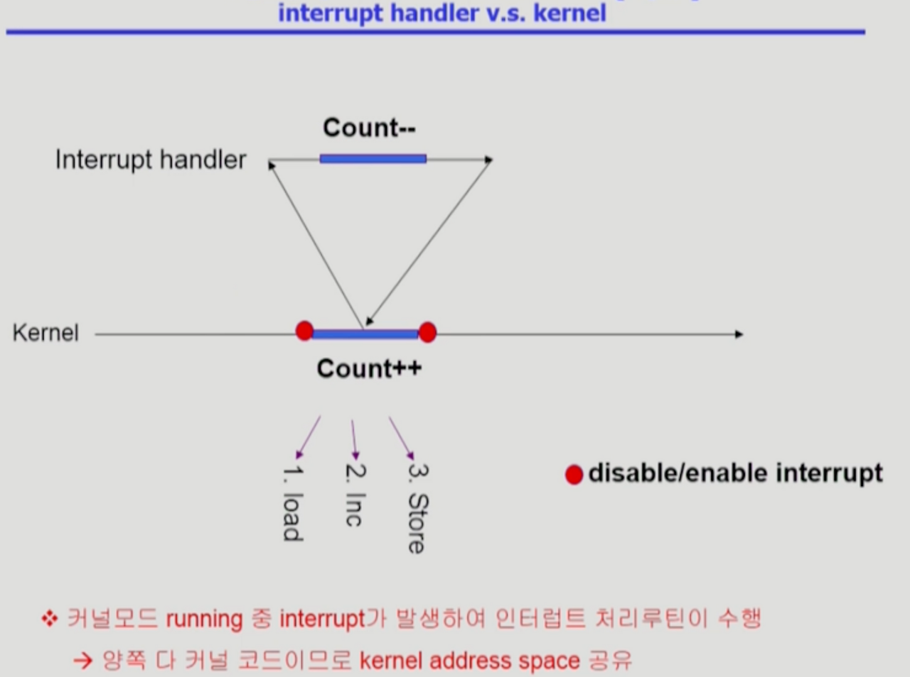
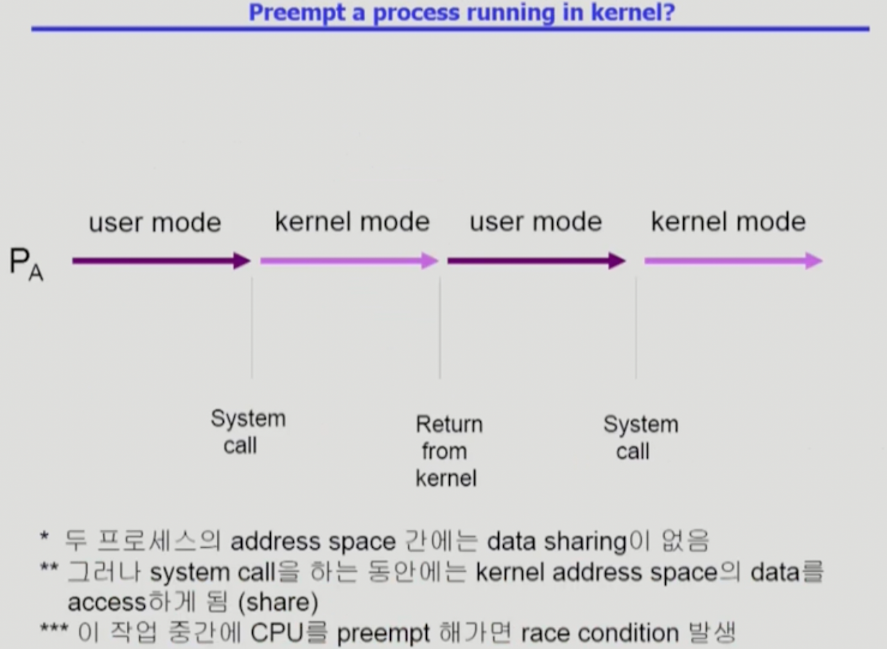
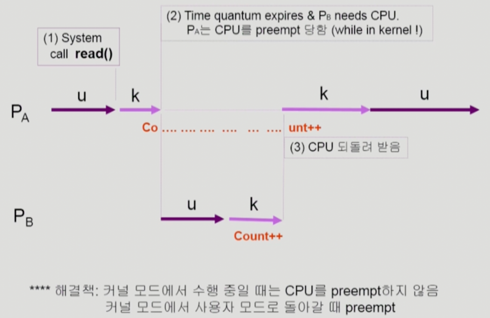
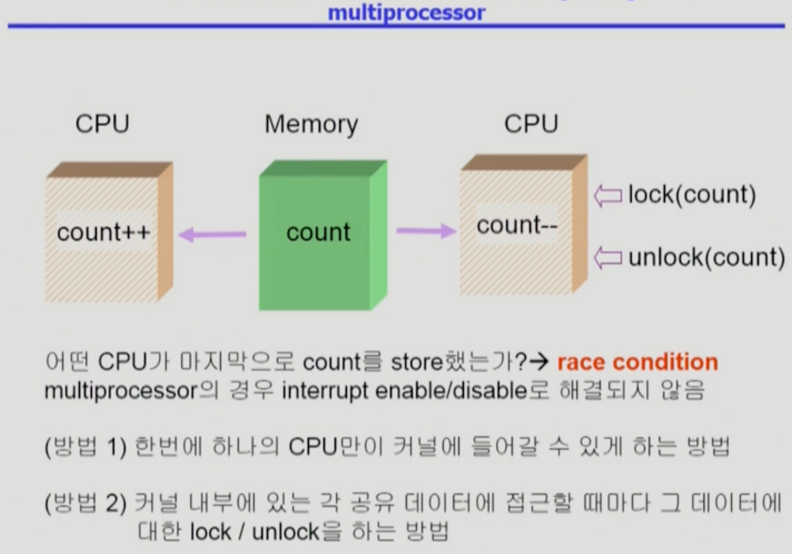
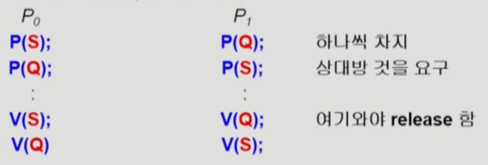

# 병행 제어 (Process Synchronization)

## 데이터 접근



- 컴퓨터 시스템에서 데이터 연산은 저장 공간과 실행 공간의 동작 흐름으로 이루어진다.
  - 저장 공간에 데이터가 있다.
  - 연산할 데이터를 실행 공간으로 가져온다.
  - 실행 공간에서 연산한다.
  - 연산 결과를 저장 공간에 반영한다.
- 저장 공간
  - 메모리, 해당 프로세스의 주소 공간, 디스크 등
- 실행 공간
  - CPU, 프로세스, 컴퓨터 내부 등

## Race Condition



- 여러 프로세스들이 동시에 공유 데이터를 접근하는 상황
- 저장 공간을 공유하는 실행 공간이 여러 개 있는 경우 race condition 가능성이 있다.
- OS에서 race condition 발생 상황 예시
  - 커널 수행 중 인터럽트 발생 시
  - 프로세스가 시스템 콜을 호출하여 커널 모드로 수행 중인 가운데 문맥 교환이 일어나는 경우
  - 멀티 프로세서에서 공유 메모리 내의 커널 데이터

## OS에서의 Race Condition

### 커널 모드 수행 중 인터럽트가 발생한 경우

- 커널 모드가 수행 중인 상태에서 인터럽트가 발생하여 인터럽트 처리 루틴이 실행되는 상황
- 중요한 변수의 값을 건드리는 동안에는 인터럽트가 발생해도 연산이 끝나고 수행할 수 있게끔 disable 처리를 해준다.
- 예제
  

  - 커널이 증감 연산을 할 때 1) 메모리에 count 변수를 load 하고, 2) count 변수를 증감하고, 3) count 변수를 메모리에 store하는 3가지 연산이 발생한다.
  - 만약 load 연산을 수행한 후 증감 연산을 수행하기 전에 인터럽트가 발생했다고 가정
    - 그러면 인터럽트 핸들러를 통해 인터럽트를 수행할 것이다.
    - 이때 인터럽트가 공유 변수인 count를 1 감소하는 연산이었고, 인터럽트가 끝난 이후 커널은 이전 연산 과정인 load 이후부터 수행하므로 count는 감소하지 않은 상태이다.  
      => count는 기존 값에서 1이 증가한 수치가 된다.

### 프로세스가 시스템 콜을 하여 커널 모드로 수행 중에 문맥 교환이 일어나는 경우




### Multiprocessor에서 공유 메모리 내의 커널 데이터



- CPU가 메모리에서 데이터를 가져오기 전에 lock을 걸어 다른 CPU가 같은 데이터에 접근하는 것을 막아 준다.
- 연산이 끝난 후 데이터를 다시 메모리에 저장할 때 lock을 풀어줌으로써 다른 CPU가 접근할 수 있게 한다.
- 방법 1
  - 한 번에 하나의 CPU만 커널에 들어갈 수 있게 하는 방법
  - 커널 전체에 lock을 걸기 때문에 비효율적
- 방법 2
  - 커널 내부에 있는 각 공유 데이터에 접근할 때마다 해당 데이터에 lock을 거는 방법

## 프로세스 동기화 문제

- 공유 데이터의 동시 접근은 데이터의 불일치 문제를 유발할 수 있다.
- 일관성 유지를 위해서는 협력 프로세스 간의 실행 순서를 정해주는 메커니즘이 필요하다.
- Race Condition
  - 여러 프로세스들이 동시에 공유 데이터에 접근하는 상황
  - 데이터의 최종 연산 결과는 마지막에 그 데이터를 다른 프로세스에 따라 달라진다.
- race condition을 막기 위해서는 병행 프로세스는 동기화되어야 한다.

## 임계구역(Critical-Section) 문제

- n개의 프로세스가 공유 데이터를 동시에 사용하기를 원하는 경우, 각 프로세스의 code segment에는 공유 데이터를 접근하는 코드인 임계 구역이 존재한다.
- 하나의 프로세스가 임계 구역에 있을 때 다른 모든 프로세스는 임계 구역에 들어갈 수 없어야 한다.

### 임계 구역 문제를 해결하기 위한 충족 조건

- 상호 배제 (Mutual Exclusion)
  - 어떤 프로세스가 임계 구역 부분을 수행 중이면 다른 모든 프로세스는 그 임계 구역에 들어가면 안된다.
- 진행 (Progress)
  - 아무도 임계 구역에 있지 않은 상태에서 임계 구역에 들어가고자 하는 프로세스가 있으면 임계 구역에 들어가게 해 주어야 한다.
- 유한 대기 (Bounded Waiting)
  - 프로세스가 임계 구역에 들어가려고 요청한 후부터 그 요청이 허용될 때까지 다른 프로세스들이 임계 구역에 들어가는 횟수에 한계가 있어야 한다.
  - ex) 세 개의 프로세스가 있을 때 두 개의 프로세스만 번갈아가며 임계 구역에 들어가는 것은 유한 대기 조건을 만족하지 못한 것이다.

### 임계 구역 문제 해결 알고리즘

#### Algorithm 1

- Synchronization variable

  ```c
  int turn;
  initially turn = 0; // 몇 번 프로세스가 들어갈 수 있는지를 알려주는 turn 변수
  ```

- Process P0

  ```c
  do {
  	while (turn != 0);
  	critical section
  	turn = 1;
  	remainder section
  } while (1);
  ```

- mutual exclusion은 만족하지만 progess는 만족하지 않는다.
  - 반드시 한 번씩 교대로 임계 구역에 들어야가 하기 때문

#### Algorithm 2

- Synchronization variable

  ```c
  boolean flag[2];
  initially flag[모두] = false; // critical section에 들어가고자 하는 의사 표시
  ```

- Process Pi

  ```c
  do {
    flag[i] = true;
    while (flag[j]);
    critical section
    flag[i] = false;
    remainder section
  } while (1);
  ```

- 상대방이 임계 영역에서 빠져 나왔을 때 들어간다.
- mutual exclusion은 만족하지만 progress는 만족하지 않는다.

#### Algorithm 3

- Process Pi

  ```c
  do {
    flag[i] = true; // 내가 임계 구역에 들어가고 싶다고 알림
    turn = j; // 자신의 다음 차례를 프로세스 j로 바꿔 줌
    while (flag[i] && turn == j);
    critical section
    flag[i] = false;
    remainder section
  } while (1);
  ```

- 알고리즘1과 2의 융합
- 상대방이 임계 구역에 들어가있지 않고, 들어갈 준비도 하지 않는다면 들어간다.
- 3가지 조건을 모두 만족하지만, 계속 CPU와 메모리를 쓰면서 기다리기 때문에 busy waiting(spin lock)이 발생한다.
  - 임계 구역에 들어가려면 상대방이 CPU를 잡고 flag 변수를 false로 바꿔주어야 하는데, 자신이 CPU를 잡고 있는 상황에서 의미 없이 while문을 돌며 CPU 할당 시간을 낭비해야 한다.
- c++ 예시

  - `flag[0] = true`로 설정하여 0번 스레드가 임계 영역 진입을 하고 싶다고 표시한다.
  - `turn = 1`로 설정하여 1번 프로세스가 먼저 임계 영역에 들어가라고 양보한다.
  - 만약 이때 문맥교환이 되지 않았다면 while문에 갇히게 된다.
  - 1번 프로세스가 모든 작업을 끝내면 `turn = 0, flag[1] = false`가 되므로 0번 프로스세가 임계 구역에 진입할 수 있다.

  ```c++
  #include <iostream>
  #include <thread>

  using namespace std;

  int cnt;
  bool flag[2] = { false, false };
  int turn = 0;

  void func0() {
  	for (int i = 0; i < 10000; i++) {
  		flag[0] = true;
  		turn = 1;
  		while (flag[1] == true && turn == 1) {}

  		cnt++;
  		printf("cnt1 :: %d\n", cnt);

  		flag[0] = false;
  	}

  }
  void func1() {
  	for (int i = 0; i < 10000; i++) {
  		flag[1] = true;
  		turn = 0;
  		while (flag[0] == true && turn == 0) {}

  		cnt++;
  		printf("cnt2 :: %d\n", cnt);

  		flag[1] = false;
  	}

  }

  int main() {
  	thread t1(func0);
  	thread t2(func1);

  	t1.join();
  	t2.join();

  	cout << "cnt : :" << cnt << endl;

  	return 0;

  }
  ```

## 동기화 하드웨어

- 임계 구역 문제가 발생하는 근본적인 이유는 데이터를 읽고 쓰는 동작을 하나의 명령어로 수행할 수 없기 때문
- 따라서 명령어 하나만으로 데이터를 읽는 작업과 쓰는 작업을 atomic하게(=명령어 단위로 끊어서) 수행하도록 지원하면 임계 구역 문제 해결 가능

### Mutual Exclusion with Test & Set

- Synchronization variable

  ```c
  boolean lock = false;
  ```

- Process Pi
  ```c
  do {
  	while (Test_and_Set(lock));
  	critical section
  	lock = false;
  	remainder section;
  } while (1);
  ```

## 세마포어 (Semaphore)

- 2가지 연산에 의해서만 접근 가능

#### P(S)

- 공유 데이터를 획득하는 과정(lock)
- S가 양수이어야 한다.

```c
while (S <= 0) do no-op; // ex) wait.
S--;
```

#### V(S)

- 공유 데이터를 사용하고 반납하는 과정 (unlock)

```c
S++;
```

### n개의 프로세스가 임계 구역에 들어가려는 경우

- P(mutex) 연산 수행 시, mutex 값이 양수가 아니면 계속 기다려야 하는데, 프로세스의 CPU 할당 시간이 끝날 때까지 무의미하게 CPU를 낭비하게 된다.
- = busy-wait 또는 spin lock
- 이러한 단점을 보완하기 위해 **Block/Wake-up** 혹은 **Sleep lock** 기법 생겨남

```c
/*
Synchronization variables
- semaphore mutex;
*/
do {
    P(mutex); // mutex의 값이 양수면 임계 구역 접근하고, 아니면 기다린다.
    critical section
    V(mutex); // mutex의 값을 1 증가한다.
    remainder section
} while (1);
```

### Block/Wake-up 기법

- 세마포어 정의 코드
  ```c
  typedef struct
  {
  	int value; // 세마포어 변수
  	struct process *L; // 프로세스 Wait Queue
  } semaphore;
  ```

#### Block

- 커널은 block을 호출한 프로세스를 suspend하고, 이 프로세스의 PCB를 세마포어에 대한 Wait Queue에 넣음.

#### Wake-up (P)

- block된 프로세스 P를 wake up하고, 이 프로세스의 PCB를 Ready Queue로 옮김.

#### P(S)

- 세마포어 변수 S를 무조건 1 줄이고, 그 변수의 값이 음수면 해당 프로세스를 Wait Queue로 보낸 후 Block 상태로 만든다.

```c
S.value--;
if (S.value < 0)
{
    add this process to S.L;
    block();
}
```

#### V(S)

- 세마포어 변수 S를 무조건 1 늘리고, 그 변수의 값이 0보다 작거나 같으면 이미 기다리고 있는 프로세스가 있으므로 프로세스 P를 Wait Queue에서 꺼내서 Ready Queue로 보낸다.
- 세마포어 변수 S 값이 양수면 아무나 임계 구역에 들어 갈 수 있으므로 별다른 추가 연산을 하지 않는다.
- V 연산은 특정 프로세스가 공유 데이터를 반납한 후 임계 구역에서 나가는 연산임을 기억해야 한다.

```c
S.value++;
if (S.value <= 0)
{
    remove a process P from S.L;
    wakeup(P);
}
```

### Busy Wait VS Block/Wake-up

- 일반적으로 Block Wake-up 기법이 좋음.
- 임계 구역의 길이가 긴 경우 Block/Wake-up 기법이 적합함.
- 임계 구역의 길이가 매우 짧은 경우 Block/Wake-up 기법의 오버헤드가 Busy-wait 기법의 오버헤드보다 크므로 Busy Wait 기법이 적합할 수 있음.

### 세마포어의 종류

#### 계수 세마포어 (Counting Semaphore)

- 도메인이 0 이상인 임의의 정수 값
- 여러 개의 공유 자원을 상호 배제함.
- 주로 resource counting에 사용됨.

#### 이진 세마포어 (Binary Semaphore)

- 0 또는 1 값만 가질 수 있음.
- 한 개의 공유 자원을 상호 배제함.
- mutex와 유사함. (완전히 같지는 않음.)

## 데드락 (Deadlock)

- 둘 이상의 프로세스가 서로 상대방에 의해 충족될 수 있는 이벤트를 무한히 기다리는 현상
- 예시 : P0가 CPU를 얻어서 P(S) 연산까지 수행하여 S 자원을 얻었다고 가정

    

  - P0의 CPU 할당 시간이 끝나 문맥 교환이 발생하여 P1에게 CPU 제어권이 넘어갔다.
  - P1은 P(Q) 연산을 수행하여 Q 자원을 얻었으나 또 다시 CPU 할당 시간이 끝나 문맥 교환이 발생하여 P0에게 CPU 제어권이 넘어갔다.
  - P0은 P(Q) 연산을 통해 Q 자원을 얻고 싶지만, 이미 Q 자원은 P1이 갖고 잇는 상태이므로 Q 자원을 가져올 수 없다.
  - 마찬가지로 P1도 P(S) 연산을 통해 S 자원을 얻고 싶지만, 이미 S 자원은 P0이 갖고 있는 상태이므로 S 자원을 가져올 수 없다.
  - P0과 P1은 영원히 서로의 자원을 가져올 수 없다 = Deadlock

### Starvation (기아)

- 프로세스가 자원을 얻지 못하고 무한히 기다리는 현상
