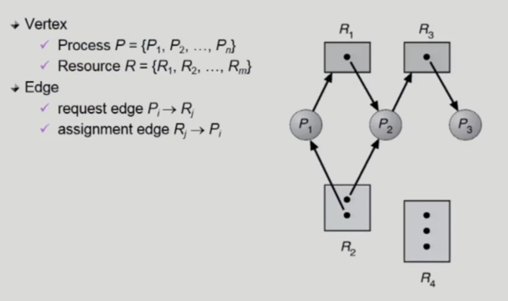
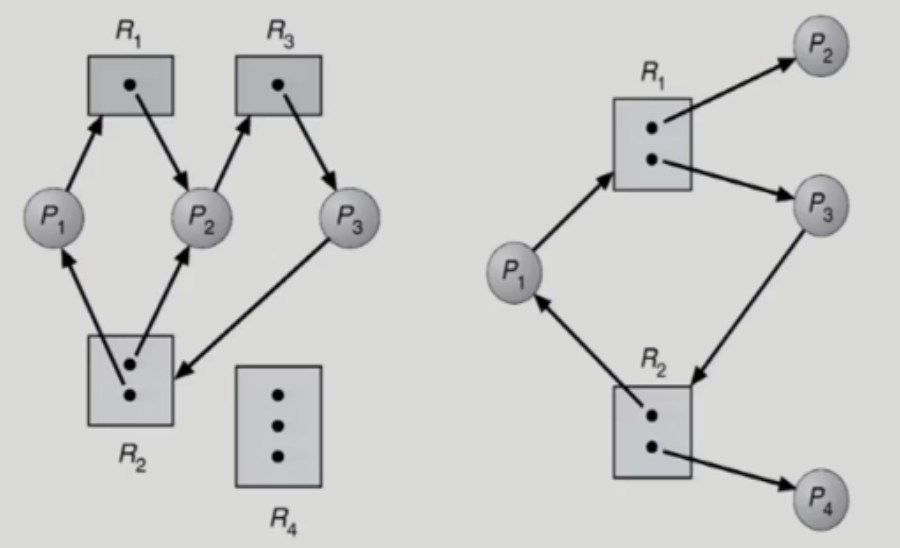
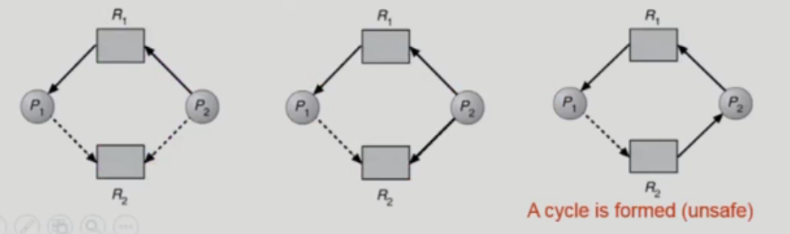
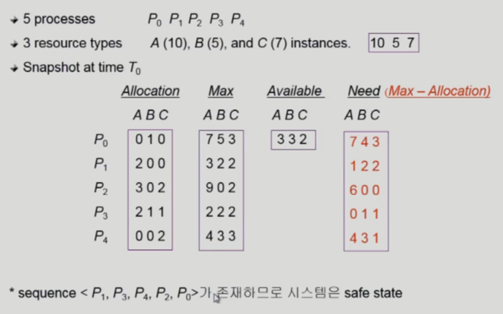
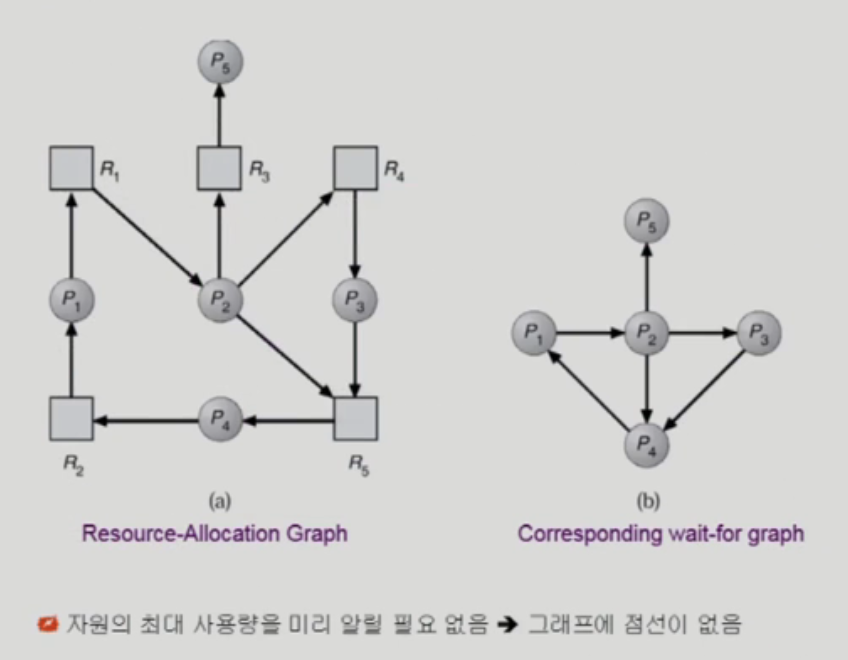
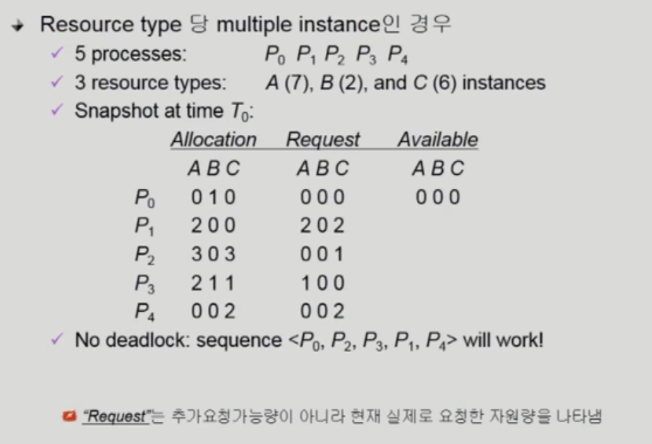
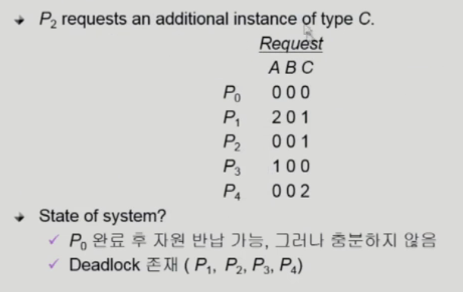

# DeadLock

## Deadlock

- 일련의 프로세스들이 서로가 가진 resource을 기다리며 block된 상태
- 예시 1
  - 시스템에 2개의 tape drive가 있다.
  - 프로세스 P1과 P2 각각 하나의 다른 tape drive를 보유한 채 다른 하나를 기다리고 있다.
- 예시 2
  - 이진 세마포어 A와 B가 있다.
  - 프로세스 P1이 A 자원을 얻은 상태에서 문맥 교환이 발생하여 프로세스 P2에게 CPU 제어권이 넘어갔고, 프로세스 P2가 B 자원을 얻었다.
  - 다시 문맥 교환이 발생하여 프로세스 P1에게 CPU 제어권이 넘어갔고, 프로세스 P1이 B 자원을 얻고 싶어하지만 이미 프로세스 P2가 B 자원을 가지고 있다.
  - 마찬가지로 프로세스 P2가 A 자원을 얻고 싶어하지만 이미 프로세스 P1이 A 자원을 가지고 있다.

### Resource

- HW, SW 등을 포함하는 개념
- 프로세스가 자원을 사용하는 절차
  - Request, Allocate, Use, Release
- 예시
  - I/O Device, CPU Cycle, Memory, Semaphore 등

## Deadlock 발생 조건

### 상호 배제 (Mutual Exclusion)

- 매 순간 하나의 프로세스만이 자원을 사용할 수 있다.

### 비선점 (No Preemption)

- 프로세스는 자원을 스스로 내어놓을 뿐 강제로 빼앗가지 않는다.

### 보유 대기 (Hold and wait)

- 자원을 가진 프로세스가 다른 자원을 기다릴 때 보유 자원을 놓지 않고 계속 가지고 있는다.

### 순환 대기 (Circular wait)

- 자원을 기다리는 프로세스 간에 사이클이 형성되어야 한다.

## 자원 할당 그래프 (Resource-Allocation Graph)

- 정점 : 프로세스 혹은 자원
- 간선 : 자원을 요청하거나 할당한다는 의미
- 그래프에 사이클 없음 => deadlock이 아님
- 그래프에 사이클 존재
  - 자원 당 하나의 인스턴스만 존재 => deadlock
  - 자원 당 여러 개의 인스턴스 존재 => deadlock 가능성
- 왼쪽 그래프
  - P1에게 R2 자원 1개가 할당되어 있고, P2에게 R2 자원이 할당되어 있는 상황
  - P3가 R2 자원을 하나 요구한다.
  - P2는 R3 자원을 요청하고, R3는 P3가 가지고 있다.
  - P1은 R1을 요청하지만, 이를 P2가 가지고 있으므로 모든 프로세스가 자원을 반납할 수 없다.  
    => Deadlock
- 오른쪽 그래프
  - P1에게 R2 자원이 할당되어 있고, P4에게 R2 자원이 할당되어 있는 상황
  - P3가 R2 자원을 요구하면 P4가 R2 자원을 반납하면 문제 없음  
    => Deadlock 아님

## Deadlock 처리 방법

### Deadlock Prevention

- 자원 할당 시 deadlock의 4가지 필요 조건 중 어느 하나가 만족되지 않도록 하는 것

### Deadlock Avoidance

- 자원 요청에 대한 부가적인 정보를 이용해서 deadlock의 가능성이 없는 경우에만 자원을 할당
- 시스템 state가 원래 state로 돌아올 수 있는 경우에만 자원 할당

### Deadlock Detection and Recovery

- Deadlock 발생은 허용하되 그에 대한 detection 루틴을 두어 deadlock 발견 시 recover

### Deadlock Ignorance

- OS 대부분에서 채택
- deadlock을 시스템이 책임지지 않음

## 처리 방법 1. Deadlock Prevention

- 생기지도 않을 수 있는 데드락 때문에 많은 제약조건이 생김  
  => Utilization 저하, Throughput 감소, Starvation 문제 발생 가능

### 상호 배제 (Mutual Exclusion)

- 공유해서는 안되는 자원의 경우 반드시 성립해야 한다.

### 보유 대기 (Hold and Wait)

- 프로세스가 자원을 요청할 때 다른 어떤 자원도 가지고 있지 않아야 한다.
- 방법 1. 프로세스 시작 시 모든 필요한 자원을 할당 받게 하는 방법
- 방법 2. 자원이 필요할 경우 보유 자원을 모두 놓고 다시 요청

### 비선점 (No Preemption)

- 프로세스가 어떤 자원을 기다려야 하는 경우 이미 보유한 자원이 선점된다.
- 모든 필요한 자원을 얻을 수 있을 때 그 프로세스는 다시 시작된다.
- 상태를 쉽게 저장하고 복구할 수 있는 자원에서 주로 사용 (CPU, Memory)

### 순환 대기 (Circular Wait)

- 모든 자원 유형에 할당 순서를 정하여 정해진 순서대로만 자원을 할당

## 처리 방법 2. Deadlock Avoidance

- 자원 요청에 대한 부가 정보를 이용해서 자원 할당이 데드락으로부터 안전한지를 동적으로 조사해서 안전한 경우에만 할당한다.
- 가장 단순하고 일반적인 모델은 프로세스들이 필요로 하는 각 자원별 최대 사용량을 미리 선언하도록 하는 방법이다.
- 시스템이 안전 상태 => deadlock 아님
- 시스템이 불안전 상태 => deadlock 발생 가능성
- 시스템이 불안전 상태에 들어가지 않는 것을 보장한다.
  - 자원 타입 당 1개의 인스턴스만 존재 -> **자원 할당 그래프 알고리즘** 사용
  - 자원 타입 당 여러 개의 인스턴스 존재 -> **은행원 알고리즘** 사용

### Safe State (안전 상태)

- 시스템 내의 프로세스들에 대한 safe sequence가 존재하는 상태

### Safe Sequence (안전 순서열)

- 프로세스의 sequence <P1, P2, ..., Pn>이 안전하려면 Pi (1<=i<=n)의 자원 요청이 `가용 자원 + 모든 Pj(j<i)의 보유 자원`에 의해 충족되어야 한다.
- 조건을 만족하면 다음 방법으로 모든 프로세스의 수행을 보장
  - Pi의 자원 요청이 즉시 충족될 수 없으면 모든 Pj가 종료될 때까지 기다린다.
  - P(i-1)이 종료되면 Pi의 자원 요청을 만족하여 수행한다.

### 자원 할당 알고리즘

- Claim edge (예약 간선) Pi -> Rj
  - 프로세스 Pi가 자원 Rj를 미래에 요청할 수 있음을 뜻한다. (점선으로 표시)
  - 프로세스가 해당 자원 요청 시 request edge(요청 간선)으로 바뀐다. (실선으로 표시)
  - Rj가 반납되면 assignment edge(할당 간선)은 다시 예약 간선으로 바뀐다.
- 요청 간선의 할당 간선 변경 시, 사이클이 생기지 않는 경우에만 요청 자원을 할당한다.
- 사이클 생성 여부 조사시 프로세스의 수가 n일 때 O(n^2) 시간이 걸린다.

### Banker's Algorithm

- 가정

  - 모든 프로세스는 자원의 최대 사용량을 미리 명시
  - 프로세스가 요청 자원을 모두 할당받은 경우, 유한 시간 안에 이들 자원을 다시 반납한다.

- 방법

  - 기본 개념 : 자원 요청 시 safe 상태를 유지할 경우에만 할당
  - 총 요청 자원의 수가 가용 자원의 수보다 적은 프로세스를 선택
    - 그런 프로세스가 없으면 unsafe 상태
  - 그런 프로세스가 있으면 그 프로세스에게 자원을 할당
  - 할당받은 프로세스가 종료되면 모든 자원을 반납
  - 모든 프로세스가 종료될 때까지 이러한 과정 반복

- 예제

  

  - Allocation: 현재 각 프로세스에 할당된 자원의 수
  - Max: 각 프로세스마다 최대로 할당 받고 싶은 자원의 수
  - Available: 각 자원이 프로세스에게 추가로 할당 할 수 있는 가용 자원의 수
  - Need: 각 프로세스가 현재 최대로 필요로 하는 자원의 수로, `Max-Allocation`의 값
  - A 자원은 10개의 인스턴스, B 자원은 5개의 인스턴스, C 자원은 7개의 인스턴스가 존재한다.
  - 자원은 현재 가용 자원을 보고, Need만큼 자원을 줄 수 있는 프로세스를 하나도 찾지 못하면 불안전한 상태가 된다.
  - 있다면 해당 프로세스에게 자원을 주고, 프로세스가 끝날 때 모든 자원을 가져온다.
  - 이 과정을 반복하면 <P1, P3, P4, P2, P0>라는 안전 순서열을 만들 수 있다.

## 처리 방법 3. Deadlock Detection and Recovery

### Detection

- 자원 타입 당 1개의 인스턴스만 존재 -> 자원 할당 그래프 알고리즘에서 사이클이 곧 deadlock을 의미
- 자원 타입 당 여러 개의 인스턴스 존재 -> 은행원 알고리즘과 유사한 방법 활용

#### Wait-for graph 알고리즘 (자원 당 하나의 인스턴스)

- Wait-for graph
  - 자원 할당 그래프의 변형
  - 프로세스만으로 node 구성
  - Pj를 가지고 있는 자원을 Pk가 기다리는 경우 `Pk -> Pj`
- Wait-for graph에 사이클이 존재하는지 주기적으로 조사
- 시간 복잡도는 O(N^2)
  - DFS나 BFS와 같은 알고리즘 사용

#### 변형된 Banker's 알고리즘 (자원 당 여러 개의 인스턴스)

- 기존 Bankers 알고리즘과 다르게 낙관저긍로 자원의 분배를 예상한다.
- 추가 요청 가능량이 아니라, 실제 요청 자원량으로 판단
- 아무것도 요청하지 않은 프로세스의 자원을 반납시켜서 다른 곳에 쓸 수 있다고 낙관적으로 가정하여 판단한다.

### Recovery

- 프로세스 종료
  - 데드락에 연루된 모든 프로세스를 강제 종료
  - 데드락 사이클이 없어질 때까지 하나씩 프로세스를 강제 종료
- 자원 선점
  - 비용을 최소화할 희생 프로세스를 선정
  - 안전 상태로 롤백하여 프로세스를 재시작
  - Starvation 문제 존재
    - 동일한 프로세스가 계속 희생 프로세스로 선정되는 경우
    - 비용 요소에 롤백 횟수도 같이 고려해야 함

## 처리 방법 4. Deadlock Ignorance

- OS 대부분에서 채택
- deadlock을 시스템이 책임지지 않음
- 데드락이 일어나지 않는다고 생각하고 아무런 조치를 취하지 않음
- 데드락이 매우 드물게 발생하므로 데드락에 대한 조치 자체가 더 큰 오버헤드일 수 있다.
- 만약 시스템에 데드락이 발생한 경우 시스템이 비정상적으로 작동하는 것을 사람이 느낀 후 직접 프로세스를 죽이는 등의 방법으로 대처
