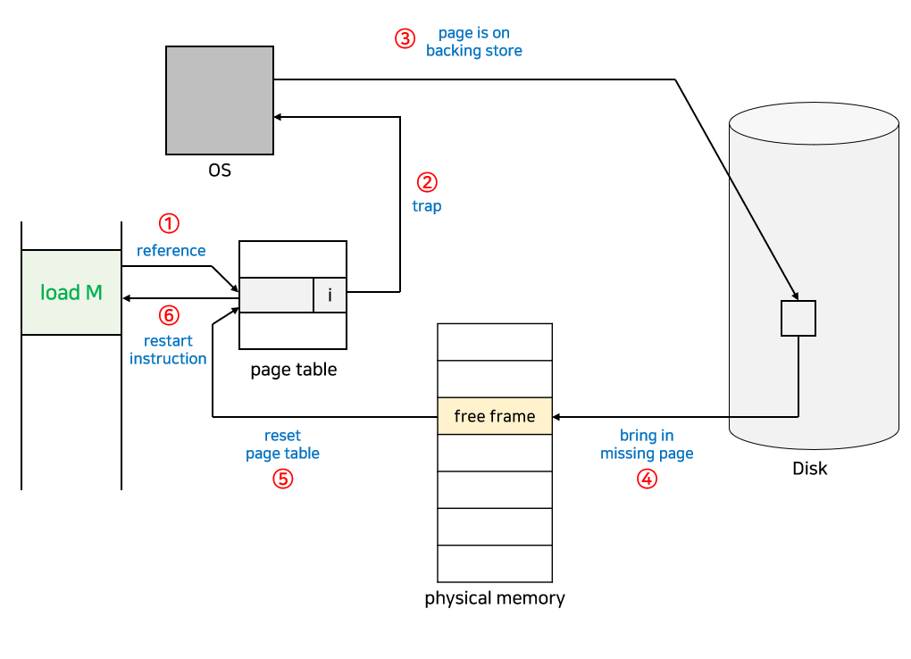
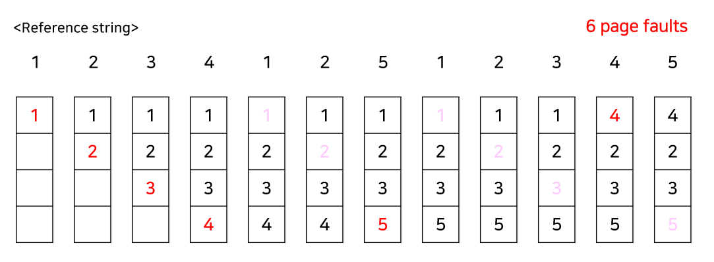
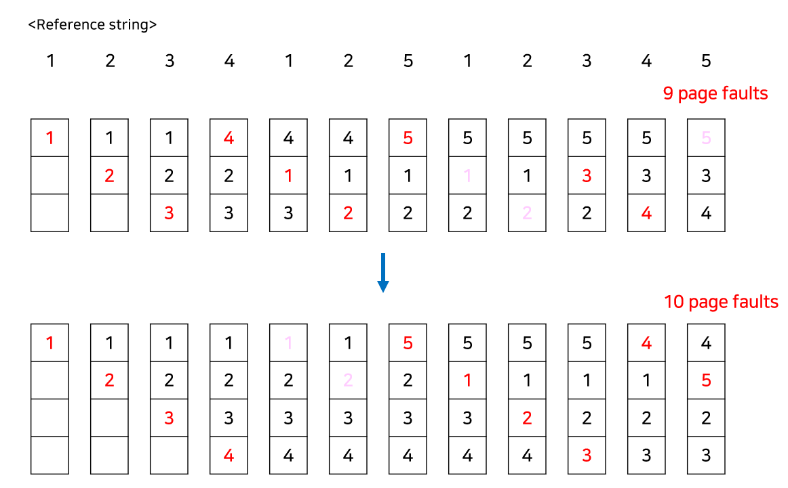
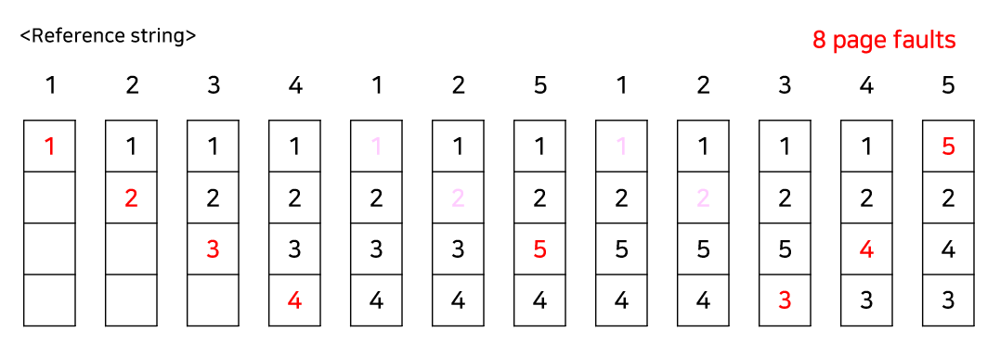
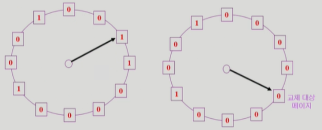
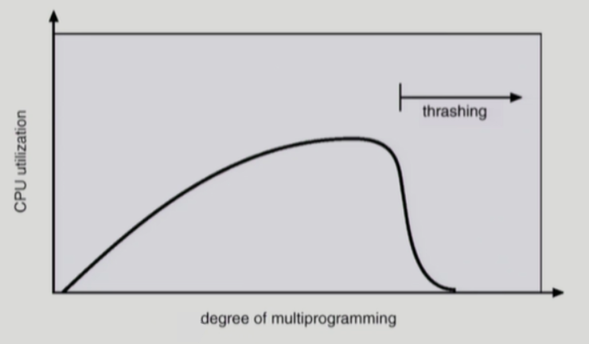

# 가상 메모리

## Virtual Memory

- 기존에는 프로세스가 실행되는 코드의 전체를 메모리에 로드해야 했고, 메모리 용량보다 더 큰 프로그램은 실행시킬 수 없었다.
- 하지만 실제로는 코드의 일부에서만 대부분의 시간을 사용하고, 프로세스는 특정 순간에는 항상 작은 양의 주소 공간을 사용했기 때문에 이러한 방식은 매우 비효율적이었다.
- **가상 메모리**는 이러한 물리적 메모리 크기의 한계를 극복하기 위해 나온 기술이다.
- 프로세스를 실행할 때 실행에 필요한 일부만 메모리에 로드하고 나머지는 디스크에 두는 것
- 이를 통해 프로세스 전체가 물리적 메모리에 있는 것'처럼' 수행되는, 즉 물리적 메모리가 훨씬 많이 있는 것처럼 보이게 된다.
- 결과적으로 메모리에 작은 양의 주소 공간만 있으면 충분히 프로세스를 수행할 수 있고, 그에 따라 더 많은 프로그램을 동시에 실행할 수 있게 된다.
- 이처럼 현재 필요한 page만 메모리에 올리는 것을 **Demand Paging**이라 한다.

## Demand Paging

- 실제로 필요한 page를 메모리에 올리는 것
- 이를 통해 CPU 이용률과 처리율이 높아지고, 더 많은 사용자를 수용할 수 있다.
- page table에서 해당 페이지가 메모리에 있는지를 나타내는 **valid-invalid bit**를 사용
  - bit가 invalid인 경우, 페이지가 물리적 메모리에 없다는 것
  - 처음에는 모든 page entry가 Invalid로 초기화되어있고, 주소 변환 시 bit가 invalid로 되어있다면 **page fault** 오류 발생
- 만약 page frame이 존재하지 않는 경우에는 어떤 프레임에 있는 페이지를 대체할지 결정해야 한다.
- 기본적으로 page fault rate를 최소화하는 것이 목표이고, 이에 대한 여러 알고리즘이 존재한다.
- 알고리즘의 성능 평가는 주어진 *page reference string*에 대해 page fault를 얼마나 내는지 조사하는 방식으로 이루어진다.
  - 참조되는 일련의 page 번호

### [ 주소 변환 과정 ]

1. HW가 TLB를 확인한다.
2. TLB hit인 경우 곧바로 주소를 변환하고, TLB miss인 경우 page table을 확인한다.
3. page table의 **valid-invalid bit**가 valid라면 주소를 변환하고 TLB에 페이지를 올린다. invalid라면 **page fault**가 발생한다.
4. **page fault**가 발생하면 **MMU**가 OS에 **trap**을 걸고 커널 모드로 들어가서 page fault handler가 invoke된다.
5. 유효하지 않은 참조인 경우 프로세스를 종료시키고, 그렇지 않다면 빈 page frame을 얻는다. 빈 프레임이 없다면 메모리에서 **victim page**를 선택하여 대체한다.
6. OS는 참조된 페이지를 디스크에서 메모리로 로드하고, disk I/O가 끝날 때까지 이 프로세스는 CPU를 빼앗긴다.
7. disk I/O가 끝나면 page table이 업데이트되고 valid-invalid bit가 valid로 바뀐다. 그 후 프로세스를 ready queue에 넣어준다.
8. 프로세스가 CPU를 잡게 되면 다시 이어서 수행한다.

## Page Replacement Algorithm

- 가정) page reference string = "1 2 3 4 1 2 5 1 2 3 4 5"

### 1. OPT (Optimal Algorithm)

- 가장 먼 미래에 참조되는 pagefmf 대체하는 방법
- 항상 최적의 결과를 갖는다.
- 하지만 미래의 참조를 모두 알고 있어야 하므로 실제 사용하기는 어렵다.
- 다른 알고리즘의 성능에 대한 upper bound를 제공하는 역할을 한다.
- = Belady's optimal algorithm = OPT = MIN

### 2. FIFO (First In First Out)

- 제일 먼저 들어온 page를 먼저 내보내는 방법
- 모든 page가 평등하게 frame에 거주하며, 구현하기 쉽다.
- 하지만 항상 필요한 page가 존재하는 경우, replace를 시킨다는 단점 존재
- **Belady's anomaly** 현상 발생 가능
  - frame이 늘어나도 page fault가 감소하지 않고 오히려 늘어나는 현상

### 3. LRU (Least Recently Used)

- 가장 오래전에 참조된 것을 지우는 방법
- Optimal에 근접한 방법
- Belady's anomaly가 발생하지 않음
- 다만, 구현하기 어렵고 접근되는 빈도를 고려하지 않는다는 단점 존재
- 연결 리스트로 LRU를 구현하면 **O**(**1**)만에 page 조회 및 삽입 가능
- 제일 최근에 참조된 page를 가장 앞으로 옮기는 방식으로 연결 리스트를 구현하면 replace가 일어날 때 가장 뒤에 있는 page를 바꿔주면 된다.

### 4. LFU (Least Frequently Used)

- 참조 횟수가 가장 적은 page를 지우는 방법
- LRU에 비해 장기적인 시간 규모를 보기 때문에 page의 인기도를 조금 더 정확히 반영할 수 있다.
- 하지만 최근성은 반영하지 못한다.
- 최저 참조 횟수인 page가 2개 이상인 경우에는 LFU 알고리즘 자체에서 임의로 page를 선정한다.
- LRU처럼 연결 리스트를 이용해서 구현하면 replace될 page를 찾는데 **O**(**N**)의 시간이 걸린다.  
  => 느림
- **Heap**을 사용하면 최소 빈도를 갖는 page를 조회, 삽입, 삭제하는데 **O**(**logN**)의 시간이 걸린다.  
  => 효율적

### 5. Second Chance Algorithm (Clock Algorithm)

- LRU와 LFU 알고리즘은 실제 paging 시스템에서 사용 불가능하다.
  - LRU와 LFU에서 OS가 자료구조를 변경하고 유지하는 작업을 수행해야 하는데, 이미 메모리에 page가 올라가 있는 경우에는 CPU가 OS에 넘어가지 않는다.
  - page fault가 발생해야 CPU가 OS에 넘어가고, 디스크에서 메모리로 페이지를 로드할 때 해당 페이지에 대한 정보를 얻고 갱신할 수 있다.  
    => OS가 참조한 지 오래되거나 참조 횟수가 적은 페이지를 정확하게 알 수 없다.
- LRU의 근사 알고리즘
- 최근에 참조되었는지 여부를 나타내는 **Reference bit**라는 정보를 사용하는 방법
- Reference bit가 0인 것을 찾을 때까지 시계처럼 한 바퀴씩 포인터를 이동하다가 0인 것을 찾으면 해당 page를 교체하는 방식
- Reference bit가 1인 page를 만나면 0으로 바꿔주고, 한 바퀴 되돌아와서도(Second chance) 여전히 0이면 해당 page를 교체한다.
  - 다시 bit가 1로 바뀌어있다면 그만큼 자주 사용되는 page라는 의미

### 6. Enhanced Second Chance Algorithm

- Second Chance Algorithm을 조금 더 개선한 방식
- **Modified bit**(=**Dirty bit**)가 추가됨
  - 최근에 해당 page가 변경되었는지 나타냄
- Modified bit가 1이라면 page가 변경되었기 때문에 교체를 하면 디스크에 해당 내용을 반영해야 한다.
- 즉, I/O 작업이 동반되므로 시간이 오래 걸린다.
- 따라서 **Reference bit** -> **Modified bit** 순으로 우선순위를 가진다.

## Allocation of Frames

### [ page frame을 할당하는 방식 ]

- 프로세스마다 **균일하게 할당** VS **특정 기준에 따라 할당**

#### 균일하게 할당하는 방법

- frame나 프로세스 수만큼 각 프로세스마다 frame을 할당한다.

#### 특정 기준에 따라 할당하는 방법

- 프로세스의 크기나 우선순위 등에 따라 더 많은 frame을 할당한다.

### [ page fault 발생 시 대체될 frame 그룹의 종류 ]

#### Global Replacement

- Replace 할 때 다른 프로세스에 할당된 frame을 빼앗아올 수 있다.
- 프로세스별로 frame 할당량을 조절하는 또 다른 방법이 될 수 있지만, 자신의 page fault rate를 조절할 수 없다.
- 일반적으로 더 좋은 처리량을 가지므로 가장 흔하게 사용되는 방법

#### Local Replacement

- 자신에게 할당된 frame 내에서만 교체하는 방법
- 알고리즘을 프로세스마다 독자적으로 운영하는 경우 가능하다.
- 쉬고 잇는 메모리를 사용할 수 없기 때문에 비교적 비효율적이다.

## Thrashing

- 프로세스가 원활한 수행에 필요한 최소한의 page frame을 할당받지 못해서 실행보다 Swapping 하는데 더 많은 시간을 소모하는 현상
- page fault rate가 매우 높아지고 CPU 효율성이 낮아진다.

### [ Thrashing 발생 과정 ]

1. page가 부족하여 page fault가 증가한다.
2. Swapping(I/O) 작업이 증가하여 CPU 효율성이 감소한다.
3. OS는 Multiprogramming Degree를 높여야 한다고 판단하여 또 다른 프로세스를 시스템에 추가한다.
4. 프로세스당 할당된 page frame이 더욱 감소하여 page fault가 더 증가한다.
5. 프로세스는 Swapping으로 인해 매우 바빠져서 대부분의 시간에 CPU는 한가해진다.

## Thrashing Prevention

### 1. Working-Set Model

- 가능한 최대 Multiprogramming Degree를 유지하면서 Thrashing을 막는 방법
- `필요한 frame의 총 수 = A`일 때,
  - `A > {총 사용 가능한 frame 수}` => Thrashing 발생
- 따라서 OS가 지속적으로 각 프로세스의 Working Set을 지켜보면서 충분한 frame을 할당해주고,
- A가 총 사용 가능한 frame 수보다 크다면, 프로세스 중 하나를 종료시키고 해당 프로세스의 frame을 다른 프로세스들에게 할당해준다.

#### Working Set

- **참조 지역성의 원리**에 기반하여 프로세스가 일정 시간동안 원활히 수행되기 위해 한꺼번에 메모리에 올라와있어야 하는 page들의 집합
  - 프로세스가 특정 시간동알 일정 장소를 집중적으로 참조하는 성질
- **Working Set Window**라는 고정된 page 참조 횟수(시간)로 구한다.

### 2. PFF(Page-Fault Frequency) Scheme

- page fault의 상한값과 하한값을 둔다.
- page fault rate가 상한값을 넘으면, frame을 더 할당
- page fault rate가 하한값보다 낮아지면, frame 수를 줄임
